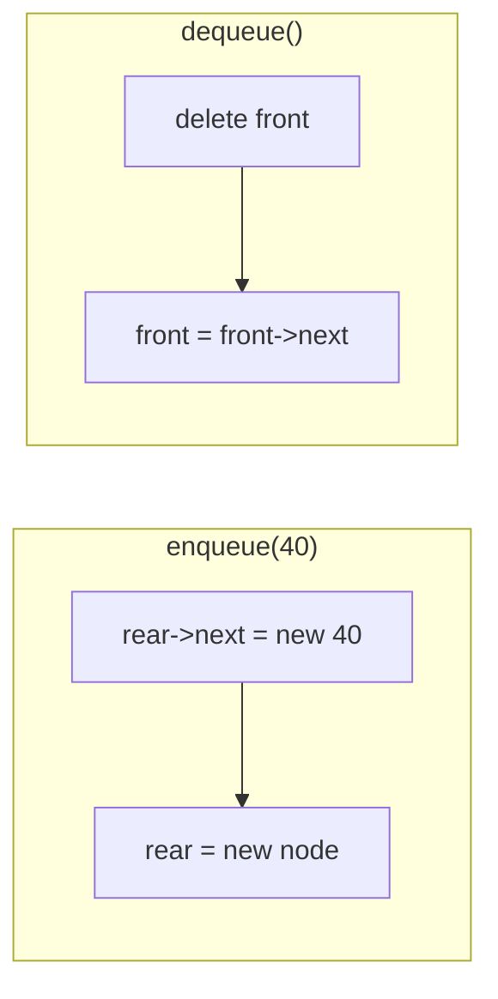
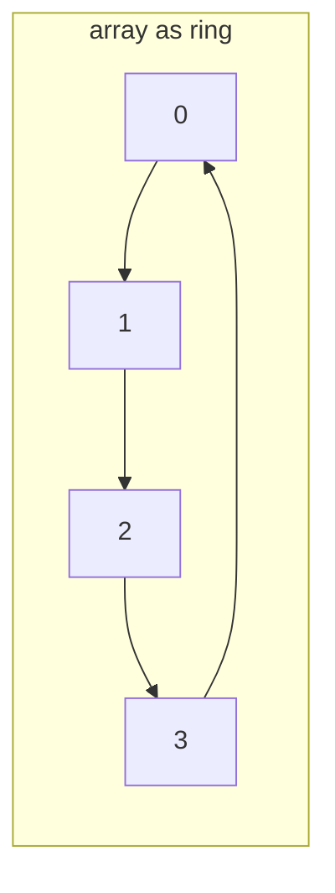
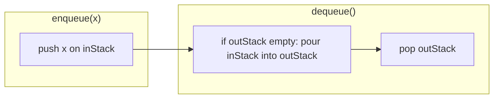
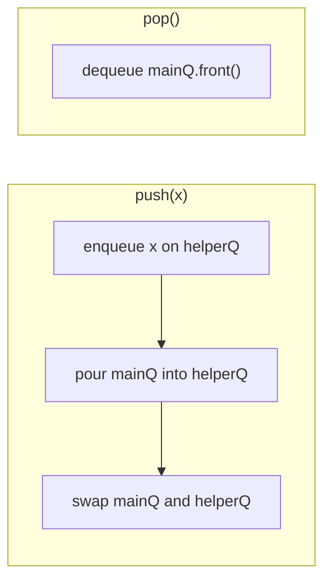
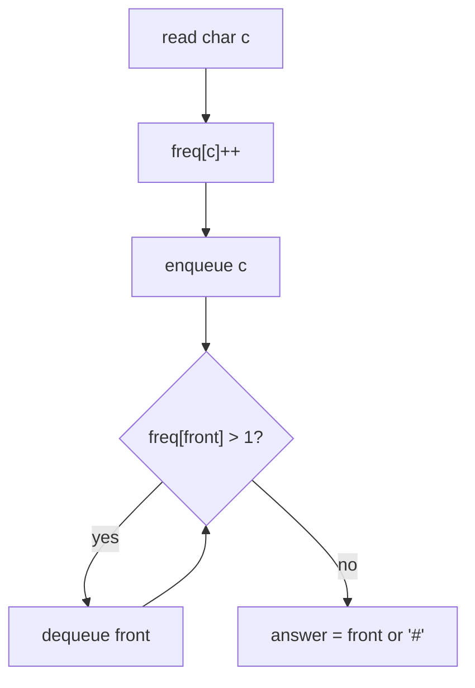
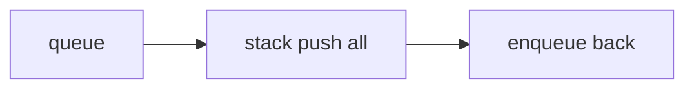
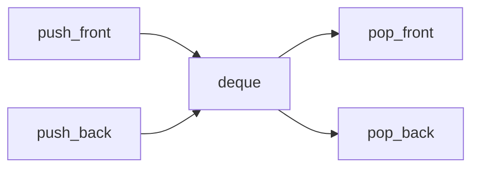
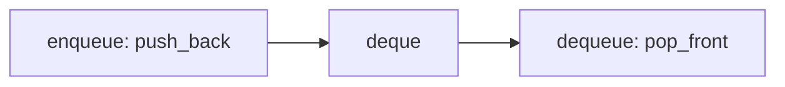
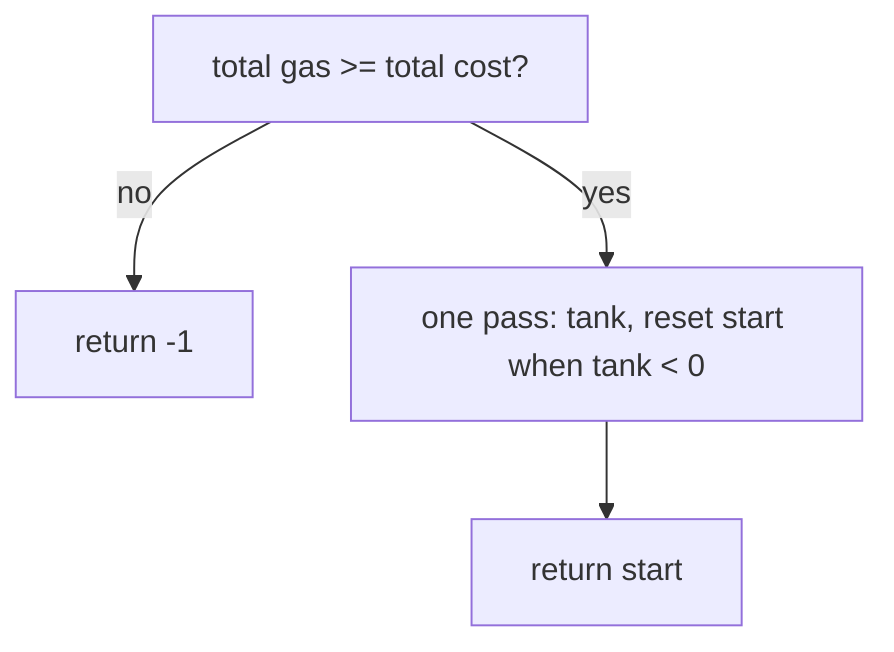
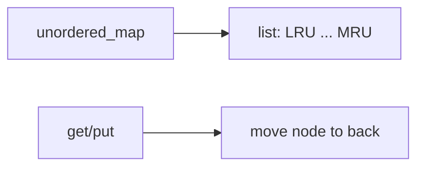

# MODULE 26 — Queue

**Illustration code:** `a.cpp`–`l.cpp` (queue/deque concepts) · `m.cpp` (time to buy tickets) · `n.cpp` (gas station) · `o.cpp` (reverse first K in queue) · `p.cpp` (LRU cache)

---

## What is a queue?

A **queue** is a linear data structure where you add elements at one end and remove them from the **other** end.

- **Enqueue** — insert at the **rear** (back of the line).
- **Dequeue** — remove from the **front** (front of the line).
- **Front** — look at the front element without removing it.

Think of a **line at a ticket counter** or a **printer job list**:

- The first person who joins the line is served **first**.
- New people always stand at the **rear**.

So a queue follows **FIFO** — **First In, First Out**: the oldest element leaves first.

---

## FIFO vs LIFO (stack)

| | **Stack** (Module 25) | **Queue** (Module 26) |
|--|----------------------|------------------------|
| Rule | **LIFO** — Last In, First Out | **FIFO** — First In, First Out |
| Add | **Push** on top | **Enqueue** at rear |
| Remove | **Pop** from top | **Dequeue** from front |
| Analogy | Stack of plates | Line at a counter |

```text
Enqueue 10, 20, 30  ->  front [ 10 | 20 | 30 ] rear
Dequeue             ->  removes 10 (first in)
```

---

## Array implementation (circular buffer)

In `a.cpp` we use a **fixed-size array** as a **circular queue**:

- **`front`** — index of the first element.
- **`rear`** — index where the **next** enqueue will write.
- **`count`** — how many elements are stored.

Enqueue writes at **`rear`**, then advances **`rear = (rear + 1) % CAPACITY`**.  
Dequeue reads at **`front`**, then advances **`front = (front + 1) % CAPACITY`**.

Wrapping lets us reuse slots at the start of the array after dequeues — no shifting of all elements.

```text
CAPACITY = 8

after enqueue 10, 20, 30:
  front -> [10][20][30][ _ ][ _ ]...
  rear points to next empty slot
```

---

## Main operations

| Operation | Meaning |
|-----------|---------|
| **Enqueue(x)** | Add `x` at the rear (if not full). |
| **Dequeue()** | Remove the front element (if not empty). |
| **Front()** | Read the front element without removing. |
| **Empty() / Full()** | Check state. |

With a circular array and fixed capacity, **enqueue**, **dequeue**, and **front** are **O(1)** time.

---

## When queues are useful

- **BFS** in graphs (process nodes in order discovered).
- **CPU / task scheduling**, print spoolers, message buffers.
- **Level-order** traversal in trees.
- Any problem that needs “handle the **oldest** waiting item first”.

Run `a.cpp` to see enqueue, front, and dequeue in FIFO order.

---

## Queue using a linked list

**Illustration code:** `b.cpp`

In `a.cpp` the queue lives in a **fixed array**. With a **singly linked list**, each value is a **node** (`data` + `next`). There is **no capacity limit** (until memory runs out).

### Two pointers: `front` and `rear`

| Pointer | Points to |
|---------|-----------|
| **`front`** | First node (next to **dequeue**) |
| **`rear`** | Last node (where we **enqueue**) |

```text
front                          rear
  |                              |
  v                              v
 [10] -> [20] -> [30] -> nullptr
```

- **Enqueue** — create a node, link **`rear->next = newNode`**, move **`rear`** forward. **O(1)** because we keep **`rear`**.
- **Dequeue** — remove **`front`**, advance **`front`**. If the list becomes empty, set **`rear = nullptr`** too. **O(1)**.
- **Front** — return **`front->data`**. **O(1)**.



**Important:** If you only stored **`front`** and enqueued by walking to the end of the list, each enqueue would be **O(n)**. Keeping **`rear`** makes enqueue **O(1)**.

### Operation names (same queue, two naming styles)

| Queue name | Same idea as | Where |
|------------|--------------|--------|
| **enqueue(x)** | **push(x)** (add at **rear**) | back of line |
| **dequeue()** | **pop()** (remove from **front**) | front of line |
| **front()** | peek first element | front of line |

Do **not** confuse with a **stack**: stack **push/pop** use one end only; queue **enqueue/dequeue** use **opposite** ends.

`b.cpp` implements **`enqueue` / `dequeue` / `front`** and aliases **`push` / `pop`** that call the same logic.

### Time complexity

| Operation | Time |
|-----------|------|
| **enqueue** / **push** | **O(1)** |
| **dequeue** / **pop** | **O(1)** |
| **front** | **O(1)** |
| **empty** / **size** | **O(1)** |

### Space complexity

- **O(n)** for **`n`** stored elements — one node per value, plus two pointers (`front`, `rear`).
- Each **`new`** on enqueue is matched with **`delete`** on dequeue; destructor frees any remaining nodes.

### vs array queue (`a.cpp`)

| | Array (`a.cpp`) | Linked list (`b.cpp`) |
|--|-----------------|------------------------|
| Capacity | Fixed **`CAPACITY`** | Grows with allocations |
| Enqueue / dequeue | **O(1)** | **O(1)** |
| Extra memory | No per-node pointer | Pointer per node |
| Locality | Contiguous (cache-friendly) | Nodes may be scattered |

Run `b.cpp` for a **`Queue`** class with linked-list **enqueue**, **dequeue**, and **front**.

---

## Circular queue (array implementation)

**Illustration code:** `c.cpp`

A **circular queue** stores elements in a **fixed-size array** but treats the array as a **ring**: after the last index, the next slot is index **0** again.

### Why circular?

A **naive array queue** might dequeue by shifting every element left — **O(n)** per dequeue.

With **two indices** — **`front`** (dequeue here) and **`rear`** (enqueue here) — and **modulo** wrap:

```text
index:   0    1    2    3    4
        [20][30][ _ ][ _ ][40]   <- logical: front=0, rear=3 after wrap
          ^front          ^rear (next write at index 3)
```

After dequeues free slots at the start, **enqueue** can reuse them without shifting.



### Variables (`c.cpp`)

| Field | Role |
|-------|------|
| **`data[CAPACITY]`** | Storage |
| **`front`** | Index of first element |
| **`rear`** | Index where **next** enqueue writes |
| **`count`** | Number of elements (tells empty vs full) |

**Empty:** `count == 0`  
**Full:** `count == CAPACITY`

Using **`count`** avoids the “waste one slot” trick (`(rear+1)%CAP == front` means full).

### Operations (all **O(1)**)

| Operation | Action |
|-----------|--------|
| **enqueue(x)** | If not full: `data[rear]=x`, `rear=(rear+1)%CAPACITY`, `count++` |
| **dequeue()** | If not empty: `front=(front+1)%CAPACITY`, `count--` |
| **front()** | Return `data[front]` |
| **isEmpty() / isFull()** | Check `count` |

### Time and space

| | |
|--|--|
| **Time** | **O(1)** per enqueue, dequeue, front |
| **Space** | **O(CAPACITY)** — fixed array; at most **`CAPACITY`** elements |

### Wrap-around example

`CAPACITY = 5`, enqueue `1..5` (full), dequeue `1,2`, enqueue `6,7`:

```text
Physical array:  [6][7][3][4][5]
                  ^front=0  rear=2 (next slot)
Logical order:   3, 4, 5, 6, 7  (FIFO)
```

`c.cpp` defines class **`CircularQueue`** and **`main`** demonstrates fill → dequeue → enqueue with wrap.

Run `c.cpp` to see indices reuse after dequeue.

---

## Queue in the C++ standard library (`std::queue`)

**Illustration code:** `d.cpp`

Include the header:

```cpp
#include <queue>
```

**`std::queue<T, Container>`** is a **container adapter**: it wraps an underlying sequence container (default **`std::deque<T>`**) and only exposes **FIFO** queue operations.

### Map to our queue names

| Our queue (`a`–`c`) | `std::queue` |
|---------------------|--------------|
| enqueue | **`push(x)`** or **`emplace(...)`** |
| dequeue | **`pop()`** (returns **`void`**) |
| front | **`front()`** |
| peek rear | **`back()`** |
| empty / size | **`empty()`**, **`size()`** |

There is **no** **`clear()`** member. Empty the queue by looping **`pop()`** or **`swap`** with an empty queue (see `d.cpp`).

### Member functions (what `d.cpp` demonstrates)

| Category | Functions |
|----------|-----------|
| **Constructors** | default **`queue()`**, copy **`queue(const queue&)`**, move **`queue(queue&&)`**, from container **`queue(const Container& c)`** |
| **Assignment** | **`operator=`** (copy / move) |
| **Access** | **`front()`**, **`back()`** |
| **Capacity** | **`empty()`**, **`size()`** |
| **Modifiers** | **`push(x)`**, **`emplace(args...)`**, **`pop()`**, **`swap(other)`** |
| **Non-member** | **`swap(q1, q2)`**, **`==`**, **`!=`**, **`<`**, **`<=`**, **`>`**, **`>=`** |

**`pop()`** removes the front element but does **not** return it — read **`front()`** first if you need the value.

Default backing store is **`deque`** (good for growth at both ends internally). You can pass **`std::list<T>`** as the second template argument: **`queue<int, list<int>>`**.

### Complexity (typical)

| Operation | Time |
|-----------|------|
| **`push`**, **`pop`**, **`front`**, **`back`**, **`empty`**, **`size`** | **O(1)** amortized |
| **Copy / move** whole queue | **O(n)** |

### Space

**O(n)** for **`n`** elements stored in the underlying container.

`d.cpp` runs through **every** common **`std::queue`** member and helper in one program.

Run `d.cpp` to see all STL queue functions in action.

---

## Queue using two stacks

**Illustration code:** `e.cpp`

You can simulate a **FIFO queue** using only **two LIFO stacks** — often called **`inStack`** (incoming) and **`outStack`** (outgoing).

### Idea

| Operation | What to do |
|-----------|------------|
| **Enqueue** | **Push** onto **`inStack`** only. **O(1)**. |
| **Dequeue** | If **`outStack`** is empty, **pop** everything from **`inStack`** and **push** onto **`outStack`** (reverses order). Then **pop** from **`outStack`**. |
| **Front** | Same as dequeue, but **peek** **`outStack.top()`** without popping (after transfer if needed). |

```text
enqueue 1,2,3  ->  inStack:  bottom [1,2,3] top

dequeue:
  transfer inStack -> outStack
  inStack: empty    outStack: bottom [3,2,1] top
  pop outStack -> returns 1  (FIFO!)
```



**Why it works:** Stack reverses order. Pushing `1,2,3` on `inStack` gives top `3`. Pouring into `outStack` makes top `1` — the **first** enqueued — so dequeue is FIFO.

### Amortized time

| Operation | Time |
|-----------|------|
| **Enqueue** | **O(1)** every time |
| **Dequeue** | **O(1) amortized** — each element moves from `inStack` to `outStack` **at most once** over its lifetime |
| **Dequeue (worst single call)** | **O(n)** when `outStack` is empty and you pour **`n`** elements |

So a long series of enqueues and dequeues costs **O(1)** per dequeue on average, like a normal queue.

### Space

**O(n)** — at most **`n`** elements split across the two stacks.

### When this pattern appears

- Interview classic: “implement queue using stacks.”
- Shows how **LIFO + LIFO** can mimic **FIFO** with careful transfer.
- Related: **stack using two queues** (opposite problem).

`e.cpp` defines **`QueueTwoStacks`** with **`enqueue`**, **`dequeue`**, **`front`**, and a demo trace.

Run `e.cpp` to compare FIFO order with the two-stack transfer step.

---

## Stack using two queues

**Illustration code:** `f.cpp`

The mirror of **`e.cpp`**: simulate a **LIFO stack** using only **two FIFO queues** — **`mainQ`** and **`helperQ`**.

### Idea (push costs more, pop is cheap)

| Operation | What to do |
|-----------|------------|
| **Push(x)** | Enqueue **`x`** on **`helperQ`**. Move every element from **`mainQ`** to **`helperQ`**. **Swap** the two queues. New top is at **`mainQ.front()`**. |
| **Pop** | Dequeue from **`mainQ.front()`**. **O(1)**. |
| **Top** | Return **`mainQ.front()`** (after pushes, the stack top is always at the front). **O(1)**. |

```text
push(1):  mainQ: [1]                    (front = top = 1)
push(2):  helper [2], pour 1 -> [2,1], swap -> mainQ [2,1]   top = 2
push(3):  helper [3], pour -> [3,2,1], swap -> mainQ [3,2,1] top = 3
pop():    dequeue front -> 3  (LIFO)
```



**Why it works:** Each **push** rotates the queue so the **newest** element moves to the **front**. The **front** of the queue always holds the stack **top**; **pop** removes it in **O(1)**.

### Alternative (opposite costs)

You can instead **push in O(1)** and **pop in O(n)** by moving **`size - 1`** elements to the helper queue, popping the last one, then swapping — similar to **`e.cpp`**’s pour-on-dequeue style.

`f.cpp` uses **O(n) push / O(1) pop** so **`top()`** stays simple.

### Time complexity

| Operation | Time |
|-----------|------|
| **Push** | **O(n)** — pour all of **`mainQ`** into **`helperQ`** |
| **Pop** / **Top** | **O(1)** |

### Space

**O(n)** — elements live in the two queues combined.

### Pair with Module 25 / `e.cpp`

| Problem | Tools | Typical trick |
|---------|--------|----------------|
| Queue from 2 stacks (`e.cpp`) | LIFO + LIFO | Pour when dequeuing |
| Stack from 2 queues (`f.cpp`) | FIFO + FIFO | Pour when pushing |

`f.cpp` defines **`StackTwoQueues`** with **`push`**, **`pop`**, **`top`**.

Run `f.cpp` to see LIFO order with two `std::queue`s.

---

# Practice problems

---

## First non-repeating letter in a stream

**Code:** `g.cpp`

### Problem statement

Characters arrive **one at a time** (a stream). After **each** new character, output the **first** character (from the start of the stream until now) that has appeared **exactly once** so far.

If every character seen so far repeats at least twice, output **`'#'`** (or another sentinel your problem uses).

**Example:** stream `"aabc"` → output after each char: **`a`**, **`#`**, **`b`**, **`b`**

| Step | Stream so far | First unique |
|------|---------------|--------------|
| `a` | `a` | `a` |
| `a` | `aa` | none → `#` |
| `b` | `aab` | `b` |
| `c` | `aabc` | `b` (still oldest with count 1) |

### Approach

- **`freq[c]`** — how many times character **`c`** appeared.
- **`queue<char>`** — candidates in **order of first appearance** (FIFO).

On each new character **`c`**:

1. **`freq[c]++`**
2. **`enqueue c`**
3. **While** **`queue.front()`** has **`freq > 1`**, **dequeue** (no longer a unique candidate).

The **front** of the queue (if any) is the **oldest** character that is still unique.



### Complexity

| | |
|--|--|
| **Time** | **O(1)** amortized per character — each char enqueued once and dequeued at most once |
| **Space** | **O(1)** if alphabet size is fixed (e.g. 26 letters); **O(k)** for **`k`** distinct chars in stream |

---

## Interleave two queues / two halves

**Code:** `h.cpp`

### Problem A — Interleave two queues

Given **`q1`** and **`q2`**, build a new sequence by taking elements **alternately**: first from **`q1`**, then from **`q2`**, until one is empty, then append the rest of the other.

**Example:** `q1 = [1,2,3]`, `q2 = [4,5,6]` → **`[1,4,2,5,3,6]`**

```text
q1: 1 2 3
q2: 4 5 6
     | | |
out: 1 4 2 5 3 6
```

### Problem B — Interleave two halves of one queue (even length)

Given a queue of **even** size, split into **first half** and **second half**, then interleave.

**Example:** `[11,12,13,14,15,16]` → halves `[11,12,13]` and `[14,15,16]` → **`[11,14,12,15,13,16]`**

```text
first:  11  12  13
second: 14  15  16
out:    11  14  12  15  13  16
```

### Approach

Use extra **`queue`**s (or indices): dequeue from each side in turn and push to result.

### Complexity

| | |
|--|--|
| **Time** | **O(n)** — each element moved a constant number of times |
| **Space** | **O(n)** — result / temporary queues |

---

## Queue reversal

**Code:** `i.cpp`

### Problem statement

Reverse the order of elements in a queue so **front** and **rear** swap roles (first becomes last).

**Example:** front → rear **`1,2,3,4,5`** becomes **`5,4,3,2,1`**.

### Approach (stack)

A **stack** reverses order (LIFO):

1. **Dequeue** all elements from the queue and **push** each onto a **stack**.
2. **Pop** the stack and **enqueue** back into the queue.

```text
queue: 1 2 3  -> stack: 3 2 1  -> queue: 3 2 1
```



### Complexity

| | |
|--|--|
| **Time** | **O(n)** |
| **Space** | **O(n)** for the stack |

Run **`g.cpp`**, **`h.cpp`**, and **`i.cpp`** for full implementations and sample output.

---

## Double-ended queue (`std::deque`)

**Illustration code:** `j.cpp`

A **deque** (double-ended queue, pronounced “deck”) lets you add and remove from **both ends** in **O(1)** time. In C++ use:

```cpp
#include <deque>
```

### vs `queue` and `stack`

| Structure | Insert | Remove | Ends used |
|-----------|--------|--------|-----------|
| **`std::queue`** | rear only | front only | one in, one out (FIFO) |
| **`std::stack`** | top only | top only | one end (LIFO) |
| **`std::deque`** | **front or back** | **front or back** | **both** |

```text
        push_front               push_back
             \                       /
              v                     v
         [ 10 | 20 | 30 | 40 ]
              ^                     ^
             front                 back
        pop_front                pop_back
```

`std::queue` and `std::stack` are **adapters**; their default underlying container is **`std::deque`** because it supports fast growth at both ends.

### Main operations (`j.cpp`)

| Member | Effect |
|--------|--------|
| **`push_back(x)`** | Insert **`x`** at the **back** |
| **`push_front(x)`** | Insert **`x`** at the **front** |
| **`pop_back()`** | Remove last element |
| **`pop_front()`** | Remove first element |
| **`back()`** | Reference to last element |
| **`front()`** | Reference to first element |
| **`empty()`**, **`size()`** | State |
| **`clear()`** | Remove all elements (deque has this; `queue` adapter does not) |

**Note:** **`pop_front()`** and **`pop_back()`** return **`void`** — read **`front()`** / **`back()`** first if you need the value.

### Diagram: building a deque

```text
start:        [ ]
push_back(3): [ 3 ]
push_back(4): [ 3 | 4 ]
push_front(2):[ 2 | 3 | 4 ]
push_front(1):[ 1 | 2 | 3 | 4 ]
pop_front():  [ 2 | 3 | 4 ]     front() = 2
pop_back():   [ 2 | 3 ]         back()  = 3
```



### When to use a deque

- Need **FIFO** or **LIFO** at **either** end (sliding window, palindrome check with ends).
- **BFS** with deque (0-1 BFS) when you push to front or back depending on edge weight.
- Implementing **`queue`** / **`stack`** yourself with one container.

### Complexity (typical)

| Operation | Time |
|-----------|------|
| **`push_front`**, **`push_back`**, **`pop_front`**, **`pop_back`**, **`front`**, **`back`** | **O(1)** |
| **Random access** **`d[i]`** | **O(1)** (unlike `list`) |

### Space

**O(n)** for **`n`** elements stored in the deque.

`j.cpp` demonstrates every operation listed above with **`std::deque<int>`** and prints the deque after each step.

Run `j.cpp` for the full STL deque walkthrough.

---

## Queue using `deque`

**Illustration code:** `k.cpp`

A normal **FIFO queue** only needs **one end for insert** and **the other for remove**. A **`std::deque`** supports both in **O(1)**:

| Queue operation | `deque` call |
|-----------------|--------------|
| **Enqueue** (add at rear) | **`push_back(x)`** |
| **Dequeue** (remove from front) | **`pop_front()`** |
| **Front** (peek) | **`front()`** |

```text
enqueue 10, 20, 30:

  front                         back
    |                             |
   [10] -> [20] -> [30]

dequeue -> removes 10 (pop_front)
```



This is exactly how **`std::queue`** is implemented by default: it is a **container adapter** on top of **`std::deque`**.

```cpp
#include <queue>
std::queue<int> q;  // default: deque<int> inside
```

`k.cpp` wraps a **`deque<int>`** in class **`QueueDeque`** and also shows **`std::queue<int, deque<int>>`**.

### Complexity

| Operation | Time | Space |
|-----------|------|-------|
| enqueue / dequeue / front | **O(1)** | **O(n)** total for `n` elements |

---

## Stack using `deque`

**Illustration code:** `l.cpp`

A **LIFO stack** uses **only one end** for push and pop. With a deque, use the **back**:

| Stack operation | `deque` call |
|-----------------|--------------|
| **Push** | **`push_back(x)`** |
| **Pop** | **`pop_back()`** |
| **Top** (peek) | **`back()`** |

```text
push 10, 20, 30:

  bottom                    top
    |                        |
   [10] -> [20] -> [30]
                    ^
                  back()

pop -> pop_back() removes 30
```

You *could* use the **front** end instead (push_front / pop_front) as long as push and pop use the **same** end — **back** is the usual convention and matches **`std::stack`**.

```cpp
#include <stack>
std::stack<int> s;  // default: deque<int> inside
```

`l.cpp` defines **`StackDeque`** and demonstrates **`std::stack<int, deque<int>>`**.

### Complexity

| Operation | Time | Space |
|-----------|------|-------|
| push / pop / top | **O(1)** | **O(n)** |

### Why deque for both?

| Need | Ends used on `deque` |
|------|----------------------|
| Queue (FIFO) | in at **back**, out at **front** |
| Stack (LIFO) | in and out at **back** |

One container type can back **both** adapters in the C++ standard library — that is why **`deque`** is the default underlying container for **`queue`** and **`stack`**.

Run **`k.cpp`** and **`l.cpp`** for side-by-side demos.

---

# LeetCode-style problems

---

## Problem 1 — Time required to buy tickets

**Code:** `m.cpp`

### Problem statement

**`n`** people stand in a line (index **`0`** = front, **`n-1`** = back).  
**`tickets[i]`** = how many tickets person **`i`** wants.

Each **second**, the person at the **front** buys **one** ticket (takes 1 second), then:
- If they still need more tickets → go to the **back** of the line instantly.
- If they are done → **leave** the line.

Return the **total seconds** until person **`k`** finishes buying all their tickets.

**Example:** `tickets = [2,3,2]`, `k = 2`

```text
Sec 1: front 0 buys -> [1,3,2] line order after rotate: 1,2,0
Sec 2: front 1 buys -> ...
...
Person k=2 finishes when their count hits 0.
```

### Approach A — math (no simulation)

Person **`k`** buys **`tickets[k]`** times. Each time they reach the front costs one second.

- For **`i ≤ k`**: person **`i`** buys **`min(tickets[i], tickets[k])`** times before **`k`** is done.
- For **`i > k`**: person **`i`** buys at most **`tickets[k] - 1`** times (they cannot buy when **`k`** buys their last ticket).

**Answer:** sum of those mins.

### Approach B — queue simulation

Store **`(index, remaining)`** in a queue; each second pop front, decrement, re-push if remaining > 0; stop when person **`k`** hits 0.

### Complexity

| | Math | Simulation |
|--|------|------------|
| **Time** | **O(n)** | **O(total tickets)** |
| **Space** | **O(1)** | **O(n)** queue |

---

## Problem 2 — Gas station (circular route)

**Code:** `n.cpp`

### Problem statement

**`n`** gas stations on a **circle**. At station **`i`** you get **`gas[i]`** fuel. Traveling to station **`(i+1) % n`** costs **`cost[i]`**.

Start at some station with **empty** tank. Return the **starting index** if you can complete **one full clockwise lap**, else **`-1`**. Solution is unique if it exists.

**Example:** `gas = [1,2,3,4,5]`, `cost = [3,4,5,1,2]` → start at index **3**.

### Approach

1. If **`sum(gas) < sum(cost)`** → impossible → **`-1`**.
2. Otherwise a solution exists. One pass:
   - **`tank += gas[i] - cost[i]`**
   - If **`tank < 0`**, you cannot have started anywhere from **`start+1` .. i`** → set **`start = i+1`**, **`tank = 0`**.

```text
net[i] = gas[i] - cost[i]
if total net < 0 -> -1
else start = index after last "break" in partial sum
```



### Complexity

| | |
|--|--|
| **Time** | **O(n)** |
| **Space** | **O(1)** |

---

## Problem 3 — Reverse first K elements of a queue

**Code:** `o.cpp`

### Problem statement

Given queue **`q`** and integer **`K`**, reverse **only the first `K`** elements; keep the rest in the same relative order.

**Example:** `[1,2,3,4,5]`, **`K=3`** → **`[3,2,1,4,5]`**

Allowed ops: **`push`**, **`pop`**, **`front`**, **`size`** only.

### Approach (queue + stack)

1. Dequeue **`K`** elements → **push** onto a **stack** (reverses order).
2. Dequeue remaining **`n-K`** → temporary **queue** **`rest`**.
3. Pop stack → **enqueue** to **`q`** (reversed first K).
4. Move **`rest`** back to **`q`**.

```text
[1,2,3,4,5]  K=3
stack <- 1,2,3  => 3,2,1 on stack
rest  <- 4,5
q <- pop stack => 3,2,1 then 4,5
```

### Complexity

| | |
|--|--|
| **Time** | **O(n)** |
| **Space** | **O(n)** stack + helper queue |

---

## Problem 4 — LRU cache

**Code:** `p.cpp`

### Problem statement

Design **LRU cache** with capacity **`cap`**:

- **`get(key)`** — return value or **`-1`**; marks key as **recently used**.
- **`put(key, value)`** — insert/update; if size **`> cap`**, remove **least recently used** key.

**`get`** and **`put`** must be **O(1)** average time.

### Approach — hash map + doubly linked list (or `list`)

- **`unordered_map<key, list<pair>::iterator>`** — find node in **O(1)**.
- **`list`** stores **`(key, value)`** in order: **front = LRU**, **back = MRU**.
- **`get` / `put`**: find node, move to **back** (splice).
- **`put`** new key at back; if over capacity, **pop front** and erase from map.



### Complexity

| | |
|--|--|
| **Time** | **O(1)** average per `get` / `put` |
| **Space** | **O(capacity)** |

Run **`m.cpp`**, **`n.cpp`**, **`o.cpp`**, **`p.cpp`** for complete solutions and tests.