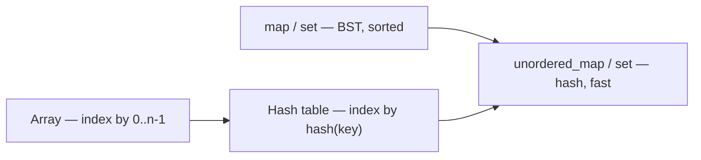
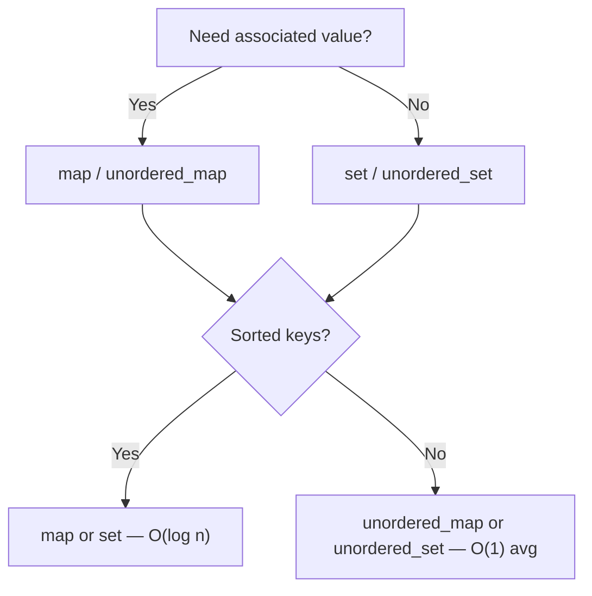
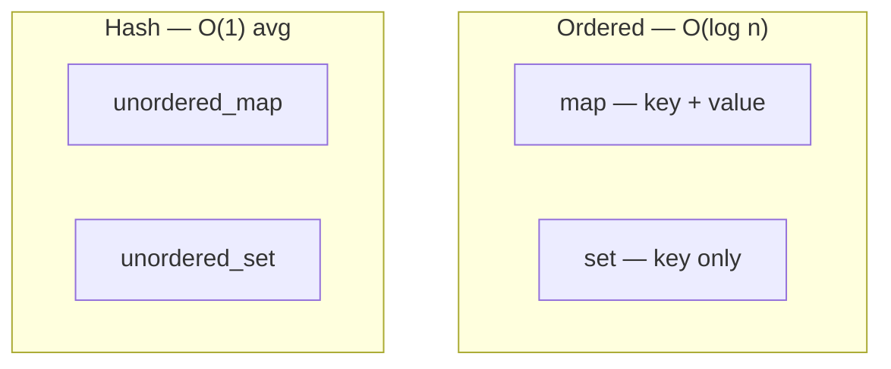
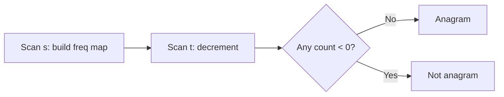
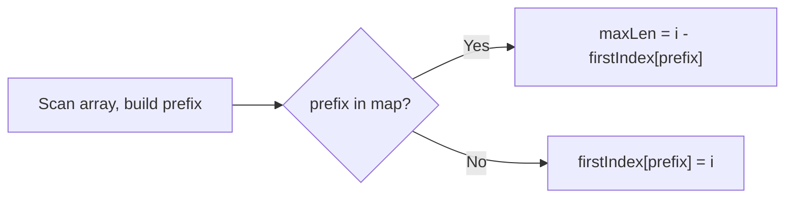
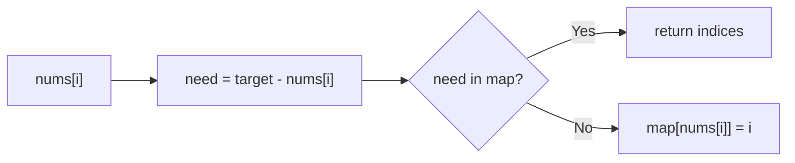

# MODULE 31 — Hashing

**Illustration code:** `a.cpp`–`f.cpp` · `g.cpp` / `h.cpp` (unordered) · `i.cpp` (`map`) · `j.cpp` (`set`) · `k.cpp`–`z.cpp` (more)

---

## Overview

| Idea | Meaning |
|------|---------|
| **Hashing** | Turn a **key** (number, string, object) into an **array index** using a **hash function** |
| **Hash table** | Array + hashing — store key–value pairs for **fast average** lookup |
| **`unordered_map`** | C++ hash table: **key → value** |
| **`unordered_set`** | C++ hash table: **unique keys only** (no value) |

> **One-line goal:** Answer “is this key here?” and “what is its value?” in **average O(1)** time instead of scanning the whole array.

---

## From Module 28 / 30 to hashing

You already used **ordered** associative containers:

| Container | Internal idea | Keys sorted? | Typical lookup |
|-----------|---------------|--------------|----------------|
| **`map` / `set`** | Balanced BST (e.g. red-black tree) | **Yes** | **O(log n)** |
| **`unordered_map` / `unordered_set`** | **Hash table** | **No** | **O(1)** average |

```text
Need sorted keys or inorder traversal?     →  map / set
Need fastest lookup, order does not matter? →  unordered_map / unordered_set
```

**Module 31** focuses on **how hashing works** and how **`unordered_*`** containers use it.

---

## What is hashing?

**Hashing** maps data of **any size** (a key) to a **fixed-range integer** called a **hash code**, then uses that code to pick a **bucket** (index) in an array.

```text
Key  "Rajat"  ──hash function──►  hash code  ──►  index in table  ──►  store / find value

Key  42       ──hash function──►  hash code  ──►  index in table
```

| Term | Meaning |
|------|---------|
| **Key** | What you search by (roll number, name, array element) |
| **Value** | Extra data stored with the key (only in **map**, not **set**) |
| **Hash function** | `hash(key)` → integer |
| **Bucket / slot** | One cell in the underlying array |
| **Hash table** | Array of buckets + hash function + rules for collisions |

---

## Hash function

A good hash function should:

1. **Spread keys evenly** across buckets (few collisions).
2. Be **fast** to compute.
3. Return the **same** hash for the **same** key every time.

```text
Simple example (int key, table size 10):

  hash(key) = key % 10

  key 23  →  23 % 10  =  3  →  bucket 3
  key 47  →  47 % 10  =  7  →  bucket 7
```

For **`string`**, C++ uses built-in specializations (e.g. `std::hash<string>`) — you rarely write your own in contests.

```cpp
#include <functional>
size_t h = hash<string>{}("hello");
```

> **Note:** `key % tableSize` is a teaching example. Real libraries resize the table and use more sophisticated mixing.

---

## What is a hash table?

A **hash table** is an ADT that supports:

| Operation | Average time | Idea |
|-----------|--------------|------|
| **Insert** | O(1) | Hash key → bucket, store there |
| **Search** | O(1) | Hash key → bucket, look there |
| **Delete** | O(1) | Hash key → bucket, remove |

```text
Underlying array (buckets):

index:  0    1    2    3    4
       [ ] [ ] [(23→A)] [ ] [(47→B)]
              ↑              ↑
         hash(23)=3    hash(47)=7  (if size=10, index 7)
```

### Collision

Two different keys can map to the **same bucket** — called a **collision**.

```text
hash(13) = 3  and  hash(23) = 3   →  both want bucket 3
```

Common fixes (library handles this for you):

| Method | Idea |
|--------|------|
| **Chaining** | Each bucket holds a **list** of entries |
| **Open addressing** | Probe to the next free slot (linear / quadratic probing) |

C++ `unordered_map` / `unordered_set` use implementation-defined strategies (often chaining or open addressing).

---

## `unordered_map` — definition

**`unordered_map<Key, Value>`** — associative container: each **key** maps to at most **one** **value**. Keys are **unique**. Backed by a **hash table**.

```cpp
#include <unordered_map>
using namespace std;

unordered_map<string, int> marks;
marks["Anita"] = 95;
marks["Ravi"]  = 88;

// marks["Anita"]  →  95
```

| Property | Detail |
|----------|--------|
| **Keys** | Unique |
| **Values** | Can repeat across different keys |
| **Order** | **No** sorted order of keys |
| **Header** | `#include <unordered_map>` |

**Typical operations:**

| Operation | Meaning | Average time |
|-----------|---------|--------------|
| `m[key] = val` | Insert or update | O(1) |
| `m.find(key)` | Search | O(1) |
| `m.count(key)` | 0 or 1 (exists?) | O(1) |
| `m.erase(key)` | Delete | O(1) |
| `m.size()` | Number of pairs | O(1) |

---

## `unordered_set` — definition

**`unordered_set<Key>`** — stores **unique keys only** (no separate value). Hash table of keys.

```cpp
#include <unordered_set>
using namespace std;

unordered_set<int> seen;
seen.insert(10);
seen.insert(20);
seen.insert(10);   // duplicate — ignored

// seen.count(10)  →  1
// seen.count(99)  →  0
```

| Property | Detail |
|----------|--------|
| **Elements** | Unique keys only |
| **Use when** | “Have I seen this before?” duplicate check, frequency with key only |
| **Header** | `#include <unordered_set>` |

**Typical operations:** `insert`, `erase`, `find`, `count` — all **average O(1)**.

---

## `unordered_map` vs `unordered_set`

| | **`unordered_map<K, V>`** | **`unordered_set<K>`** |
|--|---------------------------|------------------------|
| **Stores** | Key **and** value | Key only |
| **Example** | name → marks | set of visited nodes |
| **Duplicate keys** | Not allowed | Not allowed |
| **Access** | `m[key]`, `m[key] = v` | `s.insert(key)` |

```text
Count frequency of characters     →  unordered_map<char, int>
Check if element already seen   →  unordered_set<int>
```

---

## `map` / `set` vs `unordered_map` / `unordered_set`

| | **Ordered (`map`, `set`)** | **Unordered (`unordered_*`)** |
|--|---------------------------|--------------------------------|
| **Structure** | Balanced BST | Hash table |
| **Key order** | Sorted | Random / implementation order |
| **Lookup** | O(log n) | **O(1)** average |
| **Worst lookup** | O(log n) | O(n) — rare, many collisions |
| **Need smallest key?** | `begin()` works | Not available — sort keys yourself |
| **Need range query?** | Yes (`lower_bound`) | No |

---

## Complexity summary

| Operation | `unordered_map` / `unordered_set` (average) | Worst case |
|-----------|---------------------------------------------|------------|
| Insert | O(1) | O(n) |
| Search | O(1) | O(n) |
| Delete | O(1) | O(n) |

Worst case happens when many keys collide; good hash + resizing keeps average fast in practice.

**Space:** **O(n)** for `n` stored keys (plus bucket overhead).

---

## When to use hashing (in DSA)

| Problem pattern | Container |
|-----------------|-----------|
| Count frequency | `unordered_map<T, int>` |
| Check duplicate / visited | `unordered_set<T>` |
| Two sum, complement lookup | `unordered_map` |
| Group by some property | `unordered_map` (key = property) |
| Need sorted order of keys | **`map`**, not `unordered_map` |

---

## Key ideas (definitions checklist)

1. **Hash function** maps a key → integer (hash code).
2. **Hash table** uses that code to index into an array (**bucket**).
3. **Collision** = two keys, same bucket — solved by chaining or probing.
4. **`unordered_map`** = hash table with **key + value**.
5. **`unordered_set`** = hash table with **unique keys only**.
6. **Average O(1)** lookup; **no sorted order** of keys.
7. Use **`map`/`set`** when you need **order**; **`unordered_*`** when you need **speed**.

---

## Module map (what comes next)

| Topic | Typical file | Idea |
|-------|--------------|------|
| STL hash table | `a.cpp` | `unordered_map` API |
| Collisions | `b.cpp` | same bucket, chaining |
| Build (array + linked list) | `c.cpp` | structure of buckets |
| Insert | `d.cpp` | add / update in chain |
| Rehashing | `e.cpp` | resize when table fills |
| Search | `f.cpp` | hash + walk chain |
| `unordered_map` STL | `g.cpp` | key → value, hash |
| `unordered_set` STL | `h.cpp` | unique keys, hash |
| `map` STL | `i.cpp` | key → value, sorted |
| `set` STL | `j.cpp` | unique keys, sorted |
| Hash problems | `k.cpp`+ | frequency, two sum |
| Two sum / subarray sum | | complement in map |
| Custom hash / struct keys | | `unordered_map` with struct |
| `map` vs `unordered_map` problems | | pick the right container |

---

## Connection to earlier modules



- **Array:** index must be `0 .. n-1`.
- **Hash table:** index comes from **key** via **hash** — works for strings, large ints, etc.
- **Module 28 `map`:** ordered; **Module 31 `unordered_map`:** same idea (key → value), different engine underneath.

---

## Hash table — detailed (`a.cpp`)

**Illustration code:** [`a.cpp`](a.cpp)

### What is a hash table?

A **hash table** is an **unordered** data structure that stores **(key, value)** pairs.

```text
Normal array:     index must be 0, 1, 2, ... n-1
Hash table:       index = f(key)  where f = hash function

  key "Anita"  ──hash──►  index 4  ──►  store value 95 at bucket 4
  key "Ravi"   ──hash──►  index 1  ──►  store value 88 at bucket 1
```

You take an **array** (called **buckets**), use **hashing** to convert each **key** into an **index**, and store the **value** there.

> **Hashing** = process of taking data of one type (key), passing it through a **hash function**, and producing a **hash code** (usually an integer) that picks a bucket index.

```text
key  (string, int, etc.)  →  hash function  →  hash code  →  index in array
```

### Unordered data

- Keys are **not sorted** (unlike `map`).
- Order of iteration is **not** insertion order guaranteed in theory — treat it as **random** for logic.
- Perfect when data has **no natural order** but you need **fast lookup by key**.

### Three main operations

| Operation | What it does | Average time | C++ (`unordered_map`) |
|-----------|--------------|--------------|------------------------|
| **Insert** | Add or update `(key, value)` | **O(1)** | `m[key] = val`, `m.insert({k,v})` |
| **Search** | Find value for `key` | **O(1)** | `m.find(key)`, `m.count(key)`, `m[key]` |
| **Remove** | Delete entry for `key` | **O(1)** | `m.erase(key)` |

**Worst case:** **O(n)** if many **collisions** (all keys in one bucket).

### When to use a hash table

| Situation | Why hash table? |
|-----------|-----------------|
| “Is this **key** present?” | Search in **O(1)** average |
| “What is the **value** for this key?” | Direct access |
| Data is **unordered** | No need to sort |
| Count frequency, two sum, visited set | Key-based lookup many times |

**Not for:** smallest key, range queries, sorted traversal → use **`map`**.

### Simple hash function (int keys, table size `M`)

```text
hash(key) = key % M     →  index in [0, M-1]

key 23, M=10  →  index 3
key 47, M=10  →  index 7
```

C++ hides this inside `unordered_map`; you use the container directly.

Run: `g++ -std=c++17 -o a a.cpp && ./a`

---

## Collisions (`b.cpp`)

**Illustration code:** [`b.cpp`](b.cpp)

### What is a collision?

A **collision** happens when **two different keys** get the **same index** (same bucket).

```text
M = 10

key 13  →  13 % 10  =  3
key 23  →  23 % 10  =  3   ← collision! both want bucket 3
```

Both pairs cannot occupy one array cell without a strategy.

### How we fix collisions

| Method | Idea | Picture |
|--------|------|---------|
| **Chaining** | Each bucket is a **list** of (key, value) pairs | `[ (13, A) → (23, B) ]` at index 3 |
| **Open addressing** | Probe next free slot in the array | try 3, then 4, then 5… |

C++ `unordered_map` uses an implementation-defined strategy (you use the STL; `b.cpp` shows **chaining** by hand).

### After chaining

```text
bucket 3:  (13, "A") → (23, "B") → null

Search 23:  hash → 3, walk list, find 23  →  "B"
```

Search is still **O(1) average** if the table is not too full and the hash spreads keys well.

Run: `g++ -std=c++17 -o b b.cpp && ./b`

---

### `a.cpp` vs `b.cpp` — summary

| File | Topic | Takeaway |
|------|-------|----------|
| `a.cpp` | Hash table API | `unordered_map` = insert / search / remove |
| `b.cpp` | Collisions | Same index → chain or probe |

---

## Building a hash table — array + linked list (`c.cpp`)

**Illustration code:** [`c.cpp`](c.cpp)

We **build** a hash table from scratch using:

1. An **array** of size **`M`** (buckets `0 .. M-1`).
2. Each array slot holds the head of a **linked list** (`std::list` in C++) of `(key, value)` pairs.

```text
buckets[0] →  (empty)
buckets[1] →  (empty)
buckets[2] →  (17, "X") → null
buckets[3] →  (13, "A") → (23, "B") → null   ← chain after collision
...
buckets[M-1]
```

| Part | Role |
|------|------|
| **Array** | Fixed number of buckets; index = `hash(key)` |
| **Linked list** | Stores all keys that collided into that bucket |
| **`hash(key)`** | Usually `key % M` for integers |

```cpp
vector<list<pair<int, string>>> buckets(M);  // M chains
int hash(int key) { return key % M; }
```

**Why not store only in the array?** One slot = one key fails when two keys hash to the same index → need a **chain** (list) per bucket.

Run: `g++ -std=c++17 -o c c.cpp && ./c`

---

## Inserting in a hash table (`d.cpp`)

**Illustration code:** [`d.cpp`](d.cpp)

### Steps to insert `(key, value)`

| Step | Action |
|------|--------|
| 1 | Compute `idx = hash(key)` |
| 2 | Walk the **linked list** at `buckets[idx]` |
| 3 | If **key already exists** → **update** value, stop |
| 4 | Else reach end of list → **push_back** new `(key, value)` |
| 5 | Increment `count` of elements (for rehashing) |

```text
Insert (23, "B"), M=10:

  idx = 23 % 10 = 3
  bucket 3 already has (13, "A")
  23 ≠ 13  →  append (23, "B") at end of list
```

| Case | Result |
|------|--------|
| **Empty bucket** | New list node is the only entry |
| **Collision** | Append to existing chain — **O(1)** if chain length stays small |
| **Duplicate key** | Update value in place — no second copy |

**Average time:** **O(1)** · **Worst:** **O(n)** if every key lands in one chain.

Run: `g++ -std=c++17 -o d d.cpp && ./d`

---

## Rehashing (`e.cpp`)

**Illustration code:** [`e.cpp`](e.cpp)

When the table gets **too full**, chains grow long and operations slow down. **Rehashing** creates a **larger** array and **re-inserts** every entry.

### Load factor

```text
load factor α = (number of keys) / M

Example: 8 keys, M=10  →  α = 0.8
```

| α | Effect |
|---|--------|
| **Small** (e.g. 0.5) | Few collisions, fast |
| **Large** (e.g. > 0.75) | Long chains, slow → **rehash** |

### Rehash algorithm

| Step | Action |
|------|--------|
| 1 | If `count >= M * maxLoad` (e.g. 3 keys when M=4 and max=0.75), trigger rehash |
| 2 | Create **new** array of size **`M' = 2 * M`** (typical) |
| 3 | For each `(key, value)` in **old** table, `insert` into **new** table |
| 4 | Keys get **new indices** because `key % M'` changed |
| 5 | Replace old buckets with new; update `M` |

```text
Before: M=4, keys 5,9,13,17  (all may collide at bucket 1)

After M'=8:
  5 % 8 = 5
  9 % 8 = 1
  13 % 8 = 5  (still collision possible, but fewer per bucket on average)
```

**Cost of one rehash:** **O(n)** — touch every stored key. Amortized over many inserts, insert stays **O(1)** average.

`unordered_map` in C++ rehashes automatically when you insert.

Run: `g++ -std=c++17 -o e e.cpp && ./e`

---

## Searching in a hash table (`f.cpp`)

**Illustration code:** [`f.cpp`](f.cpp)

### Steps to search `key`

| Step | Action |
|------|--------|
| 1 | `idx = hash(key)` |
| 2 | Walk linked list at `buckets[idx]` |
| 3 | If `node.key == key` → **found**, return value |
| 4 | If list ends → **not found** |

```text
Search 23, M=10:

  idx = 3
  bucket 3: (13, "A") → (23, "B")
            check 13 ≠ 23
            check 23 = 23  →  found "B"
```

| Case | Time (average) |
|------|----------------|
| Empty bucket | O(1) — immediate miss |
| Key at head of chain | O(1) |
| Key at end of short chain | O(1) average |
| All keys in one chain | O(n) worst |

**Same path as insert** — that is why hash tables stay fast when chains stay short (good hash + rehashing).

Run: `g++ -std=c++17 -o f f.cpp && ./f`

---

### `c.cpp`–`f.cpp` — summary

| File | Topic | Key idea |
|------|-------|----------|
| `c.cpp` | **Build** | `vector<list<>>` = array of chains |
| `d.cpp` | **Insert** | hash → walk → update or append |
| `e.cpp` | **Rehash** | bigger `M`, re-insert all keys |
| `f.cpp` | **Search** | hash → walk chain |

---

## STL containers — hash-based (`unordered_*`)

C++ gives you **ready-made hash tables**. You do **not** need to code array + linked list yourself in contests — use these when you need **fast average** lookup.

| Container | Header | Stores | Hash table? |
|-----------|--------|--------|-------------|
| **`unordered_map<K, V>`** | `<unordered_map>` | **Key + value** pairs | Yes |
| **`unordered_set<K>`** | `<unordered_set>` | **Keys only** (unique) | Yes |

> **Spelling:** **unordered** (not “underlined”) — keys have **no sorted order**.

**Illustration code:** [`g.cpp`](g.cpp) · [`h.cpp`](h.cpp)

---

## `unordered_map` — `g.cpp`

**Key → value.** Each key appears **at most once**. Duplicate key **overwrites** value.

```cpp
#include <unordered_map>
unordered_map<string, int> freq;
freq["apple"] = 3;
freq["banana"] = 1;
cout << freq["apple"];   // 3
```

| Operation | Code | Avg time |
|-----------|------|----------|
| Insert / update | `m[key] = val`, `m.insert({k,v})` | O(1) |
| Search | `m.count(key)`, `m.find(key)`, `m[key]` | O(1) |
| Delete | `m.erase(key)` | O(1) |
| Size | `m.size()` | O(1) |

**Use for:** frequency map, two-sum complement, cache `key → data`.

Run: `g++ -std=c++17 -o g g.cpp && ./g`

---

## `unordered_set` — `h.cpp`

**Only keys** — no separate value. **Unique** elements.

```cpp
#include <unordered_set>
unordered_set<int> seen;
seen.insert(10);
seen.insert(10);   // ignored — duplicate
cout << seen.count(10);  // 1
cout << seen.count(99);  // 0
```

| Operation | Code | Avg time |
|-----------|------|----------|
| Insert | `s.insert(x)` | O(1) |
| Search | `s.count(x)`, `s.find(x)` | O(1) |
| Delete | `s.erase(x)` | O(1) |

**Use for:** “Already seen?”, duplicate check, graph visited set.

Run: `g++ -std=c++17 -o h h.cpp && ./h`

---

## Difference: `map` vs `unordered_map`

Both store **key → value**. Difference is **how** they are implemented and whether keys are **sorted**.

| | **`map<K, V>`** | **`unordered_map<K, V>`** |
|--|-------------------|---------------------------|
| **Underlying** | Balanced BST (red-black tree) | **Hash table** |
| **Key order** | **Sorted** (increasing by default) | **Not sorted** |
| **Insert / search / erase** | **O(log n)** | **O(1)** average |
| **Worst case** | O(log n) | O(n) |
| **Header** | `<map>` | `<unordered_map>` |
| **`begin()`** | Smallest key | Arbitrary bucket order |
| **Range queries** | `lower_bound`, `upper_bound` | Not supported |
| **When to use** | Need sorted keys, nearest key | Need fastest lookup only |

```text
map:           keys always  1, 5, 10, 20  (sorted)
unordered_map: keys might print  10, 1, 20, 5  (unordered)
```

```cpp
map<int, string> ordered;
unordered_map<int, string> fast;
```

---

## Difference: `set` vs `unordered_set`

Both store **unique keys only** (no value). Same ordered vs hash split as above.

| | **`set<K>`** | **`unordered_set<K>`** |
|--|--------------|-------------------------|
| **Underlying** | Balanced BST | **Hash table** |
| **Order** | **Sorted** | **Unordered** |
| **Lookup** | O(log n) | **O(1)** average |
| **Header** | `<set>` | `<unordered_set>` |
| **When to use** | Need sorted unique elements | Fast duplicate / membership test |

```cpp
set<int> sortedUnique;
unordered_set<int> fastUnique;
```

---

## Difference: `unordered_map` vs `unordered_set`

Both use **hash tables** and are **unordered**. The difference is **what** you store.

| | **`unordered_map<K, V>`** | **`unordered_set<K>`** |
|--|---------------------------|-------------------------|
| **Stores** | **Key and value** | **Key only** |
| **Example** | word → count | set of visited node IDs |
| **Access** | `m[key]`, `m[key] = v` | `s.insert(x)`, `s.count(x)` |
| **Duplicate key** | Updates value | Ignored on insert |
| **Typical question** | Frequency, two sum | Duplicate in array, visited |

```text
Count how many times each char appears     →  unordered_map<char, int>
Check if number already seen in array      →  unordered_set<int>
```

You can mimic a set with `unordered_map<K, bool>` or `unordered_map<K, int>`, but **`unordered_set` is clearer** when there is no value.

---

### Quick picker (interviews)

```text
Need key → value?     Yes → map or unordered_map
                      No  → set or unordered_set

Need sorted order?    Yes → map / set
                      No  → unordered_map / unordered_set
```



---

### `g.cpp` / `h.cpp` — summary

| File | Container | Remember |
|------|-----------|----------|
| `g.cpp` | `unordered_map` | key → value, hash, O(1) avg |
| `h.cpp` | `unordered_set` | unique keys only, hash, O(1) avg |

---

## STL containers — ordered (`map` & `set`)

From **Module 28** you saw that **`map`** and **`set`** use a **balanced binary search tree** (usually a **red-black tree**), **not** a hash table.

| Container | Header | Stores | Internal | Keys sorted? |
|-----------|--------|--------|----------|--------------|
| **`map<K, V>`** | `<map>` | **Key + value** | BST | **Yes** |
| **`set<K>`** | `<set>` | **Unique keys only** | BST | **Yes** |

**Illustration code:** [`i.cpp`](i.cpp) · [`j.cpp`](j.cpp)

---

## `map` — definition & `i.cpp`

### Definition

A **`map`** is an ordered associative container: each **key** maps to exactly **one** **value**. Keys are stored in **sorted order** (default: increasing).

```text
map<string, int> marks:

  key (sorted)    value
  "Anita"    →    95
  "Kiran"    →    76
  "Ravi"     →    88

Iteration always walks keys in sorted order.
```

### How it works (idea)

```text
        (Kiran, 76)
       /           \
  (Anita, 95)   (Ravi, 88)

BST by key  →  insert/search/erase in O(log n)
```

### Main operations

| Operation | Code | Time |
|-----------|------|------|
| Insert / update | `m[key] = val`, `m.insert({k,v})` | O(log n) |
| Search | `m.count(key)`, `m.find(key)`, `m[key]` | O(log n) |
| Delete | `m.erase(key)` | O(log n) |
| Smallest key | `m.begin()->first` | O(log n) to first node |
| First key ≥ x | `m.lower_bound(x)` | O(log n) |

```cpp
#include <map>
map<int, string> m;
m[30] = "C";
m[10] = "A";
m[20] = "B";
// iteration: 10, 20, 30
```

### When to use `map`

| Use `map` when… |
|-----------------|
| You need keys in **sorted order** |
| You need **`lower_bound` / `upper_bound`** |
| O(log n) is fine and order matters |

**Use `unordered_map` when** you only need fast lookup and **do not** care about order.

Run: `g++ -std=c++17 -o i i.cpp && ./i`

---

## `set` — definition & `j.cpp`

### Definition

A **`set`** stores **unique keys** in **sorted order**. There is **no separate value** — the key **is** the element.

```text
set<int> s;
insert: 40, 10, 30, 10

Stored (sorted):  10, 30, 40
Duplicate 10 ignored.
```

### How it works (idea)

Same **BST** idea as `map`, but each node holds **one key** (no value field).

### Main operations

| Operation | Code | Time |
|-----------|------|------|
| Insert | `s.insert(x)` | O(log n) |
| Search | `s.count(x)`, `s.find(x)` | O(log n) |
| Delete | `s.erase(x)` | O(log n) |
| Smallest element | `*s.begin()` | O(log n) |
| Largest element | `*s.rbegin()` | O(log n) |

```cpp
#include <set>
set<int> s;
s.insert(5);
s.insert(2);
if (s.count(5)) { /* present */ }
```

### When to use `set`

| Use `set` when… |
|-----------------|
| You need **sorted unique** elements |
| You need next/previous element in order |
| You use `lower_bound` on a collection of keys |

**Use `unordered_set` when** you only need fast membership test, no order.

Run: `g++ -std=c++17 -o j j.cpp && ./j`

---

## All four STL containers — one table

| | **`map`** | **`unordered_map`** | **`set`** | **`unordered_set`** |
|--|-----------|---------------------|-----------|---------------------|
| **File** | `i.cpp` | `g.cpp` | `j.cpp` | `h.cpp` |
| **Stores** | key + value | key + value | key only | key only |
| **Engine** | BST | hash table | BST | hash table |
| **Sorted?** | Yes | No | Yes | No |
| **Lookup** | O(log n) | O(1) avg | O(log n) | O(1) avg |
| **Header** | `<map>` | `<unordered_map>` | `<set>` | `<unordered_set>` |



---

### `i.cpp` / `j.cpp` — summary

| File | Container | Remember |
|------|-----------|----------|
| `i.cpp` | `map` | sorted key → value, BST, `lower_bound` |
| `j.cpp` | `set` | sorted unique keys, BST |

## Practice problems — `k.cpp`–`u.cpp`

Hash-table problems using **`unordered_map`** and **`unordered_set`**.

| File | Problem | Container |
|------|---------|-----------|
| [`k.cpp`](k.cpp) | Majority Element (> n/3) | `unordered_map` (+ voting) |
| [`l.cpp`](l.cpp) | Valid Anagram | `unordered_map<char,int>` |
| [`m.cpp`](m.cpp) | Count Distinct | `unordered_set` |
| [`n.cpp`](n.cpp) | Union & Intersection | `unordered_set` |
| [`o.cpp`](o.cpp) | Longest subarray with sum 0 | `unordered_map` (prefix sum) |
| [`p.cpp`](p.cpp) | Subarray sum equals K | `unordered_map` (prefix count) |
| [`q.cpp`](q.cpp) | Itinerary from Tickets | `unordered_map` + graph DFS |
| [`r.cpp`](r.cpp) | Bottom view of binary tree | `map` (HD → node) |
| [`s.cpp`](s.cpp) | Two Sum | `unordered_map` |
| [`t.cpp`](t.cpp) | Sort by frequency | `unordered_map` |
| [`u.cpp`](u.cpp) | Bulls & Cows | `unordered_map` (digit freq) |

---

## Majority Element (> n/3) — `k.cpp`

**Task:** Given an array of size `n`, return **every** value that appears **more than `n/3` times**. (At most **two** such values can exist.)

**Sample:** `nums = [1, 1, 1, 3, 3, 2, 2, 2]`, `n = 8` → **`1`** and **`2`** (each appears 3 times; `3 > 8/3`).

### Why at most two answers?

If three different values each appeared more than `n/3` times, their total count would exceed `n` — impossible.

```text
n = 9  →  threshold = 3
Max from three values each > 3:  4 + 4 + 4 = 12 > 9  ✗
So at most 2 values can pass the test.
```

### Approach 1 — Hash map (primary for Module 31)

| Step | Action |
|------|--------|
| 1 | Create `unordered_map<int,int> freq` |
| 2 | For each `nums[i]`, do `freq[nums[i]]++` |
| 3 | Scan the map; if `freq[key] > n/3`, add `key` to answer |

```text
[1, 1, 1, 3, 3, 2, 2, 2]

freq:  1→3   3→2   2→3
n/3 = 2  →  keep 1 and 2
```

| | |
|---|---|
| **Time** | **O(n)** average |
| **Space** | **O(n)** for the map |

### Approach 2 — Extended Boyer–Moore voting (`k.cpp`)

Same cancellation idea as majority **> n/2**, but maintain **two** candidates.

| Phase | Action |
|-------|--------|
| **Pass 1** | Track `cand1`, `cand2` and counts; cancel triples of distinct values |
| **Pass 2** | Count real frequencies of `cand1` and `cand2`; keep if `count > n/3` |

```text
[1,1,1,3,3,2,2,2]  →  candidates 1 and 2 survive → verify → both valid
```

| | |
|---|---|
| **Time** | **O(n)** |
| **Space** | **O(1)** |

Run: `g++ -std=c++17 -o k k.cpp && ./k`

---

## Valid Anagram — `l.cpp`

**Task:** Two strings `s` and `t` are **anagrams** if they use the **same characters** with the **same frequencies** (order may differ).

**Sample:** `"listen"` and `"silent"` → **true**.

### Steps

| Step | Action |
|------|--------|
| 1 | If `s.length() != t.length()` → **false** |
| 2 | `unordered_map<char,int> freq` — for each char in `s`, `freq[c]++` |
| 3 | For each char `c` in `t`, `freq[c]--`; if any becomes **negative** → **false** |
| 4 | Otherwise → **true** |

```text
s = "listen"     t = "silent"

After s:  e→1 i→1 l→1 n→1 s→1 t→1
Walk t:  each -- hits 0  →  anagram
```



| | |
|---|---|
| **Time** | **O(n)** where `n` = string length |
| **Space** | **O(1)** for lowercase English (26 letters); **O(k)** for `k` unique characters |

Run: `g++ -std=c++17 -o l l.cpp && ./l`

---

## Count Distinct — `m.cpp`

**Task:** Count how many **unique** values appear in an array.

**Sample:** `[4, 1, 2, 1, 5, 2]` → **4** distinct values (`4, 1, 2, 5`).

### Steps

| Step | Action |
|------|--------|
| 1 | `unordered_set<int> seen` |
| 2 | For each `x` in array, `seen.insert(x)` (duplicates ignored) |
| 3 | Return `seen.size()` |

```text
4 → {4}
1 → {4,1}
2 → {4,1,2}
1 → duplicate, ignored
5 → {4,1,2,5}
2 → duplicate

answer = 4
```

| | |
|---|---|
| **Time** | **O(n)** average |
| **Space** | **O(n)** |

**Alternative:** sort + scan — **O(n log n)** time, **O(1)** extra if in-place.

Run: `g++ -std=c++17 -o m m.cpp && ./m`

---

## Union and Intersection — `n.cpp`

Given two arrays **A** and **B**, find:

| Set | Meaning |
|-----|---------|
| **Union** | All **unique** elements that appear in **A or B** (or both) |
| **Intersection** | All **unique** elements that appear in **both** A and B |

**Sample:** `A = [1,2,3,4,5]`, `B = [3,4,5,6,7]`

| Result | Values |
|--------|--------|
| Union | `1 2 3 4 5 6 7` |
| Intersection | `3 4 5` |

### Union — steps

| Step | Action |
|------|--------|
| 1 | `unordered_set<int> u` — insert all elements of **A** |
| 2 | Insert all elements of **B** |
| 3 | Copy set into result vector |

### Intersection — steps

| Step | Action |
|------|--------|
| 1 | Put all elements of **B** into `unordered_set<int> setB` |
| 2 | For each `x` in **A**, if `setB.count(x)`, add `x` to `common` set (avoids duplicates) |
| 3 | Return `common` as vector |

```text
A: 1 2 3 4 5          B: 3 4 5 6 7
         \___________/
              3 4 5  ← intersection

Union = everything in either circle:

    A ∪ B = {1,2,3,4,5,6,7}
```

| Operation | Time (avg) | Space |
|-----------|------------|-------|
| Union | O(n + m) | O(n + m) |
| Intersection | O(n + m) | O(n + m) |

Run: `g++ -std=c++17 -o n n.cpp && ./n`

---

## Itinerary from Tickets — `q.cpp`

**Task:** You are given plane tickets as pairs **`<from, to>`**. Use **every ticket exactly once** to form one continuous route. Return the cities in order.

**Sample tickets:**

| From | To |
|------|-----|
| Chennai | Bengaluru |
| Mumbai | Delhi |
| Goa | Chennai |
| Delhi | Goa |

**Route:** `Mumbai → Delhi → Goa → Chennai → Bengaluru`

### Model as a graph

- Each **city** = **vertex**
- Each **ticket** = one **directed edge** `from → to`

```text
Mumbai ──► Delhi ──► Goa ──► Chennai ──► Bengaluru
```

You need an **Eulerian trail** that uses **every edge once** — here a simple path (no repeated cities).

### Find the starting city

Count **outgoing** and **incoming** edges per city:

| City | Out | In | Out − In |
|------|-----|-----|----------|
| Mumbai | 1 | 0 | **−1** |
| Delhi | 1 | 1 | 0 |
| Goa | 1 | 1 | 0 |
| Chennai | 1 | 1 | 0 |
| Bengaluru | 0 | 1 | +1 |

The **start** has **one more outgoing** edge than incoming → **`Mumbai`**.

(`balance[city] = in − out`; start city has `balance < 0`.)

### Build the route — Hierholzer / iterative DFS

| Step | Action |
|------|--------|
| 1 | `unordered_map<string, vector<string>> graph` — adjacency lists |
| 2 | Sort each city’s destination list (lexicographic tie-break when needed) |
| 3 | DFS from start: while edges remain from current city, walk to next city and **remove used edge** |
| 4 | When stuck, **push city to route**; reverse at end |

```text
Stack DFS from Mumbai:

  Mumbai → Delhi → Goa → Chennai → Bengaluru (no more edges)
  unwind: Bengaluru, Chennai, Goa, Delhi, Mumbai
  reverse → Mumbai … Bengaluru
```

| | |
|---|---|
| **Time** | **O(E log E)** if sorting destinations; **O(E)** without sort |
| **Space** | **O(E)** for graph + stack |

Run: `g++ -std=c++17 -o q q.cpp && ./q`

---

## Longest subarray with sum 0 — `o.cpp`

**Task:** Given an integer array, find the **length of the longest contiguous subarray** whose elements **sum to 0**.

**Sample:** `arr = [15, -2, 2, -8, 1, 7, 10, 23]` → answer **5** (subarray `[-2, 2, -8, 1, 7]`).

### Prefix sum idea

Define **`prefix[i]`** = sum of `arr[0..i]`.

```text
Subarray arr[l..r] has sum 0  ⟺  prefix[r] = prefix[l - 1]

  arr:   15  -2   2  -8   1   7  10  23
  pref:  15  13  15   7   8  15  25  48
   ↑                           ↑
 index 0                   index 5
 both prefix = 15  →  subarray index 1..5 has sum 0  →  length 5
```

### Steps (hash map of first prefix index)

| Step | Action |
|------|--------|
| 1 | `unordered_map<int,int> firstIndex`; set `firstIndex[0] = -1` (empty prefix before array) |
| 2 | Walk array, update `prefix += arr[i]` |
| 3 | If `prefix` seen before → length = `i - firstIndex[prefix]`; update `maxLen` |
| 4 | Else store `firstIndex[prefix] = i` (**first** occurrence only — we want longest) |
| 5 | Return `maxLen` |



| | |
|---|---|
| **Time** | **O(n)** average |
| **Space** | **O(n)** for the map |

**Brute force:** check every subarray — **O(n²)** time.

Run: `g++ -std=c++17 -o o o.cpp && ./o`

---

## Subarray sum equals K — `p.cpp`

**Task:** Count how many **contiguous subarrays** have sum **exactly `K`**. (Includes negative numbers.)

**Sample:** `arr = [1, 1, 1]`, `K = 2` → **2** subarrays: `[1,1]` at indices `0..1` and `1..2`.

### Prefix sum + frequency map

```text
sum(arr[l..r]) = K  ⟺  prefix[r] - prefix[l-1] = K
                  ⟺  prefix[l-1] = prefix[r] - K
```

At index `r`, add **`count[prefix[r] - K]`** to the answer (how many earlier prefixes match).

| Step | Action |
|------|--------|
| 1 | `unordered_map<long long,int> prefixCount`; `prefixCount[0] = 1` |
| 2 | For each element, `prefix += arr[i]` |
| 3 | `count += prefixCount[prefix - K]` |
| 4 | `prefixCount[prefix]++` |
| 5 | Return `count` |

**Example trace:** `arr = [1, 2, 3]`, `K = 3`

| i | prefix | need prefix−K | count | map after |
|---|--------|---------------|-------|-----------|
| 0 | 1 | −2 → 0 | 0 | {0:1, 1:1} |
| 1 | 3 | 0 → 1 | 1 | {0:1, 1:1, 3:1} |
| 2 | 6 | 3 → 1 | 2 | {0:1, 1:1, 3:1, 6:1} |

Answer: **2** (`[3]` and `[1,2]`).

```text
Difference of prefix sums:

  prefix[r] ──────────────── prefix[l-1] = K
              subarray l..r
```

| | |
|---|---|
| **Time** | **O(n)** average |
| **Space** | **O(n)** |

**Note:** Use `long long` for prefix if values are large (avoid overflow).

Run: `g++ -std=c++17 -o p p.cpp && ./p`

---

### `k.cpp`–`q.cpp` — summary

| File | Technique | Time | Space |
|------|-----------|------|-------|
| `k.cpp` | Frequency map / Boyer–Moore II | O(n) | O(n) or O(1) |
| `l.cpp` | Char frequency map | O(n) | O(1)–O(k) |
| `m.cpp` | `unordered_set` | O(n) | O(n) |
| `n.cpp` | Two hash sets | O(n+m) | O(n+m) |
| `o.cpp` | Prefix sum + first index map | O(n) | O(n) |
| `p.cpp` | Prefix sum + prefix count map | O(n) | O(n) |
| `q.cpp` | Graph + Eulerian DFS | O(E log E) | O(E) |

---

## Bottom view of binary tree — `r.cpp`

**Task:** Print the **bottom view** of a binary tree — the nodes you see when looking **from below**. For each vertical column (**horizontal distance / HD**), the **deepest** node is visible.

> **Note:** Some problem statements say “top view” by mistake. **Top view** keeps the **first** (topmost) node per HD; **bottom view** keeps the **last** (deepest) node per HD. This file implements **bottom view**.

**Sample tree:**

```text
           1(0)
          /    \
      2(-1)    3(1)
      /  \       \
  4(-2) 5(0)    6(2)
```

**Bottom view (left → right by HD):** `4  2  5  3  6`  
(At HD `0`, node **5** is below **1**, so bottom view shows **5** not **1**.)

### Horizontal distance (HD)

| Rule | HD |
|------|-----|
| Root | `0` |
| Left child | parent HD − 1 |
| Right child | parent HD + 1 |

### Steps

| Step | Action |
|------|--------|
| 1 | BFS (level order) from root with `(node, HD)` |
| 2 | `map<int,int> bottom` — for each HD, store the **latest** node value seen |
| 3 | Every visit: `bottom[hd] = node->data` (**overwrite** → deepest wins) |
| 4 | Print `bottom` in increasing HD order |

```text
BFS order visits HD 0 twice: first 1, then 5  →  bottom[0] = 5

Top view (first wins):     4  2  1  3  6
Bottom view (last wins):   4  2  5  3  6
```

| | |
|---|---|
| **Time** | **O(n log n)** with `map` (or O(n) with `unordered_map` + sort HD keys) |
| **Space** | **O(n)** |

Run: `g++ -std=c++17 -o r r.cpp && ./r`

---

## Two Sum — `s.cpp`

**Task:** Given array `nums` and integer `target`, return **indices** of two distinct elements that sum to `target`. Exactly one solution exists.

**Sample:** `nums = [2, 7, 11, 15]`, `target = 9` → **`[0, 1]`** (because `2 + 7 = 9`).

### Steps (hash map — one pass)

| Step | Action |
|------|--------|
| 1 | `unordered_map<int,int> valueToIndex` |
| 2 | For each index `i`, `need = target - nums[i]` |
| 3 | If `need` is already in map → return `{valueToIndex[need], i}` |
| 4 | Else `valueToIndex[nums[i]] = i` |
| 5 | Continue until pair found |

```text
nums = [2, 7, 11, 15],  target = 9

i=0: need=7, map empty     → map {2→0}
i=1: need=2, map has 2     → answer [0, 1]
```



| | |
|---|---|
| **Time** | **O(n)** average |
| **Space** | **O(n)** |

**Brute force:** all pairs — **O(n²)** time, **O(1)** space.

Run: `g++ -std=c++17 -o s s.cpp && ./s`

---

## Sort by frequency — `t.cpp`

**Task:** Given string `s`, rearrange characters so **higher frequency** comes first (decreasing frequency). If frequencies tie, any order is fine (we break ties by character for stable demos).

**Samples:**

| Input | Output (example) |
|-------|------------------|
| `"tree"` | `"eert"` |
| `"cccaaa"` | `"aaaccc"` or `"cccaaa"` |

### Steps

| Step | Action |
|------|--------|
| 1 | `unordered_map<char,int> freq` — count each character |
| 2 | Copy map entries into `vector<pair<char,int>>` |
| 3 | Sort pairs by **frequency descending** |
| 4 | Append each character `freq` times to result string |

```text
"tree"  →  t:1  r:1  e:2
sort by freq  →  e:2, r:1, t:1
result  →  "eert"
```

| | |
|---|---|
| **Time** | **O(n + k log k)** — `n` = string length, `k` = distinct chars |
| **Space** | **O(k)** |

Run: `g++ -std=c++17 -o t t.cpp && ./t`

---

## Bulls & Cows — `u.cpp`

**Task:** Compare `secret` and `guess` (same length). Return hint **`"xAyB"`**:

| Symbol | Meaning |
|--------|---------|
| **Bulls (x)** | Same digit in the **same position** |
| **Cows (y)** | Digit appears in both strings but in **wrong position** (after removing bulls) |

**Sample:** `secret = "1807"`, `guess = "7810"` → **`"1A3B"`** (1 bull, 3 cows).

### Steps

| Step | Action |
|------|--------|
| 1 | Scan index by index: if `secret[i] == guess[i]` → **bull++** |
| 2 | Else add `secret[i]` and `guess[i]` to separate frequency maps |
| 3 | For each digit `d` in guess map: `cows += min(guessFreq[d], secretFreq[d])` |
| 4 | Return `to_string(bulls) + "A" + to_string(cows) + "B"` |

```text
secret = 1 8 0 7
guess  = 7 8 1 0
         ✗ ✓ ✗ ✗   →  1 bull (the 8)

Non-bull digits:
  secret: 1, 0, 7
  guess:  7, 1, 0
  match pairs: 1↔1, 0↔0, 7↔7  →  3 cows
```

| | |
|---|---|
| **Time** | **O(n)** |
| **Space** | **O(1)** — at most 10 digits |

Run: `g++ -std=c++17 -o u u.cpp && ./u`

---

### `k.cpp`–`u.cpp` — full summary

| File | Technique | Time | Space |
|------|-----------|------|-------|
| `k.cpp` | Frequency map / Boyer–Moore II | O(n) | O(n) or O(1) |
| `l.cpp` | Char frequency map | O(n) | O(1)–O(k) |
| `m.cpp` | `unordered_set` | O(n) | O(n) |
| `n.cpp` | Two hash sets | O(n+m) | O(n+m) |
| `o.cpp` | Prefix sum + first index map | O(n) | O(n) |
| `p.cpp` | Prefix sum + prefix count map | O(n) | O(n) |
| `q.cpp` | Graph + Eulerian DFS | O(E log E) | O(E) |
| `r.cpp` | BFS + HD map (bottom view) | O(n log n) | O(n) |
| `s.cpp` | Complement in hash map | O(n) | O(n) |
| `t.cpp` | Frequency + sort | O(n + k log k) | O(k) |
| `u.cpp` | Digit frequency (bulls/cows) | O(n) | O(1) |