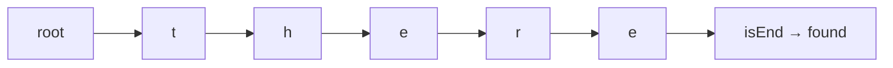

# MODULE 32 — Tries (Prefix Trees)

**Illustration code:** [`a.cpp`](a.cpp)–[`g.cpp`](g.cpp) · [`h.cpp`](h.cpp)–[`j.cpp`](j.cpp) (more)

---

## Overview

| Idea | Meaning |
|------|---------|
| **Trie** | Tree for storing **strings** where each edge represents a **character** |
| **Prefix tree** | Paths from root spell **prefixes** of stored words |
| **Retrieval tree** | Optimized for **lookup / insert** of keys (words) |
| **K-ary tree** | Each node has up to **K** children (for lowercase English, **K = 26**) |

> **One-line goal:** Insert and search words in **O(L)** time, where **L = length of the key** — not **O(number of words)**.

---

## What is a trie?

A **trie** (pronounced “try”) is a tree used for **string-based** problems:

- Dictionary of words
- Prefix matching / autocomplete
- “Does any word start with …?”
- Pattern matching on character sets

**Characters are stored on the paths** (or in nodes along the path), not as one blob per node like a BST key.

```text
Words:  the, a, there, their, any, thee

              (root)
             /   |   \
            a    ...  t
            |          |
            n          h
            |          |
            y          e  ← "the" ends here [END]
         [any]       / | \
                    e  r  ...
                 [thee] |
                        e [there]
                        |
                        i
                        |
                        r [their]
```

Words that share a **prefix** share the **same path** from the root — that is why tries save space for similar words.

---

## Other names

| Name | Why |
|------|-----|
| **Prefix tree** | Every path from root is a **prefix** of one or more stored words |
| **Retrieval tree** | Built for fast **retrieval** (search) of string keys |

---

## K-ary (generic) tree

A trie is a **K-ary tree**: each node has at most **K** children — one per possible next character.

| Alphabet | K | Child index |
|----------|---|-------------|
| Lowercase `a`–`z` | **26** | `ch - 'a'` |
| Uppercase | 26 | `ch - 'A'` |
| Digits `0`–`9` | 10 | `ch - '0'` |

In code we often use:

```cpp
struct TrieNode {
    TrieNode* children[26];  // a-z
    bool isEnd;              // true if a word ends here
};
```

> **At most 26 children** per node for lowercase English strings.

---

## Trie node — what it stores

| Field | Purpose |
|-------|---------|
| **`children[26]`** | Pointers to next letter (or `nullptr` if branch absent) |
| **`isEnd`** | `true` if a complete word ends at this node |

```text
Insert "the":

(root) --t--> () --h--> () --e--> [isEnd=true]
```

If we later insert **"there"**, we **reuse** `t → h → e` and only add `r → e`.

---

## Example word list

```cpp
vector<string> words = {"the", "a", "there", "their", "any", "thee"};
```

| Word | Shared prefix with others |
|------|---------------------------|
| `the` | Base for `there`, `their`, `thee` |
| `there` | Shares `the`, then `r-e` |
| `their` | Shares `the`, then `i-r` |
| `thee` | Shares `the`, then extra `e` |
| `a` | Single branch from root |
| `any` | `a` → `n` → `y` |

---

## Building a trie — `a.cpp`

**Idea:** Start with an empty root. For each word, walk/create one node per character, then mark `isEnd`.

| Step | Action |
|------|--------|
| 1 | Create empty `TrieNode` as **root** |
| 2 | For each word in the list, call **insert** |
| 3 | Insert walks letter by letter, creating missing children |

**Illustration code:** [`a.cpp`](a.cpp) — inserts all six words and prints trie paths.

Run: `g++ -std=c++17 -o a a.cpp && ./a`

| | |
|---|---|
| **Build time** | **O(total characters)** across all words |
| **Space** | **O(total characters)** in worst case (no sharing beyond prefixes) |

---

## Insert in a trie — `b.cpp`

**Idea:** Follow the path for each character; if a child is missing, **create** it. After the last character, set **`isEnd = true`**.

| Step | Action |
|------|--------|
| 1 | `node = root` |
| 2 | For each character `ch` in word: `idx = ch - 'a'` |
| 3 | If `children[idx]` is null → `new TrieNode()` |
| 4 | `node = children[idx]` |
| 5 | After loop: `node->isEnd = true` |

```text
Insert "the"     →  create t, h, e  →  isEnd at e
Insert "there"   →  reuse t, h, e  →  create r, e  →  isEnd at final e
```

**Illustration code:** [`b.cpp`](b.cpp) — step-by-step trace for `"the"` and `"there"`.

Run: `g++ -std=c++17 -o b b.cpp && ./b`

| | |
|---|---|
| **Time** | **O(L)** per insert — **L** = word length |
| **Space** | **O(L)** new nodes in worst case (no shared prefix) |

---

## Searching in a trie — `c.cpp`

**Task:** Check if a key (e.g. **`"there"`**) exists as a **full word** in the trie.

**Idea:** Walk the same path as insert. If any child is missing → **not found**. If path completes, check **`isEnd`**.

| Step | Action |
|------|--------|
| 1 | `node = root` |
| 2 | For each character in key, follow `children[ch - 'a']` |
| 3 | If null at any step → return **false** |
| 4 | After loop: return **`node->isEnd`** |

### Search trace: `key = "there"`

```text
(root) --t--> --h--> --e--> --r--> --e-->  isEnd?  YES  →  FOUND
 step 1    2      3      4      5
```

### Prefix search (`startsWith`)

Same walk, but **do not** require `isEnd` at the end — only check that the path exists.

| Query | Result |
|-------|--------|
| `startsWith("the")` | **true** (prefix of `there`, `their`, …) |
| `search("the")` | **true** (word ends at third `e`) |
| `search("tha")` | **false** (path breaks or `isEnd` false) |

**Illustration code:** [`c.cpp`](c.cpp) — searches `"there"`, `"the"`, `"tha"`, `"apple"`.

Run: `g++ -std=c++17 -o c c.cpp && ./c`

| Operation | Time |
|-----------|------|
| **Search** (exact word) | **O(L)** |
| **startsWith** | **O(L)** |
| **Insert** | **O(L)** |

**L = length of key** — independent of how many words are stored.

---

## Why O(L) and not O(n)?

| Approach | Search "there" in n words |
|----------|---------------------------|
| **Array of strings** | Compare with each word → **O(n × L)** |
| **Trie** | Walk 5 edges → **O(L)** |



---

## Uses of tries

| Use case | How trie helps |
|----------|----------------|
| **Dictionary / word list** | Fast exact lookup |
| **Autocomplete** | `startsWith` + DFS from prefix node |
| **Prefix count** | Store count at each node |
| **Pattern matching** | Branch on characters level by level |

**Generally used for:**

- **Insert** and **search** (retrieval queries)
- Problems where keys are **strings** and **prefixes** matter

---

## Trie vs hash table (Module 31)

| | **Trie** | **Hash table (`unordered_map`)** |
|--|----------|----------------------------------|
| **Search time** | O(L) | O(L) average for string keys (hash + compare) |
| **Prefix queries** | Natural (`startsWith`) | Awkward — scan all keys |
| **Space** | Many pointers; shared prefixes help | One entry per key |
| **Ordering** | Alphabetical traversal possible | Unordered |

Use a **trie** when you need **prefix** operations. Use a **hash map** when you only need exact key lookup.

---

## Complexity summary

| Operation | Time | Space (extra) |
|-----------|------|----------------|
| **Insert** | O(L) | O(L) new nodes worst case |
| **Search** | O(L) | O(1) |
| **Build n words** | O(sum of lengths) | O(total stored characters) |

**Trade-off:** Fast string retrieval, but **extra space** for child pointers (up to 26 per node).

---

## Illustration files — summary

| File | Topic | Remember |
|------|-------|----------|
| [`a.cpp`](a.cpp) | **Build** trie from word list | Shared prefixes = shared paths |
| [`b.cpp`](b.cpp) | **Insert** step by step | Create child if missing; `isEnd` at end |
| [`c.cpp`](c.cpp) | **Search** & `startsWith` | O(L); must check `isEnd` for full word |
| [`d.cpp`](d.cpp) | **Word break** | Trie + DP from each reachable index |
| [`e.cpp`](e.cpp) | **Shortest unique prefix** | `prefixCount` on nodes; stop when count == 1 |
| [`f.cpp`](f.cpp) | **`startsWith` vs `search`** | Prefix needs path only; word needs `isEnd` |
| [`g.cpp`](g.cpp) | **Distinct substrings** | Insert all suffixes; sum new nodes |
| [`h.cpp`](h.cpp) | **Longest word, all prefixes in dict** | Trie DFS from `isEnd` nodes only |
| [`i.cpp`](i.cpp) | **Group anagrams** | `unordered_map` keyed by sorted string |
| [`j.cpp`](j.cpp) | **Longest word built step-by-step** | Sort + `buildable` set of prefixes |

```bash
cd 32-Tries
g++ -std=c++17 -o a a.cpp && ./a
g++ -std=c++17 -o b b.cpp && ./b
g++ -std=c++17 -o c c.cpp && ./c
g++ -std=c++17 -o d d.cpp && ./d
g++ -std=c++17 -o e e.cpp && ./e
g++ -std=c++17 -o f f.cpp && ./f
g++ -std=c++17 -o g g.cpp && ./g
g++ -std=c++17 -o h h.cpp && ./h
g++ -std=c++17 -o i i.cpp && ./i
g++ -std=c++17 -o j j.cpp && ./j
```

---

## Word Break — `d.cpp`

**Task:** Given a **dictionary** of words and a string `key`, return whether `key` can be split into **one or more** dictionary words placed **end-to-end** with **no gaps** (each segment must be exactly a dictionary word).

**Example**

| Dictionary | Key | Answer | One valid split |
|------------|-----|--------|-------------------|
| `i`, `like`, `sam`, `samsung`, `mobile`, `ice` | `ilikesamsung` | **true** | `i` \| `like` \| `samsung` |

### Logic behind the code

Define **`dp[i]`** = “the prefix `key[0..i-1]` can be segmented into dictionary words.”

- **`dp[0] = true`** (empty prefix is trivially valid).
- If **`dp[i]`** is true, we stand at position `i` in `key` and try to read **forward** as long as characters still match edges in the trie.
- Whenever the trie says **`isEnd`** at position `j` (meaning `key[i..j]` is a full dictionary word), set **`dp[j + 1] = true`**.

So we only extend from positions that are already reachable; the trie tells us **which next words** exist without scanning the whole dictionary for each substring.

### Steps

| Step | Action |
|------|--------|
| 1 | Build a trie from all dictionary words (`isEnd` marks word boundaries). |
| 2 | Allocate `dp` of size `n + 1`, set `dp[0] = true`. |
| 3 | For each index `i` from `0` to `n-1`, if `dp[i]` is false, skip. |
| 4 | Otherwise walk the trie with characters `key[i]`, `key[i+1]`, … until a child is missing. |
| 5 | Each time the current trie node has `isEnd`, set `dp[j+1] = true` for the end index `j` of that word. |
| 6 | Return **`dp[n]`**. |

```text
key = i l i k e s a m s u n g
      ^     ^       ^^^^^^^^^
      i     like    samsung

dp[0]=T → from i=0 walk trie: "i" ends → dp[1]=T
from i=1 walk: "like" ends at i=5 → dp[6]=T
from i=6 walk: "samsung" ends at n → dp[n]=T
```

| | |
|---|---|
| **Time** | **O(n²)** worst case over the string length `n` (each `i`, walk up to `n` steps); each step is **O(1)** per character in the trie. |
| **Space** | **O(n)** for `dp` + **O(total chars in dictionary)** for the trie. |

**Alternative:** `unordered_set<string>` dictionary + DP checking every substring — same **O(n²)** idea but substring checks can be slower in practice than a single trie walk.

Run: `g++ -std=c++17 -o d d.cpp && ./d`

---

## Shortest unique prefix — `e.cpp`

**Task:** Given a list of words, for **each** word output the **shortest prefix** that **uniquely identifies** that word among the whole list (no other word in the list has the same prefix).

**Example words:** `zebra`, `dog`, `duck`, `dove` (stored as lowercase in the trie for `a`–`z`).

| Word | Shortest unique prefix | Why |
|------|------------------------|-----|
| `zebra` | `z` | Only `zebra` starts with `z`. |
| `dog` | `dog` | `d` and `do` are shared with `duck` / `dove`; `dog` is the first prefix only `dog` has. |
| `duck` | `du` | After `d`, `u` breaks away from `dog` / `dove` (`do…`). |
| `dove` | `dov` | Shares `do` with `dog`; `dov` is unique to `dove`. |

Your notes showed three prefixes (`dog`, `du`, `dov`); the fourth word **`zebra`** gets **`z`** in the full solution.

### Logic behind the code

1. Build a trie and, on **every** node along each insert path, increment **`prefixCount`** (how many words in the dictionary **go through** this node — i.e. share this prefix).
2. For a word `w`, walk from the root following `w` character by character, appending to the answer prefix.
3. **Stop** as soon as you reach a node with **`prefixCount == 1`**: only **one** word in the whole set still matches this prefix, so that prefix is **unique** to the current word and is **shortest** by construction (we stopped at the first such node).

```text
After inserts, counts on path for "duck":
  d → 3 words   (dog, duck, dove)
  du → 1 word   (duck only)  →  shortest unique prefix = "du"
```

| | |
|---|---|
| **Time** | **O(total length of all words)** to build + **O(L)** per word query (`L` = word length). |
| **Space** | **O(trie nodes)** in the worst case. |

**Note:** The assumption “no word is a prefix of another” is **not** required for this algorithm; it still works if one word prefixes another (then the shorter word’s “unique” prefix may be the whole word).

Run: `g++ -std=c++17 -o e e.cpp && ./e`

---

## `startsWith` vs full word search — `f.cpp`

**Task:** Implement **`bool startsWith(const string& prefix)`** on the trie: return whether **any** stored string has **`prefix`** as a **prefix** (the path exists; we do **not** require a word to end exactly there).

**Dictionary (example):** `apple`, `app`, `mango`, `man`, `woman`.

### Logic behind the code

| Method | Walk trie | At last character |
|--------|-----------|---------------------|
| **`startsWith(prefix)`** | Follow each character of `prefix`. | If no edge was missing → **true**. |
| **`search(word)`** | Same walk. | Also require **`isEnd == true`** on the last node → that path is a **complete** dictionary word. |

So **`app`** is both a stored word and a prefix of **`apple`** → `search("app")` and `startsWith("app")` are **true**.  
**`appl`** is a prefix of **`apple`** but not a full word → `startsWith("appl")` is **true**, **`search("appl")`** is **false**.  
**`wom`** only prefixes **`woman`** → `startsWith("wom")` **true**, `search("wom")` **false**.

### Steps (`startsWith`)

| Step | Action |
|------|--------|
| 1 | `node = root`. |
| 2 | For each character `c` in `prefix`, map `c` to index `0..25`. |
| 3 | If `node->children[idx]` is `nullptr` → return **false**. |
| 4 | Else `node = node->children[idx]`. |
| 5 | After the loop → return **true**. |

| | |
|---|---|
| **Time** | **O(L)** — `L = prefix.length()`. |
| **Space** | **O(1)** extra (only pointers while walking). |

Run: `g++ -std=c++17 -o f f.cpp && ./f`

---

## Count distinct substrings — `g.cpp`

**Task:** Given a string `s`, count how many **different** **contiguous** substrings appear in `s` (same content from different positions counts **once**).

**Example:** `s = "ababa"`.

All distinct substrings: **`a`**, **`ab`**, **`aba`**, **`abab`**, **`ababa`**, **`b`**, **`ba`**, **`bab`**, **`baba`** → **9** distinct strings.

Some sources incorrectly list **10** for `"ababa"`; a trie that inserts **every suffix** and counts **new nodes** gives **9** — that is the exact count for this string.

### Logic behind the code

Every substring is a **prefix of some suffix** of `s`:

```text
Suffixes of "ababa":  ababa, baba, aba, ba, a

Substring "bab" appears as prefix of suffix "baba" (start index 1).
```

Algorithm:

| Step | Action |
|------|--------|
| 1 | Create an empty trie (no `isEnd` needed — every node on a path represents one distinct substring). |
| 2 | For each start index `i`, insert the suffix `s[i..n-1]` into the trie. |
| 3 | While inserting, count **how many new nodes** were created; each new node = one substring never seen before. |
| 4 | Sum these counts over all suffixes → **total distinct substrings**. |

Why it works: two substrings are equal iff they correspond to the **same path** from the root. The trie merges identical paths, so **number of nodes created** (excluding the root) equals the number of **distinct** substrings.

| | |
|---|---|
| **Time** | **O(n²)** — `n` suffixes, each insert up to `O(n)` characters. |
| **Space** | **O(n²)** nodes in the worst case (e.g. all characters distinct). |

Run: `g++ -std=c++17 -o g g.cpp && ./g`

---

## Longest word with all prefixes in dictionary — `h.cpp`

**Task:** Given an array of distinct strings (dictionary), return the **longest** string `w` such that **every prefix** of `w` (including `w` itself) appears in the array. If several have the same length, return the **lexicographically smallest**.

**Example dictionary:** `a`, `banana`, `app`, `appl`, `ap`, `apply`, `apple`  
**Answer:** **`apple`** — prefixes `a`, `ap`, `app`, `appl`, `apple` are all in the dictionary.  
`banana` fails at prefix `b`. `apply` ties length with `apple` but `apple` < `apply` lexicographically.

### Logic (trie + DFS)

1. Insert every word into a trie; mark `isEnd` at each word’s last character.
2. **DFS from the root** with path string `path`:
   - **Root:** you may follow **any** first edge (start any first letter).
   - **Non-root:** you may only be at a node with **`isEnd == true`** — meaning the current `path` is a **complete dictionary word**, so extending by one more character still has “all prefixes so far” in the dict.
3. Whenever `path` is a word (`isEnd`), update the answer using **longer length first**, then **lex smaller** on ties.

| | |
|---|---|
| **Time** | **O(total trie nodes)** in the worst case (each edge visited a constant number of times). |
| **Space** | **O(total characters)** for the trie + **O(L)** recursion depth (`L` = longest word). |

**Relation to `j.cpp`:** Same answer for this dictionary; `j.cpp` uses sorting + a hash set instead of a trie.

Run: `g++ -std=c++17 -o h h.cpp && ./h`

---

## Group anagrams — `i.cpp`

**Task:** Given `strs`, group strings that are **anagrams** of each other (same multiset of characters, different order). Return order of groups and strings **any** order.

**Example:** `["eat","tea","tan","ate","nat","bat"]` → `[["bat"],["nat","tan"],["ate","eat","tea"]]` (up to ordering).

### Logic

Anagrams become **identical** when letters are **sorted**. Use that as a **hash key**:

| Step | Action |
|------|--------|
| 1 | `unordered_map<string, vector<string>> groups` |
| 2 | For each `s`, `key = sort(s)` |
| 3 | `groups[key].push_back(s)` |
| 4 | Collect all `vector`s into the result |

**Alternative key:** 26-length frequency string `"a3b1..."` — **O(k)** per string vs **O(k log k)** for sorting (`k` = length).

| | |
|---|---|
| **Time** | **O(n · k log k)** with sort keys; **O(n · k)** with counting keys. |
| **Space** | **O(n · k)** for stored strings and keys. |

Run: `g++ -std=c++17 -o i i.cpp && ./i`

---

## Longest word in dictionary (built one character at a time) — `j.cpp`

**Task:** Same as `h.cpp` for this course: from `words`, return the **longest** word that can be formed by starting with a **one-letter** word in `words` and repeatedly **appending one letter** so that **every intermediate string** is still in `words`. Ties: **longest**, then **lexicographically smallest**.

**Example:** same dictionary → **`apple`**.

### Logic (sort + `buildable` set)

| Step | Action |
|------|--------|
| 1 | **Sort** `words` lexicographically — so `ap` appears before `app`, `apple`, etc. |
| 2 | `unordered_set<string> buildable` |
| 3 | For each `w` in sorted order: if `w.size() == 1` **or** `w` without its last character is in `buildable`, then insert `w` into `buildable` and consider `w` for the answer. |
| 4 | Update global best when `w` is longer, or same length and `w` is lex smaller. |

Why it works: `w` is acceptable iff its **parent** `w[0..n-2]` is already known to be a **chain of valid prefixes**; processing shorter strings first (by sort order among related prefixes) builds that chain correctly.

| | |
|---|---|
| **Time** | **O(n log n · L)** dominated by sort (`L` = average length); substring checks **O(L)**. |
| **Space** | **O(n · L)** for the set of strings stored. |

Run: `g++ -std=c++17 -o j j.cpp && ./j`