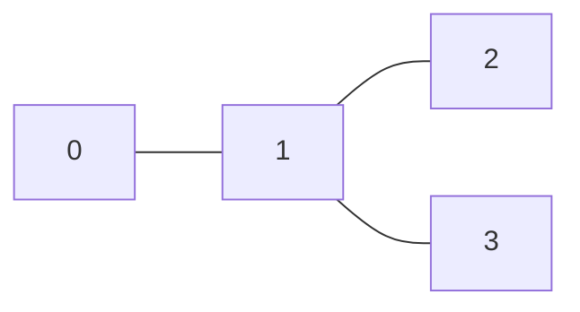
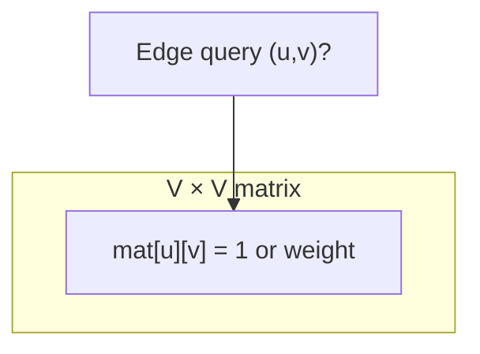
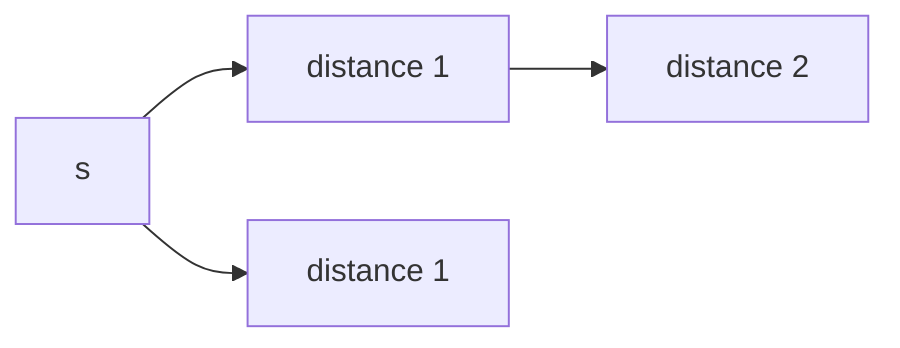
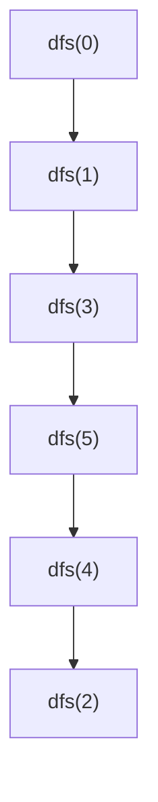
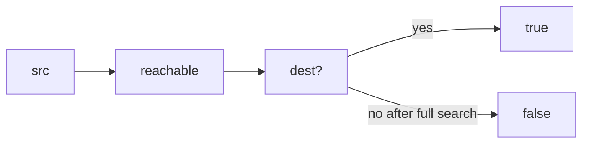

# MODULE 33 — Graphs: definitions, types, and representations

**Illustration code:** [`a.cpp`](a.cpp)–[`f.cpp`](f.cpp) (representations) · [`g.cpp`](g.cpp)–[`l.cpp`](l.cpp) (build + traversal + connectivity)

---

## What is a graph?

**Definition:** A **graph** \(G = (V, E)\) is a **set of vertices (nodes)** \(V\) and a **set of edges** \(E\). Each edge connects **two** vertices (or one vertex to itself in a loop, if allowed).

**Intuition:** A graph is a **network**: cities and roads, people and friendships, web pages and links, tasks and dependencies. Unlike a **tree**, a graph has **no built-in hierarchy** (no single root; cycles are allowed).

**Example (small undirected graph):**

```text
Vertices V = {0, 1, 2, 3}
Edges E = { (0,1), (1,2), (2,3), (0,3) }   // each edge is “two-way”

    0 --- 1
    |     |
    3 --- 2
```

**Applications:** shortest paths, social networks, compilers (CFG), scheduling, maps, games (states as nodes), network flow, dependency resolution, and many more.

---

## Vertices and edges

| Term | Meaning |
|------|---------|
| **Vertex (node)** | One entity in the network (often labeled by an integer or id). |
| **Edge** | A connection between two vertices; may be **directed** (arrow) or **undirected** (segment). |
| **Endpoint** | The two vertices an edge touches. |
| **Degree** | Number of edges incident to a vertex (in directed graphs: **in-degree** / **out-degree**). |

---

## Types of graphs (by edges)

### Direction

| Type | Definition | Example |
|------|------------|---------|
| **Undirected** | Edge \(\{u,v\}\) has **no** direction; \(u\)–\(v\) is the same as \(v\)–\(u\). | Mutual friendship. |
| **Directed (uni-directional)** | Edge \((u,v)\) goes **from** \(u\) **to** \(v\) only; \((u,v) \neq (v,u)\) unless both exist. | One-way street, prerequisite \(u\) before \(v\). |
| **Bi-directional (as two directed edges)** | Model an undirected link by storing **both** \((u,v)\) and \((v,u)\) in a directed adjacency structure. | Same practical effect as undirected in many programs. |

**Example — directed:**

```text
  0 ---> 1 ---> 2
```

Here \((0,1)\) exists but \((1,0)\) might not.

### Weight

| Type | Definition | Example |
|------|------------|---------|
| **Unweighted** | Edges are “there or not” (often stored as `1` / `0` or bool). | “Are these pages linked?” |
| **Weighted** | Each edge has a **number** (distance, cost, capacity, probability). | Road length, flight price. |

---

## Storing a graph in a program

Four common representations (plus the grid idea):

| Representation | Core idea | Typical use |
|----------------|-----------|-------------|
| **Adjacency list** | For each vertex, list its neighbors (and maybe weights). | Sparse graphs, BFS/DFS, most contests. |
| **Adjacency matrix** | `V × V` table; cell \((u,v)\) is weight or `0/1`. | Dense graphs, fast “is there an edge?” in \(O(1)\). |
| **Edge list** | List of all edges \((u,v)\) or \((u,v,w)\). | Kruskal MST, scanning all edges. |
| **Implicit graph (e.g. 2D grid)** | Vertices are grid cells; neighbors implied by \((r,c)\) and moves (4-way, 8-way). | Mazes, flood fill, shortest path on map. |

---

## `std::list` in C++ — [`a.cpp`](a.cpp)

**Definition:** `std::list` is a **doubly linked list**: each element has links to **previous** and **next** elements.

**Why graphs:** An **adjacency list** can use `vector<list<int>>` so each vertex’s neighbor list supports **fast insert/erase** in the middle if you often modify edges (many codes use `vector<vector<int>>` instead for simplicity and cache locality).

### Main operations (doubly linked list)

| Operation | Role |
|-----------|------|
| `push_front(x)` | Insert `x` at the **beginning** — \(O(1)\). |
| `push_back(x)` | Insert `x` at the **end** — \(O(1)\). |
| `pop_front()` | Remove first element — \(O(1)\). |
| `pop_back()` | Remove last element — \(O(1)\). |
| `front()` | Reference to first element. |
| `back()` | Reference to last element. |
| `size()` | Number of elements. |

**Example trace:** start empty → `push_back(10)`, `push_back(20)`, `push_front(5)` → order `5, 10, 20` → `pop_front()` → `10, 20` → `pop_back()` → `10`.

Run: `g++ -std=c++17 -o a a.cpp && ./a`

---

## Adjacency list — [`b.cpp`](b.cpp)

**Definition:** An array (or map) of size \(|V|\); entry `adj[u]` holds **all neighbors of `u`** (for weighted graphs, often `pair<int,int>`: neighbor, weight).

**Example (directed):** edges `0→1`, `0→2`, `1→3`, `2→4`, `3→5`, `4→5`:

```text
0: [1, 2]
1: [3]
2: [4]
3: [5]
4: [5]
5: []
```

**Benefits**

- **Space:** \(O(|V| + |E|)\) — only edges that exist are stored.
- **Neighbor scan:** visit only `degree(u)` neighbors, not all \(|V|\) vertices.

**Trade-off:** Checking “is there an edge \(u \to v\)?” may take \(O(\deg(u))\) unless you also keep a hash set per vertex.

Run: `g++ -std=c++17 -o b b.cpp && ./b`

---

## Adjacency matrix — [`c.cpp`](c.cpp)

**Definition:** A **\(|V| \times |V|\)** matrix `M`. For unweighted graphs, `M[u][v] = 1` if edge \((u,v)\) exists, else `0`. For weighted graphs, `M[u][v] = w` if edge exists, else `0` or a special “infinity” sentinel (choose consistently with your algorithm).

**Example — unweighted undirected (symmetric matrix):** cycle on 4 nodes.

**Space:** \(\Theta(|V|^2)\) — impractical for \(|V| \approx 10^5\) unless very sparse tricks are used.

**When it shines:** \(\Theta(1)\) **edge lookup** `M[u][v]`; Floyd–Warshall all-pairs shortest paths naturally uses a matrix.

Run: `g++ -std=c++17 -o c c.cpp && ./c`

---

## Edge list — [`d.cpp`](d.cpp)

**Definition:** A vector (or list) of edges, each stored as `(u, v)` or `(u, v, weight)`.

**Example:**

```text
(0, 1, 4)
(0, 2, 3)
(1, 2, 1)
...
```

**When used:** Algorithms that **sort or scan all edges** — e.g. **Kruskal’s MST** (sort by weight, union–find to avoid cycles). Also natural for **input format** that lists edges only.

**Trade-off:** To list neighbors of `u`, you must scan all edges touching `u` unless you build an index.

Run: `g++ -std=c++17 -o d d.cpp && ./d`

---

## Directed vs undirected in code — [`e.cpp`](e.cpp)

**Undirected edge \(\{u,v\}\)** in an adjacency list: **push `v` to `adj[u]` and `u` to `adj[v]`.**

**Directed edge \((u,v)\)** in an adjacency list: **push `v` to `adj[u]` only.**

**Bi-directional** in a directed storage model = **two directed edges** \((u,v)\) and \((v,u)\).

Run: `g++ -std=c++17 -o e e.cpp && ./e`

---

## Implicit graph (2D matrix) — [`f.cpp`](f.cpp)

**Definition:** Vertices are **cells** `(row, col)` of a matrix. **Edges** are implied by rules: e.g. **4-neighbors** up/down/left/right if the target cell is inside the grid and **walkable** (not a wall).

**Example:** maze with `'.'` = free, `'#'` = blocked. You do **not** build a huge `adj` array; you **generate** neighbors on the fly:

```text
Neighbors of (r,c): (r-1,c), (r+1,c), (r,c-1), (r,c+1) if valid and not '#'
```

**BFS** on this implicit graph finds **shortest path in number of steps** (unweighted).

Run: `g++ -std=c++17 -o f f.cpp && ./f`

---

## Quick comparison

| | Adjacency list | Adjacency matrix | Edge list |
|--|----------------|------------------|-----------|
| **Space** | \(O(V+E)\) | \(O(V^2)\) | \(O(E)\) |
| **Check edge \(u\to v\)** | \(O(\deg(u))\) avg | \(O(1)\) | \(O(E)\) scan |
| **Iterate neighbors of \(u\)** | \(O(\deg(u))\) | \(O(V)\) | \(O(E)\) scan |
| **All edges** | \(O(V+E)\) | \(O(V^2)\) | \(O(E)\) |

---

## Building a graph — adjacency list — [`g.cpp`](g.cpp)

**Definition:** Start with **`V` empty buckets** `adj[0] … adj[V-1]`. Each **undirected** edge `{u,v}` does `adj[u].push_back(v)` and `adj[v].push_back(u)`; each **directed** edge `(u,v)` only does `adj[u].push_back(v)`.

### Algorithm steps

| Step | Action |
|------|--------|
| 1 | Read or choose **\(V\)** (number of vertices, labeled `0 … V-1`). |
| 2 | Allocate **`vector<vector<int>> adj(V)`** (or `vector<list<int>>`). |
| 3 | For each edge, **append** neighbor id(s) as above. |
| 4 | For queries, scan **`adj[u]`** to iterate neighbors of `u`. |

**Example (ASCII):** edges `(0,1)`, `(1,2)`, `(1,3)` undirected:

```text
   0 --- 1 --- 2
           |
           3
```



| | |
|---|---|
| **Time to build** | **\(O(E)\)** pushes for `E` edges (amortized **\(O(1)\)** per `push_back`). |
| **Space** | **\(O(V + E)\)** — empty lists for isolated vertices plus one stored endpoint per directed half-edge. |

Run: `g++ -std=c++17 -o g g.cpp && ./g`

---

## Building a graph — adjacency matrix — [`h.cpp`](h.cpp)

**Definition:** Allocate **`mat[V][V]`**, usually initialized to **0** (no edge). For an **undirected** edge `{u,v}`, set **`mat[u][v] = mat[v][u] = 1`** (or weight `w`). For **directed** `(u,v)`, set **`mat[u][v]`** only.

### Algorithm steps

| Step | Action |
|------|--------|
| 1 | Allocate **\(V \times V\)** table filled with **no-edge** sentinel (`0` or `∞`). |
| 2 | For each edge, write **symmetric** entries (undirected) or **one** entry (directed). |
| 3 | Query edge **`(u,v)`** in **\(O(1)\)** by reading **`mat[u][v]`**. |



| | |
|---|---|
| **Time to build** | **\(O(E)\)** updates, each **\(O(1)\)**. |
| **Space** | **\(\Theta(V^2)\)** — every pair has a cell. |

Run: `g++ -std=c++17 -o h h.cpp && ./h`

---

## Building a graph — edge list — [`i.cpp`](i.cpp)

**Definition:** Keep a **`vector`** of **edges** `(u, v)` or `(u, v, w)` for weight `w`. No per-vertex structure until you **derive** one.

### Algorithm steps

| Step | Action |
|------|--------|
| 1 | Choose struct **`Edge { int u, v; }`** (add `w` if weighted). |
| 2 | **`edges.push_back({u,v})`** for each input edge. |
| 3 | **Optional:** second pass — for each edge, **`adj[u].push_back(v)`** (and reverse for undirected) to build an adjacency list in **\(O(E)\)**. |

| | |
|---|---|
| **Time to build list** | **\(O(E)\)**. |
| **Space** | **\(O(E)\)** for the list alone. |

**When used:** Kruskal’s MST (sort edges), input given as edge dumps, dynamic edge additions without adjacency yet.

Run: `g++ -std=c++17 -o i i.cpp && ./i`

---

## Graph traversal — BFS — [`j.cpp`](j.cpp)

**Definition:** **Breadth-first search** explores the graph **layer by layer** from a **source** `s`: all vertices at **distance 1**, then **2**, etc. Uses a **queue** (FIFO).

### Algorithm steps

| Step | Action |
|------|--------|
| 1 | **`visited[s] = true`**, **`queue.push(s)`**. |
| 2 | While queue **not empty**: **`u = pop front`**. |
| 3 | For each neighbor **`v`** of **`u`**: if **`!visited[v]`**, set **`visited[v]=true`**, **`push(v)`**. |
| 4 | Optionally maintain **`dist[v]`** = `dist[u] + 1` for **unweighted shortest path** edge count. |

**Invariant:** Queue holds exactly vertices **discovered** but whose **outgoing scan** may not be finished; BFS order is **non-decreasing** shortest-path length from `s` (unweighted graph).



```text
Queue timeline (example):  [0] -> [1,2] -> [2,3] -> ...
Visit order from 0:        0,  1, 2,  3, 4, 5   (see j.cpp output)
```

| | |
|---|---|
| **Time** | **\(O(V + E)\)** — each vertex dequeued once, each edge examined once when scanning `adj[u]`. |
| **Space** | **\(O(V)\)** for **`visited`** (and **`dist`** if used) + **\(O(V)\)** queue in worst case. |

Run: `g++ -std=c++17 -o j j.cpp && ./j`

---

## Graph traversal — DFS — [`k.cpp`](k.cpp)

**Definition:** **Depth-first search** goes **as deep as possible** along one branch, then **backtracks** and tries the next unexplored neighbor. Implemented with **recursion** (implicit stack) or an **explicit stack**.

### Algorithm steps (recursive)

| Step | Action |
|------|--------|
| 1 | **`dfs(u)`**: mark **`visited[u]=true`**, **record `u`** (preorder). |
| 2 | For each neighbor **`v`** of **`u`**: if **`!visited[v]`**, call **`dfs(v)`**. |
| 3 | When the loop ends, return — **backtrack** to caller. |



| | |
|---|---|
| **Time** | **\(O(V + E)\)** — same as BFS: each vertex constant work, each edge considered once from each endpoint in undirected careful implementations. |
| **Space** | **\(O(V)\)** for **`visited`** + **\(O(V)\)** recursion stack in the **worst case** (e.g. path graph); iterative DFS uses an explicit stack of the same order. |

**BFS vs DFS (short):** BFS finds **shortest edge-count** distances in unweighted graphs; DFS is simpler for **connectivity**, **cycle detection**, and **topological sort** (on DAGs with minor change).

Run: `g++ -std=c++17 -o k k.cpp && ./k`

---

## Has path (src → dest)? — [`l.cpp`](l.cpp)

**Task:** Given an (undirected or directed) graph in **adjacency list** form, two vertices **`src`** and **`dest`**, return **whether some path** exists from **`src`** to **`dest`** (possibly length 0 if `src == dest`).

### Idea

Connectivity along edges is exactly what **BFS** or **DFS** explores from **`src`**. If **`dest`** is ever **visited** (or dequeued as reached in BFS), answer **true**; after the search finishes without reaching **`dest`**, answer **false**.

### Algorithm steps (BFS)

| Step | Action |
|------|--------|
| 1 | If **`src == dest`**, return **true**. |
| 2 | **`visited[src] = true`**, push **`src`** into **queue**. |
| 3 | While queue not empty: pop **`u`**, for each neighbor **`v`**: if **`v == dest`**, return **true**; else if **`!visited[v]`**, mark visited and push **`v`**. |
| 4 | Return **false**. |

**DFS variant:** from **`src`**, recurse on unvisited neighbors; return **true** if any recursive call reaches **`dest`** (or handle **`src == dest`** at entry).



| | |
|---|---|
| **Time** | **\(O(V + E)\)** — same traversal bound as BFS/DFS on the component reachable from **`src`**. |
| **Space** | **\(O(V)\)** for **`visited`** + **\(O(V)\)** queue (BFS) or recursion stack (DFS worst case). |

Run: `g++ -std=c++17 -o l l.cpp && ./l`

---

## Compile all illustrations

```bash
cd 33-Graphs
g++ -std=c++17 -o a a.cpp && ./a
g++ -std=c++17 -o b b.cpp && ./b
g++ -std=c++17 -o c c.cpp && ./c
g++ -std=c++17 -o d d.cpp && ./d
g++ -std=c++17 -o e e.cpp && ./e
g++ -std=c++17 -o f f.cpp && ./f
g++ -std=c++17 -o g g.cpp && ./g
g++ -std=c++17 -o h h.cpp && ./h
g++ -std=c++17 -o i i.cpp && ./i
g++ -std=c++17 -o j j.cpp && ./j
g++ -std=c++17 -o k k.cpp && ./k
g++ -std=c++17 -o l l.cpp && ./l
```

**Note:** [`e.cpp`](e.cpp) shows **directed** vs **undirected** storage in an adjacency list (earlier in this module).