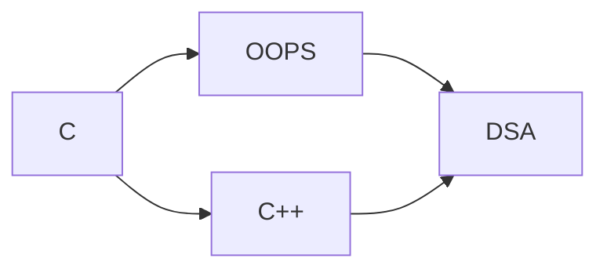
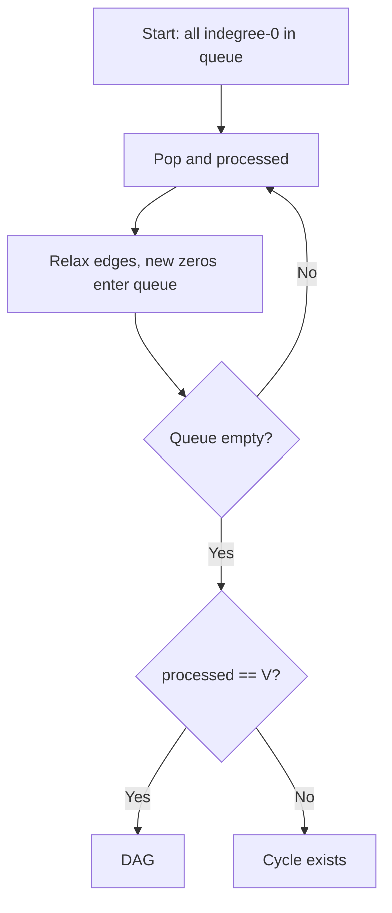

# MODULE 35 — Topological sorting (DAG), Kahn’s algorithm & course scheduling

**Illustration code:** [`a.cpp`](a.cpp) (DFS topo) · [`b.cpp`](b.cpp) (Kahn topo) · [`c.cpp`](c.cpp) (Kahn / cycle) · [`d.cpp`](d.cpp) (Course Schedule I) · [`e.cpp`](e.cpp) (Course Schedule II)

---

## 1. What is topological sorting?

**Setting:** A **directed graph** \(G = (V, E)\).

**Definition:** A **topological order** (topological sort) is a **linear ordering** of all vertices  
\[
v_1, v_2, \ldots, v_n
\]
such that **for every directed edge** \(u \to v\) in the graph, **\(u\) appears before \(v\)** in the list.

**Important:** Such an ordering exists **if and only if** the graph is a **DAG** — a **Directed Acyclic Graph** (no directed cycle).

```text
If there is a cycle  A -> B -> C -> A,
then A must come before B, B before C, and C before A — impossible in one line.
So:  cycle  =>  NO topological sort
      DAG   =>  at least ONE topological sort (often many)
```

### 1.1 Dependency intuition

Edges mean **“before”**: \(u \to v\) reads as “\(u\) must happen / be completed **before** \(v\)”.

**Example (course/programming deps):**

```text
   C ------> C++
    \         \
     \         v
      ---> OOPS ----> DSA
              ^
              |
         (C++ also leads to DSA in real life; here we match your sketch)

```

As a DAG (vertex names as ids for code):

| Concept | Meaning |
|---------|--------|
| `C → C++` | learn C before C++ |
| `C → OOPS` | learn C before OOPS |
| `OOPS → DSA` | OOPS before DSA |
| `C++ → DSA` | C++ before DSA |



**Valid topological orders include:**  
`C, C++, OOPS, DSA` or `C, OOPS, C++, DSA` (both respect all arrows).

---

## 2. When does a topological sort exist? (mathematics)

**Theorem:** A finite directed graph has a topological ordering **iff** it has **no** directed cycle (**iff** it is a **DAG**).

**Sketch (“only if”):** Suppose a topo order exists and there is a cycle \(u_0 \to u_1 \to \cdots \to u_k = u_0\).  
Then \(u_0\) must appear before \(u_1\), …, \(u_{k-1}\) before \(u_k = u_0\), so \(u_0\) must appear before itself — contradiction.

**Sketch (“if”, existence):** One can always pick a **source** (vertex with in-degree 0) in a nonempty DAG, put it first, remove it, repeat — this is exactly **Kahn’s algorithm** (Section 4).

**Counting:** The number of different topological orders can be **exponential** in \(|V|\); we usually compute **one** valid order.

---

## 3. Topological sort — DFS approach — [`a.cpp`](a.cpp)

### 3.1 Idea

Run **DFS** from every unvisited vertex. Maintain **states**:

| State | Meaning |
|-------|---------|
| `0` | White — not visited |
| `1` | Gray — currently in recursion stack |
| `2` | Black — DFS finished for this vertex |

- If DFS follows edge \(u \to v\) and **`v` is gray**, you have a **back edge to an ancestor** ⇒ **directed cycle** ⇒ **no** topo sort.
- If graph is a DAG, when a vertex **`u` is completely processed** (all outgoing edges explored), append **`u`** to a list **`finishOrder`**.

**Key fact:** **Reverse** `finishOrder` gives a **topological order**.

**Intuition:** In a DAG, any edge \(u \to v\) finishes DFS at **`v` before** **`u`** cannot happen in a way that violates order; the last finished vertex in recursion is deepest in the sense of dependencies — reversing handles “before” constraints globally.

### 3.2 Steps

| Step | Action |
|------|--------|
| 1 | `state[i]=0` for all `i`. Clear `finishOrder`. |
| 2 | For each `i`, if `state[i]==0`, run `dfs(i)`. If DFS sees gray neighbor, return **failure** (cycle). |
| 3 | In `dfs(u)`: set gray; recurse on white neighbors; then set black and `finishOrder.push_back(u)`. |
| 4 | If no failure, **reverse** `finishOrder` → print/store topological order. |

### 3.3 Example (matches `a.cpp`)

Edges in code: **`5→2`**, **`5→0`**, **`4→0`**, **`4→1`**, **`2→3`**, **`3→1`**.

```text
     5 -----> 2 -----> 3 -----+
     |                         v
     +-----> 0 <----- 4 -----> 1
```

One valid topological order: **`5 4 2 3 1 0`** (see [`a.cpp`](a.cpp) output).

### 3.4 Complexity

| | |
|---|---|
| **Time** | **\(O(V + E)\)** — DFS visits each vertex once, scans each edge once per head. |
| **Space** | **\(O(V)\)** for `state`, recursion stack **\(O(V)\)** worst case, **`finishOrder`** length **\(V\)`. |

Run: `g++ -std=c++17 -o a a.cpp && ./a`

---

## 4. Topological sort — BFS / Kahn’s algorithm — [`b.cpp`](b.cpp)

### 4.1 Idea — **indegree**

**Indegree** of vertex **`v`** = number of edges **coming in** to **`v`**:  
\[
\text{indegree}(v) = |\{ (u,v) \in E \}|.
\]

**Sources** = vertices with **`indegree == 0`** (nothing must come before them in the remaining graph).

**Kahn:** Repeatedly:

1. Pick a source, append it to the **answer order**, **remove** it from the graph conceptually.
2. For each outgoing edge `u → v`, **`indegree[v]--`**.
3. Any vertex whose indegree becomes **0** is a new **source** — push to queue.

If you remove **all** **`V`** vertices, you output a valid **topological order**.  
If the queue becomes empty but fewer than **`V`** vertices were processed, a **directed cycle** exists (see Section 5).

### 4.2 Steps

| Step | Action |
|------|--------|
| 1 | Build `adj` and compute `indegree[v]` for all `v`. |
| 2 | Push every `v` with `indegree[v]==0` into queue `q`. |
| 3 | While `q` not empty: pop `u`, append `u` to `order`, for each `v` in `adj[u]` do `indegree[v]--`; if `indegree[v]==0`, push `v`. |
| 4 | If `order.size() == V`, success; else cycle (for topo, we treat as failure). |

### 4.3 Why queue = “BFS on sources”

All **current** sources can be processed in any order; a **queue** processes them in FIFO order layer-by-layer over the **logical** “peeling” of the DAG. That is why this is often described as **BFS-style** Kahn.

### 4.4 Complexity

| | |
|---|---|
| **Time** | **\(O(V + E)\)** — each vertex queued once, each edge relaxed once. |
| **Space** | **\(O(V + E)\)** for graph + **\(O(V)\)** for indegree and queue. |

Run: `g++ -std=c++17 -o b b.cpp && ./b`

---

## 5. Kahn’s algorithm for detecting a directed cycle — [`c.cpp`](c.cpp)

**Same peeling** as Section 4, but we only count **how many** vertices were removed.

| Condition | Meaning |
|-----------|--------|
| **`processed == V`** | Every vertex had indegree 0 at some point ⇒ **no** directed cycle (**DAG**). |
| **`processed < V`** | Some vertices never became sources ⇒ they lie on a **directed cycle** (or depend on one). |



| | |
|---|---|
| **Time** | **\(O(V + E)\)** |
| **Space** | **\(O(V)\)** |

Run: `g++ -std=c++17 -o c c.cpp && ./c`

---

## 6. Course Schedule I — can you finish all courses? — [`d.cpp`](d.cpp)

### 6.1 Problem (LeetCode-style)

- **`numCourses`:** vertices **`0 … numCourses-1`**.
- **`prerequisites[i] = [a, b]`** means: to take course **`a`**, you must first finish **`b`**.

**Graph edge:** **`b → a`** (prerequisite **`b`**, dependent course **`a`**).

**Question:** Is it possible to finish **all** courses? **Yes** iff the graph is a **DAG** iff topological order exists.

### 6.2 Example

| Prerequisites | Graph | Answer |
|---------------|-------|--------|
| `[[1,0]]` | `0 → 1` | **Yes** — take `0` then `1`. |
| `[[1,0],[0,1]]` | `0 ↔ 1` cycle | **No** |

```text
  [[1,0]]:     0 ---> 1       OK

  [[1,0],[0,1]]:
      0 ----> 1
      ^       |
      +-------+        cycle => cannot finish both
```

### 6.3 Algorithm

Same as **Kahn**: count how many courses get “removed” when indegree hits 0. **Answer = (count == numCourses).**

| | |
|---|---|
| **Time** | **\(O(V + E)\)** with \(V=\) `numCourses`, \(E=\) number of prerequisite pairs. |
| **Space** | **\(O(V + E)\)** for adjacency + indegree. |

Run: `g++ -std=c++17 -o d d.cpp && ./d`

---

## 7. Course Schedule II — output an order — [`e.cpp`](e.cpp)

**Same graph as Course I**, but return **one valid order** of all courses (any valid topo order). If impossible (cycle), return **empty** list.

### 7.1 Example

`numCourses = 4`, `prerequisites = [[1,0],[2,0],[3,1],[3,2]]`

- `0` before `1` and `2`; `1` and `2` before `3`.

```text
        1 ----\
       /      v
      0       3
       \      ^
        2 ----/

```

Valid orders: **`0,1,2,3`**, **`0,2,1,3`**, etc.

### 7.2 Algorithm

Run **Kahn** and **append** each popped vertex to **`order`**. If at the end **`|order| != numCourses`**, return `{}`.

| | |
|---|---|
| **Time** | **\(O(V + E)\)** |
| **Space** | **\(O(V + E)\)** |

Run: `g++ -std=c++17 -o e e.cpp && ./e`

---

## 8. DFS topo vs Kahn — when to use which

| | **DFS (reverse finish time)** | **Kahn (indegree queue)** |
|--|--------------------------------|---------------------------|
| **Output** | One topo order if DAG | One topo order if DAG |
| **Cycle check** | Gray-node rule during DFS | `processed < V` |
| **Style** | Recursive, stack-heavy on deep graphs | Iterative queue, often clearer for scheduling |
| **Complexity** | \(O(V+E)\) time, \(O(V)\) space | \(O(V+E)\) time, \(O(V)\) space |

Both are standard; **Course Schedule** problems map very naturally to **Kahn** because **indegree = number of prerequisites still unmet**.

---

## Compile all

```bash
cd 35-Topo_Sort
g++ -std=c++17 -o a a.cpp && ./a
g++ -std=c++17 -o b b.cpp && ./b
g++ -std=c++17 -o c c.cpp && ./c
g++ -std=c++17 -o d d.cpp && ./d
g++ -std=c++17 -o e e.cpp && ./e
```
