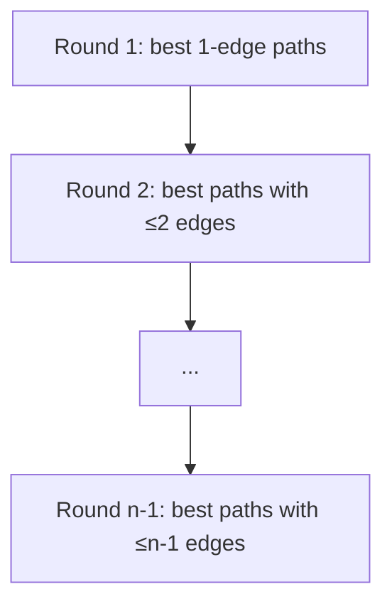
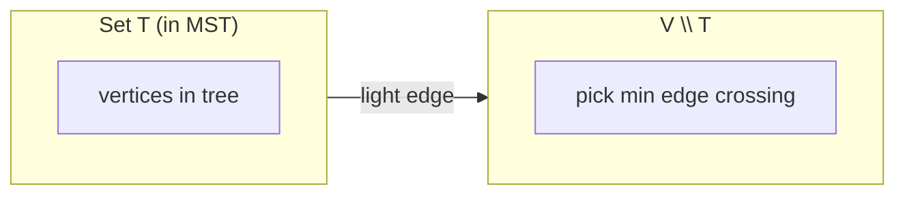
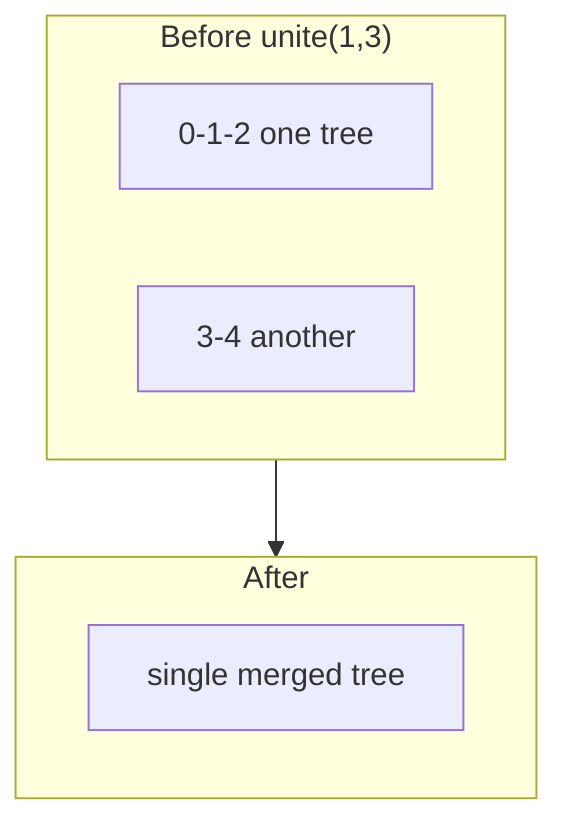

# MODULE 36 — Shortest paths (Dijkstra, Bellman–Ford) & minimum spanning trees (Prim, Kruskal)

**Illustration code:** [`a.cpp`](a.cpp) · [`b.cpp`](b.cpp) · [`g.cpp`](g.cpp) · [`c.cpp`](c.cpp) · [`d.cpp`](d.cpp) · [`h.cpp`](h.cpp) · [`e.cpp`](e.cpp) · [`f.cpp`](f.cpp) · [`i.cpp`](i.cpp) · [`j.cpp`](j.cpp)–[`s.cpp`](s.cpp) *(Part IV)*

---

## Notation (used in all sections)

- **\(G = (V, E)\)** — graph with vertex set **\(V\)**, **\(|V| = n\)** often written **`V`** in code.
- **Edge weight** **\(w(u,v)\)** (or **`w`** on directed arc **`u → v`**).
- **Path weight** — sum of edge weights along the path.
- **SP** — shortest-path distance (minimum total weight).

---

# Part I — Single-source shortest paths

**Single-source problem:** Fix a **source** **`s`**. For every **`v ∈ V`**, compute (or approximate) **\(\mathrm{dist}(s,v)\)** = minimum weight of any path from **`s`** to **`v`** (∞ if unreachable).

---

## 1. Dijkstra’s algorithm — [`a.cpp`](a.cpp)

### 1.1 When it applies

**Requirement:** Edge weights must be **non-negative**:  
\[
w(u,v) \ge 0 \quad \text{for every edge.}
\]

If any **negative** weight appears, Dijkstra’s **greedy choice can be wrong** (a later “longer looking” path might add a negative edge — not allowed in the proof).

### 1.2 Idea (greedy invariant)

Maintain **\(\mathrm{dist}[v]\)** = **best distance found so far** from **`s`** to **`v`**.

**Invariant (key):** When you **finalize** a vertex **`u`** as having the **minimum** tentative distance among **all** not-yet-finalized vertices, that value is **already** the true shortest distance **\(\mathrm{dist}(s,u)\)** — **provided all edge weights are non-negative**.

**Why:** Any other path to **`u`** must go through some **not-yet-finalized** vertex **`x`**. The prefix to **`x`** is already **≥** the distance we will eventually assign to **`x`**, and that is **≥** current **`dist[u]`** by how **`u`** was chosen. So no other route can beat **`dist[u]`**.

### 1.3 Algorithm steps (binary heap version)

| Step | Action |
|------|--------|
| 1 | **`dist[s]=0`**, **`dist[others]=∞`**. Min-heap **`pq`** of pairs **`(distance, vertex)`**, push **`(0,s)`**. |
| 2 | Pop **`(d,u)`** with **smallest** `d`. If **`d > dist[u]`** (stale entry), **skip**. |
| 3 | For each edge **`u → v`** of weight **`w`**: if **`dist[v] > d + w`**, set **`dist[v]=d+w`** and **push** **`(dist[v], v)`** to **`pq`**. |
| 4 | Repeat until **`pq`** empty. |

**Stale entries:** The same vertex may be pushed many times; the first time it is popped **with `d == dist[u]`** is the “real” extraction; later pops are ignored.

### 1.4 Example trace (one relaxation)

From source **`0`**: if **`0 → 4`** has weight **3** and **`4 → 1`** has weight **1**, then path **`0→4→1`** gives distance **4**, often better than a direct edge **`0→1`** of weight **10**.

### 1.5 Time & space (how we derive them)

Let **`n = |V|`**, **`m = |E|`**.

- **Each vertex** can cause **many** heap pushes, but **each edge `u→v`** is relaxed only when **`u`** is extracted with the **correct** final `dist[u]` at most **once** in the standard accounting; **heap size** is **\(O(m)\)** in worst case, each **push/pop** costs **\(O(\log m)\)**.
- **Total time:** **\(O(m \log n)\)** with a binary heap (often written **\(O((n+m)\log n)\)** since **`m ≥ n-1`** in connected graphs).  
  With a **Fibonacci heap**, **decrease-key** can improve amortized bounds, but contests / teaching use binary heaps.
- **Dense graph variant:** Store **`dist`** and scan all `u` not finalized each phase → **\(O(n^2)\)** time, **\(O(n)\)** extra — good when **`m ≈ n²`**.

**Space:** **`dist`** array **\(O(n)\)** + heap **\(O(m)\)** entries in worst case → **\(O(n+m)\)**.

**Dijkstra relaxation (conceptual):**


---

## 2. Bellman–Ford algorithm — [`b.cpp`](b.cpp)

### 2.1 When it applies

- Graph may have **negative** edge weights.
- **No negative-weight cycle** reachable from **`s`** (otherwise shortest path is **undefined** as **\(-\infty\)** along the cycle).

### 2.2 Idea (dynamic programming on path length)

Let **\(\mathrm{dist}^{(k)}[v]\)** be the minimum weight of any path from **`s`** to **`v`** using **at most `k` edges**.

**Recurrence (relaxation):**  
After processing all edges once, you have correctly computed **\(\mathrm{dist}^{(1)}\)**; after **`k`** rounds, **\(\mathrm{dist}^{(k)}\)**.  
Any simple path uses **at most `n-1` edges**, so **`n-1` rounds** suffice **if no negative cycle**.

**Negative cycle test:** If after **`n-1`** relaxations, **some** edge **`(u,v)`** still satisfies **`dist[v] > dist[u] + w(u,v)`**, you can keep decreasing distances forever ⇒ **negative-weight cycle** reachable.

### 2.3 Algorithm steps

| Step | Action |
|------|--------|
| 1 | **`dist[s]=0`**, others **`∞`**. |
| 2 | Repeat **`n-1`** times: for **each** edge **`(u,v,w)`**, try **`dist[v] = min(dist[v], dist[u]+w)`** (only if **`dist[u]<\infty`**). Optional: **break early** if no **`dist`** changed in a full pass. |
| 3 | **Extra pass:** same relaxation; if any update succeeds, report **negative cycle**. |

**Rounds:** each round touches every edge once — “relaxation wave” spreads shortest **\(k\)**-edge paths.



---

### 2.4 Time & space derivation

- **Passes:** **`n-1`** times × **`|E|`** edges → **`O(n·m)`** (**`O(V·E)`**) in worst case.
- **Early exit** when no change: can be faster on practice graphs.
- **Space:** **`dist`** **\(O(n)\)** + edge list **\(O(m)\)**.

### 2.5 Dijkstra vs Bellman–Ford (comparison)

| | **Dijkstra** | **Bellman–Ford** |
|--|--------------|------------------|
| **Weights** | **\(w \ge 0\)** | **any** (no neg cycle for finite answers) |
| **Typical time** | **\(O(m \log n)\)** | **\(O(n·m)\)** |
| **Detects neg cycle** | N/A (assumption breaks) | **Yes** (extra pass) |

### 2.6 Cheapest flights within **K** stops — [`g.cpp`](g.cpp)

**Problem (LeetCode 787 style):** **`n`** cities, directed flights **`(from, to, price)`**, start **`src`**, destination **`dst`**. You may use **at most `K` stops** (intermediate airports), so any route has **at most `K+1` flights**.

**Idea:** Run **`K+1`** **synchronous relaxation rounds** (like Bellman–Ford, but each round adds **exactly one** more flight to allowed paths). Keep **`dist[v]`** = cheapest price to **`v`** after the previous number of rounds; update **`next`** from **`dist`** only, then **`dist ← next`**.

| Step | Action |
|------|--------|
| 1 | **`dist[src]=0`**, others **`∞`**. |
| 2 | For **`s = 0 .. K`**: **`next ← dist`**, then for each flight **`(u,v,price)`**, **`next[v] = min(next[v], dist[u]+price)`**, then **`dist ← next`**. |
| 3 | Return **`dist[dst]`** or **`-1`** if still **`∞`**. |

**Why copy:** Prevents using **two** flights along the same “layer” in one iteration; each round extends all paths by **at most one** edge.

**Complexity:** **`O((K+1) · |F|)`** time, **`O(n)`** space (`|F|` = number of flights).

```text
Example: 0 -100-> 1 -100-> 2,  and 0 -500-> 2
K=0: only direct 0->2  => 500
K=1: can use 0->1->2   => 200
```

Run: `g++ -std=c++17 -o g g.cpp && ./g`

---

# Part II — Minimum spanning tree (MST)

**Setting:** **Undirected**, **connected** graph **\(G=(V,E)\)** with **weight** **`w(e)`** on each edge.

**Spanning tree:** Subgraph that is a **tree** (connected, **`|V|-1` edges**, **no** cycle) on **all** **`V`**.

**MST:** Spanning tree **\(T\)** minimizing **\(\sum_{e\in T} w(e)\)**.

### Cut property (why greedy MST works)

**Theorem (cut property):** Partition **\(V\)** into **\(S\)** and **\(V \setminus S\)**. Among **all** edges crossing the cut (one endpoint in **`S`**, one not), **any** **lightest** such edge belongs to **some** MST.

**Cycle property:** The **heaviest** edge on a simple cycle **cannot** belong to **any** MST (unless tied — careful with equal weights).

**Prim** grows a tree from one root, always adding a **minimum-weight edge** crossing **\((T, V\\T)\)** — respects the cut property.

**Growing the tree across a cut:**



---

## 3. Prim’s algorithm — [`c.cpp`](c.cpp)

### 3.1 Idea

Start with **any** vertex in the spanning tree set **`T`**.  
Repeat **`|V|-1`** times: add the **cheapest** edge that connects **`T`** to a vertex **outside** **`T`**.

### 3.2 Lazy Prim with a min-heap

| Step | Action |
|------|--------|
| 1 | Mark **`0`** (or arbitrary start) **in MST**. Push all edges **`(w, v)`** from **`0`** to neighbors **`v`** not in MST into **`pq`**. |
| 2 | Pop **`(w,u)`**. If **`u`** already in MST, continue (lazy duplicate). |
| 3 | Add **`u`**, **`total += w`**, **`edgesUsed++`**. Push each edge from **`u`** to **`v ∉ T`**. |
| 4 | Stop when **`edgesUsed == |V|-1`**. |

### 3.3 Time & space

- Each edge may be inserted into **`pq`** up to **twice** (from each endpoint in lazy implementations) → **\(O(m \log m)\)** or **\(O(m \log n)\)** heap ops.
- **Space:** **`O(n+m)`** for graph + heap.

---

## 4. Kruskal’s algorithm — [`d.cpp`](d.cpp)

### 4.1 Idea

Sort **all** edges by **non-decreasing** weight. Scan edges; **add** edge **`(u,v)`** **iff** **`u`** and **`v`** lie in **different** DSU components (so it connects two trees without forming a cycle).

### 4.2 Steps

| Step | Action |
|------|--------|
| 1 | Sort edges: **`(w, u, v)`** ascending. |
| 2 | **DSU** on **`V`** (see **§4.5** / [`h.cpp`](h.cpp)). **`total=0`**, **`used=0`**. |
| 3 | For each edge in order: if **`unite(u,v)`** succeeds, **`total += w`**, **`used++`**. |
| 4 | If **`used == n-1`**, graph was connected — **`total`** is MST weight; else **disconnected** (your code can return **-1**). |

### 4.3 Time & space

- **Sorting:** **\(O(m \log m)\)**.
- **DSU:** **\(O(m \,\alpha(n))\)** ≈ **\(O(m)\)**.
- **Total:** **\(O(m \log m)\)** dominated by sort.
- **Space:** **\(O(n+m)\)**.

### 4.4 Same MST weight as Prim?

On the **same connected undirected weighted graph**, **any** MST has the **same total weight** (weights of chosen edges may differ if there are ties, but the **sum** is minimal and unique if all weights are distinct).

[`c.cpp`](c.cpp) and [`d.cpp`](d.cpp) share the same demo graph → both print **110**.

---

## 4.5 Disjoint Set Union (Union–Find) — [`h.cpp`](h.cpp)

**Role:** Maintains a **partition** of **`{0,…,n-1}`** into **disjoint sets** under:

- **`find(x)`** — label of the set containing **`x`** (canonical “representative”).
- **`unite(a,b)`** — merge the two sets if they differ; returns **`false`** if **`a`**, **`b`** were already in the same set.

**Used in:** [`d.cpp`](d.cpp) **Kruskal** (MST), **cycle detection** on undirected graphs (Module 34), **dynamic connectivity** basics.

### Operations (two optimizations)

1. **Path compression** in **`find`:** `parent[x] = find(parent[x])` so future **`find`** jumps are shorter.
2. **Union by rank** (or size): hang the **shorter** tree under the **taller** root to keep trees shallow.

**Amortized time:** **`find` / `unite`** in **`O(α(n))`** where **\(α\)** is the **inverse Ackermann** — grows so slowly it is **≤ 4** for any realistic **`n`** → treated as **constant** in contests.

**Space:** **`O(n)`** for **`parent`** and **`rank`**.



### 4.5.1 Arrays: `parent` and `rank`

| Array | Meaning |
|-------|--------|
| **`parent[i]`** | If **`i`** is a **root**, **`parent[i] == i`**. Otherwise **`parent[i]`** is its parent one step toward that root (tree edges are **up** to the representative). |
| **`rank[i]`** (in code: **`rankv`**) | Used only for roots in **`unite`**: an **upper bound** on the height of the tree rooted at **`i`**. Non-root entries can be stale; **`find`** does not consult them. |

**Initialization:** **`parent[i] = i`**, **`rank[i] = 0`** for all vertices — **`n`** singleton sets.

**`unite(a, b)` (union by rank)** — same policy as [`h.cpp`](h.cpp):

1. **`a ← find(a)`**, **`b ← find(b)`**; if **`a == b`**, already one set → **no merge**.
2. If **`rank[a] < rank[b]`**, **swap** so **`a`** has the **larger or equal** rank.
3. **`parent[b] = a`** (hang the smaller-rank root under the other).
4. If ranks were **equal**, **`rank[a]++`**.

**`find(x)` (path compression):** if **`x`** is not a root, **`parent[x] ← find(parent[x])`** on the recursion unwinding, so every node on the path points **directly** at the root.

Together, **`find`** / **`unite`** are **`O(α(n))`** amortized per call.

### 4.5.2 Worked sequence (`n = 6`, vertices `0 … 5`)

Below, **`unite`** / **`find`** follow [`h.cpp`](h.cpp) exactly.

**Start**

| `i` | 0 | 1 | 2 | 3 | 4 | 5 |
|-----|---|---|---|---|---|---|
| `parent[i]` | 0 | 1 | 2 | 3 | 4 | 5 |
| `rank` (root) | 0 | 0 | 0 | 0 | 0 | 0 |

1. **`unite(0, 2)`** — roots **0** and **2**, equal rank → **`parent[2] = 0`**, **`rank[0] = 1`**.
2. **`find(2)`** — walks **2 → 0**, returns **0**; **`parent[2]`** stays **0** (already linked to root).
3. **`unite(1, 3)`** — **`parent[3] = 1`**, **`rank[1] = 1`**.
4. **`unite(2, 5)`** — **`find(2) = 0`**, **`find(5) = 5`**; **`rank[0] > rank[5]`** → **`parent[5] = 0`** (rank[0] unchanged).
5. **`unite(0, 3)`** — **`find(0) = 0`**, **`find(3) = 1`**; **`rank[0] == rank[1] == 1`** → **`parent[1] = 0`**, **`rank[0] = 2`**.  
   One set now; **3** still has **`parent[3] = 1`** (valid path **3 → 1 → 0**).
6. **`find(2)`** — still returns **0** in **one** hop. To see **path compression**, call e.g. **`find(3)`**: it sets **`parent[3] = 0`** so later **`find(3)`** is **O(1)**.
7. **`unite(0, 4)`** — **`find(4) = 4`**, **`rank[0] > rank[4]`** → **`parent[4] = 0`**.

**After all steps** (before an optional **`find(3)`**):  
**`parent`** ≈ **`[0, 0, 0, 1, 0, 0]`** — every node reaches root **0**; **`find`** on **3** flattens **3**’s pointer to **0**.

Run: `g++ -std=c++17 -o h h.cpp && ./h`

---

## 5. Min cost to connect all points — [`e.cpp`](e.cpp)

**Problem (LeetCode 1584 style):** Given **`n`** points **`(x,y)`** in the plane, connect them so that there is **one** connected component using **straight** connections whose cost between **`i`** and **`j`** is **Manhattan distance**  
\[
|x_i - x_j| + |y_i - y_j|.
\]

**Graph:** **Complete** graph **`K_n`**: every pair has an edge with that weight.

**Solution:** **MST** of this complete graph — total MST weight = **minimum total wire** to connect all points.

### Steps in code

| Step | Action |
|------|--------|
| 1 | For each pair **`i < j`**, push edge **`(w,i,j)`** with Manhattan **`w`**. **\(O(n^2)\)** edges. |
| 2 | **Kruskal** (or Prim on dense graph in **`O(n²)`** without explicit edge list). |

### Complexity

- **Naive:** **\(O(n^2)\)** edges + **\(O(n^2 \log n)\)** sort.
- **Space:** **\(O(n^2)\)** for edge list (alternatives exist for space/time tradeoffs).

**Example (from problem statement):**  
`points = [[0,0],[2,2],[3,10],[5,2],[7,0]]` → **MST cost = `20`** (verified in [`e.cpp`](e.cpp)).

```text
   y
   |     (3,10)
   |        *
   |   (2,2)    (5,2)
   |      *----*
   |            
   +---*--------*--- x
     (0,0)    (7,0)
```

---

## 6. Min cost to connect all cities — [`f.cpp`](f.cpp)

**Problem (LeetCode 1135 style):** **`n`** cities labeled **`1 … n`**. Given **`connections[i] = [u, v, cost]`** (bidirectional road), find **minimum total cost** to connect **all** cities, or **`-1`** if impossible.

**Graph:** **`n`** vertices, given edges (sparse in typical tests).

**Solution:** MST: if **`Kruskal`** uses **`n-1`** edges, return **sum**; else some city **disconnected** → **`-1`**.

**Example:** **`n=3`**, edges **`(1,2,5),(1,3,6),(2,3,1)`** → take **`1`** and **`5`** → **6**.

### Complexity

**\(O(m \log m)\)** for sorting **`m`** edges, **\(O(m \,\alpha(n))\)** DSU.

---

# Part III — Flood fill (grid as implicit graph)

## 7. Flood fill — [`i.cpp`](i.cpp)

**Setting:** **`R × C`** grid cells; often **`0/1`**, **`land/water`**, **`visited`**, or RGB image “paint bucket”.

**Graph model:** Each cell is a vertex; **4-neighbors** (up/down/left/right) are edges if inside bounds and allowed (same color, etc.).

**Algorithm:** From a **start** **\((r,c)\)** with a **seed** condition (e.g. cell is **`'1'`**):

| Step | Action |
|------|--------|
| 1 | If out of bounds or cell does not match seed, **return**. |
| 2 | **Mark** cell (change color / mark visited). |
| 3 | **Recurse** (or **enqueue**) on four neighbors. |

**DFS** flood fill uses recursion stack; **BFS** uses a queue — same **`O(R·C)`** region size per component.

**Application:** Count **islands**, fill **regions**, **blob detection** in images.

```text
1 1 0 0
1 1 0 0    ->  3 islands (4-connectivity): 2x2 block, one cell, one cell
0 0 1 0
0 0 0 1
```

| | |
|---|---|
| **Time** | **`O(R·C)`** per full grid scan (each cell constant work). |
| **Space** | **`O(R·C)`** recursion stack worst case for DFS on a snake pattern. |

Run: `g++ -std=c++17 -o i i.cpp && ./i`

---

## 8. Compile all

```bash
cd 36-Paths_MST
g++ -std=c++17 -o a a.cpp && ./a
g++ -std=c++17 -o b b.cpp && ./b
g++ -std=c++17 -o c c.cpp && ./c
g++ -std=c++17 -o d d.cpp && ./d
g++ -std=c++17 -o e e.cpp && ./e
g++ -std=c++17 -o f f.cpp && ./f
g++ -std=c++17 -o g g.cpp && ./g
g++ -std=c++17 -o h h.cpp && ./h
g++ -std=c++17 -o i i.cpp && ./i
g++ -std=c++17 -o j j.cpp && ./j
g++ -std=c++17 -o k k.cpp && ./k
g++ -std=c++17 -o l l.cpp && ./l
g++ -std=c++17 -o m m.cpp && ./m
g++ -std=c++17 -o n n.cpp && ./n
g++ -std=c++17 -o o o.cpp && ./o
g++ -std=c++17 -o p p.cpp && ./p
g++ -std=c++17 -o q q.cpp && ./q
g++ -std=c++17 -o r r.cpp && ./r
g++ -std=c++17 -o s s.cpp && ./s
```

---

## Quick reference

| Topic | File | Time | Notes |
|-------|------|------|--------|
| Dijkstra | `a.cpp` | **`O(m log n)`** | **`w ≥ 0`** |
| Bellman–Ford | `b.cpp` | **`O(n·m)`** | negatives; detects neg cycle |
| Prim MST | `c.cpp` | **`O(m log n)`** typical | grows one tree |
| Kruskal MST | `d.cpp` | **`O(m log m)`** | sort + DSU |
| Connect points | `e.cpp` | **`O(n² log n)`** naive | Manhattan MST |
| Connect cities | `f.cpp` | **`O(m log m)`** | sparse MST or **-1** |
| **K-stop shortest path** | **`g.cpp`** | **`O(K · |F|)`** | layered Bellman; flights |
| **Union–Find (DSU)** | **`h.cpp`** | **`O(α(n))` amortized / op** | MST, connectivity |
| **Flood fill** | **`i.cpp`** | **`O(R·C)`** | 4-neighbor grid / DFS |
| **Redundant Connection** | **`j.cpp`** | **`O(n · α(n))`** | tree + one edge; DSU |
| **Rotting Oranges** | **`k.cpp`** | **`O(m·n)`** | multi-source BFS layers |
| **Max area island** | **`l.cpp`** | **`O(m·n)`** | DFS / BFS component size |
| **Word Ladder** | **`m.cpp`** | **`O(N · L² · 26)`** typical | BFS + one-letter edits |
| **Redundant dir. connection** | **`n.cpp`** | **`O(n · α(n))`** | two-parent + cycle cases |
| **Couples / swaps** | **`o.cpp`** | **`O(n · α(n))`** | DSU on couple IDs |
| **Course Schedule III** | **`p.cpp`** | **`O(n log n)`** | deadline greedy + heap |
| **Alien Dictionary** | **`q.cpp`** | **`O(V+E)`** | topological sort |
| **Closed islands** | **`r.cpp`** | **`O(m·n)`** | boundary flood + count |
| **Alt-color shortest path** | **`s.cpp`** | **`O(V+E)`** BFS | doubled state graph |

---

# Part IV — Extended practice (LeetCode-style)

The following ten programs ([`j.cpp`](j.cpp)–[`s.cpp`](s.cpp)) implement classic **graph traversals**, **union–find**, **greedy scheduling**, and **state-space BFS**. For each problem, the notes give: **what structure is being modeled**, **the step-by-step algorithm**, **time and space**, and a short **mathematical justification** (graph facts, exchange arguments, or product constructions).

---

## 9.1 Redundant Connection (undirected) — [`j.cpp`](j.cpp)

**Setting.** You start from a **tree** on **\(n\)** labeled vertices \(\{1,\dots,n\}\): connected, **acyclic**, with **\(n-1\)** edges. One **extra** undirected edge is added, so the final graph has **\(n\)** edges and **exactly one simple cycle** (connected graph with \(|E| = |V|\) has cyclomatic number \(m - n + 1 = 1\)).

**Goal.** Remove **one** edge so the graph is again a tree. Any edge **on that cycle** is valid; among those, return the one that appears **last** in `edges`.

**Approach — DSU.** Scan edges **in order**. If **`find(u) ≠ find(v)`**, **`unite(u,v)`**. Otherwise this edge **closes a cycle** → set **`ans = [u,v]`** and keep overwriting so **`ans`** is the **last** redundant edge in input order.

**Correctness / tie-break.** In a connected graph with \(|V|=n\) and \(|E|=n\), **deleting any edge on the unique simple cycle** yields a tree. While scanning `edges`, the first time an endpoint pair is already connected, that edge completes a cycle built from **earlier** edges alone, hence lies on that cycle. If several edges are removable (they all lie on the cycle), overwriting **`ans`** on **every** failed **`unite`** returns the one that appears **last** in the array — matching the problem statement.

**Time / space.** **`O(n · α(n)) ≈ O(n)`**, **`O(n)`** arrays.

---

## 9.2 Rotting Oranges — [`k.cpp`](k.cpp)

**Model.** Simultaneous **multi-source BFS**: rotten cells are sources; each “minute” expands the frontier by one step through **fresh** cells (**1**), **empty (0)** blocks edges. The answer is the **maximum BFS layer** that still converts **1**, or **`-1`** if **`fresh > 0`** when the queue empties.

**Algorithm.** Count **`fresh`**. Queue all **2**s. Repeatedly process the queue in **level-sized** chunks; each **1** neighbor becomes **2** and enters the queue. Increment **`minutes`** only when a level actually rots something.

**Discrete-time view.** Model only edges between **fresh** and **rotten** (and **rotten**–**rotten** for propagation). After \(t\) integer minutes, every cell that is rotten has **graph distance** \(\le t\) from **some** initial rotten cell **through** cells that were fresh at the time of propagation — equivalent to **layered BFS** where each “wave” pushes the frontier one step. The answer is the **smallest** \(t\) such that no **1** remains, i.e. the **maximum** shortest-path distance from any **1** to the multi-source set **if** all **1**s are in the same finite component as some rotten cell; otherwise **`-1`**.

**Time / space.** **`O(m·n)`** each (each cell enters the queue a constant number of times).

---

## 9.3 Max Area of Island — [`l.cpp`](l.cpp)

**Model.** Vertices = land **1**; edges between **4-neighbors**. **Area** = component size \(|\mathcal{C}|\).

**Algorithm.** DFS/BFS from each unvisited **1**; mark visited (**0** or a flag); track **`max`** area.

**Graph theory.** The grid is the **Cartesian product** of two paths (**\(P_m \square P_n\)**); restricting to **1**-cells gives an induced subgraph. Each island is a **connected component**; **area** = **\(|V(C)|\)**. Unweighted shortest-path BFS from an arbitrary cell in \(C\) visits exactly \(|V(C)|\) vertices.

**Time / space.** **`O(m·n)`** time; DFS stack **`O(m·n)`** in the worst “snake” pattern.

---

## 9.4 Word Ladder — [`m.cpp`](m.cpp)

**Graph.** Implicit edges: **Hamming distance 1** between words in the dictionary plus **`beginWord`**.

**Algorithm.** BFS from **`beginWord`**; **`depth`** = number of words on path (**including** endpoints). For each word, try **`26 × L`** letter flips; use a hash set for **`O(1)`** membership and **remove** words when enqueued so each word is processed once.

**Implicit graph size.** Hamming distance defines edges. Out-degree of a word is at most **`L · (26-1)`** in the full cube \(\{\texttt{a}..\texttt{z}\}^L\); intersecting with **`wordList`** is done by **generating** neighbors and testing membership (not by precomputing all pairs, which would be **`O(N²)`**).

**Complexity.** Each word is dequeued at most once; per dequeue **`O(26·L)`** neighbor attempts × **`O(L)`** string compare/hash → often stated **`O(N·L²·26)`** time and **`O(N·L)`** space for the dictionary set and queue.

---

## 9.5 Redundant Connection II (directed) — [`n.cpp`](n.cpp)

**Two cases.** (1) Some node has **two parents** — store indices of both incoming edges. Try removing the **later** edge; if the undirected **underlying** graph still has a cycle (DSU), remove the **earlier** one instead. (2) **No** double parent: the extra edge completes a **directed** cycle without breaking the “≤1 parent” rule; then the redundant arc is exactly the **last** edge that fails **`unite(u,v)`** if every edge is treated as **undirected** in DSU (same logic as [`j.cpp`](j.cpp)).

**Structure theorem.** A functional digraph where every vertex has indegree \(\le 1\) is a **rooted forest**; adding one parent edge either creates **one** vertex of indegree **2** (two candidates) **or** closes a **single** directed cycle off the tree.

**Time / space.** **`O(n · α(n))`**, **`O(n)`**.

---

## 9.6 Couples Holding Hands — [`o.cpp`](o.cpp)

**Encoding.** Couple id = **`person / 2`**. For each pair of seats **`(2i, 2i+1)`**, **`unite(row[2i]/2, row[2i+1]/2)`**.

**Formula.** Minimum swaps \(= n_{\text{couples}} - \#\text{DSU components}\). Here **`n_couples = row.size()/2`**.

**Why the formula holds.** Ideal seating partitions people into pairs **\(\{2k,2k+1\}\)**. Actual adjacent pairs **\((row[2i], row[2i+1])`** merge the couple-ids **`⌊id/2⌋`** in DSU. Wrong placements create **cycles** in the permutation that maps “who should sit with whom” vs “who actually sits together”; each **swap** can increase the number of merged couple-components by **at most** **1**, and a careful greedy (or this global DSU count) shows the minimum number of swaps to reach **\(n\)** disjoint couples equals **\(n - c\)** where **`c`** is the number of components after those **`n`** unions.

**Time / space.** **`O(n · α(n))`**, **`O(n)`**.

---

## 9.7 Course Schedule III — [`p.cpp`](p.cpp)

**Greedy.** Sort by **`lastDay`** ascending. Accumulate **`duration`**. If **`time > lastDay`**, **drop** the **longest** course taken so far (**max-heap** of durations).

**Exchange / optimality.** Fix the order of deadlines. Suppose after processing prefix by **`lastDay`**, total duration exceeds **`lastDay_k`**. Any feasible **\(k\)**-course schedule must drop **at least** one course among those taken; replacing the dropped course with a **shorter** one only helps deadlines. Dropping the **current longest** minimizes the new sum \(\sum \text{duration}\) after one removal, so it is the best single step. Iterating yields the classical **maximum jobs with deadlines** variant for **one processor** and **non-preemptive** jobs of lengths **`duration_i`** windows **`(−∞, lastDay_i]`**.

**Time / space.** **`O(n log n)`** (sort + heap), **`O(n)`** heap storage.

---

## 9.8 Alien Dictionary — [`q.cpp`](q.cpp)

**Constraints.** For adjacent words, first differing letters **\(a \neq b\)** imply **\(a\)** before **\(b\)** → directed edge **`a → b`**. If a **longer** word appears **before** a **shorter** word while the shorter is a **prefix** of the longer, the dictionary order is **unsatisfiable** (no total order puts the longer word first).

**Algorithm.** Topological sort (Kahn); cycle ⇒ **`""`**. Unique solution is **not** guaranteed — any valid topological order of the **constraint digraph** is a legal alphabet.

**Time / space.** **`O(|V| + |E|)`** with **\(|V| \le 26\)**, **\(|E|\le\)** total length of word comparisons — linear in input size.

---

## 9.9 Number of Closed Islands — [`r.cpp`](r.cpp)

**Definition.** **Closed** land components do **not** touch the **outer boundary** of the grid.

**Algorithm.** DFS/flood all **border `0`** into water, then count **`0`**-components in the interior (second DFS). Same as: first delete every land cell connected to the grid border, then count connected components of what remains.

**Equivalence.** A **closed** island cannot touch the boundary \(\partial [0,m{-}1]\times[0,n{-}1]\) in 4-neighbor topology; erasing all **0**s **connected** to \(\partial\) removes exactly the **non-closed** land. The remaining **0**s are **interior** and **surrounded by 1**.

**Sample.** LeetCode **Example 1** is the **5×8** grid printed in [`r.cpp`](r.cpp) (answer **2**). A common mis-copy adds a **sixth** row and can change the count.

**Time / space.** **`O(m·n)`**.

---

## 9.10 Shortest Path with Alternating Colors — [`s.cpp`](s.cpp)

**State graph (product construction).** Build **\(G' = G \times \{0,1\}\)** (two copies of the vertex set). Directed edge **`((u, c) → (v, 1-c))`** iff \(G\) has an edge **\(u \to v\)** of color **`1-c`** (so colors along the original walk **alternate**). Shortest path lengths in **\(G'\)** from **`{(0,0),(0,1)}\`** yield the answer.

**Implementation.** BFS with **`dist[v][c]`** as above; initialize **`dist[0][0]=dist[0][1]=0`** so the first traversed edge may be either color.

**Answer.** **`min(dist[x][0], dist[x][1])`**, or **`-1`** if both ∞.

**Time / space.** States **\(2n\)**, each directed edge of \(G\) scanned once per compatible predecessor color → **`O(n + |R| + |B|)`** time, **`O(n)`** distance table.

---

Run individually, e.g. `g++ -std=c++17 -o j j.cpp && ./j`.

