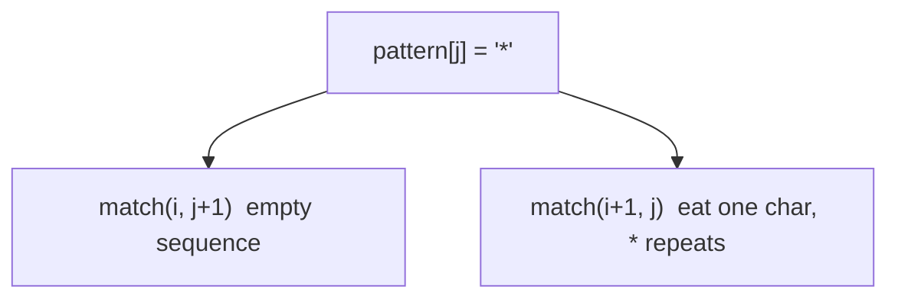
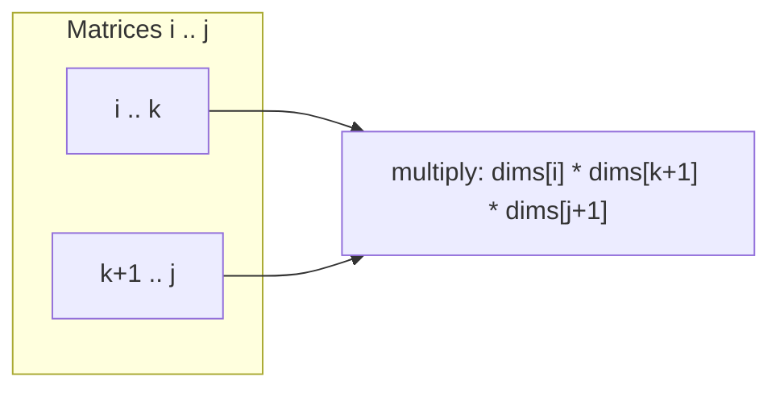

# MODULE 39 — DP: wildcard, Catalan, MCM, partition & more

**Illustration code:** [`a.cpp`](a.cpp)–[`j.cpp`](j.cpp) (Parts I–V) · [`k.cpp`](k.cpp)–[`t.cpp`](t.cpp) (Part VI)

See also: [`09. Catalan Variations & Applications.pdf`](09.%20Catalan%20Variations%20%26%20Applications.pdf)

---

## Notation

- **`text` / `pattern`** — strings; pattern may contain literals, **`?`**, **`*`**.
- **`C_n`** — **n-th Catalan number** (OEIS A000108), **`C_0 = 1`**.
- **`dims[0..n]`** — dimensions of **`n`** matrices; matrix **`i`** is **`dims[i] × dims[i+1]`**.
- **`cost(i,j)`** — minimum scalar multiplications to multiply matrices **`i..j`**.

---

# Part I — Wildcard pattern matching

## 1. Problem — [`a.cpp`](a.cpp)

**Given** a text string and a pattern, decide if the pattern **matches** the full text.

| Symbol | Meaning |
|--------|---------|
| **`?`** | Matches **exactly one** arbitrary character in the text |
| **`*`** | Matches **any sequence** of characters (length **0** or more) |

**Examples:**

| Text | Pattern | Match? |
|------|---------|--------|
| `"baaabab"` | `"**ba****ab*"` | **true** |
| `"baaabab"` | `"a*ab"` | **false** |

```bash
g++ -std=c++17 -o a a.cpp && ./a
```

---

### 1.1 State and recurrence (2D DP on indices)

**State:** **`match(i, j)`** = can **`text[i..]`** be matched by **`pattern[j..]`**?

**Base cases:**

- **`j == pattern.length`** → match iff **`i == text.length`** (both consumed).
- If **`text` exhausted** but pattern remains → only possible if remaining pattern is all **`*`** (handled in loop / recursion).

**Transitions** at **`pattern[j]`**:

| `pattern[j]` | Recurrence |
|--------------|------------|
| **`*`** | `match(i, j+1)` **OR** `match(i+1, j)` if `i < n` — star matches **empty**, or eats one text char and stays |
| **`?`** | `i < n` and `match(i+1, j+1)` |
| **letter** | `i < n` and `text[i]==pattern[j]` and `match(i+1, j+1)` |



**Overlapping:** many pairs **`(i,j)`** revisited → **memoization** or **bottom-up** table **`dp[i][j]`** filled from the end.

---

### 1.2 Implementation in [`a.cpp`](a.cpp)

| Method | Function |
|--------|----------|
| Naive recursion | `matchNaive` |
| Memoization | `wildcardMatch` / `matchMemo` |
| Tabulation | `matchTab` (fill from `i,j` at end) |

**Time / space:** **\(O(n \cdot m)\)** where **`n = |text|`**, **`m = |pattern|`**; space **\(O(nm)\)** or **\(O(m)\)** with rolling (not shown).

**Why not greedy?** Patterns like **`*a`** and text **`ba`** need exploring both “how much” **`*`** consumes — DP (or careful recursion) is the standard approach.

---

# Part II — Catalan numbers

## 2. What is \(C_n\)?

The **Catalan numbers** count many “balanced” combinatorial structures:

- **Valid parentheses** strings of **`n`** pairs: **`()`**, **`(())`**, **`()()`**, …
- **BSTs** with **`n`** distinct keys (structure count)
- **Triangulations** of a convex **`(n+2)`**-gon
- **Paths** that stay below a diagonal in a grid (Dyck paths)

**Sequence:** **`1, 1, 2, 5, 14, 42, 132, 429, …`**

---

### 2.1 Recursive definition (from your notes)

\[
C_0 = 1,\quad C_1 = 1
\]

For **`n ≥ 2`**:

\[
C_n = \sum_{k=0}^{n-1} C_k \cdot C_{n-1-k}
\]

**Idea:** Split a structure of “size **`n`**” into a **left** piece of size **`k`** and a **right** piece of size **`n-1-k`**, then multiply counts (convolution of Catalan sequence with itself).

**Worked values:**

| \(n\) | Expansion | Value |
|-------|-----------|-------|
| **0** | — | **1** |
| **1** | — | **1** |
| **2** | \(C_0 C_1 + C_1 C_0 = 1\cdot1 + 1\cdot1\) | **2** |
| **3** | \(C_0 C_2 + C_1 C_1 + C_2 C_0 = 1\cdot2 + 1\cdot1 + 2\cdot1\) | **5** |
| **4** | \(C_0 C_3 + C_1 C_2 + C_2 C_1 + C_3 C_0 = 1\cdot5 + 1\cdot2 + 2\cdot1 + 5\cdot1\) | **14** |

This matches [`b.cpp`](b.cpp) / [`c.cpp`](c.cpp) / [`d.cpp`](d.cpp) output.

---

### 2.2 Closed form (reference)

\[
C_n = \frac{1}{n+1}\binom{2n}{n}
\]

[`d.cpp`](d.cpp) checks tabulation against this formula for **`n ≤ 10`**.

---

### 2.3 Recursion tree / overlap

Computing **`C_4`** calls **`C_3`**, **`C_2`**, **`C_1`**, **`C_0`** many times across different **`k`** splits → **massive overlap**. Naive recursion in [`b.cpp`](b.cpp) is **exponential** in **`n`** without cache.

```text
C_4
├── k=0: C_0 * C_3  →  C_3 recomputed again for k=2, etc.
├── k=1: C_1 * C_2
├── k=2: C_2 * C_3
└── k=3: C_3 * C_0
```

---

## 3. Catalan — recursion — [`b.cpp`](b.cpp)

Direct translation of:

```cpp
long long catalan(int n) {
    if (n <= 1) return 1;
    long long sum = 0;
    for (int k = 0; k < n; k++)
        sum += catalan(k) * catalan(n - 1 - k);
    return sum;
}
```

Prints **`C_0 … C_6`** and explains **`C_2`**, **`C_3`**, **`C_4`** by hand.

```bash
g++ -std=c++17 -o b b.cpp && ./b
```

**Time (naive):** exponential · **Space:** **\(O(n)\)** stack depth.

---

## 4. Catalan — memoization — [`c.cpp`](c.cpp)

**`memo[n]`** stores **`C_n`** after first compute; inner loop still sums **`k`** but each **`C_k`** is **O(1)** lookup.

```bash
g++ -std=c++17 -o c c.cpp && ./c
```

Fills **`C_0 … C_20`** quickly.

**Time:** **\(O(n^2)\)** if each **`C_i`** summed once with **`i`** terms (standard Catalan DP). **Space:** **\(O(n)\)**.

---

## 5. Catalan — tabulation — [`d.cpp`](d.cpp)

**Bottom-up:** build **`dp[0..n]`** in increasing order so **`dp[k]`** and **`dp[i-1-k]`** are ready.

```cpp
dp[0] = 1;
dp[1] = 1;
for (int i = 2; i <= n; i++)
    for (int k = 0; k < i; k++)
        dp[i] += dp[k] * dp[i - 1 - k];
```

| `i` | `dp[i]` |
|-----|---------|
| 0 | 1 |
| 1 | 1 |
| 2 | 2 |
| 3 | 5 |
| 4 | 14 |
| 5 | 42 |

```bash
g++ -std=c++17 -o d d.cpp && ./d
```

**Time:** **\(O(n^2)\)** · **Space:** **\(O(n)\)**.

---

### 5.1 Comparison: b → c → d

| | `b.cpp` | `c.cpp` | `d.cpp` |
|---|---------|---------|---------|
| Style | Top-down, recompute | Top-down + cache | Bottom-up table |
| Time | exponential | **\(O(n^2)\)** | **\(O(n^2)\)** |
| Best for | tiny `n`, teaching | medium `n` | medium `n`, no stack |

Same recurrence; **DP stores each `C_k` once**.

---

### 5.2 Applications (conceptual)

| Application | Why \(C_n\) |
|-------------|-------------|
| **Balanced parentheses** | `n` pairs → **`C_n`** valid strings |
| **Binary search trees** | `n` nodes → **`C_n`** structurally distinct BSTs |
| **Mountain ranges** | up/down steps staying above ground |
| **Polygon triangulation** | **`(n+2)`**-gon → **`C_n`** triangulations |

Details and variants: see the course PDF in this folder.

---

# Part III — Catalan applications

Both problems below count the **same** sequence **`C_n`** from Part II; the code shows **why** the BST split and the mountain prefix rule both reduce to **`dp[i] += dp[k] * dp[i-1-k]`**.

---

## 6. Count structurally unique BSTs — [`e.cpp`](e.cpp)

**Problem:** Given **`n`** nodes (say keys **`1 .. n`**), how many **structurally different** binary search trees exist? (Shape only — not permutations of values.)

| `n` | Answer |
|-----|--------|
| 2 | **2** |
| 3 | **5** |

### 6.1 Why it is Catalan

Choose **root** at key **`k`** (**`1 ≤ k ≤ n`**):

- **Left subtree:** **`k - 1`** nodes → **`C_{k-1}`** shapes.
- **Right subtree:** **`n - k`** nodes → **`C_{n-k}`** shapes.

Total:

\[
\text{BST}(n) = \sum_{k=1}^{n} C_{k-1}\, C_{n-k}
\]

Re-index **`k' = k-1`** → same as **`C_n = \sum_{k=0}^{n-1} C_k C_{n-1-k}`** (§3).

**`n = 2`:** root at 1 → left empty (**`C_0=1`**) + right one node (**`C_1=1`**); root at 2 → left one + right empty → **2** trees.

**`n = 3`:** sum **`C_0 C_2 + C_1 C_1 + C_2 C_0 = 1·2 + 1·1 + 2·1 = 5`**.

[`e.cpp`](e.cpp) tabulates **`C_n`** and prints checks for **`n = 2, 3`**.

```bash
g++ -std=c++17 -o e e.cpp && ./e
```

**Time / space:** **\(O(n^2)\)** / **\(O(n)\)** (same table as [`d.cpp`](d.cpp)).

---

## 7. Mountain ranges (Dyck paths) — [`f.cpp`](f.cpp)

**Problem:** Draw a mountain with **`n`** **up** strokes (**`U`**) and **`n`** **down** strokes (**`D`**). At **every prefix**, the number of **`U`** must be **≥** the number of **`D`** (you never go below “ground”).

| `pairs` | Mountains |
|---------|-----------|
| 3 | **5** |

### 7.1 State and recurrence

**State:** **`ways(u, d)`** = valid partial paths using **`u`** ups and **`d`** downs so far, with **`u ≥ d`** always.

**Transitions** from **`(u, d)`** toward **`(n, n)`**:

- Add **`U`** if **`u < n`**
- Add **`D`** only if **`d < u`** (so after adding, still **`u ≥ d`**)

**Base:** **`u == d == n`** → **1** way.

This 2D DP on a triangular grid also equals **`C_n`**; [`f.cpp`](f.cpp) implements **DFS**, **memo**, and **Catalan tab** for **`pairs = 3`**, then **lists all 5** paths.

Example paths for **`pairs = 3`** (same as 3-pair balanced parentheses):

```
UUUDDD   UUDUDD   UUDDUD   UDUUDD   UDUDUD
```

```bash
g++ -std=c++17 -o f f.cpp && ./f
```

**Time:** **\(O(n^2)\)** memo / Catalan · **Space:** **\(O(n^2)\)** memo or **\(O(n)\)** tab.

---

# Part IV — Matrix multiplication & chain (MCM)

## 9. Matrix multiplication — math and code

### 9.1 Mathematics

If **`A`** is **`p × q`** and **`B`** is **`q × r`** (inner dimension **`q`** must match), the product **`C = A × B`** is **`p × r`**.

Each entry **`C[i][j]`** is a dot product of row **`i`** of **`A`** with column **`j`** of **`B`**:

\[
C[i][j] = \sum_{t=0}^{q-1} A[i][t]\cdot B[t][j]
\]

**Scalar multiplication count** (one multiply + one add per inner step, counted as multiplications in MCM):

\[
\text{cost}(A_{p\times q}, B_{q\times r}) = p \cdot q \cdot r
\]

**Not commutative:** **`A×B`** and **`B×A`** may differ in shape and cost.  
**Associative:** **`(AB)C`** and **`A(BC)`** give the same numeric result but **different** costs when dimensions differ.

**Example:** **`A` 1×2**, **`B` 2×3**, **`C` 3×4**

| Order | Steps | Cost |
|-------|-------|------|
| **`(AB)C`** | **`AB`**: 1·2·3 = **6**, then **×C**: 1·3·4 = **12** | **18** |
| **`A(BC)`** | **`BC`**: 2·3·4 = **24**, then **A×**: 1·2·4 = **8** | **32** |

Parentheses matter — that is what **MCM** optimizes.

### 9.2 Programming representation

Store only the **dimension array** (not full matrices):

```text
dims = { d0, d1, d2, ..., dn }
```

Matrix **`i`** has shape **`dims[i] × dims[i+1]`**.  
Multiplying chain **`i..k`** then **`k+1..j`** costs **`dims[i] * dims[k+1] * dims[j+1]`** (result is **`dims[i] × dims[j+1]`**).

---

## 10. Matrix Chain Multiplication — [`g.cpp`](g.cpp) · [`h.cpp`](h.cpp) · [`i.cpp`](i.cpp)

**Problem:** Given **`dims[0..n]`** for **`n`** matrices, find the **minimum number of scalar multiplications** to multiply **`M0 × M1 × … × M_{n-1}`** (any parenthesization).

**Course example:**

```text
dims = { 1, 2, 3, 4, 3 }
```

| Matrix | Shape |
|--------|-------|
| **M0** | 1 × 2 |
| **M1** | 2 × 3 |
| **M2** | 3 × 4 |
| **M3** | 4 × 3 |

**Answer:** minimum cost = **30** (e.g. **`((M0 M1) M2) M3`** → 6 + 12 + 12).

---

### 10.1 Interval DP recurrence

**State:** **`cost(i, j)`** = min cost to multiply matrices **`i` through `j`**.

**Base:** **`i == j`** → **0** (single matrix, no multiply).

**Split** at **`k`** (**`i ≤ k < j`**): multiply left part **`i..k`**, right part **`k+1..j`**, then combine:

\[
cost(i,j) = \min_{k=i}^{j-1}\Bigl(
cost(i,k) + cost(k+1,j) + dims[i]\cdot dims[k+1]\cdot dims[j+1]
\Bigr)
\]



---

### 10.2 Methods

| File | Method | Notes |
|------|--------|-------|
| [`g.cpp`](g.cpp) | Naive recursion | Recomputes subproblems — exponential |
| [`h.cpp`](h.cpp) | Memoization | **`memo[i][j]`** caches **`cost(i,j)`** |
| [`i.cpp`](i.cpp) | Tabulation | Loop **`len = 2..n`**, fill **`dp[i][j]`**; prints optimal parentheses |

```bash
g++ -std=c++17 -o g g.cpp && ./g
g++ -std=c++17 -o h h.cpp && ./h
g++ -std=c++17 -o i i.cpp && ./i
```

**Time:** **\(O(n^3)\)** (three nested loops: length, **`i`**, split **`k`**)  
**Space:** **\(O(n^2)\)** for **`dp`**

---

### 10.3 Tabulation order ([`i.cpp`](i.cpp))

Fill **`dp[i][j]`** by **increasing chain length** **`len = j - i + 1`**, so **`dp[i][k]`** and **`dp[k+1][j]`** are ready before **`dp[i][j]`**.

---

# Part V — Minimum partitioning

## 11. Problem — [`j.cpp`](j.cpp)

**Given** an array **`nums`**, split into **two subsets** **`S1`** and **`S2`** (every element in exactly one set). Minimize **`|sum(S1) - sum(S2)|`**.

**Example:**

```text
nums = { 1, 6, 11, 5 }   sum = 23
```

Best split: **`{11}`** vs **`{1, 6, 5}`** → **11** and **12** → **min diff = 1**.

*(If you include **7** as in **`{1, 7, 6, 11, 5}`**, the best diff is **2** — see second demo in [`j.cpp`](j.cpp).)*

---

### 11.1 Reduce to subset sum

Let **`total = sum(nums)`**. We want a subset **`S`** with sum **`s`** as close as possible to **`total/2`**:

\[
\min |sum(S_1) - sum(S_2)| = total - 2\cdot \max\{\,s : s \le \lfloor total/2 \rfloor,\; s \text{ achievable}\,\}
\]

**DP:** **`dp[s] = true`** if some subset sums to **`s`** (0/1 knapsack on sums, same spirit as Module 37 [`j.cpp`](../37-DP_Intro/j.cpp)).

```bash
g++ -std=c++17 -o j j.cpp && ./j
```

**Time:** **\(O(n \cdot \text{total})\)** · **Space:** **\(O(\text{total})\)** (or **\(O(n \cdot \text{total})\)** for 2D memo in [`j.cpp`](j.cpp)).

---

# Part VI — More DP problems (`k.cpp`–`t.cpp`)

---

## 13. Tribonacci — [`k.cpp`](k.cpp)

**Problem:** **`T0 = 0`**, **`T1 = T2 = 1`**, and for **`n ≥ 3`**:

\[
T_n = T_{n-1} + T_{n-2} + T_{n-3}
\]

Return **`T_n`**.

### 13.1 Solution steps

1. **Base cases:** **`n = 0 → 0`**, **`n = 1` or `2 → 1`**.
2. **Recurrence:** each term needs the previous **three** values (like Fibonacci but width 3).
3. **Memoization:** cache **`T(k)`** when using top-down recursion.
4. **Tabulation:** keep rolling **`(t0, t1, t2)`** and shift each step — only **\(O(1)\)** extra space.

### 13.2 Complexity

| Method | Time | Space |
|--------|------|-------|
| Naive recursion | **\(O(3^n)\)** | **\(O(n)\)** stack |
| Memo / tab | **\(O(n)\)** | **\(O(n)\)** memo or **\(O(1)\)** tab |

```bash
g++ -std=c++17 -o k k.cpp && ./k
```

**Sample:** **`T(10) = 149`**.

---

## 14. Stock with transaction fee — [`l.cpp`](l.cpp)

**Problem:** Array **`prices[i]`** = stock price on day **`i`**. Pay **`fee`** once per **complete transaction** (buy + sell). Unlimited transactions, at most one share held. Maximize profit.

### 14.1 State machine DP

Two states each day:

| State | Meaning |
|-------|---------|
| **cash** | Not holding stock — max profit so far |
| **hold** | Holding one share — max profit so far |

**Transitions** on day **`i`** (price **`p`**):

- **cash** = max( prev cash, prev hold + **`p - fee`** ) — sell today (fee on sell)
- **hold** = max( prev hold, prev cash - **`p`** ) — buy today

**Answer:** **cash** after the last day.

### 14.2 Steps

1. Initialize **`hold = -prices[0]`** (bought day 0), **`cash = 0`**.
2. Loop **`i = 1 .. n-1`**, update **`cash`** then **`hold`** (order matches [`l.cpp`](l.cpp)).
3. Optional 2D table **`dpCash[i]`**, **`dpHold[i]`** for tracing.

### 14.3 Complexity

**Time:** **\(O(n)\)** · **Space:** **\(O(1)\)** rolling, or **\(O(n)\)** with full table.

```bash
g++ -std=c++17 -o l l.cpp && ./l
```

**Demo:** **`prices = {1,3,2,8,4,9}`**, **`fee = 2`** → profit **8**.

---

## 15. Longest increasing path in matrix — [`m.cpp`](m.cpp)

**Problem:** **`m × n`** matrix. From each cell move **up / down / left / right** only to **strictly larger** values. Return **length** of the longest path (cells count).

### 15.1 Solution steps

1. **Subproblem:** **`len(r,c)`** = longest path **starting** at **`(r,c)`** (including that cell).
2. **DFS:** from **`(r,c)`**, try 4 neighbors with **`mat[nr][nc] > mat[r][c]`**:
   **`len(r,c) = 1 + max len(neighbor)`**.
3. **Memoize** **`len(r,c)`** — each cell computed once.
4. **Answer:** **`max_{r,c} len(r,c)`** over all cells.

No cycles: only moves to **larger** values → DAG.

### 15.2 Complexity

**Time:** **\(O(m \cdot n)\)** — each cell + 4 edges once.  
**Space:** **\(O(m \cdot n)\)** memo.

```bash
g++ -std=c++17 -o m m.cpp && ./m
```

**Demo matrix** (LeetCode classic): longest path length **4** (`1 → 2 → 6 → 9`).

---

## 16. Generate parentheses — [`n.cpp`](n.cpp)

**Problem:** Given **`n`**, output **all** strings of **`n`** pairs **`()`** that are **well-formed**.

### 16.1 Backtracking steps

1. Track **`open`** = **`(`** used, **`close`** = **`)`** used.
2. If **`open < n`**, add **`(`** and recurse.
3. If **`close < open`**, add **`)`** and recurse (never more closes than opens).
4. When **`open + close == 2n`**, save string.

**Count** = **`C_n`** (Catalan) — see Part II [`b.cpp`](b.cpp)–[`d.cpp`](d.cpp).

### 16.2 Complexity

**Time:** **\(O(C_n \cdot n)\)** to emit all strings.  
**Space:** **\(O(n)\)** recursion stack per path.

```bash
g++ -std=c++17 -o n n.cpp && ./n
```

---

## 17. House robber — [`o.cpp`](o.cpp)

**Problem:** **`nums[i]`** = money at house **`i`**. Cannot rob **two adjacent** houses. Maximize total robbed.

### 17.1 Recurrence

**`rob(i)`** = max money from houses **`i..end`**.

\[
rob(i) = \max\bigl( rob(i+1),\; nums[i] + rob(i+2) \bigr)
\]

**Tabulation (forward):**

- **`prev2`** = best up to **`i-2`**, **`prev1`** = best up to **`i-1`**
- **`cur = max(prev1, nums[i] + prev2)`**

### 17.2 Steps

1. Base: empty street → **0**.
2. For each house, choose **skip** (keep **`prev1`**) or **rob** (add **`nums[i] + prev2`**).
3. Answer = **`prev1`** after last house.

### 17.3 Complexity

| Method | Time | Space |
|--------|------|-------|
| Naive | **\(O(2^n)\)** | **\(O(n)\)** |
| Tab | **\(O(n)\)** | **\(O(1)\)** |

```bash
g++ -std=c++17 -o o o.cpp && ./o
```

**Demo:** **`{2,7,9,3,1}`** → **12** (rob **2 + 9 + 1**).

---

## 18. Longest palindromic subsequence — [`p.cpp`](p.cpp)

**Problem:** String **`s`**. Longest **subsequence** (not necessarily contiguous) that is a **palindrome**. Return **length**.

### 18.1 Interval DP

**`dp[i][j]`** = LPS length in **`s[i..j]`**.

**Steps:**

1. **`i == j`** → **`dp[i][j] = 1`**.
2. Fill by **increasing length** **`len = 2 .. n`**.
3. If **`s[i] == s[j]`**: **`dp[i][j] = 2 + dp[i+1][j-1]`** (or **2** if adjacent).
4. Else: **`dp[i][j] = max(dp[i+1][j], dp[i][j-1])`** — drop one end.

### 18.2 Complexity

**Time:** **\(O(n^2)\)** · **Space:** **\(O(n^2)\)**.

```bash
g++ -std=c++17 -o p p.cpp && ./p
```

**Demo:** **`"bbbab"`** → **4**.

---

## 19. Equal subset sum partition — [`q.cpp`](q.cpp)

**Problem:** Can **`nums`** be split into **two subsets with equal sum**?

### 19.1 Steps

1. **`total = sum(nums)`**. If **odd** → **false**.
2. **Target** **`target = total / 2`** — find subset summing to **`target`**.
3. **0/1 knapsack on sums:** **`dp[s] = true`** if sum **`s`** achievable.
4. For each **`x`**, update **`s` from target down to x** (avoid reuse).

**Answer:** **`dp[target]`**.

### 19.2 Complexity

**Time:** **\(O(n \cdot \text{total})\)** · **Space:** **\(O(\text{total})\)**.

```bash
g++ -std=c++17 -o q q.cpp && ./q
```

**Demo:** **`{1, 5, 11, 5}`** → **true** (subset **11**).

---

## 20. Mountain array — minimum removals — [`r.cpp`](r.cpp)

**Problem:** **Mountain array:** length **`≥ 3`**, some peak **`i`** (**`0 < i < n-1`**) with **strict increase** to **`i`**, then **strict decrease** after. Return **minimum elements to remove** so the **remaining subsequence** (in order) is a mountain array.

### 20.1 Steps (longest mountain subsequence)

1. **`inc[i]`** = length of **strictly increasing** subsequence **ending** at **`i`** (from left).
2. **`dec[i]`** = length of **strictly decreasing** subsequence **starting** at **`i`** (from right).
3. At peak **`i`** ( **`1 ≤ i ≤ n-2`** ), mountain length **`inc[i] + dec[i] - 1`** (peak counted once).
4. **`longestMountain = max`** over valid peaks.
5. **Removals** = **`n - longestMountain`**.

**Related:** **Longest bitonic subsequence** (LBS) uses full **`O(n^2)`** LIS-style DP — also in [`r.cpp`](r.cpp).

### 20.2 Complexity

**Time:** **\(O(n)\)** for mountain with adjacent-only inc/dec arrays; **\(O(n^2)\)** for general LBS.  
**Space:** **\(O(n)\)**.

```bash
g++ -std=c++17 -o r r.cpp && ./r
```

---

## 21. Box stacking — [`s.cpp`](s.cpp)

**Problem:** **`n`** cuboids **`[w, l, h]`**. Rotate any box (permute dimensions). Stack boxes **`i`** on **`j`** only if all three dimensions of **`i`** are **`≤`** those of **`j`**. Maximize **total height**.

### 21.1 Steps

1. **Normalize** each box: sort its 3 dims so **`w ≤ l ≤ h`**.
2. **Sort all boxes** by **`(w, l, h)`** ascending (ensures only earlier boxes can sit below).
3. **DP:** **`dp[i]`** = max stack height with box **`i` on top**:
   **`dp[i] = h_i + max{ dp[j] : j < i, box j fits under i }`**.
4. **Answer:** **`max_i dp[i]`**.

Same pattern as **LIS**, but **3D** dominance instead of one key.

### 21.2 Complexity

**Time:** **\(O(n^2)\)** · **Space:** **\(O(n)\)**.

```bash
g++ -std=c++17 -o s s.cpp && ./s
```

---

## 22. Palindrome partitioning (all partitions) — [`t.cpp`](t.cpp)

**Problem:** String **`s`**. Partition into substrings so **each part is a palindrome**. Return **all** valid partitions.

### 22.1 Steps

1. **Precompute** **`pal[i][j]`** = is **`s[i..j]`** a palindrome? (interval DP, **`O(n^2)`**).
2. **Backtrack** from index **`start`**:
   - Try every **`end ≥ start`** with **`pal[start][end]`** true.
   - Push **`s[start..end]`**, recurse from **`end+1`**.
   - On reaching **`start == n`**, save current partition list.
3. **Backtrack** pop before next branch.

### 22.2 Complexity

**Time:** exponential in **`n`** in worst case (many palindrome splits); preprocessing **\(O(n^2)\)**.  
**Space:** **\(O(n^2)\)** pal table + **\(O(n)\)** recursion.

```bash
g++ -std=c++17 -o t t.cpp && ./t
```

**Demo:** **`"aab"`** → **`["a","a","b"]`**, **`["aa","b"]`**.

---

## 23. Compile all

```bash
cd 39-DP_Advanced
g++ -std=c++17 -o a a.cpp && ./a
g++ -std=c++17 -o b b.cpp && ./b
g++ -std=c++17 -o c c.cpp && ./c
g++ -std=c++17 -o d d.cpp && ./d
g++ -std=c++17 -o e e.cpp && ./e
g++ -std=c++17 -o f f.cpp && ./f
g++ -std=c++17 -o g g.cpp && ./g
g++ -std=c++17 -o h h.cpp && ./h
g++ -std=c++17 -o i i.cpp && ./i
g++ -std=c++17 -o j j.cpp && ./j
g++ -std=c++17 -o k k.cpp && ./k
g++ -std=c++17 -o l l.cpp && ./l
g++ -std=c++17 -o m m.cpp && ./m
g++ -std=c++17 -o n n.cpp && ./n
g++ -std=c++17 -o o o.cpp && ./o
g++ -std=c++17 -o p p.cpp && ./p
g++ -std=c++17 -o q q.cpp && ./q
g++ -std=c++17 -o r r.cpp && ./r
g++ -std=c++17 -o s s.cpp && ./s
g++ -std=c++17 -o t t.cpp && ./t
```

---

## Quick reference

| # | Topic | File | Time | Space |
|---|-------|------|------|-------|
| 1 | Wildcard | `a.cpp` | **\(O(nm)\)** | **\(O(nm)\)** |
| 2–4 | Catalan | `b`–`d` | **\(O(n^2)\)** | **\(O(n)\)**–**\(O(n^2)\)** |
| 5–6 | BST / mountains | `e`, `f` | **\(O(n^2)\)** | **\(O(n^2)\)** |
| 7–9 | MCM | `g`–`i` | **\(O(n^3)\)** | **\(O(n^2)\)** |
| 10 | Min partition | `j.cpp` | **\(O(n\cdot sum)\)** | **\(O(sum)\)** |
| 11 | Tribonacci | `k.cpp` | **\(O(n)\)** | **\(O(1)\)** |
| 12 | Stock + fee | `l.cpp` | **\(O(n)\)** | **\(O(1)\)** |
| 13 | LIP matrix | `m.cpp` | **\(O(mn)\)** | **\(O(mn)\)** |
| 14 | Gen parentheses | `n.cpp` | **\(O(C_n\cdot n)\)** | **\(O(n)\)** |
| 15 | House robber | `o.cpp` | **\(O(n)\)** | **\(O(1)\)** |
| 16 | LPS | `p.cpp` | **\(O(n^2)\)** | **\(O(n^2)\)** |
| 17 | Equal partition | `q.cpp` | **\(O(n\cdot sum)\)** | **\(O(sum)\)** |
| 18 | Mountain removals | `r.cpp` | **\(O(n)\)**–**\(O(n^2)\)** | **\(O(n)\)** |
| 19 | Box stacking | `s.cpp` | **\(O(n^2)\)** | **\(O(n)\)** |
| 20 | Pal. partitioning | `t.cpp` | **\(O(n^2 + \text{out})\)** | **\(O(n^2)\)** |
