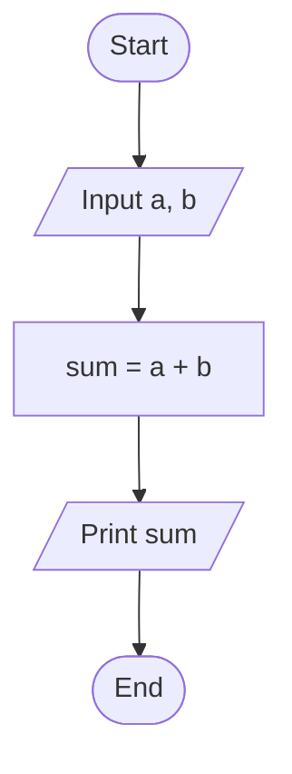
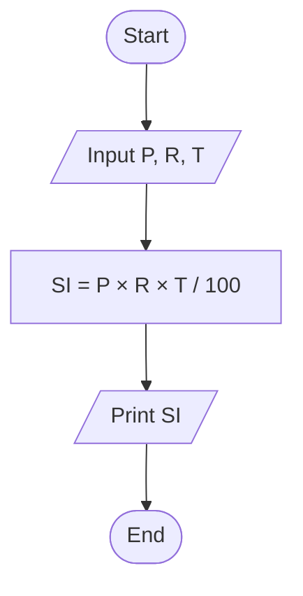
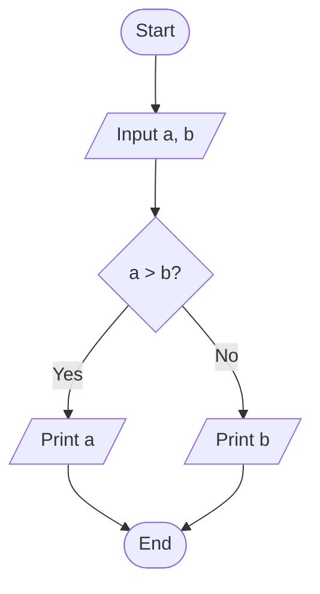
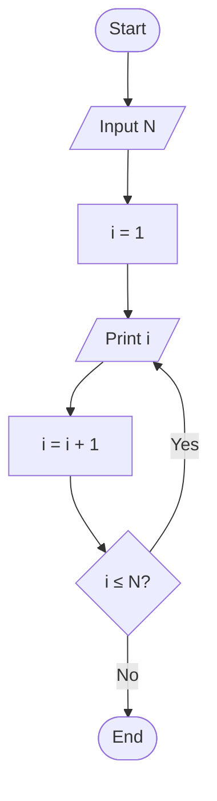
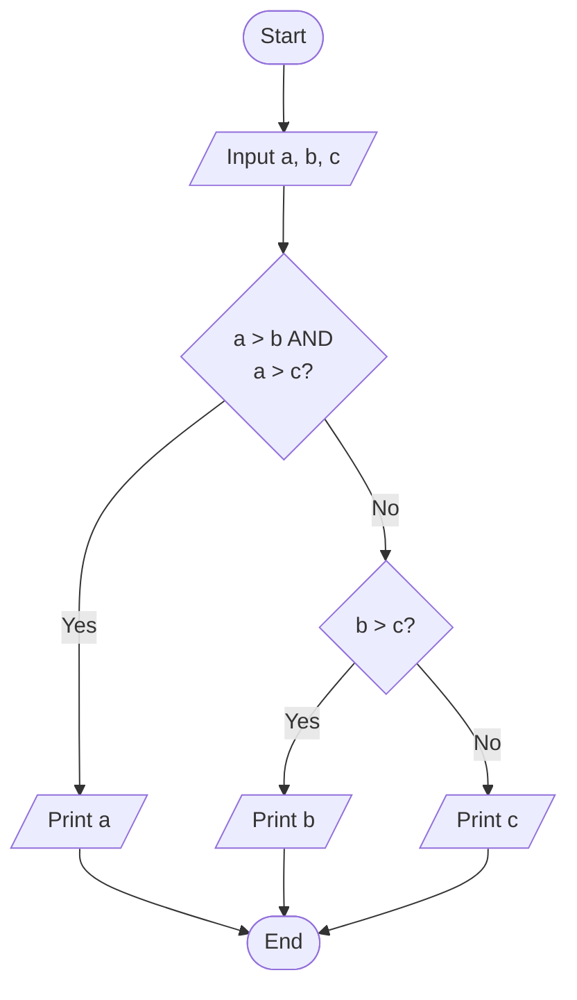
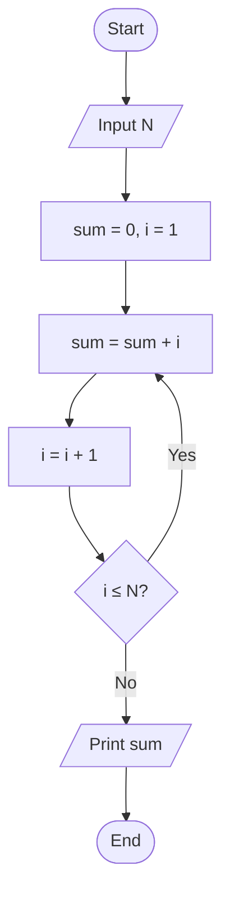
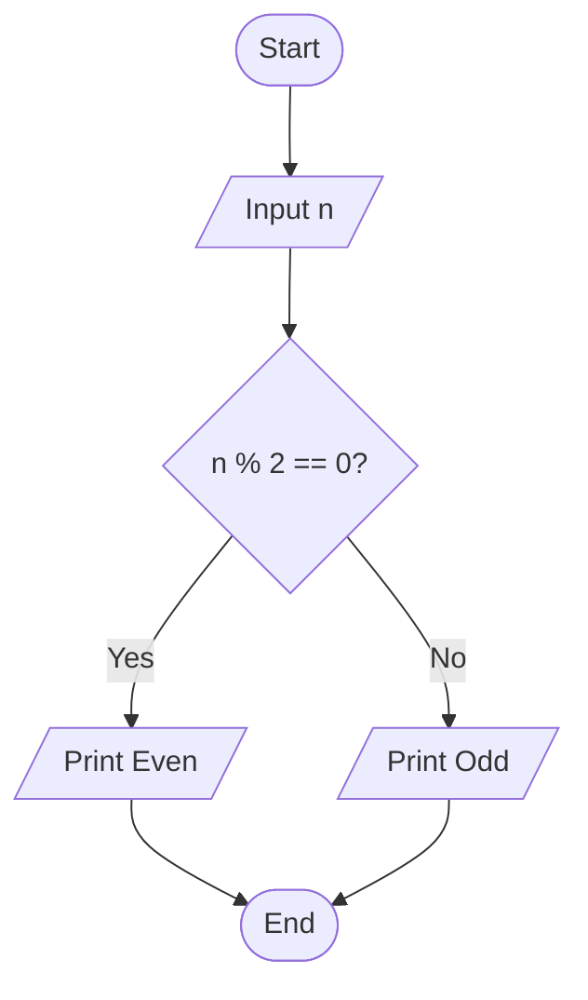
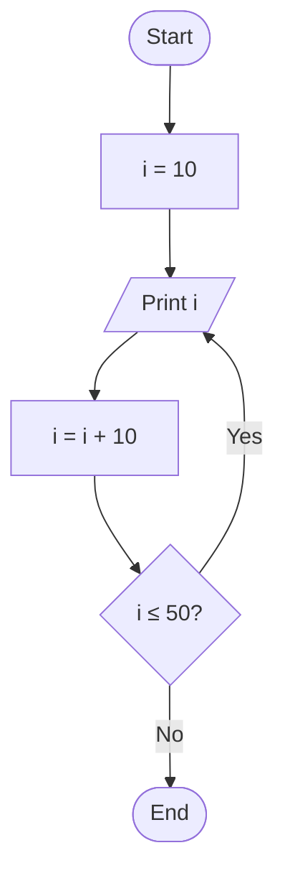

# DSA with C++ — Module 1 Notes

---

## 🔹 PREREQUISITES

Before starting Data Structures and Algorithms (DSA) using C++, ensure the following tools are installed:

1. **VS Code** – Code Editor
2. **C++ Compiler** – Required to compile and run C++ programs

---

## 🔹 FLOWCHARTS

Flowcharts are **logical diagrams** used to represent the solution of a problem.  
They help in understanding the **step-by-step flow of logic** before writing actual code.

---

## 🔹 ELEMENTS OF A FLOWCHART

1. **Oval** – Start or Exit
2. **Parallelogram** – Input or Output
3. **Rectangle** – Process
4. **Rhombus (Diamond)** – Decision
5. **Arrows** – Direction of Flow

---

## 🧩 FLOWCHART PROBLEMS & SOLUTIONS

---

### 1️⃣ Sum of Two Numbers

**Flowchart Logic:**

- Start
- Input two numbers `a` and `b`
- Calculate `sum = a + b`
- Print `sum`
- End

---

### 2️⃣ Simple Interest

**Formula:**  
`Simple Interest = (P × R × T) / 100`

**Flowchart Logic:**

- Start
- Input Principal `P`, Rate `R`, Time `T`
- Calculate `SI = (P × R × T) / 100`
- Print `SI`
- End

---

### 3️⃣ Maximum of Two Numbers

**Flowchart Logic:**

- Start
- Input two numbers `a` and `b`
- Check: `a > b`
  - If **Yes**, print `a`
  - Else, print `b`
- End

---

### 4️⃣ Print First N Natural Numbers

**Flowchart Logic:**

- Start
- Input `N`
- Initialize `i = 1`
- Print `i`
- Increment `i = i + 1`
- Check: `i ≤ N`
  - If **Yes**, repeat printing
  - If **No**, End

---

### 5️⃣ Maximum of Three Numbers

**Flowchart Logic:**

- Start
- Input three numbers `a`, `b`, `c`
- Check: `a > b` AND `a > c`
  - If **Yes**, print `a`
- Else check: `b > c`
  - If **Yes**, print `b`
  - Else, print `c`
- End

---

### 6️⃣ Sum of First N Natural Numbers

**Flowchart Logic:**

- Start
- Input `N`
- Initialize `sum = 0`, `i = 1`
- Add `sum = sum + i`
- Increment `i = i + 1`
- Check: `i ≤ N`
  - If **Yes**, repeat addition
  - If **No**, print `sum`
- End

---

### 7️⃣ Check Whether a Number is Odd or Even

**Flowchart Logic:**

- Start
- Input number `n`
- Check: `n % 2 == 0`
  - If **Yes**, print `"Even"`
  - Else, print `"Odd"`
- End

---

### 8️⃣ Print All Multiples from 10 to 50

**Flowchart Logic:**

- Start
- Initialize `i = 10`
- Print `i`
- Increment `i = i + 10`
- Check: `i ≤ 50`
  - If **Yes**, repeat printing
  - If **No**, End

---

## ✅ LECTURE 1 SUMMARY

- Flowcharts help in **planning logic before coding**
- They improve understanding of **conditions, loops, and calculations**
- These problems build the **foundation of DSA in C++**

_End of Module 1_
