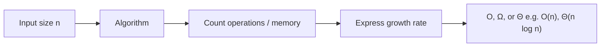
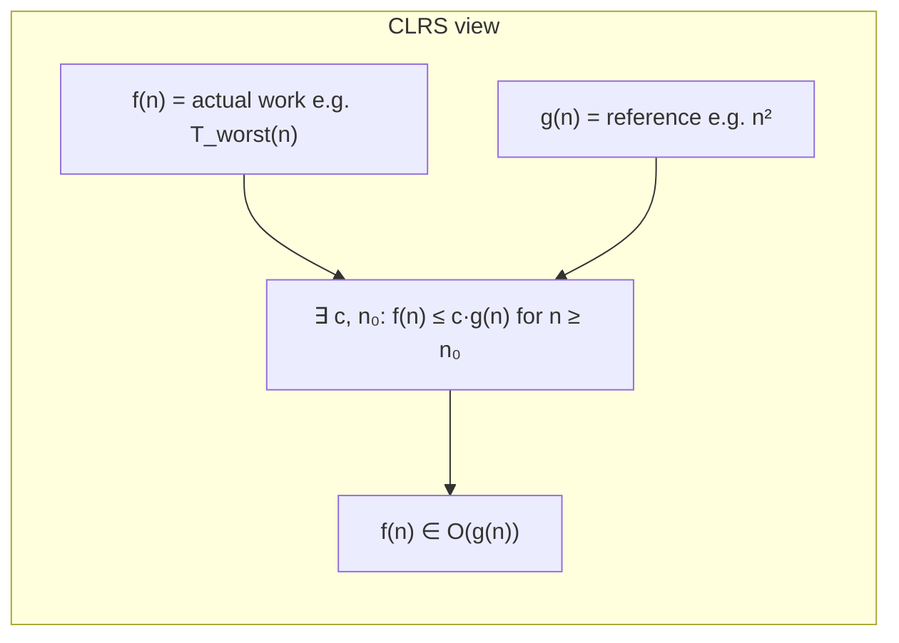
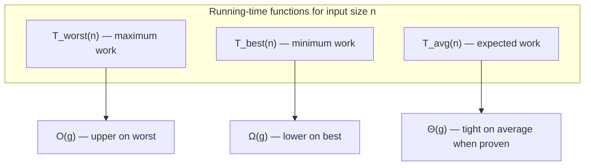
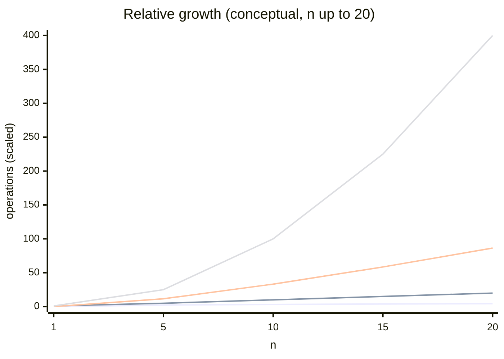
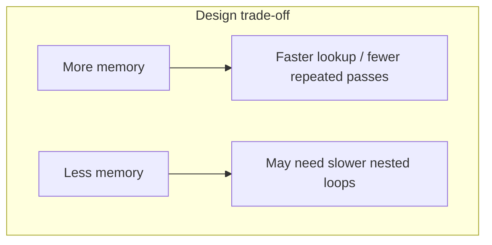

# DSA with C++ — Module 22 Notes

**Topic:** Time and space complexity — asymptotic analysis, **Big O**, **Big Ω (Omega)**, and **Big Θ (Theta)**, standard growth classes, best/average/worst case, and complexity graphs.  
**Companion code:** [a.cpp](a.cpp) and future files in this folder illustrate counting operations on sample algorithms. These notes explain *definitions* and *intuition*; use the `.cpp` files for runnable examples.

**Prerequisite:** Comfortable with loops, arrays, and basic algorithms from earlier modules (e.g. linear scan, binary search, sorting from Modules 11–13 and 21).

---

## Why complexity matters

When you compare two ways to solve the same problem, **wall-clock time** on one machine is misleading: CPU speed, compiler, and load all change the number. What stays useful is **how cost grows when input size grows**.

| Goal | What we measure |
|------|-----------------|
| **Time** | How the **number of elementary steps** (comparisons, assignments, loop iterations) grows with input size. |
| **Space** | How much **extra memory** the algorithm needs as input size grows. |

An algorithm is **more efficient** than another if, for large enough inputs, it uses **less time** and/or **less space** in this asymptotic sense — not because it happened to run faster once on a small test case.

Throughout this module, **`n`** denotes **input size**: length of an array, number of nodes in a list, number of digits in a number, number of edges in a graph, etc. We usually assume **`n` is large** when we ask “which algorithm scales better?”

---

## Order complexity analysis (asymptotic analysis)

**Order complexity analysis** (also called **asymptotic analysis**) describes efficiency **in terms of growth rate** as `n → ∞`.

| Measure | Name | Question it answers |
|---------|------|---------------------|
| **Time** | **Time complexity** | As `n` increases, how does the **work** (operations) increase? |
| **Space** | **Space complexity** | As `n` increases, how does **memory usage** increase? |

We express answers using three related notations: **Big O**, **Big Ω (Omega)**, and **Big Θ (Theta)**. In practice, **Big O** is used most often in courses and interviews; Ω and Θ make the meaning of “bound” precise.

**Important:** Time complexity is **not** “3 seconds on my laptop.” It is a **function of `n`** (e.g. proportional to `n`, `n²`, `log n`) that describes **scaling behavior**.



---

## Time complexity — definition

**Time complexity** is the amount of work an algorithm performs, expressed as a function of input size `n`, in the **asymptotic** sense.

| Idea | Detail |
|------|--------|
| **Input grows** | Double the array length, add more graph nodes, etc. |
| **Work responds** | Count how comparisons, loop iterations, or recursive calls grow. |
| **Ignore machine details** | Same algorithm is O(n) on any reasonable machine; constant factors differ. |

**Example (conceptual):** Scanning an array once to find a maximum touches each element about once → work grows **linearly** with `n` → **O(n)** time.

---

## Space complexity — definition

**Space complexity** is how much **memory** an algorithm needs as a function of `n`.

| Type | Meaning |
|------|---------|
| **Auxiliary space** | **Extra** memory beyond the input (new arrays, recursion stack, hash table). This is what people usually mean by “space complexity” of the algorithm. |
| **Total space** | Input storage **plus** auxiliary space. Sometimes written separately: “O(n) input, O(1) auxiliary.” |

| Idea | Detail |
|------|--------|
| **In-place** | Uses **O(1)** auxiliary space (only a few variables); may still reorder the **input** array. |
| **Recursion** | Each call uses stack space; depth `d` often adds **O(d)** auxiliary space. |

**Example:** Merge sort needs a temporary array of size about `n` → **O(n)** auxiliary space. Quick sort’s partition step uses **O(1)** extra variables, but recursion stack can be **O(log n)** or **O(n)** depending on splits (see Module 21).

---

## Asymptotic notation: Big O, Big Ω, and Big Θ

Three symbols describe how a function `f(n)` (actual work or space) relates to a growth function `g(n)` as **`n` becomes very large**. Constants and lower-order terms are ignored — same rules as in the Big O section below.

Let `f(n)` be the **exact** operation count (or a close model) for input size `n`.

### Overview — three ways to bound growth

| Notation | Name | Type of bound | Plain English |
|----------|------|---------------|---------------|
| **O(g(n))** | **Big O** | **Upper bound** (loose ceiling) | `f(n)` grows **no faster than** `g(n)` — “**at most**” |
| **Ω(g(n))** | **Big Omega** | **Lower bound** (loose floor) | `f(n)` grows **at least as fast as** `g(n)` — “**at least**” |
| **Θ(g(n))** | **Big Theta** | **Tight bound** | `f(n)` same order as `g(n)` — **both** O and Ω with same `g` |
| **o(g(n))** | **Little-o** | **Strict upper** | `f(n)` grows **strictly slower** than `g(n)` |
| **ω(g(n))** | **Little-omega** | **Strict lower** | `f(n)` grows **strictly faster** than `g(n)` |

```mermaid
flowchart TB
  subgraph bounds [How f(n) relates to g(n) for large n]
    O["O(g) — upper cap\nf does not grow faster than g"]
    Omega["Ω(g) — lower floor\nf does not grow slower than g"]
    Theta["Θ(g) — tight fit\nf and g same order"]
  end
  Theta --> O
  Theta --> Omega
```

**Visual intuition** (one algorithm, one `n`):

```
operations
  |     ..........  O(g)  — "won't do worse than this rate" (upper)
  |    *
  |   * *     actual f(n) might wiggle but stays between bounds
  |  *   *
  | *     *
  |*_______*____  Ω(g)  — "won't do better than this rate" (lower)
  +------------------------> n
              Θ(g) when upper and lower are the same order
```

---

### Big O notation (upper bound)

**Big O** states that an algorithm’s cost **`f(n)` is bounded above** by some multiple of `g(n)` for all sufficiently large `n`.

#### Time complexity as a function

Treat **time complexity** as a function **`T(n)`** (or **`f(n)`** in textbooks): for each input size `n`, `T(n)` is the number of elementary operations in the case you are analyzing (often **worst case**).

| Symbol | Meaning |
|--------|---------|
| **`T(n)`** | Running time as a function of input size `n` |
| **`g(n)`** | A simple reference growth function (e.g. `n`, `n²`, `n log n`) |
| **`T(n) = O(g(n))`** | “`T(n)` grows **no faster than** `g(n)`” (asymptotic upper bound) |

---

#### Formal definition — *Introduction to Algorithms* (CLRS, Cormen et al.)

The standard treatment is in **Cormen, Leiserson, Rivest, and Stein**, *Introduction to Algorithms* (often called **CLRS**). There, **`O(g(n))`** is a **set of functions**:

> **`f(n) = O(g(n))`** if there exist **positive constants** `c` and `n₀` such that  
> **`0 ≤ f(n) ≤ c · g(n)`** for all **`n ≥ n₀`**.

So Big O is not “equals” — it means: **from `n₀` onward, `f` stays at or below a fixed multiple of `g`.**

**Requirements (as in the book):**

- Usually assume **`f(n) ≥ 0`** and **`g(n) ≥ 0`** for large `n`.
- **`g(n)`** should be **asymptotically positive** (nonzero for all large `n`) so the bound is meaningful.

**Limit form (equivalent intuition when the limit exists):**

If `g(n) > 0` for large `n` and the limit below exists (or you use **lim sup** in general),

$$\lim_{n \to \infty} \frac{|f(n)|}{g(n)} < \infty$$

then **`f(n) = O(g(n))`**. The ratio **does not blow up** — `f` cannot grow faster than `g` up to a constant factor.

| Limit of &#124;f(n)&#124; / g(n) | Meaning |
|----------------------------------|---------|
| **0** | `f` grows **strictly slower** than `g` (also written **little-o**: `f(n) = o(g(n))`) |
| **Finite constant** `L > 0` | `f` and `g` same order → **`f(n) = Θ(g(n))`** |
| **∞** | `f` grows **faster** than `g` → `f` is **not** `O(g)` |

**Worst-case time complexity:** Let **`T_worst(n)`** be the **maximum** number of steps over **all** inputs of size `n`. Saying the algorithm’s worst-case time is **`O(g(n))`** means:

$$T_{\text{worst}}(n) = O(g(n))$$

i.e. for large `n`, the **worst** input never needs more than a constant times `g(n)` operations. That is why course problems often report **Big O of worst case** — it is a **guarantee**.



**Example (formal check):** `f(n) = 3n² + 5n + 6`, `g(n) = n²`.  
Pick `c = 4` and `n₀ = 10`. For `n ≥ 10`, `3n² + 5n + 6 ≤ 4n²`. So **`f(n) = O(n²)`** by definition.

---

#### Informal summary (same idea, less notation)

| Idea | Detail |
|------|--------|
| **Upper bound** | You are saying the algorithm takes **at most** on the order of `g(n)` steps. |
| **Worst case in practice** | When people say “the complexity is **O(n)**,” they usually mean **`T_worst(n) = O(n)`** (or a safe upper bound). |
| **Not “equals”** | `O(n²)` does **not** mean the algorithm always does exactly `n²` work; it might do less on some inputs. |
| **Link to simplification** | Dropping constants and lower terms in `T(n)` finds a simple **`g(n)`** that satisfies the CLRS inequality. |

**Examples:**

| Actual work `f(n)` | Valid Big O statements | Note |
|--------------------|------------------------|------|
| `3n + 10` | **O(n)**, also O(n log n), O(n²) | We give the **tightest usual** answer: O(n) |
| `n² + 5n` | **O(n²)** | Lower-order `5n` is dropped |
| `100` (fixed) | **O(1)** | Does not depend on `n` |

#### Rules and common mistakes (Big O)

| Rule | Example |
|------|---------|
| **Drop constant multipliers** | `3n + 100` → **O(n)** |
| **Drop lower-order terms** | `n² + 5n + 20` → **O(n²)** |
| **Keep the dominant term** | The term that grows fastest as `n` → ∞ |

| Wrong habit | Correct statement |
|-------------|-------------------|
| “This is O(3)” or “O(100)” | **O(1)** — constant time |
| “O(5n)” vs “O(n)” | Both are **O(n)**; the `5` is ignored |

Work that does **not** depend on `n` is always written **O(1)**, not O(3) or O(100).

#### Multiple inputs

If two sizes matter (e.g. `n` rows and `m` columns), complexity may be **O(n·m)**, **O(n + m)**, etc. State what each symbol means.

---

### Big Ω (Omega) notation (lower bound)

**Big Omega** states that an algorithm’s cost **`f(n)` is bounded below** by some multiple of `g(n)` for large `n`.

#### Formal definition (CLRS)

> **`f(n) = Ω(g(n))`** if there exist positive constants **`c`** and **`n₀`** such that  
> **`0 ≤ c · g(n) ≤ f(n)`** for all **`n ≥ n₀`**.

**Limit form (when the limit exists, `g(n) > 0`):**

$$\lim_{n \to \infty} \frac{|f(n)|}{g(n)} > 0 \quad \text{(and finite, or } \to \infty \text{)}$$

For a **tight** lower bound matching `g`, one often has **`lim |f(n)| / g(n) = L`** with **`L` a positive constant**.

**Best-case connection:** If **`T_best(n)`** is the **minimum** work over inputs of size `n`, then **`T_best(n) = Ω(g(n))`** means even the **easiest** input of that size still needs at least on the order of `g(n)` work.

| Idea | Detail |
|------|--------|
| **Lower bound** | The algorithm needs **at least** on the order of `g(n)` work — it cannot be asymptotically faster than that. |
| **Best case connection** | Sometimes Ω is used with **best-case** analysis: “you must do at least this much work even in the best situation.” |
| **Pair with O** | If you prove both `f(n) = O(g(n))` and `f(n) = Ω(g(n))`, you get `f(n) = Θ(g(n))`. |

**Examples:**

| Algorithm / problem | Lower bound intuition | Big Ω |
|---------------------|----------------------|-------|
| Print every element of an array of size `n` | Must touch each element at least once | **Ω(n)** |
| Comparison sort (general) | Must distinguish orderings | **Ω(n log n)** (standard result) |
| Binary search on sorted array | Each step eliminates half | **Ω(log n)** in the worst case for finding one element |

**Example:** If an algorithm always performs at least `n/2` comparisons for inputs of size `n`, then `f(n) ≥ n/2` → **Ω(n)**.

---

### Big Θ (Theta) notation (tight bound)

**Big Theta** means `f(n)` is **sandwiched** between constant multiples of `g(n)` — same growth order from above and below.

#### Formal definition (CLRS)

> **`f(n) = Θ(g(n))`** if there exist positive constants **`c₁`**, **`c₂`**, and **`n₀`** such that  
> **`0 ≤ c₁ · g(n) ≤ f(n) ≤ c₂ · g(n)`** for all **`n ≥ n₀`**.

Equivalently: **`f(n) = O(g(n))`** and **`f(n) = Ω(g(n))`** with the **same** **`g(n)`**.

**Limit form (when the limit exists, `g(n) > 0`):**

$$\lim_{n \to \infty} \frac{|f(n)|}{g(n)} = L \quad \text{where } L \text{ is a positive constant}$$

Then **`f(n) = Θ(g(n))`** — the ratio tends to a **fixed** constant, not 0 and not ∞.

| Idea | Detail |
|------|--------|
| **Tight / exact order** | “The algorithm grows **like** `g(n)`,” not just “at most” or “at least.” |
| **When to use** | When best and worst case are the **same order**, or when average case is proven to match (e.g. merge sort time is **Θ(n log n)** in all cases). |
| **Stronger than O alone** | Saying **Θ(n)** promises you cannot claim O(n) while secretly doing only O(log n) on every input — both upper and lower match. |

**Examples:**

| Situation | Statement |
|-----------|-----------|
| Merge sort time (always divides in half, always merges) | **Θ(n log n)** — best, average, and worst are the same order |
| Single loop `for (i = 0; i < n; i++)` body O(1) | **Θ(n)** — exactly `n` iterations |
| Linear search **worst** case only | **O(n)** is enough; worst is Θ(n), best is Θ(1) — whole algorithm is **not** Θ(n) |

---

### O vs Ω vs Θ — quick comparison

| Question | Use |
|----------|-----|
| “Will it ever need more than ~`g(n)` work?” | **O(g(n))** — upper / safe guarantee |
| “Must it always need at least ~`g(n)` work?” | **Ω(g(n))** — lower |
| “Does it grow **exactly** like `g(n)` (up to constants)?” | **Θ(g(n))** — tight |

| Relation | Meaning |
|----------|---------|
| `f(n) = Θ(g(n))` | Implies `f(n) = O(g(n))` **and** `f(n) = Ω(g(n))` |
| `f(n) = O(n)` only | Allows `f(n) = log n` or `f(n) = n` — only a ceiling |
| `f(n) = Ω(n²)` only | Allows `f(n) = n³` — only a floor |

**Course habit:** Problems often ask for **Big O** of **worst-case** time. Use **Θ** when the bound is tight in all cases (or you state which case). Use **Ω** when discussing **lower limits** (e.g. “any comparison sort needs Ω(n log n)”).

---

### Big O, Big Ω, Big Θ — links to best, average, and worst case

Many courses (including Mercury-style problem sets) **pair** each “Big” symbol with a **case** of running time. That is a **mnemonic**, not the full CLRS definition — but it is useful if you remember what each symbol **really** means.

| Notation | Bound type (CLRS) | Often used with… | Function | Meaning |
|----------|-------------------|------------------|----------|---------|
| **O(g(n))** | Upper (ceiling) | **Worst-case** time | **`T_worst(n)`** | Even the **hardest** input of size `n` needs **at most** ~`g(n)` work |
| **Ω(g(n))** | Lower (floor) | **Best-case** time | **`T_best(n)`** | Even the **easiest** input of size `n` needs **at least** ~`g(n)` work |
| **Θ(g(n))** | Tight (sandwich) | **Average-case** (when tight) | **`T_avg(n)`** | **Typical / expected** work grows **like** `g(n)` — **if** you proved upper and lower match for that case |

**Important corrections (CLRS vs classroom shorthand):**

| Shorthand you may hear | Precise truth |
|------------------------|---------------|
| “**Θ = average case only**” | **Θ** means **tight** for **whatever** `f(n)` you chose — worst, best, or average. Merge sort is **Θ(n log n)** for **worst** case too, not only average. |
| “**Ω = best case only**” | **Ω** is any **lower bound** on the function you analyze. Worst-case binary search is **Ω(log n)** (you still do at least ~log n work in the worst case). |
| “**O = worst case only**” | **O** is any **upper bound**. Best-case linear search is **O(1)**. |

**When the shorthand works well:**

| Algorithm | Best | Average | Worst | Usual report |
|-----------|------|---------|-------|--------------|
| Linear search | **Ω(1)** | **Θ(n)** if uniform random target | **O(n)** | Worst **O(n)** |
| Merge sort | **Θ(n log n)** | **Θ(n log n)** | **Θ(n log n)** | **Θ(n log n)** (all cases same order) |
| Quick sort (naive pivot) | **Ω(n log n)** possible | often **Θ(n log n)** | **O(n²)** | Worst **O(n²)**, average often **Θ(n log n)** |



---

### Little-o and little-omega — strict (non-tight) bounds

CLRS also defines **little-o** and **little-omega**. They are **not** “small theta” — there is **no standard little-Θ** in CLRS. These notations mean the bound is **strict**: growth is **strictly** below or above `g(n)`, not just “up to a constant.”

| Notation | Name | CLRS-style definition (idea) | Limit (when it exists) |
|----------|------|------------------------------|-------------------------|
| **`f(n) = o(g(n))`** | Little-o | For **every** constant `c > 0`, `f(n) < c·g(n)` for all large `n` | \(\displaystyle \lim_{n \to \infty} \frac{f(n)}{g(n)} = 0\) |
| **`f(n) = ω(g(n))`** | Little-omega | For **every** constant `c > 0`, `f(n) > c·g(n)` for all large `n` | \(\displaystyle \lim_{n \to \infty} \frac{f(n)}{g(n)} = \infty\) |

**Loose vs tight vs strict:**

| Kind | Symbol | How tight? |
|------|--------|------------|
| **Loose upper** | **O(g)** | `f` may be **much smaller** than `g` (e.g. `f = n`, `g = n²`) |
| **Strict upper** | **o(g)** | `f` must be **strictly smaller order** than `g` (e.g. `f = n`, `g = n²` → `n = o(n²)`) |
| **Loose lower** | **Ω(g)** | `f` may be **much larger** than `g` |
| **Strict lower** | **ω(g)** | `f` must be **strictly larger order** than `g` |
| **Tight both sides** | **Θ(g)** | `f` is **sandwiched** between constant multiples of `g` |

So “**loosely bounded**” in practice usually means **Big O** or **Big Ω** alone (you only proved a **ceiling** or **floor**). **Little-o** / **little-omega** are **stricter**, not looser: they forbid `f` and `g` from being the **same** order.

**Relationships:**

| If true | Then also true | But not necessarily |
|---------|----------------|---------------------|
| `f(n) = o(g(n))` | `f(n) = O(g(n))` | `f(n) = Θ(g(n))` |
| `f(n) = ω(g(n))` | `f(n) = Ω(g(n))` | `f(n) = Θ(g(n))` |
| `f(n) = Θ(g(n))` | `f(n) = O(g(n))` and `f(n) = Ω(g(n))` | `f(n) = o(g(n))` or `ω(g(n))` |

**Examples:**

| `f(n)` | `g(n)` | Statement |
|--------|--------|-----------|
| `n` | `n²` | `f = o(g)` and `f = O(g)` — strict and loose upper |
| `n²` | `n` | `f = ω(g)` — `n²` grows strictly faster than `n` |
| `3n` | `n` | `f = Θ(g)` — same order; **not** `o(n)` or `ω(n)` |
| `100` | `n` | `f = o(n)` — constant is strictly less than linear |

**When courses mention “small o / small omega”:** They mean **`o`** and **`ω`** (lowercase). Use them when you want to say one function grows **strictly slower** or **strictly faster** than another, not merely “at most” or “at least.”

---

### Best, average, and worst case (with notation)

| Case | Meaning | Typical notation |
|------|---------|------------------|
| **Best case** | Minimum work over **all** inputs of size `n` | Often **Ω(...)** for lower bound on that case |
| **Worst case** | Maximum work over **all** inputs of size `n` | Usually stated as **O(...)** (upper bound) |
| **Average case** | Expected work over a **distribution** of inputs | **O(...)** or **Θ(...)** if proven tight |

**Example — linear search for a target in an array of size `n`:**

| Case | When | Bound |
|------|------|-------|
| Best | Target at index 0 | **O(1)**, **Ω(1)**, **Θ(1)** |
| Worst | Target absent or at last index | **O(n)**, **Ω(n)**, **Θ(n)** |
| Whole algorithm (mixed cases) | Not one fixed order | **O(n)** worst-case; **Ω(1)** best-case — **not** **Θ(n)** overall |

For interviews and design, **worst-case O(...)** is cited most often unless the problem specifies otherwise.

---

## Standard time complexity classes (with graphs)

Below: **horizontal axis** = input size `n`, **vertical axis** = work or memory (relative units). Curves show **shape of growth**, not exact constants.

### Growth comparison (overview)

For large `n`, from **slowest growing** to **fastest growing** among common classes:

```
O(1) < O(log n) < O(n) < O(n log n) < O(n²) < O(n³) < O(2ⁿ) < O(n!)
```



*(For very large `n`, exponential and factorial curves dwarf everything else; they are omitted from the chart above so smaller classes remain visible.)*

---

### 1. Constant time — **O(1)**

**Definition:** The number of operations is **bounded by a fixed constant** that does **not** grow with `n`.

| Property | Detail |
|----------|--------|
| **As `n` increases** | Work stays (asymptotically) the same. |
| **Typical operations** | Access `arr[i]`, push/pop at end of vector (amortized O(1) for dynamic array), arithmetic on a few variables. |

**Examples:**

- Read the first or last element of an array.
- Find the **minimum of a sorted array** → always `arr[0]` → **one** access, **O(1)** (the fact that the array is long does not change the number of steps).
- Swap two variables, update a counter, hash table lookup **average** case (treated as O(1) in standard models).

**Graph — work vs `n`:**

```
work
  |     ___________________________  O(1)
  |
  +-----------------------------------> n
```

---

### 2. Logarithmic time — **O(log n)**

**Definition:** Each step **reduces** the problem size by a **constant factor** (often half), so the number of steps grows like **log₂ n** (base is omitted in Big O).

| Property | Detail |
|----------|--------|
| **Doubling `n`** | Adds only **one** more step (e.g. one more halving). |
| **Typical pattern** | Binary search, balanced tree height, exponentiation by squaring. |

**Example:** Binary search on a sorted array of size `n` — halve the search range each time → about **log₂ n** iterations → **O(log n)**. (Module 11.)

**Graph:**

```
work
  |              ****
  |          ****
  |      ****
  |  ****
  +-----------------------------------> n
        (slow increase — logarithmic)
```

**Intuition table:**

| n | ≈ log₂ n (halving steps) |
|---|--------------------------|
| 8 | 3 |
| 1,024 | 10 |
| 1,000,000 | ~20 |

---

### 3. Linear time — **O(n)**

**Definition:** Work grows **in proportion to `n`** — roughly a **constant amount of work per element**.

| Property | Detail |
|----------|--------|
| **Doubling `n`** | About **doubles** the work. |
| **Typical pattern** | Single loop over all `n` elements, linear scan, one pass merge of two lists totaling `n`. |

**Examples:** Find max/min in unsorted array, count frequencies in one pass, print all elements.

**Graph:**

```
work
  |                        /
  |                      /
  |                    /
  |                  /
  +-----------------------------------> n
              straight line — O(n)
```

---

### 4. Linearithmic time — **O(n log n)**

**Definition:** Work is **O(n)** times an **O(log n)** factor — very common in efficient comparison sorts and divide-and-conquer.

| Property | Detail |
|----------|--------|
| **Typical pattern** | **log n** levels of recursion, **O(n)** work per level (merge sort, heap sort, average quick sort). |
| **Comparison** | Much better than **O(n²)** for large `n`; slightly worse than **O(n)**. |

**Examples:** Merge sort, heap sort; `std::sort` is typically **O(n log n)** average.

**Graph:**

```
work
  |                    ****
  |                ****
  |            ****
  |        ****
  +-----------------------------------> n
        between linear and quadratic
```

---

### 5. Quadratic time — **O(n²)**

**Definition:** Work grows like **n²** — often **nested loops** each running about `n` times.

| Property | Detail |
|----------|--------|
| **Doubling `n`** | Roughly **quadruples** the work. |
| **Typical pattern** | All pairs `(i, j)`, simple comparison sorts (bubble, selection, insertion in worst/average). |

**Examples:** Bubble sort, selection sort, insertion sort (worst case), print all pairs in an array.

**Graph:**

```
work
  |                          *
  |                        *
  |                      *
  |                    *
  |                  *
  +-----------------------------------> n
              parabola — O(n²)
```

---

### 6. Cubic time — **O(n³)**

**Definition:** Work grows like **n³** — often **three nested loops** over `n`.

**Examples:** Naive matrix multiplication of two `n×n` matrices with three nested loops; checking all triples `(i, j, k)`.

**Graph:** Steeper than quadratic; becomes impractical for large `n` quickly.

```
work
  |                              *
  |                            *
  |                          *
  |                        *
  +-----------------------------------> n
```

---

### 7. Exponential time — **O(2ⁿ)** (and similar bases)

**Definition:** Work **doubles** (or multiplies by a constant base) when `n` increases by 1 — common in **brute-force** subsets and naive recursion without memoization.

**Examples:** Generate all subsets (2ⁿ choices), naive Fibonacci recursion tree size ~ O(2ⁿ) without caching.

**Graph:**

```
work
  |                                    *
  |                                  *
  |                                *
  |                              *
  |                            *
  +-----------------------------------> n
        explosive — unusable for large n
```

---

### 8. Factorial time — **O(n!)**

**Definition:** Work grows faster than any exponential with base 2 — common in **all permutations** brute force.

**Example:** Traveling salesman by trying every permutation of cities (~ **n!** orderings).

**Use:** Only tiny `n` (e.g. `n ≤ 10–12` in practice for naive approaches).

---

## Master comparison table

| Complexity | Name | Doubling `n` (rough effect) | Typical use |
|------------|------|-----------------------------|-------------|
| **O(1)** | Constant | Same order of work | Index access, fixed updates |
| **O(log n)** | Logarithmic | +constant steps | Binary search, balanced trees |
| **O(n)** | Linear | ~2× work | Single pass, linear search |
| **O(n log n)** | Linearithmic | ~2× × log factor | Efficient sorting |
| **O(n²)** | Quadratic | ~4× work | Nested loops, simple sorts |
| **O(n³)** | Cubic | ~8× work | Triple nested loops |
| **O(2ⁿ)** | Exponential | Work × ~2 | Subsets, naive recursion |
| **O(n!)** | Factorial | Explodes | Permutations brute force |

### “Which is better?” for large `n`

```
Faster (preferred)  ──────────────────────────────────────►  Slower (avoid for large n)

O(1) → O(log n) → O(n) → O(n log n) → O(n²) → O(n³) → O(2ⁿ) → O(n!)
```

**Numeric intuition** (same `n`, relative scale only):

| n | O(log n) | O(n) | O(n log n) | O(n²) |
|---|----------|------|------------|-------|
| 10 | ~3 | 10 | ~33 | 100 |
| 1,000 | ~10 | 1,000 | ~10,000 | 1,000,000 |
| 1,000,000 | ~20 | 1,000,000 | ~20,000,000 | 10¹² |

---

## Space complexity classes (summary)

Space uses the **same Big O classes** as time, but counts **memory locations** (or stack frames), not comparisons.

| Class | Example |
|-------|---------|
| **O(1)** | A few variables; in-place swap; iterative binary search. |
| **O(log n)** | Recursion depth `log n` (balanced binary search recursion). |
| **O(n)** | Copy of array, frequency table of size `n`, merge sort temp buffer. |
| **O(n²)** | 2D `n×n` table built by the algorithm (e.g. DP table). |

**Time–space trade-off:** Sometimes you use **extra O(n) memory** (hash set, prefix array) to reduce time from **O(n²)** to **O(n)**.



---

## Finding time complexity — three approaches

You can arrive at the same Big O class in different ways. All three are valid; use whichever fits the problem.

| Approach | When it helps |
|----------|----------------|
| **1. Graph** | Compare **shape** of growth (flat, line, parabola, explosion). |
| **2. Function (mathematical)** | You have a formula for operation count `T(n)` after counting steps. |
| **3. Intuition** | Recognize **loop patterns**, recursion depth, or “one pass / nested passes” without full algebra. |

```mermaid
flowchart TB
  Q[Need time complexity?]
  Q --> G[Graph: shape vs n]
  Q --> F[Function: simplify T(n)]
  Q --> I[Intuition: loops / recursion]
  G --> R["Big O e.g. O(n²)"]
  F --> R
  I --> R
```

---

### 1. From graphs

Plot **work** (or relative work) on the **y-axis** and **input size `n`** on the **x-axis**. The **curve shape** tells you the class (see [Standard time complexity classes](#standard-time-complexity-classes-with-graphs) above).

| Shape of curve | Likely complexity |
|----------------|-------------------|
| Flat horizontal line | **O(1)** |
| Slow rise, doubles slowly when `n` doubles | **O(log n)** |
| Straight diagonal | **O(n)** |
| Between line and steep curve | **O(n log n)** |
| Parabola-like | **O(n²)** |
| Steeper than parabola, polynomial | **O(n³)**, etc. |
| Shoots up vertically for modest `n` | **O(2ⁿ)**, **O(n!)** |

**Example:** If doubling `n` roughly **quadruples** the operation count, the graph looks quadratic → **O(n²)**.

---

### 2. From functions (mathematical method)

First, express the total work as a function **`T(n)`** (number of operations in terms of `n`). Then convert **`T(n)`** to **Big O** using two simplification steps.

#### Step A — ignore constant multipliers (coefficients)

Drop leading constants on each term. Constants with **no** `n` are also dropped for the final class.

| Before | After (keep structure) |
|--------|-------------------------|
| `3n² + 5n + 6` | `n² + n + 1` |
| `10n + 50` | `n + 1` |
| `4n log n + 3n` | `n log n + n` |

#### Step B — remove lower-order (smaller) terms

Keep only the **term that grows fastest** as `n → ∞`.

| After step A | Dominant term | Big O |
|--------------|---------------|-------|
| `n² + n + 1` | `n²` | **O(n²)** |
| `n + 1` | `n` | **O(n)** |
| `n log n + n` | `n log n` | **O(n log n)** |
| `2ⁿ + n³ + n` | `2ⁿ` | **O(2ⁿ)** |

**Growth order reminder** (fastest at the end wins):

```
1 < log n < n < n log n < n² < n³ < … < 2ⁿ < n!
```

#### Worked example 1 (your course pattern)

```
T(n) = 3n² + 5n + 6

Step A (ignore constant multipliers):  n² + n + 1
Step B (drop smaller terms):           n²

Time complexity: O(n²)
```

#### Worked example 2 — linear

```
T(n) = 10n + 50

Step A:  n + 1
Step B:  n

Time complexity: O(n)
```

#### Worked example 3 — linearithmic

```
T(n) = 4n log₂ n + 3n + 100

Step A:  n log n + n + 1
Step B:  n log n          (n log n grows faster than n)

Time complexity: O(n log n)
```

#### Worked example 4 — exponential beats polynomial

```
T(n) = 2ⁿ + n³ + n

Step A:  2ⁿ + n³ + n      (coefficients already 1)
Step B:  2ⁿ               (2ⁿ dominates n³ and n)

Time complexity: O(2ⁿ)
```

#### Worked example 5 — constant

```
T(n) = 100

Step A/B:  no term in n

Time complexity: O(1)
```

#### Worked example 6 — cubic with extra terms

```
T(n) = 5n³ + 2n² log n + 8n + 20

Step A:  n³ + n² log n + n + 1
Step B:  n³               (n³ beats n² log n, n, and 1)

Time complexity: O(n³)
```

**Optional check:** If both a simplified upper bound and lower bound match, you can say **Θ(dominant term)** — e.g. `T(n) = 3n² + 5n + 6` is **Θ(n²)** when the algorithm always does that order of work in the case you analyzed.

---

### 3. From intuition

Use **structure of the code** without writing the full polynomial.

| What you see | Usual time |
|--------------|------------|
| Single loop over `n`, O(1) body | **O(n)** |
| Two nested loops, each `0 .. n-1` | **O(n²)** |
| Loop on `n`, inner loop halves index | **O(n log n)** |
| Loop `i *= 2` until `n` | **O(log n)** |
| Binary search, halving range | **O(log n)** |
| Merge sort–style: log levels, O(n) per level | **O(n log n)** |
| Recursion that splits in half + O(n) combine | Often **O(n log n)** |
| Try all subsets / permutations | **O(2ⁿ)** / **O(n!)** |

**Example (intuition):** Bubble sort — outer `n`, inner up to `n` → “about `n × n`” → **O(n²)** without expanding `n²/2 + n/2`.

**Example (intuition):** One `for` reading every array element once → **O(n)**.

When intuition and math disagree, **count more carefully** or write **`T(n)`** and simplify.

---

### Code analysis checklist

Apply this when reading [a.cpp](a.cpp) or any program (combine with graph or function method above).

| Step | Action |
|------|--------|
| 1 | Identify **input size** `n` (and `m` if multiple dimensions). |
| 2 | Count **loops**: single loop over `n` → often **O(n)**; nested `k` loops each `n` → often **O(nᵏ)**. |
| 3 | **Divide and conquer**: depth × work per level (Module 21 merge/quick sort). |
| 4 | **Recursion**: tree depth and work per node. |
| 5 | Write **`T(n)`** if helpful, then **drop constants** and **lower-order terms**. |
| 6 | State **best / worst / average** if they differ. |
| 7 | For space, count **extra** structures and **recursion stack depth**. |

### Quick loop patterns

| Pattern | Time (typical) |
|---------|----------------|
| One loop `i = 0 .. n-1` | O(n) |
| Two nested loops, each `n` | O(n²) |
| Outer `n`, inner halving `j` | O(n log n) |
| Loop `i = 1; i < n; i *= 2` | O(log n) |

---

## Diagram: one picture for time classes

```
relative work (log scale feeling)
  |
  |                                              n!  *
  |                                            2^n *
  |                                         n³ *
  |                                    n² *
  |                              n log n *
  |                         n *
  |                    log n *
  |  1  __________________________________________________
  +--------------------------------------------------------> n
```

---

## Connecting to earlier modules

| Topic | Module | Typical complexity |
|-------|--------|-------------------|
| Linear search | Earlier arrays | Time **O(n)**, space **O(1)** |
| Binary search | 11 | Time **O(log n)**, iterative space **O(1)** |
| Bubble / selection / insertion sort | 13 | Time **O(n²)**, space **O(1)** |
| Merge sort | 21 | Time **O(n log n)**, space **O(n)** |
| Quick sort | 21 | Time **O(n log n)** average, **O(n²)** worst; partition space **O(1)** |

Complexity analysis is the language you use to **justify** these choices and to predict behavior on **large** inputs.

---

## Key takeaways

| # | Point |
|---|--------|
| 1 | **`n` is input size**; complexity describes **growth**, not seconds on one machine. |
| 2 | **Time** = how operations grow; **space** = how **auxiliary** memory grows. |
| 3 | **CLRS:** `f(n) = O(g(n))` ⇔ `f(n) ≤ c·g(n)` for large `n`; limit &#124;f/g&#124; &lt; ∞ (when defined). |
| 4 | **O** → worst-case ceiling; **Ω** → best-case floor; **Θ** → tight (often average when proven). |
| 5 | **o** / **ω** = strict upper/lower; no standard little-Θ. |
| 6 | **Big O** drops constants and lower terms; **O(1)** means constant, not “O(3)”. |
| 7 | Know the **ordering** of common classes and **best / average / worst** when they differ. |
| 8 | Use **graphs** to remember shape: flat (O(1)), slow rise (log), line (n), between line and parabola (n log n), parabola (n²), explosion (2ⁿ, n!). |
| 9 | Find complexity via **graph**, **function** (`T(n)` → simplify), or **intuition** (loops/recursion). |
| 10 | Analyze by **loops**, **recursion depth**, and **extra arrays**; link practice to companion `.cpp` files. |

---

**Next steps:** Work through examples in [a.cpp](a.cpp) — define `T(n)`, verify **`T(n) = O(g(n))`** using the CLRS inequality or simplification, and check best vs worst case. In later modules, the same formal bounds apply to trees, graphs, and dynamic programming.

**Further reading:** Cormen, Leiserson, Rivest, and Stein — *Introduction to Algorithms* (CLRS), chapter on asymptotic notation (Big O, Ω, Θ, little-o, little-ω).