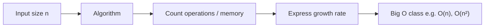
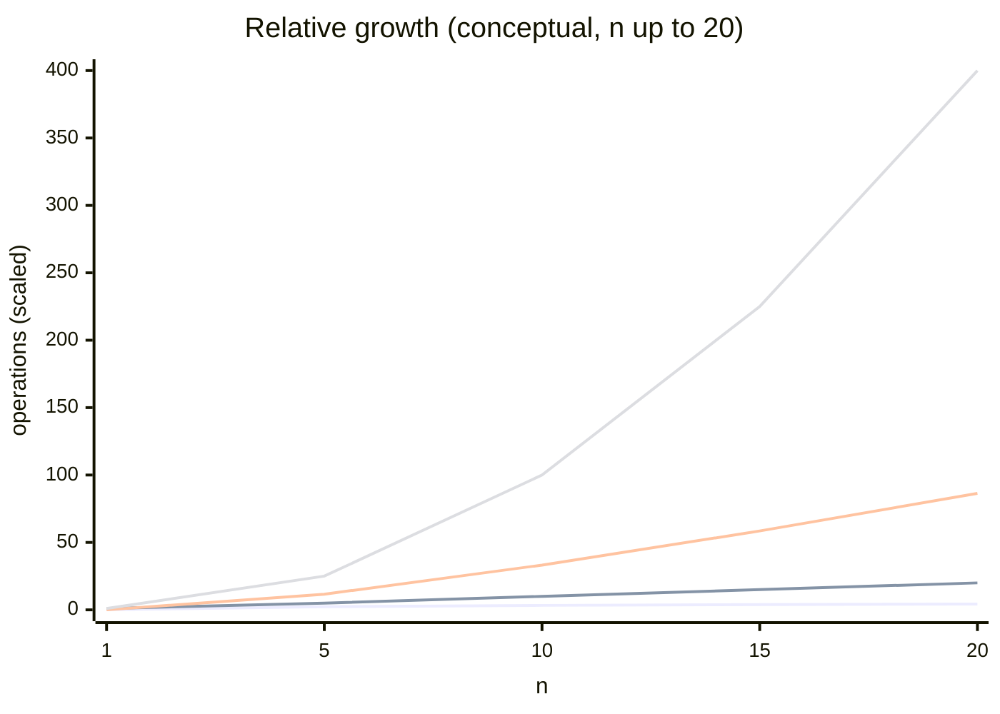
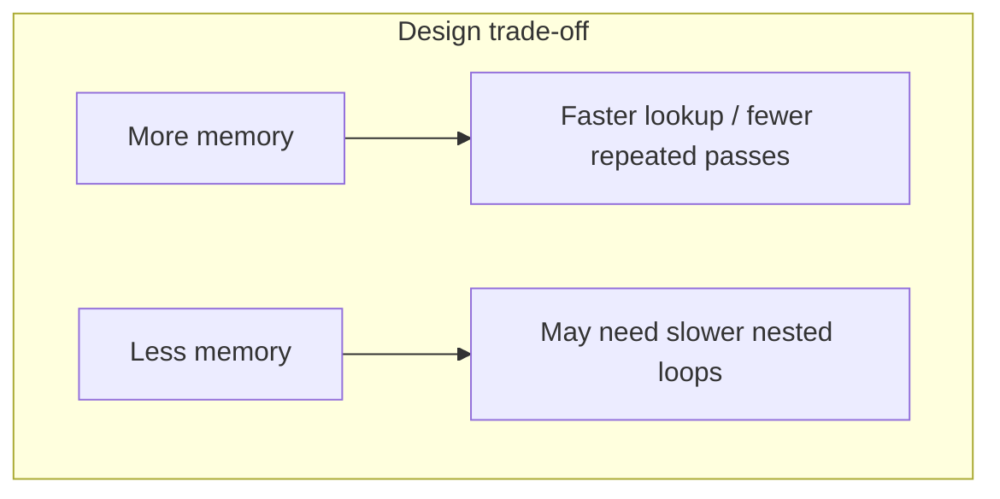

# DSA with C++ — Module 22 Notes

**Topic:** Time and space complexity — asymptotic analysis, Big O notation, standard growth classes, best/average/worst case, and how to read complexity graphs.  
**Companion code:** [a.cpp](a.cpp) and future files in this folder illustrate counting operations on sample algorithms. These notes explain *definitions* and *intuition*; use the `.cpp` files for runnable examples.

**Prerequisite:** Comfortable with loops, arrays, and basic algorithms from earlier modules (e.g. linear scan, binary search, sorting from Modules 11–13 and 21).

---

## Why complexity matters

When you compare two ways to solve the same problem, **wall-clock time** on one machine is misleading: CPU speed, compiler, and load all change the number. What stays useful is **how cost grows when input size grows**.

| Goal | What we measure |
|------|-----------------|
| **Time** | How the **number of elementary steps** (comparisons, assignments, loop iterations) grows with input size. |
| **Space** | How much **extra memory** the algorithm needs as input size grows. |

An algorithm is **more efficient** than another if, for large enough inputs, it uses **less time** and/or **less space** in this asymptotic sense — not because it happened to run faster once on a small test case.

Throughout this module, **`n`** denotes **input size**: length of an array, number of nodes in a list, number of digits in a number, number of edges in a graph, etc. We usually assume **`n` is large** when we ask “which algorithm scales better?”

---

## Order complexity analysis (asymptotic analysis)

**Order complexity analysis** (also called **asymptotic analysis**) describes efficiency **in terms of growth rate** as `n → ∞`.

| Measure | Name | Question it answers |
|---------|------|---------------------|
| **Time** | **Time complexity** | As `n` increases, how does the **work** (operations) increase? |
| **Space** | **Space complexity** | As `n` increases, how does **memory usage** increase? |

We express answers using **Big O notation** (and sometimes Ω, Θ in advanced courses). This module focuses on **Big O** for **upper bounds** on growth — “at most this fast.”

**Important:** Time complexity is **not** “3 seconds on my laptop.” It is a **function of `n`** (e.g. proportional to `n`, `n²`, `log n`) that describes **scaling behavior**.



---

## Time complexity — definition

**Time complexity** is the amount of work an algorithm performs, expressed as a function of input size `n`, in the **asymptotic** sense.

| Idea | Detail |
|------|--------|
| **Input grows** | Double the array length, add more graph nodes, etc. |
| **Work responds** | Count how comparisons, loop iterations, or recursive calls grow. |
| **Ignore machine details** | Same algorithm is O(n) on any reasonable machine; constant factors differ. |

**Example (conceptual):** Scanning an array once to find a maximum touches each element about once → work grows **linearly** with `n` → **O(n)** time.

---

## Space complexity — definition

**Space complexity** is how much **memory** an algorithm needs as a function of `n`.

| Type | Meaning |
|------|---------|
| **Auxiliary space** | **Extra** memory beyond the input (new arrays, recursion stack, hash table). This is what people usually mean by “space complexity” of the algorithm. |
| **Total space** | Input storage **plus** auxiliary space. Sometimes written separately: “O(n) input, O(1) auxiliary.” |

| Idea | Detail |
|------|--------|
| **In-place** | Uses **O(1)** auxiliary space (only a few variables); may still reorder the **input** array. |
| **Recursion** | Each call uses stack space; depth `d` often adds **O(d)** auxiliary space. |

**Example:** Merge sort needs a temporary array of size about `n` → **O(n)** auxiliary space. Quick sort’s partition step uses **O(1)** extra variables, but recursion stack can be **O(log n)** or **O(n)** depending on splits (see Module 21).

---

## Big O notation — rules and common mistakes

**Big O** describes an **upper bound** on growth (up to constant factors) for large `n`.

### What we keep and what we drop

| Rule | Example |
|------|---------|
| **Drop constant multipliers** | `3n + 100` → **O(n)** |
| **Drop lower-order terms** | `n² + 5n + 20` → **O(n²)** |
| **Keep the dominant term** | The term that grows fastest as `n` → ∞ |

### Correction: there is no separate “O(3)” or “O(100)”

Constants are **not** written as their own Big O class for fixed overhead.

| Wrong habit | Correct statement |
|-------------|-------------------|
| “This is O(3)” or “O(100)” | **O(1)** — constant time |
| “O(5n)” vs “O(n)” | Both are **O(n)**; the `5` is ignored in Big O |

So when notes say “constant time can be O(3), O(5)…”, the **right** idea is: the work is **bounded by a fixed number** of steps that **does not depend on `n`**. We always write that as **O(1)**, not O(3).

### Multiple inputs

If two sizes matter (e.g. `n` rows and `m` columns), complexity may be **O(n·m)**, **O(n + m)**, etc. State what each symbol means.

### Best, average, and worst case (time)

| Case | Meaning |
|------|---------|
| **Best case** | Minimum work over **all** inputs of size `n` (often optimistic). |
| **Worst case** | Maximum work over **all** inputs of size `n` (usual for guarantees). |
| **Average case** | Expected work over a **distribution** of inputs (needs a model of “random” input). |

**Example — linear search for a target in an array of size `n`:**

| Case | When | Time |
|------|------|------|
| Best | Target is at index 0 | **O(1)** |
| Worst | Target absent or at last index | **O(n)** |
| Average (uniform position) | Target equally likely anywhere | **O(n)** |

For interviews and design, **worst-case time** is cited most often unless the problem specifies otherwise.

---

## Standard time complexity classes (with graphs)

Below: **horizontal axis** = input size `n`, **vertical axis** = work or memory (relative units). Curves show **shape of growth**, not exact constants.

### Growth comparison (overview)

For large `n`, from **slowest growing** to **fastest growing** among common classes:

```
O(1) < O(log n) < O(n) < O(n log n) < O(n²) < O(n³) < O(2ⁿ) < O(n!)
```



*(For very large `n`, exponential and factorial curves dwarf everything else; they are omitted from the chart above so smaller classes remain visible.)*

---

### 1. Constant time — **O(1)**

**Definition:** The number of operations is **bounded by a fixed constant** that does **not** grow with `n`.

| Property | Detail |
|----------|--------|
| **As `n` increases** | Work stays (asymptotically) the same. |
| **Typical operations** | Access `arr[i]`, push/pop at end of vector (amortized O(1) for dynamic array), arithmetic on a few variables. |

**Examples:**

- Read the first or last element of an array.
- Find the **minimum of a sorted array** → always `arr[0]` → **one** access, **O(1)** (the fact that the array is long does not change the number of steps).
- Swap two variables, update a counter, hash table lookup **average** case (treated as O(1) in standard models).

**Graph — work vs `n`:**

```
work
  |     ___________________________  O(1)
  |
  +-----------------------------------> n
```

---

### 2. Logarithmic time — **O(log n)**

**Definition:** Each step **reduces** the problem size by a **constant factor** (often half), so the number of steps grows like **log₂ n** (base is omitted in Big O).

| Property | Detail |
|----------|--------|
| **Doubling `n`** | Adds only **one** more step (e.g. one more halving). |
| **Typical pattern** | Binary search, balanced tree height, exponentiation by squaring. |

**Example:** Binary search on a sorted array of size `n` — halve the search range each time → about **log₂ n** iterations → **O(log n)**. (Module 11.)

**Graph:**

```
work
  |              ****
  |          ****
  |      ****
  |  ****
  +-----------------------------------> n
        (slow increase — logarithmic)
```

**Intuition table:**

| n | ≈ log₂ n (halving steps) |
|---|--------------------------|
| 8 | 3 |
| 1,024 | 10 |
| 1,000,000 | ~20 |

---

### 3. Linear time — **O(n)**

**Definition:** Work grows **in proportion to `n`** — roughly a **constant amount of work per element**.

| Property | Detail |
|----------|--------|
| **Doubling `n`** | About **doubles** the work. |
| **Typical pattern** | Single loop over all `n` elements, linear scan, one pass merge of two lists totaling `n`. |

**Examples:** Find max/min in unsorted array, count frequencies in one pass, print all elements.

**Graph:**

```
work
  |                        /
  |                      /
  |                    /
  |                  /
  +-----------------------------------> n
              straight line — O(n)
```

---

### 4. Linearithmic time — **O(n log n)**

**Definition:** Work is **O(n)** times an **O(log n)** factor — very common in efficient comparison sorts and divide-and-conquer.

| Property | Detail |
|----------|--------|
| **Typical pattern** | **log n** levels of recursion, **O(n)** work per level (merge sort, heap sort, average quick sort). |
| **Comparison** | Much better than **O(n²)** for large `n`; slightly worse than **O(n)**. |

**Examples:** Merge sort, heap sort; `std::sort` is typically **O(n log n)** average.

**Graph:**

```
work
  |                    ****
  |                ****
  |            ****
  |        ****
  +-----------------------------------> n
        between linear and quadratic
```

---

### 5. Quadratic time — **O(n²)**

**Definition:** Work grows like **n²** — often **nested loops** each running about `n` times.

| Property | Detail |
|----------|--------|
| **Doubling `n`** | Roughly **quadruples** the work. |
| **Typical pattern** | All pairs `(i, j)`, simple comparison sorts (bubble, selection, insertion in worst/average). |

**Examples:** Bubble sort, selection sort, insertion sort (worst case), print all pairs in an array.

**Graph:**

```
work
  |                          *
  |                        *
  |                      *
  |                    *
  |                  *
  +-----------------------------------> n
              parabola — O(n²)
```

---

### 6. Cubic time — **O(n³)**

**Definition:** Work grows like **n³** — often **three nested loops** over `n`.

**Examples:** Naive matrix multiplication of two `n×n` matrices with three nested loops; checking all triples `(i, j, k)`.

**Graph:** Steeper than quadratic; becomes impractical for large `n` quickly.

```
work
  |                              *
  |                            *
  |                          *
  |                        *
  +-----------------------------------> n
```

---

### 7. Exponential time — **O(2ⁿ)** (and similar bases)

**Definition:** Work **doubles** (or multiplies by a constant base) when `n` increases by 1 — common in **brute-force** subsets and naive recursion without memoization.

**Examples:** Generate all subsets (2ⁿ choices), naive Fibonacci recursion tree size ~ O(2ⁿ) without caching.

**Graph:**

```
work
  |                                    *
  |                                  *
  |                                *
  |                              *
  |                            *
  +-----------------------------------> n
        explosive — unusable for large n
```

---

### 8. Factorial time — **O(n!)**

**Definition:** Work grows faster than any exponential with base 2 — common in **all permutations** brute force.

**Example:** Traveling salesman by trying every permutation of cities (~ **n!** orderings).

**Use:** Only tiny `n` (e.g. `n ≤ 10–12` in practice for naive approaches).

---

## Master comparison table

| Complexity | Name | Doubling `n` (rough effect) | Typical use |
|------------|------|-----------------------------|-------------|
| **O(1)** | Constant | Same order of work | Index access, fixed updates |
| **O(log n)** | Logarithmic | +constant steps | Binary search, balanced trees |
| **O(n)** | Linear | ~2× work | Single pass, linear search |
| **O(n log n)** | Linearithmic | ~2× × log factor | Efficient sorting |
| **O(n²)** | Quadratic | ~4× work | Nested loops, simple sorts |
| **O(n³)** | Cubic | ~8× work | Triple nested loops |
| **O(2ⁿ)** | Exponential | Work × ~2 | Subsets, naive recursion |
| **O(n!)** | Factorial | Explodes | Permutations brute force |

### “Which is better?” for large `n`

```
Faster (preferred)  ──────────────────────────────────────►  Slower (avoid for large n)

O(1) → O(log n) → O(n) → O(n log n) → O(n²) → O(n³) → O(2ⁿ) → O(n!)
```

**Numeric intuition** (same `n`, relative scale only):

| n | O(log n) | O(n) | O(n log n) | O(n²) |
|---|----------|------|------------|-------|
| 10 | ~3 | 10 | ~33 | 100 |
| 1,000 | ~10 | 1,000 | ~10,000 | 1,000,000 |
| 1,000,000 | ~20 | 1,000,000 | ~20,000,000 | 10¹² |

---

## Space complexity classes (summary)

Space uses the **same Big O classes** as time, but counts **memory locations** (or stack frames), not comparisons.

| Class | Example |
|-------|---------|
| **O(1)** | A few variables; in-place swap; iterative binary search. |
| **O(log n)** | Recursion depth `log n` (balanced binary search recursion). |
| **O(n)** | Copy of array, frequency table of size `n`, merge sort temp buffer. |
| **O(n²)** | 2D `n×n` table built by the algorithm (e.g. DP table). |

**Time–space trade-off:** Sometimes you use **extra O(n) memory** (hash set, prefix array) to reduce time from **O(n²)** to **O(n)**.



---

## How to analyze code (step-by-step)

Use this checklist without writing full code in these notes — apply it when reading [a.cpp](a.cpp) or any program.

| Step | Action |
|------|--------|
| 1 | Identify **input size** `n` (and `m` if multiple dimensions). |
| 2 | Count **loops**: single loop over `n` → often **O(n)**; nested `k` loops each `n` → often **O(nᵏ)**. |
| 3 | **Divide and conquer**: depth × work per level (Module 21 merge/quick sort). |
| 4 | **Recursion**: tree depth and work per node. |
| 5 | **Drop constants** and lower-order terms; state **best / worst / average** if they differ. |
| 6 | For space, count **extra** structures and **recursion stack depth**. |

### Quick loop patterns

| Pattern | Time (typical) |
|---------|----------------|
| One loop `i = 0 .. n-1` | O(n) |
| Two nested loops, each `n` | O(n²) |
| Outer `n`, inner halving `j` | O(n log n) |
| Loop `i = 1; i < n; i *= 2` | O(log n) |

---

## Diagram: one picture for time classes

```
relative work (log scale feeling)
  |
  |                                              n!  *
  |                                            2^n *
  |                                         n³ *
  |                                    n² *
  |                              n log n *
  |                         n *
  |                    log n *
  |  1  __________________________________________________
  +--------------------------------------------------------> n
```

---

## Connecting to earlier modules

| Topic | Module | Typical complexity |
|-------|--------|-------------------|
| Linear search | Earlier arrays | Time **O(n)**, space **O(1)** |
| Binary search | 11 | Time **O(log n)**, iterative space **O(1)** |
| Bubble / selection / insertion sort | 13 | Time **O(n²)**, space **O(1)** |
| Merge sort | 21 | Time **O(n log n)**, space **O(n)** |
| Quick sort | 21 | Time **O(n log n)** average, **O(n²)** worst; partition space **O(1)** |

Complexity analysis is the language you use to **justify** these choices and to predict behavior on **large** inputs.

---

## Key takeaways

| # | Point |
|---|--------|
| 1 | **`n` is input size**; complexity describes **growth**, not seconds on one machine. |
| 2 | **Time** = how operations grow; **space** = how **auxiliary** memory grows. |
| 3 | **Big O** drops constants and lower terms; **O(1)** means constant, not “O(3)”. |
| 4 | Know the **ordering** of common classes and **best / average / worst** when they differ. |
| 5 | Use **graphs** to remember shape: flat (O(1)), slow rise (log), line (n), between line and parabola (n log n), parabola (n²), explosion (2ⁿ, n!). |
| 6 | Analyze by **loops**, **recursion depth**, and **extra arrays**; link practice to companion `.cpp` files. |

---

**Next steps:** Work through examples in [a.cpp](a.cpp) — count operations on paper, assign a Big O class, and check best vs worst case. In later modules, complexity analysis extends to trees, graphs, and dynamic programming tables using the same rules.
