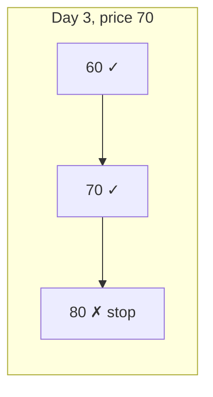
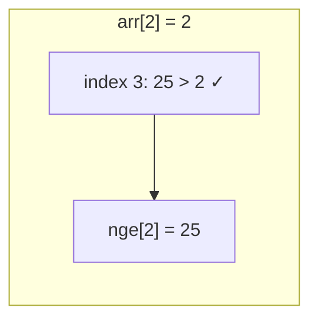
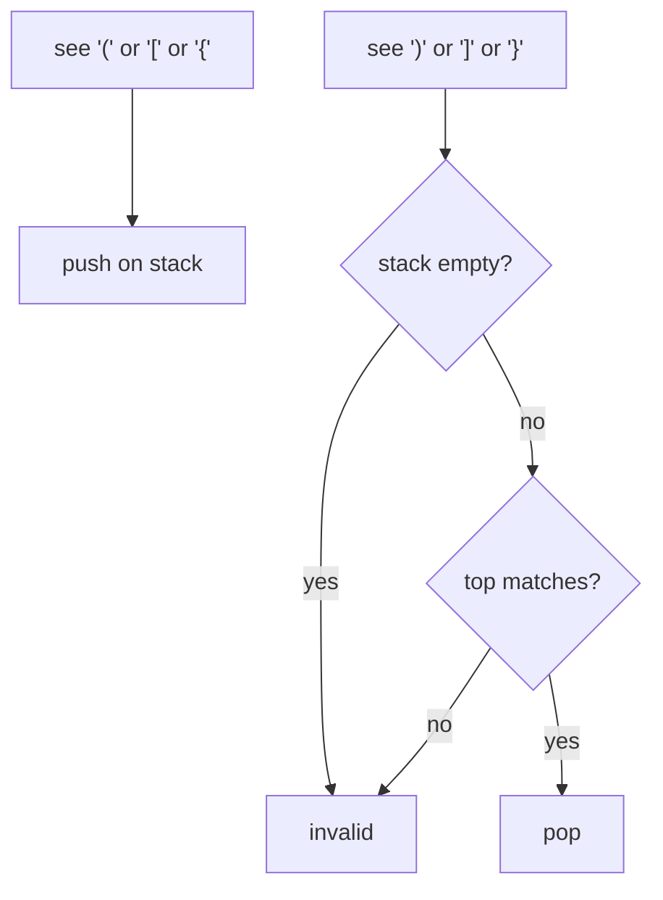

# MODULE 25 — Stack

**Illustration code:** `a.cpp` (stack + bucket model) · `b.cpp` (LIFO order trace) · `c.cpp` (stack with `std::vector`) · `d.cpp` (templated `Stack<T>`) · `e.cpp` (stack with linked list) · `f.cpp` (`std::stack` in the STL) · `g.cpp` (push at bottom) · `h.cpp` (reverse a string with stack) · `i.cpp` (reverse a stack, recursion) · `j.cpp` (stock span problem) · `k.cpp` (next greater element) · `l.cpp` (valid parentheses) · `m.cpp` (duplicate parentheses) · `n.cpp` (max area in histogram)

---

## What is a stack?

A **stack** is a linear data structure where you only add or remove elements from **one end**. That end is usually called the **top** of the stack.

Think of it like a **bucket** or a **stack of plates** in the kitchen:

- You always put a new plate on **top** of the pile.
- You always take the next plate from the **top** as well.
- You do **not** pull a plate from the middle without lifting everything above it first.

So the stack follows **LIFO** (Last In, First Out): the last thing you pushed is the first one you pop.

---

## “Static” picture in memory

In code, a stack is often built on a **fixed block of memory** (for example, a C-style array of fixed size). You can imagine that block as a **bucket** with a fixed number of slots:

- Memory is laid out in a row: index `0`, `1`, `2`, … up to `capacity - 1`.
- A variable (often called `top` or `sp` for “stack pointer”) remembers **how full** the bucket is: it points at the position **above** the last stored element, or at the index where the **next** push will go.

Nothing “allocates” a new cell for each push in the simple array version: you reuse the same bucket and only move the logical “top” index. That is the sense in which it feels **static**—one pre-sized region of memory, used in a disciplined way.

---

## Three main operations

| Operation | Meaning |
|-----------|---------|
| **Push(x)** | Put `x` on top of the stack (if there is room). |
| **Pop()** | Remove the element on top (if the stack is not empty). |
| **Top()** | Read the element on top **without** removing it (if not empty). |

In a correct implementation with a fixed-size array backing:

- **Push** writes at the current top index and advances the top.
- **Pop** moves the top back by one (the old value may still sit in memory but is no longer “in” the stack).
- **Top** returns the value at the last pushed position.

---

## Time complexity

**Push**, **Pop**, and **Top** each do a **constant** amount of work: a few index updates and maybe one assignment or read. So each operation runs in **O(1)** time—**constant time**—as long as you do not count growing the underlying storage (in `a.cpp` we use a fixed capacity, so every operation is truly O(1)).

---

## When stacks are useful

- Undo/redo, parsing expressions, matching brackets.
- Depth-first traversal, function call stack (the language runtime uses a stack for calls and locals).
- Converting recursion to iteration by explicitly storing “where to continue” on a stack.

Run `a.cpp` and follow the printed steps to see push, top, and pop in order.

---

## LIFO — Last In, First Out

**Illustration code:** `b.cpp`

**LIFO** is the ordering rule behind a stack (and behind anything that behaves like a one-ended pile).

- **Last in** — the item you most recently **pushed** sits at the **top**.
- **First out** — when you **pop**, that newest item leaves **before** anything that arrived earlier.

So removal order is the **reverse** of insertion order:

| Push order (in) | Pop order (out) |
|-----------------|-----------------|
| 1st → A | Last popped |
| 2nd → B | Middle |
| 3rd → C | **First** popped |

If you push `A`, then `B`, then `C`, the first `pop` gives `C`, then `B`, then `A`. The **last** pushed (`C`) is the **first** removed — hence **LIFO**.

Contrast with **FIFO** (First In, First Out), used by a **queue**: a line at a counter where the person who arrived first is served first.

Stacks are not “unfair”; they are defined to behave this way so algorithms can rely on **nested** or **nested-and-unwind** structure (e.g. matching brackets, undo, returning from the most recent function call first).

Run `b.cpp` to print a step-by-step trace of pushes and pops so you can read the order of values leaving the stack.

---

## Implementing a stack with `std::vector`

**Illustration code:** `c.cpp`

Instead of a **fixed-size array**, you can back the stack with a **`std::vector`**. The vector still stores elements in a contiguous row; the stack still only uses **one end** as the top.

| Stack idea | `std::vector` member / idiom |
|------------|------------------------------|
| Push on top | `push_back(x)` — append at the back |
| Pop from top | `pop_back()` — remove the last element |
| Read top | `back()` — reference to the last element |
| Empty? | `empty()` |
| How many? | `size()` |

**Why use a vector?** The stack **grows** as needed (until memory runs out). You do not pick `CAPACITY` up front. The trade-off is that `push_back` may occasionally **reallocate** when capacity is full; each push is still **amortized O(1)** time in typical use, which is good enough for the same stack algorithms.

**Class design in `c.cpp`:** A small `Stack` class wraps a private `vector` and exposes **`push`**, **`pop`**, **`top`**, **`empty`**, **`size`**, and **`clear`** so the outside world only talks in stack terms (no random access to the middle). `main` pushes and pops integers and prints state so you can follow the behavior.

Run `c.cpp` to see the same LIFO behavior with a dynamic backing store.

---

## Stack as a class template (`Stack<T>`)

**Illustration code:** `d.cpp`

In `c.cpp`, the stack is hard-coded to **`int`**. Often you want **one implementation** that works for **`double`**, **`string`**, **`char`**, or your own **`struct`**.

A **class template** lets you name a **placeholder type** (usually written **`T`**) and write the class once:

```cpp
template <typename T>
class Stack {
    std::vector<T> data;
    // ...
};
```

When you write **`Stack<int>`** or **`Stack<std::string>`**, the compiler **generates** a concrete class by substituting `T` with that type. The stored type is not a “runtime variable”; it is fixed **per instantiation** at compile time.

**Backing store:** Same as `c.cpp` — a **`std::vector<T>`** with **`push_back`** / **`pop_back`** / **`back`**.

**Requirements:** Any type `T` you store must be **assignable** and **copyable or movable** in the ways your `Stack` uses (here: default constructible for the empty-`top()` demo path, and streamable with **`<<`** if you use `print()`). `int`, `double`, `std::string`, etc. satisfy this.

`d.cpp` defines **`template <typename T> class Stack`** and in **`main`** uses **`Stack<int>`** and **`Stack<std::string>`** so you can see the same API with different element types.

Run `d.cpp` to compare stacks of integers and strings built from one template.

---

## Stack using a linked list

**Illustration code:** `e.cpp`

So far, the stack’s storage is either a **contiguous array** / **`vector`** (one block, index or pointer arithmetic at the back). Another classic approach is a **singly linked list** where each element lives in its own **node**: a small struct with **`data`** and a **`next`** pointer to the following node.

**Top at the head:** Treat the **head** of the list as the **top** of the stack.

- **Push** — allocate a new node, point it to the current head, then make head the new node. **O(1)** time.
- **Pop** — unlink the head node, `delete` it, move head to the next node. **O(1)** time.
- **Top** — read `head->data`. **O(1)** time.

No `capacity` field and no `reallocate` like a vector: growth is **one node per push**. Downsides: **extra memory** per item for the pointer, and nodes may be **scattered** in the heap (worse cache locality than a vector). Upsides: true **O(1)** push/pop without amortized reallocation, and lists are how stacks are taught next to sequential storage.

**Ownership:** Every `new` from `push` must be matched with **`delete`** on `pop` and when clearing the stack. The class **destructor** should free all nodes (e.g. by calling **`clear()`**). This demo **deletes** copy construction and copy assignment so we do not have to implement deep copy; production code would add copy/move operations or use `std::unique_ptr`.

`e.cpp` defines a **`Stack`** of **`int`** with **`push`**, **`pop`**, **`top`**, **`empty`**, **`size`**, **`clear`**, and **`print`** (walking from the head lists values **top → bottom**, i.e. the order you would pop), then **`main`** exercises the same LIFO behavior as the vector-based stack.

Run `e.cpp` to see a linked-list-backed stack in action.

---

## Stack in the C++ standard library (`std::stack`)

**Illustration code:** `f.cpp`

The language ships a ready-made adapter: **`std::stack`**, declared in the **`<stack>`** header. Include it when you want a LIFO stack without writing your own list or vector wrapper.

```cpp
#include <stack>
```

**Type:** `std::stack<T, Container>` — by default **`Container`** is **`std::deque<T>`**. You can pass a different **sequence container** that supports **`push_back`**, **`pop_back`**, and **`back`**, for example **`std::vector<T>`** or **`std::list<T>`**. The stack only exposes **top / push / pop** behavior; it does not let you iterate the middle (that is by design).

**Common members:**

| Member | Role |
|--------|------|
| **`push(x)`** | Push `x` on top |
| **`pop()`** | Remove top (returns **`void`** — use **`top()`** first if you need the value) |
| **`top()`** | Reference to the top element |
| **`empty()`**, **`size()`** | Query state |

There is **no** **`clear()`** member. To empty a stack, **`pop()`** in a loop or assign a **default-constructed** `std::stack` (see `f.cpp`).

**When to use it:** Competitive code, prototypes, and any problem that is naturally LIFO. When you need traversal or custom allocation, use your own structure (like `e.cpp`) or a **`deque`** / **`vector`** directly.

Run `f.cpp` to see **`std::stack<int>`** and **`std::stack<int, std::vector<int>>`** used from `<stack>`.

---

## Push at the bottom of a stack

**Illustration code:** `g.cpp`

A normal stack only supports **push at the top**. Sometimes you need **`pushAtBottom(stack, value)`**: insert `value` so it becomes the **bottom** element (the one that would be popped **last**), and every existing element moves one position “up” toward the top.

Example: stack bottom → top is `1, 2, 3` (3 on top). After **`pushAtBottom(s, 0)`**, bottom → top should be **`0, 1, 2, 3`**.

You cannot reach the bottom directly. The classic fix uses **recursion** and only **top / pop / push**:

1. If the stack is **empty**, **`push(value)`** — that value is the bottom.
2. Otherwise **pop** the top into a variable, call **`pushAtBottom(s, value)`** on the smaller stack, then **push** the saved top back.

That unwinds so the new value ends up under everything that was already there.

**Complexity:** **O(n)** time for `n` elements on the stack, and **O(n)** extra space from the recursion depth (same order as the number of pops).

### Pass by value vs pass by reference (STL containers)

In C++, function parameters like **`std::stack<int> s`** or **`std::vector<int> v`** are **passed by value** unless you say otherwise: the function gets a **copy**. Changes to that copy do **not** affect the caller’s stack.

For **`pushAtBottom`**, you must modify the **original** stack, so the parameter is **`std::stack<int>& s`** (pass by **reference**). Read-only inspection can use **`const std::stack<int>&`**.

| Parameter style | Effect |
|-----------------|--------|
| `stack<int> s` | Copy; caller unchanged |
| `stack<int>& s` | Alias; caller sees pushes/pops |
| `const stack<int>& s` | Read-only alias |

`g.cpp` defines **`void pushAtBottom(stack<int>& s, int value)`** and uses **`stack<int>&`** where the stack must change. For printing without destroying the original, a **copy** is passed by value on purpose.

Run `g.cpp` to trace **`pushAtBottom`** on an STL stack.

---

## Reverse a string using a stack

**Illustration code:** `h.cpp`

**Goal:** Turn `"hello"` into `"olleh"` by using only stack operations (push from the string, pop into the answer).

### Algorithm

1. **Push** every character of the string onto a stack, **left to right** (index `0`, then `1`, …, `n - 1`).
2. **Pop** until the stack is empty and append each popped character to a new string (or print them).

Because a stack is **LIFO**, the **last** character pushed is the **first** popped. That is exactly the reverse of the push order.

### The “math” (why it reverses)

Let the string have length **`n`** and characters **`s[0], s[1], …, s[n-1]`**.

After the push loop, the **top** of the stack is **`s[n-1]`**, then below it **`s[n-2]`**, …, bottom **`s[0]`**.

Pop order:

| Step | Popped | Becomes next char of reversed string |
|------|--------|--------------------------------------|
| 1 | `s[n-1]` | 1st |
| 2 | `s[n-2]` | 2nd |
| … | … | … |
| n | `s[0]` | n-th |

So the output string is **`s[n-1]s[n-2]…s[0]`**, which is the **reverse** of the original.

**Small example:** `s = "hello"` (`n = 5`)

- Push: `h, e, l, l, o` → stack top is `'o'`.
- Pop: `o, l, l, e, h` → **`"olleh"`**.

### Time complexity

Let **`n = s.length()`**.

- **Push loop:** `n` iterations, **O(1)** push each → **O(n)**.
- **Pop loop:** `n` iterations, **O(1)** pop each → **O(n)**.

**Total time: O(n)** (linear in the length of the string).

### Space complexity

The stack holds up to **`n`** characters at once (all of them before you start popping).

**Extra space: O(n)** for the stack. (The output string also needs **O(n)** if you store it; that is the reversed result itself, not “hidden” auxiliary work beyond the answer.)

### Note

Reversing a string can also be done in **O(n)** time with two pointers and **O(1)** extra space (`swap` ends inward). The stack version is a standard way to **practice LIFO**; use it when the problem expects a stack or when you are chaining stack-based steps.

`h.cpp` uses **`std::stack<char>`** and **`reverseWithStack(const string& s)`**.

Run `h.cpp` to see the original string, the stack trace idea, and the reversed result.

---

## Reverse a stack (recursion, no extra container)

**Illustration code:** `i.cpp`

**Goal:** Flip the order inside one stack **in place**. If bottom → top is **`1, 2, 3`** (3 on top), after reversing bottom → top should be **`3, 2, 1`** (1 on top).

**Constraint (as in the course):** Do **not** use another stack, vector, or array to hold elements. Only **`pop` / `push`** on the same stack, plus **recursion**.

### Idea (two helpers)

1. **`pushAtBottom(s, x)`** (from `g.cpp`) — insert `x` at the **bottom** using recursion.
2. **`reverseStack(s)`**:
   - If `s` is empty, return.
   - Save **`x = top()`**, **`pop()`**.
   - **`reverseStack(s)`** on the smaller stack.
   - **`pushAtBottom(s, x)`** so `x` goes to the bottom of the already-reversed rest.

On the way **down** the recursion you **strip** the stack; on the way **up** each value is placed at the **bottom**, which builds the reversed order.

### Small trace

Start: bottom `1`, top `3` (push order 1, 2, 3).

| Step | Action | Stack (bottom → top) |
|------|--------|----------------------|
| | pop 3, recurse | 1, 2 |
| | pop 2, recurse | 1 |
| | pop 1, recurse | empty |
| unwind | pushAtBottom(1) | 1 |
| unwind | pushAtBottom(2) | 2, 1 |
| unwind | pushAtBottom(3) | 3, 2, 1 |

Top is now **1**; the old bottom **1** is now on top — order reversed.

### Time complexity

Let **`n`** be the number of elements.

- Each **`pushAtBottom`** costs **O(k)** when the stack has size **`k`**.
- **`reverseStack`** calls **`pushAtBottom`** once per element: **O(n) + O(n-1) + … + O(1) = O(n²)**.

So this recursive method is **correct** and uses **no extra container**, but it is **slower** than copying into another stack (**O(n)**) or reversing an array with two pointers (**O(n)**).

### Space complexity

- **No** second stack / vector: **O(1)** auxiliary **container** space.
- The **recursion** depth is **`n`**, so **O(n)** space on the **call stack** (implicit storage while pops are “held” in frames).

That matches “no extra space” in interview/course wording: no explicit extra DS; recursion stack is allowed.

`i.cpp` implements **`pushAtBottom`**, **`reverseStack`**, and prints bottom → top before and after.

Run `i.cpp` to reverse an STL stack with only recursion and **`pushAtBottom`**.

---

## Stock span problem

**Illustration code:** `j.cpp`

### Problem statement

You are given an array **`price[]`** where **`price[i]`** is the stock price on **day `i`** (0-based), for **`n`** consecutive days.

For **each day `i`**, compute **`span[i]`**:

> **`span[i]`** = maximum number of **consecutive days ending at day `i`** (always **including day `i`**) such that on every day `j` in that range, **`price[j] ≤ price[i]`**.

In words: walk **backward** from today while prices stay **at or below** today’s price; count how many days you can include (today counts as 1).

**Output:** an array **`span[0 … n-1]`** of the same length as **`price`**.

### Example

`price = [100, 80, 60, 70, 60, 75, 85]`

| Day `i` | Price | Valid stretch (prices ≤ today) | `span[i]` |
|--------:|------:|--------------------------------|----------:|
| 0 | 100 | {100} | 1 |
| 1 | 80 | {80} (100 > 80) | 1 |
| 2 | 60 | {60} | 1 |
| 3 | 70 | {60, 70} | 2 |
| 4 | 60 | {60} | 1 |
| 5 | 75 | {60, 70, 60, 75} | 4 |
| 6 | 85 | all seven days | 6 |

**Answer:** `span = [1, 1, 1, 2, 1, 4, 6]`

### Picture (bar view)

Think of each price as a bar; for day **`i`**, span is how many bars you can cover going left **without** passing a bar **taller** than today’s bar.

```text
Day:     0    1    2    3    4    5    6
Price: 100  80   60   70   60   75   85
        |    |    |    |    |    |    |
        █    █    █    █    █    █    █   (heights ∝ price)

Day 3 (70):  ←── 60, 70  ──→  span = 2  (stop before 80)
Day 5 (75):  ←── 60,70,60,75 ──→  span = 4  (stop before 80 at day 1)
Day 6 (85):  ←── entire week ──→  span = 6
```



### Naive idea (slow)

For each **`i`**, walk **`j = i, i-1, …`** while **`price[j] ≤ price[i]`** and count.

- **Time:** **O(n²)** worst case (e.g. increasing prices).
- **Space:** **O(1)** extra.

### Stack algorithm (efficient)

Maintain a stack of **indices** of days whose prices form a **decreasing sequence** from bottom to top (monotonic stack).

For each day **`i`**:

1. **While** the stack is not empty and **`price[stack.top()] ≤ price[i]`**, **pop** (those days cannot be the “previous greater” for any future day after today’s bar).
2. If the stack is **empty** after pops → every earlier day is ≤ today → **`span[i] = i + 1`**.
3. Else → first day to the left with price **>** today is **`stack.top()`** →  
   **`span[i] = i - stack.top()`**
4. **Push `i`** onto the stack.

**Why it works:** After step 1, **`stack.top()`** is the nearest index **left of `i`** with **`price[stack.top()] > price[i]`**. All days between that index and **`i`** have price ≤ **`price[i]`**, so the consecutive stretch length is **`i - stack.top()`**. If the stack is empty, there is no taller bar on the left, so the stretch is **`i + 1`** days.

### Complexity

| | |
|--|--|
| **Time** | **O(n)** — each index is **pushed once** and **popped at most once** |
| **Space** | **O(n)** — stack size in the worst case (e.g. strictly decreasing prices) |

`j.cpp` implements **`vector<int> calculateSpan(const vector<int>& price)`** and prints **`price`** and **`span`** for the classic example.

Run `j.cpp` for the full trace on the sample array.

---

## Next greater element (NGE)

**Illustration code:** `k.cpp`

### Problem statement

Given an array **`arr[]`** of **`n`** elements, for **each index `i`** find the **next greater element** to the **right**:

> **`nge[i]`** = the **first** value **`arr[j]`** with **`j > i`** and **`arr[j] > arr[i]`**.

If no such **`j`** exists, **`nge[i] = -1`** (or use a sentinel your problem allows).

**Output:** array **`nge[0 … n-1]`** of the same length as **`arr`**.

**Contrast with stock span:** span looks **left** for consecutive days ≤ today; NGE looks **right** for the **first** value **strictly greater** than today.

### Example

`arr = [4, 5, 2, 25, 7, 23]`

| `i` | `arr[i]` | First greater on the right | `nge[i]` |
|----:|---------:|------------------------------|---------:|
| 0 | 4 | 5 (index 1) | 5 |
| 1 | 5 | 25 (index 3) | 25 |
| 2 | 2 | 25 (index 3) | 25 |
| 3 | 25 | none | -1 |
| 4 | 7 | 23 (index 5) | 23 |
| 5 | 23 | none | -1 |

**Answer:** `nge = [5, 25, 25, -1, 23, -1]`

### Picture (scan left → right)

```text
Index:  0   1   2    3    4   5
arr:    4   5   2   25    7  23
        |   |   |    |    |   |
        4──►5   2──►25   7──►23
            └──25      └──25
                         (25 has no greater to the right → -1)
```



For **`arr[2] = 2`**, the answer is **25** at index 3, not 7 or 23 — we need the **nearest** greater element to the right.

### Naive idea (slow)

For each **`i`**, scan **`j = i + 1, i + 2, …`** until **`arr[j] > arr[i]`**.

- **Time:** **O(n²)** worst case (e.g. sorted ascending — every element scans the rest).
- **Space:** **O(1)** extra.

### Monotonic stack (efficient)

Traverse **`i = 0 … n-1`**. Keep a stack of **indices** whose elements are still waiting for their “next greater” (stack stores indices with **decreasing** values from bottom to top).

For each **`i`**:

1. **While** stack not empty and **`arr[stack.top()] < arr[i]`**  
   → **`arr[i]`** is the next greater for **`stack.top()`** → set **`nge[stack.top()] = arr[i]`**, **pop**.
2. **Push `i`** (current index has not found its answer yet).

After the loop, indices still on the stack have **no** greater element to the right → **`nge[i] = -1`**.

**Why it works:** When we see **`arr[i]`**, it is the **first** value to the right that is greater than everything we pop from the stack (those indices are in order, and we only pop while strictly smaller). Each index is **pushed once** and **popped once**.

### Complexity

| | |
|--|--|
| **Time** | **O(n)** |
| **Space** | **O(n)** for the stack (worst case: decreasing array — every index waits on the stack) |

`k.cpp` implements **`vector<int> nextGreaterElement(const vector<int>& arr)`** and prints **`arr`** and **`nge`** for the sample above.

Run `k.cpp` for the monotonic-stack solution.

---

## Valid parentheses

**Illustration code:** `l.cpp`

### Problem statement

Given a string **`s`** containing only the characters **`'('`**, **`')'`**, **`'{'`**, **`'}'`**, **`'['`**, **`']'`**, determine whether **`s`** is **valid**:

1. Every opening bracket has a **matching** closing bracket of the **same type**.
2. Brackets close in the **correct order** (a closing bracket must match the **most recent** unmatched opener).

**Examples:**

| `s` | Valid? | Why |
|-----|--------|-----|
| `"()"` | yes | matched pair |
| `"()[]{}"` | yes | three separate pairs |
| `"(]"` | no | `(` matched with `]` |
| `"([)]"` | no | `[` closed only after `(` was closed wrongly |
| `"{[]}"` | yes | nested then closed |

### Why a stack?

Opening brackets must be closed in **reverse order** (LIFO). Push each opener; on a closer, the top of the stack must be its **partner**.

```text
"{ [ ( ) ] }"
  push { [ (
  see )  -> top is (  OK, pop
  see ]  -> top is [  OK, pop
  see }  -> top is {  OK, pop
  stack empty -> valid
```



### Algorithm

1. Create an empty stack (store opening chars, or map closers → openers).
2. For each character **`c`** in **`s`**:
   - If **`c`** is an **opener** → **push** `c`.
   - If **`c`** is a **closer** → if stack empty or **`c`** does not match **`stack.top()`**, return **false**; else **pop**.
3. After the loop, return **true** only if the stack is **empty** (no unmatched openers).

### Complexity

| | |
|--|--|
| **Time** | **O(n)** — one pass, **O(1)** work per character |
| **Space** | **O(n)** worst case — e.g. `"((((("` all openers on the stack |

`l.cpp` implements **`bool isValid(const string& s)`** and tests several strings.

Run `l.cpp` for valid / invalid examples.

---

## Duplicate parentheses

**Illustration code:** `m.cpp`

### Problem statement

Given a string **`exp`** representing an arithmetic expression with operands (letters/digits), operators **`+ - * /`**, and parentheses **`( )`**, return **true** if the expression contains **duplicate (redundant) parentheses**.

**Redundant** means there is a pair of brackets that wraps **nothing useful** — equivalently, a subexpression of the form **`( )`** with **no** operand or operator between the inner `(` and `)` when that `)` is processed, or extra wrapping like **`((a+b))`** where the outer pair adds no new structure.

**Examples:**

| Expression | Duplicate? |
|------------|------------|
| `(a+b)` | no |
| `((a+b))` | **yes** — outer `(( … ))` is redundant |
| `(a+(b)/c)` | no |
| `(a+(b+c))` | no |
| `((a+b)+c)` | no (operators between nested levels) |

### Idea (stack)

Scan left to right. Push **every** character (operands, operators, `(`).

When you see **`')'`**:

1. **Pop** and count until you pop the matching **`'('`**.
2. If **count == 0**, nothing was between that `(` and `)` → pattern like **`()`** or **`((…))`** where the inner close left nothing → **duplicate parentheses** → return **true**.
3. If count > 0, there was real content inside; continue.

```text
((a+b))
  push ( (
  push a + b
  )  -> pop until (: popped +, b, a  count=3  OK
  )  -> pop until (: count=0  DUPLICATE
```

### Algorithm

```
stack st
for c in exp:
  if c == ')':
    count = 0
    while st.top() != '(':
      st.pop(); count++
    st.pop()   // remove '('
    if count == 0: return true
  else:
    st.push(c)
return false
```

### Complexity

| | |
|--|--|
| **Time** | **O(n)** — each character pushed once, popped at most once |
| **Space** | **O(n)** — stack holds up to the whole expression |

`m.cpp` implements **`bool hasDuplicateParentheses(const string& exp)`** and prints results for sample expressions.

Run `m.cpp` for duplicate vs non-duplicate cases.

MAX AREA IN A HISTOGRAM -> n.cpp
