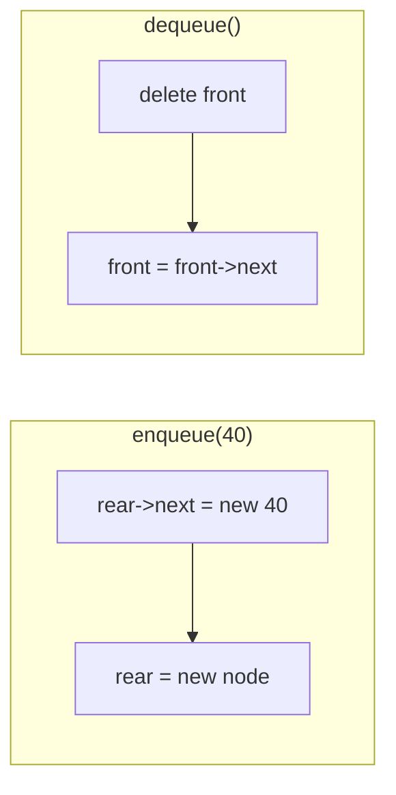
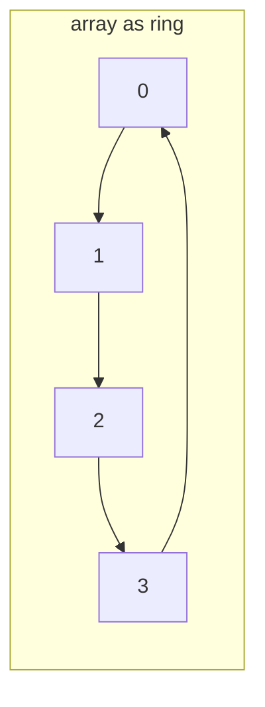
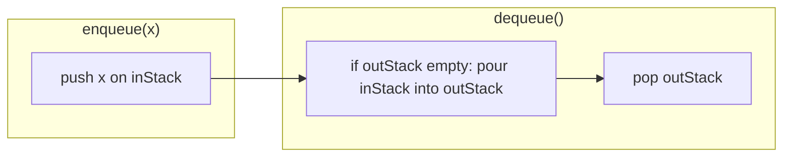

# MODULE 26 — Queue

**Illustration code:** `a.cpp` (circular array queue) · `b.cpp` (queue with linked list) · `c.cpp` (circular queue class) · `d.cpp` (`std::queue` in the STL) · `e.cpp` (queue using 2 stacks)

---

## What is a queue?

A **queue** is a linear data structure where you add elements at one end and remove them from the **other** end.

- **Enqueue** — insert at the **rear** (back of the line).
- **Dequeue** — remove from the **front** (front of the line).
- **Front** — look at the front element without removing it.

Think of a **line at a ticket counter** or a **printer job list**:

- The first person who joins the line is served **first**.
- New people always stand at the **rear**.

So a queue follows **FIFO** — **First In, First Out**: the oldest element leaves first.

---

## FIFO vs LIFO (stack)

| | **Stack** (Module 25) | **Queue** (Module 26) |
|--|----------------------|------------------------|
| Rule | **LIFO** — Last In, First Out | **FIFO** — First In, First Out |
| Add | **Push** on top | **Enqueue** at rear |
| Remove | **Pop** from top | **Dequeue** from front |
| Analogy | Stack of plates | Line at a counter |

```text
Enqueue 10, 20, 30  ->  front [ 10 | 20 | 30 ] rear
Dequeue             ->  removes 10 (first in)
```

---

## Array implementation (circular buffer)

In `a.cpp` we use a **fixed-size array** as a **circular queue**:

- **`front`** — index of the first element.
- **`rear`** — index where the **next** enqueue will write.
- **`count`** — how many elements are stored.

Enqueue writes at **`rear`**, then advances **`rear = (rear + 1) % CAPACITY`**.  
Dequeue reads at **`front`**, then advances **`front = (front + 1) % CAPACITY`**.

Wrapping lets us reuse slots at the start of the array after dequeues — no shifting of all elements.

```text
CAPACITY = 8

after enqueue 10, 20, 30:
  front -> [10][20][30][ _ ][ _ ]...
  rear points to next empty slot
```

---

## Main operations

| Operation | Meaning |
|-----------|---------|
| **Enqueue(x)** | Add `x` at the rear (if not full). |
| **Dequeue()** | Remove the front element (if not empty). |
| **Front()** | Read the front element without removing. |
| **Empty() / Full()** | Check state. |

With a circular array and fixed capacity, **enqueue**, **dequeue**, and **front** are **O(1)** time.

---

## When queues are useful

- **BFS** in graphs (process nodes in order discovered).
- **CPU / task scheduling**, print spoolers, message buffers.
- **Level-order** traversal in trees.
- Any problem that needs “handle the **oldest** waiting item first”.

Run `a.cpp` to see enqueue, front, and dequeue in FIFO order.

---

## Queue using a linked list

**Illustration code:** `b.cpp`

In `a.cpp` the queue lives in a **fixed array**. With a **singly linked list**, each value is a **node** (`data` + `next`). There is **no capacity limit** (until memory runs out).

### Two pointers: `front` and `rear`

| Pointer | Points to |
|---------|-----------|
| **`front`** | First node (next to **dequeue**) |
| **`rear`** | Last node (where we **enqueue**) |

```text
front                          rear
  |                              |
  v                              v
 [10] -> [20] -> [30] -> nullptr
```

- **Enqueue** — create a node, link **`rear->next = newNode`**, move **`rear`** forward. **O(1)** because we keep **`rear`**.
- **Dequeue** — remove **`front`**, advance **`front`**. If the list becomes empty, set **`rear = nullptr`** too. **O(1)**.
- **Front** — return **`front->data`**. **O(1)**.



**Important:** If you only stored **`front`** and enqueued by walking to the end of the list, each enqueue would be **O(n)**. Keeping **`rear`** makes enqueue **O(1)**.

### Operation names (same queue, two naming styles)

| Queue name | Same idea as | Where |
|------------|--------------|--------|
| **enqueue(x)** | **push(x)** (add at **rear**) | back of line |
| **dequeue()** | **pop()** (remove from **front**) | front of line |
| **front()** | peek first element | front of line |

Do **not** confuse with a **stack**: stack **push/pop** use one end only; queue **enqueue/dequeue** use **opposite** ends.

`b.cpp` implements **`enqueue` / `dequeue` / `front`** and aliases **`push` / `pop`** that call the same logic.

### Time complexity

| Operation | Time |
|-----------|------|
| **enqueue** / **push** | **O(1)** |
| **dequeue** / **pop** | **O(1)** |
| **front** | **O(1)** |
| **empty** / **size** | **O(1)** |

### Space complexity

- **O(n)** for **`n`** stored elements — one node per value, plus two pointers (`front`, `rear`).
- Each **`new`** on enqueue is matched with **`delete`** on dequeue; destructor frees any remaining nodes.

### vs array queue (`a.cpp`)

| | Array (`a.cpp`) | Linked list (`b.cpp`) |
|--|-----------------|------------------------|
| Capacity | Fixed **`CAPACITY`** | Grows with allocations |
| Enqueue / dequeue | **O(1)** | **O(1)** |
| Extra memory | No per-node pointer | Pointer per node |
| Locality | Contiguous (cache-friendly) | Nodes may be scattered |

Run `b.cpp` for a **`Queue`** class with linked-list **enqueue**, **dequeue**, and **front**.

---

## Circular queue (array implementation)

**Illustration code:** `c.cpp`

A **circular queue** stores elements in a **fixed-size array** but treats the array as a **ring**: after the last index, the next slot is index **0** again.

### Why circular?

A **naive array queue** might dequeue by shifting every element left — **O(n)** per dequeue.

With **two indices** — **`front`** (dequeue here) and **`rear`** (enqueue here) — and **modulo** wrap:

```text
index:   0    1    2    3    4
        [20][30][ _ ][ _ ][40]   <- logical: front=0, rear=3 after wrap
          ^front          ^rear (next write at index 3)
```

After dequeues free slots at the start, **enqueue** can reuse them without shifting.



### Variables (`c.cpp`)

| Field | Role |
|-------|------|
| **`data[CAPACITY]`** | Storage |
| **`front`** | Index of first element |
| **`rear`** | Index where **next** enqueue writes |
| **`count`** | Number of elements (tells empty vs full) |

**Empty:** `count == 0`  
**Full:** `count == CAPACITY`

Using **`count`** avoids the “waste one slot” trick (`(rear+1)%CAP == front` means full).

### Operations (all **O(1)**)

| Operation | Action |
|-----------|--------|
| **enqueue(x)** | If not full: `data[rear]=x`, `rear=(rear+1)%CAPACITY`, `count++` |
| **dequeue()** | If not empty: `front=(front+1)%CAPACITY`, `count--` |
| **front()** | Return `data[front]` |
| **isEmpty() / isFull()** | Check `count` |

### Time and space

| | |
|--|--|
| **Time** | **O(1)** per enqueue, dequeue, front |
| **Space** | **O(CAPACITY)** — fixed array; at most **`CAPACITY`** elements |

### Wrap-around example

`CAPACITY = 5`, enqueue `1..5` (full), dequeue `1,2`, enqueue `6,7`:

```text
Physical array:  [6][7][3][4][5]
                  ^front=0  rear=2 (next slot)
Logical order:   3, 4, 5, 6, 7  (FIFO)
```

`c.cpp` defines class **`CircularQueue`** and **`main`** demonstrates fill → dequeue → enqueue with wrap.

Run `c.cpp` to see indices reuse after dequeue.

---

## Queue in the C++ standard library (`std::queue`)

**Illustration code:** `d.cpp`

Include the header:

```cpp
#include <queue>
```

**`std::queue<T, Container>`** is a **container adapter**: it wraps an underlying sequence container (default **`std::deque<T>`**) and only exposes **FIFO** queue operations.

### Map to our queue names

| Our queue (`a`–`c`) | `std::queue` |
|---------------------|--------------|
| enqueue | **`push(x)`** or **`emplace(...)`** |
| dequeue | **`pop()`** (returns **`void`**) |
| front | **`front()`** |
| peek rear | **`back()`** |
| empty / size | **`empty()`**, **`size()`** |

There is **no** **`clear()`** member. Empty the queue by looping **`pop()`** or **`swap`** with an empty queue (see `d.cpp`).

### Member functions (what `d.cpp` demonstrates)

| Category | Functions |
|----------|-----------|
| **Constructors** | default **`queue()`**, copy **`queue(const queue&)`**, move **`queue(queue&&)`**, from container **`queue(const Container& c)`** |
| **Assignment** | **`operator=`** (copy / move) |
| **Access** | **`front()`**, **`back()`** |
| **Capacity** | **`empty()`**, **`size()`** |
| **Modifiers** | **`push(x)`**, **`emplace(args...)`**, **`pop()`**, **`swap(other)`** |
| **Non-member** | **`swap(q1, q2)`**, **`==`**, **`!=`**, **`<`**, **`<=`**, **`>`**, **`>=`** |

**`pop()`** removes the front element but does **not** return it — read **`front()`** first if you need the value.

Default backing store is **`deque`** (good for growth at both ends internally). You can pass **`std::list<T>`** as the second template argument: **`queue<int, list<int>>`**.

### Complexity (typical)

| Operation | Time |
|-----------|------|
| **`push`**, **`pop`**, **`front`**, **`back`**, **`empty`**, **`size`** | **O(1)** amortized |
| **Copy / move** whole queue | **O(n)** |

### Space

**O(n)** for **`n`** elements stored in the underlying container.

`d.cpp` runs through **every** common **`std::queue`** member and helper in one program.

Run `d.cpp` to see all STL queue functions in action.

---

## Queue using two stacks

**Illustration code:** `e.cpp`

You can simulate a **FIFO queue** using only **two LIFO stacks** — often called **`inStack`** (incoming) and **`outStack`** (outgoing).

### Idea

| Operation | What to do |
|-----------|------------|
| **Enqueue** | **Push** onto **`inStack`** only. **O(1)**. |
| **Dequeue** | If **`outStack`** is empty, **pop** everything from **`inStack`** and **push** onto **`outStack`** (reverses order). Then **pop** from **`outStack`**. |
| **Front** | Same as dequeue, but **peek** **`outStack.top()`** without popping (after transfer if needed). |

```text
enqueue 1,2,3  ->  inStack:  bottom [1,2,3] top

dequeue:
  transfer inStack -> outStack
  inStack: empty    outStack: bottom [3,2,1] top
  pop outStack -> returns 1  (FIFO!)
```



**Why it works:** Stack reverses order. Pushing `1,2,3` on `inStack` gives top `3`. Pouring into `outStack` makes top `1` — the **first** enqueued — so dequeue is FIFO.

### Amortized time

| Operation | Time |
|-----------|------|
| **Enqueue** | **O(1)** every time |
| **Dequeue** | **O(1) amortized** — each element moves from `inStack` to `outStack` **at most once** over its lifetime |
| **Dequeue (worst single call)** | **O(n)** when `outStack` is empty and you pour **`n`** elements |

So a long series of enqueues and dequeues costs **O(1)** per dequeue on average, like a normal queue.

### Space

**O(n)** — at most **`n`** elements split across the two stacks.

### When this pattern appears

- Interview classic: “implement queue using stacks.”
- Shows how **LIFO + LIFO** can mimic **FIFO** with careful transfer.
- Related: **stack using two queues** (opposite problem).

`e.cpp` defines **`QueueTwoStacks`** with **`enqueue`**, **`dequeue`**, **`front`**, and a demo trace.

Run `e.cpp` to compare FIFO order with the two-stack transfer step.

STACK USING 2 QUEUES -> f.cpp