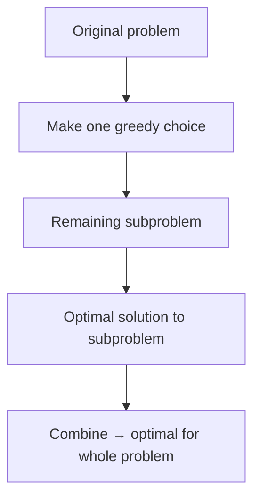
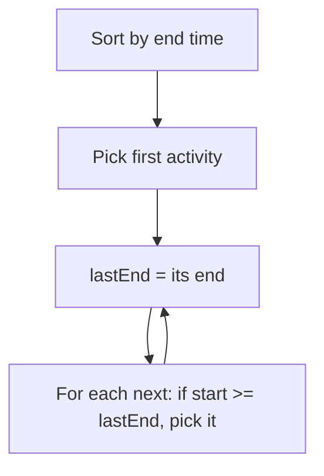

# MODULE 27 — Greedy Algorithms

**Illustration code:** `a.cpp` (activity selection + indices) · `b.cpp` (`maxActivities` — count only) · `c.cpp` (`std::pair`) · `d.cpp` (fractional knapsack)

---

## What is a greedy algorithm?

A **greedy algorithm** builds a solution **step by step**. At **each step** it makes the choice that looks **best right now** (the **locally optimal** choice) and **never undoes** that choice later.

> **Greedy idea:** Always pick the **local optimum** and **hope** it leads to the **global optimum**.

That hope is **only justified** when the problem has the right structure (see below). On some problems greedy gives the **correct** answer; on others it gives a **fast but wrong** answer.

---

## Simple example: maximum in an array

To find the **maximum** value in an array:

1. Start with the first element as “best so far.”
2. Scan the rest; whenever you see a **larger** value, update “best so far.”
3. At the end, “best so far” is the **global maximum**.

At index `i` you make the **local** decision: “Is `arr[i]` better than my current best?” If yes, take it. You never go back and change an old decision.

```text
arr:  3  9  2  7  5
      ^ best=3
         ^ best=9  (local: 9 > 3 → take 9)
            ^ skip (2 < 9)
               ^ skip
                  ^ skip
answer: 9
```

Here **local optimum** (best at this step) **is** the **global optimum**. Greedy works perfectly.

---

## Greedy vs other approaches

| Approach | Idea | Typical use |
|----------|------|-------------|
| **Greedy** | One irreversible “best now” choice per step | Problems with greedy-choice + optimal substructure |
| **Dynamic programming** | Try subproblems, combine optimal subsolutions | Overlapping subproblems, often **revisit** decisions |
| **Brute force** | Try all possibilities | Small input, or when proving correctness |

Greedy is often **simpler** and **faster** than DP when it applies — usually **O(n log n)** if sorting is needed, or **O(n)** for a single pass.

---

## When does greedy work?

Two properties are commonly used (names vary slightly in textbooks):

### 1. Greedy-choice property

A **global** optimal solution can be reached by making a **locally optimal** choice first, then solving the **remaining** subproblem optimally.

In other words: there is always some **safe** greedy pick that is part of **some** global optimum. You are allowed to commit to that pick without regret.

### 2. Optimal substructure

A problem has **optimal substructure** if:

> An **optimal solution** to the whole problem contains **optimal solutions** to its **subproblems**.

After you make a greedy choice, the **rest** of the problem should be a **smaller instance of the same type**, and the overall best answer should use the **best** answer for that smaller piece.



**Important:** Optimal substructure **alone** is **not enough** — you also need the **greedy-choice property**. Many problems (e.g. general coin change) have optimal substructure but **greedy fails**.

---

## Role of sorting in greedy

**Sorting is used in greedy a lot** because many strategies are:

> **Sort by some key**, then scan once and **greedily accept** or **reject** each item.

Examples of sort keys:

| Problem type | Often sort by |
|--------------|----------------|
| Interval / activity selection | **Finish time** (earliest end first) |
| Minimizing lateness | **Deadline** |
| Fractional knapsack | **Value per unit weight** (descending) |
| Scheduling jobs | **Profit**, **deadline**, or **ratio** |

After sorting, a single **linear scan** with greedy rules is usually **O(n)**; sorting dominates at **O(n log n)**.

```text
unsorted items  →  sort by key  →  greedy scan  →  answer
     O(n log n)        O(n)
```

---

## General recipe to design a greedy solution

1. **Define** what one “step” or one “item” means.
2. **Propose** a rule: “At each step, pick the … (smallest end time / largest ratio / etc.).”
3. **Sort** if the rule needs a global order.
4. **Prove** (or at least argue) **greedy-choice** + **optimal substructure**, or find a **counterexample**.
5. **Implement** with a loop; track what is already chosen.

If you can find a small input where greedy gives a **worse** answer than brute force / DP, greedy is **invalid** for that problem.

---

## When greedy fails (counterexample intuition)

**Coin change** with coins `{1, 3, 4}` and amount **6**:

| Strategy | Coins used | Total coins |
|----------|------------|-------------|
| Greedy (largest first) | 4 + 1 + 1 | **3** coins |
| Optimal | 3 + 3 | **2** coins |

Greedy “take the biggest coin that fits” is **locally** reasonable but **not globally** optimal here.

So: **always verify** greedy on your problem class; don’t assume “local best → global best.”

---

## Classic problems where greedy works (preview for this module)

| Problem | Greedy idea |
|---------|-------------|
| **Activity selection** | Pick activity with **earliest finish** that doesn’t conflict |
| **Fractional knapsack** | Take items with **best value/weight** first |
| **Huffman coding** | Repeatedly merge **two smallest** frequencies |
| **Minimum spanning tree (Kruskal)** | Add **cheapest** safe edge |
| **Dijkstra** (non-negative weights) | Always settle **closest** unvisited node |

Each of these has a proof that the natural greedy rule is safe.

---

## Time and space (typical)

| Phase | Complexity |
|-------|------------|
| Sort (if needed) | **O(n log n)** |
| Greedy scan | **O(n)** |
| Extra space | Often **O(1)** or **O(n)** for storing chosen items |

---

## Key takeaways

1. **Greedy** = at each step, take the **best-looking local option** and **never backtrack**.
2. It **works** only when **greedy-choice** + **optimal substructure** (or an equivalent proof) hold.
3. **Sorting** is a standard first move when the “best next” depends on global order.
4. **Optimal substructure** means optimal solutions **contain** optimal subsolutions — but you still must show the **first** greedy pick is safe.
5. When in doubt, **test a counterexample** or compare with DP / brute force.

---

## Activity selection (maximum non-overlapping activities)

**Illustration code:** `a.cpp`

### Problem statement

You have **`n`** activities. Activity **`i`** runs from **`start[i]`** to **`end[i]`** (only one person; **no two activities can overlap**).

Choose the **maximum number** of activities that can be completed.

**Rule:** If you pick an activity that ends at time **`t`**, the next activity must have **`start ≥ t`** (next can begin when the previous one ends).

### Example (from notes)

```text
start = [10, 12, 20]
end   = [20, 25, 30]

Activity 0:  |----------|          10 -------- 20
Activity 1:     |-------------|     12 -------- 25
Activity 2:                 |--------|  20 ----- 30
```

| Index | Interval | Compatible with 0? |
|-------|----------|--------------------|
| 0 | 10 – 20 | — (pick first) |
| 1 | 12 – 25 | **No** (overlaps 0: 12 < 20) |
| 2 | 20 – 30 | **Yes** (starts when 0 ends) |

**Answer: 2 activities** — e.g. activities **0** and **2**.

### Greedy strategy

1. **Sort** activities by **earliest finish time** (`end` ascending).
2. Always pick the activity that **finishes earliest** among those still allowed.
3. After picking one that ends at **`lastEnd`**, skip any activity with **`start < lastEnd`** (overlap).
4. Pick the next with **`start ≥ lastEnd`**, update **`lastEnd`**, repeat.

**Why it works (intuition):** Finishing early **frees the person sooner**, leaving the most room for future activities.



---

### Mathematical formulation

Label activities **`1, 2, …, n`**. Activity **`i`** occupies the interval **`[s_i, f_i]`** with **`s_i < f_i`**.

Two activities **`i`** and **`j`** are **compatible** if they do not overlap, i.e. one finishes before the other starts:

\[
f_i \le s_j \quad \text{or} \quad f_j \le s_i
\]

A set **`S ⊆ {1,…,n}`** is **feasible** if every pair in **`S`** is compatible.

**Goal:** find a feasible **`S`** with **maximum cardinality** \(|S|\).

After sorting by **`f_i`** ascending, relabel so:

\[
f_1 \le f_2 \le \cdots \le f_n
\]

The greedy algorithm picks activity **`1`**, then repeatedly picks the smallest-index activity **`j`** not yet considered with **`s_j ≥ f_{last}`** (compatible with the last chosen activity).

---

### Lemma 1 (Greedy-choice / exchange lemma)

> Let activity **`1`** have the **earliest finish time** \(f_1 = \min_i f_i\).  
> There exists an **optimal** feasible set **`O`** such that **`1 ∈ O`**.

**Proof (exchange argument).**

Let **`O*`** be any optimal solution (maximum size).

- If **`1 ∈ O*`** , we are done.
- Otherwise, let **`k ∈ O*`** be the activity in **`O*`** with the **earliest finish time** (so \(f_k = \min_{i \in O^*} f_i\)).

Because **`1`** finishes no later than **`k`**:

\[
f_1 \le f_k
\]

Consider **`O' = (O* \setminus \{k\}) \cup \{1\}`**.

- **Size:** \(|O'| = |O^*|\) (swap one activity for another).

- **Feasibility:** Let **`j ∈ O* \setminus \{k\}`**. Because **`O*`** is feasible, **`j`** and **`k`** do not overlap.

  **Case 1 — `j` is after `k`:** \(s_j \ge f_k\). Since \(f_1 \le f_k\), we get \(s_j \ge f_k \ge f_1\), so **`j`** does not overlap **`1`**.

  **Case 2 — `j` is before `k`:** \(f_j \le s_k\). Suppose for contradiction **`j`** overlaps **`1`**. Then \(f_j > s_1\) (they share time). Because **`1`** finishes first globally, \(f_1 \le f_j\). So
  \[
  s_1 < f_j \le s_k \quad\Rightarrow\quad s_1 < s_k.
  \]
  But **`j`** overlaps **`1`**, so **`1`** and **`j`** conflict while **`j`** ends before **`k`** starts — with \(f_1 \le f_j \le s_k\), activity **`1`** would also overlap **`k`** (since \(f_1 \ge s_1\) and **`1`** extends at least until after **`j`**). That contradicts **`k, j ∈ O*`**. So **`j`** cannot overlap **`1`**.

Thus every **`j`** in **`O* \setminus \{k\}`** is compatible with **`1`**, so **`O'`** is feasible and optimal.

Therefore some optimal solution includes activity **`1`**. ∎

---

### Lemma 2 (Optimal substructure)

> After choosing activity **`1`**, the remaining problem is: pick a maximum-size feasible set from activities that satisfy **`s_i ≥ f_1`**.  
> If **`R*`** is optimal for this subproblem, then **`{1} ∪ R*`** is optimal for the full problem.

**Proof.**

Any feasible set for the full instance that contains **`1`** must use only compatible later activities — exactly the subproblem. Adding an optimal remainder to **`{1}`** cannot be beaten by any other global solution that includes **`1`**, because that remainder would be a feasible set for the subproblem.

Combined with Lemma 1, an optimal solution can be built as **`{1}`** plus an optimal solution on the subinstance. ∎

---

### Theorem (Correctness of the greedy algorithm)

> The greedy algorithm (sort by **`f_i`**, always take the earliest-finishing compatible activity) returns a set **`G`** with **maximum possible size**.

**Proof (induction on `n`).**

**Base:** **`n = 1`**. Greedy picks the only activity; optimal.

**Inductive step:** Assume the theorem holds for fewer than **`n`** activities.

For **`n`** activities, sort by finish time. Greedy picks activity **`1`** (earliest **`f_1`**).

By **Lemma 1**, there is an optimal solution **`O*`** with **`1 ∈ O*`**.

By **Lemma 2**, the rest of **`O*`** is an optimal solution to the subproblem “activities with **`s_i ≥ f_1`**.”

The greedy algorithm, applied to that subproblem, is exactly what the loop does after fixing **`lastEnd = f_1`**.

By the **induction hypothesis**, greedy is optimal on the subproblem, so **`G`** matches \(|O^*|\).

Hence greedy is optimal for **`n`** activities. ∎

---

### Summary of the math story

| Step | Statement |
|------|-----------|
| **Greedy choice** | Earliest-finishing activity **`1`** belongs to some optimal solution (Lemma 1). |
| **Substructure** | After taking **`1`**, solve the same problem on compatible leftovers (Lemma 2). |
| **Correctness** | Induction shows greedy on subproblem + greedy first pick = global optimum (Theorem). |

This is the standard **interval scheduling** proof used in CLRS and most algorithms courses.

---

### Algorithm

```
sort activities by end[i]
count = 1, lastEnd = end of first
for each activity i in sorted order (skip first):
    if start[i] >= lastEnd:
        count++, lastEnd = end[i]
return count
```

### Complexity

| | |
|--|--|
| **Time** | **O(n log n)** — sorting dominates; scan is **O(n)** |
| **Space** | **O(n)** for index array, or **O(1)** extra if sorting in place with pairs |

`a.cpp` implements **`activitySelection(start, end)`** and prints the chosen activities for the sample above.

Run `a.cpp` for the greedy activity-selection solution.

---

## `maxActivities` implementation (course style)

**Code:** `b.cpp`

Same greedy rule, written as a **count-only** function (no list of chosen activities).

### Step 0 — sort by finish time

Activities must be processed in **increasing `end[]`**. Sort **indices** `0 … n-1` by `end[i]` before the loop below.

### Step 1 — always take the first activity

After sorting, activity at index **`0`** finishes earliest:

```cpp
int count = 1;
int currEndTime = end[0];   // not end[101] — use index 0
```

### Step 2 — scan the rest

```cpp
for (int i = 1; i < start.size(); i++) {   // i = 1 .. n-1  (NOT i <= size)
    if (start[i] >= currEndTime) {         // non-overlapping
        count++;
        currEndTime = end[i];
    }
}
return count;
```

| Line | Meaning |
|------|---------|
| **`count = 1`** | First activity (earliest end) is always selected |
| **`currEndTime`** | Finish time of the **last** chosen activity |
| **`start[i] >= currEndTime`** | Next activity starts when the previous one has ended |
| **`count++` / update `currEndTime`** | Accept activity `i` |

```text
Sorted by end:
  i=0: [10,20]  -> pick, currEndTime = 20
  i=1: [12,25]  -> 12 < 20, skip (overlap)
  i=2: [20,30]  -> 20 >= 20, pick, currEndTime = 30
count = 2
```

### Common mistakes

| Mistake | Fix |
|---------|-----|
| Loop `i <= start.size()` | Use **`i < start.size()`** (last valid index is `n-1`) |
| Skip sorting | **Must sort by `end`** before the greedy scan |
| `currEndTime = end[101]` | Use **`end[0]`** after sorting (first activity) |

### Complexity

Same as before: **O(n log n)** time (sort), **O(1)** extra space for the loop variables.

`b.cpp` defines **`int maxActivities(vector<int> start, vector<int> end)`** exactly in this style.

Run `b.cpp` for the sample `start = [10,12,20]`, `end = [20,25,30]`.

---

## `pair` in C++ (store two values together)

**Illustration code:** `c.cpp`

A **`std::pair`** holds **exactly two** objects of (possibly different) types. It lives in the STL header:

```cpp
#include <utility>   // pair, make_pair
```

It is a **small struct-like type**, not a full container like `vector` — but you often see it called an “STL utility” for grouping two related values.

### Declaration

```cpp
pair<int, int> p;              // two ints
pair<string, int> nameAge;     // string + int
pair<int, int> interval = {10, 20};  // start, end
```

Members are always:

| Member | Meaning |
|--------|---------|
| **`first`** | First value |
| **`second`** | Second value |

### Creating pairs

```cpp
pair<int, int> p1(3, 7);                    // constructor
pair<int, int> p2 = make_pair(3, 7);      // make_pair (types inferred)
pair<int, int> p3 = {3, 7};               // C++11 brace init
auto p4 = make_pair(3, 7);                // auto + make_pair
```

### Access and modify

```cpp
cout << p.first << " " << p.second;
p.first = 100;
```

C++17 **structured bindings**:

```cpp
auto [s, e] = p;   // s = p.first, e = p.second
```

### Why pairs are useful

| Use case | Example |
|----------|---------|
| **Activity / interval** | `{start, end}` |
| **Sort with two keys** | `vector<pair<int,int>>` sort by `.second` |
| **Map entries** | `map` stores `pair<const Key, Value>` internally |
| **Return two values** | `return {count, index};` |

For **activity selection**, instead of two separate arrays you can write:

```cpp
vector<pair<int,int>> acts;  // {start, end}
acts.push_back({10, 20});
sort(acts.begin(), acts.end(),
     [](const pair<int,int>& a, const pair<int,int>& b) {
         return a.second < b.second;  // sort by end time
     });
```

### Comparison

If `first` types are comparable, `pair` supports **`==`**, **`<`**, etc. Comparison is **lexicographic**: compare `first`, then `second` if tied.

```cpp
{1, 5} < {2, 0}   // true (1 < 2)
{1, 5} < {1, 3}   // false (1 == 1, 5 < 3 is false)
```

### Complexity

| Operation | Time |
|-----------|------|
| Create / read / write `.first`, `.second` | **O(1)** |
| Sort `n` pairs | **O(n log n)** |

Space: **O(1)** per pair (two stored values).

`c.cpp` demonstrates creation, access, sorting intervals, and structured bindings.

Run `c.cpp` for `std::pair` examples.

---

## Fractional knapsack (greedy)

**Illustration code:** `d.cpp`

### Problem statement

You have a knapsack of capacity **`W`**. There are **`n`** items; item **`i`** has:

- **weight** \(w_i\)
- **value** \(v_i\)

Unlike the **0/1 knapsack**, you may take **a fraction** of an item (any real amount between **0** and **100%** of that item).

**Goal:** maximize **total value** in the knapsack without exceeding total weight **W**.

### Example

```text
value  = [60, 100, 120]
weight = [10,  20,  30]
W = 50
```

| Item | \(w_i\) | \(v_i\) | Value per unit weight \(v_i / w_i\) |
|------|--------|--------|--------------------------------------|
| 0 | 10 | 60 | **6.0** |
| 1 | 20 | 100 | **5.0** |
| 2 | 30 | 120 | **4.0** |

**Greedy take (highest ratio first):**

1. All of item **0**: weight **10**, value **60** — remaining capacity **40**
2. All of item **1**: weight **20**, value **100** — remaining **20**
3. **Fraction** of item **2**: take \(\frac{20}{30}\) of it → value \(120 \times \frac{20}{30} = 80\)

\[
\text{Total value} = 60 + 100 + 80 = \mathbf{240}
\]

\[
\text{Total weight} = 10 + 20 + 20 = 50 = W
\]

**Answer: 240**


---

### Greedy strategy

Define the **value density** (profit per unit weight):

\[
\rho_i = \frac{v_i}{w_i}
\]

1. **Sort** items by **`ρ_i`** in **decreasing** order.
2. Greedily take as much as possible of the next item (full item if it fits, otherwise a **fraction** to fill the knapsack).
3. Stop when capacity is **0** or all items are used.

```text
capacity left: 50
take item 0 (ρ=6):  -10  -> 40 left,  +60 value
take item 1 (ρ=5):  -20  -> 20 left,  +100 value
take 2/3 of item 2 (ρ=4): -20 -> 0 left, +80 value
```

---

### Why greedy is optimal (math sketch)

Suppose an optimal solution takes fractions \(x_i \in [0,1]\) of each item (amount \(x_i w_i\) weight).

**Objective:**

\[
\max \sum_{i=1}^{n} x_i v_i \quad \text{subject to} \quad \sum_{i=1}^{n} x_i w_i \le W,\; 0 \le x_i \le 1
\]

This is a **linear program**. The feasible region is a polytope; the maximum of a linear function over a polytope occurs at a **vertex** where items are taken in full or not at all — except possibly **one** item that is **split**.

**Exchange argument:** If the solution takes less than full amount of item **a** and also takes some of item **b** with **lower** density \(\rho_b < \rho_a\), move weight from **b** to **a**:

- Removing \(\Delta w\) from **b** loses value \(\rho_b \Delta w\).
- Adding \(\Delta w\) to **a** gains \(\rho_a \Delta w\).
- Net gain \((\rho_a - \rho_b)\Delta w > 0\) — contradiction unless **b** is empty.

So any optimal solution fills the knapsack with items in **non-increasing \(\rho_i\)**, taking full items until capacity runs out, then at most **one** fractional item. That is exactly the greedy algorithm.

**Note:** **0/1 knapsack** (whole items only) is **not** solved by this greedy rule; fractional knapsack is special because divisibility makes the LP structure work.

---

### Algorithm

```
for each item i: ratio[i] = value[i] / weight[i]
sort items by ratio descending
ans = 0, cap = W
for each item in sorted order:
    if cap >= weight[i]:
        take full item: ans += value[i], cap -= weight[i]
    else:
        take fraction cap/weight[i]: ans += value[i] * (cap / weight[i])
        break
return ans
```

Use **`double`** for fractions and the answer when capacities/values are integers but fractions appear.

---

### Complexity

| | |
|--|--|
| **Time** | **O(n log n)** — sorting by ratio; loop **O(n)** |
| **Space** | **O(n)** — store `(ratio, value, weight)` or indices |

---

### Fractional vs 0/1 knapsack

| | Fractional | 0/1 |
|--|------------|-----|
| Take part of item? | **Yes** | **No** |
| Greedy by \(v/w\) | **Optimal** | **Not always optimal** |
| Typical solution | Greedy sort | DP **O(nW)** |

`d.cpp` implements **`double fractionalKnapsack(vector<int> value, vector<int> weight, int W)`** for the sample above.

Run `d.cpp` — expected output **240**.