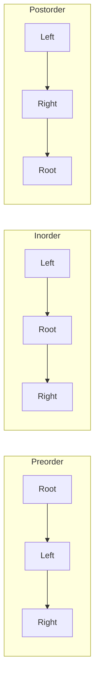

# MODULE 28 — Binary Trees

**Illustration code:** `a.cpp` (build from preorder) · `b.cpp` (preorder) · `c.cpp` (inorder) · `d.cpp` (postorder) · `e.cpp` (level order / BFS) · `f.cpp`–`z.cpp` (more topics)

---

## Hierarchical data structures

Unlike an **array** or **linked list**, data in a tree is **not** stored in one flat sequence. It is organized in **levels**: one node points to others below it. That **parent → child** link forms a **hierarchy** — like a family tree, a company org chart, or folders inside folders.

| Structure | How data is linked |
|-----------|-------------------|
| **Array / linked list** | Linear — each item has one “next” (or index) |
| **General tree** | One parent can have **any number** of children |
| **Binary tree** | One parent has **at most 2** children |

In a **general tree**, a single node can branch to many children (e.g. one folder with many subfolders).

In a **binary tree**, from any node **at most two** edges go downward. That limit makes trees easier to implement, analyze, and use in interviews — most tree problems in DSA are **binary** trees.

---

## What is a binary tree?

A **binary tree** is a tree where **every node has at most 2 children**. No node has 3 or more direct children.

For each node, exactly one of these holds:

| Case | Meaning |
|------|---------|
| **No child** | Node is a **leaf** (in that direction, subtree is empty) |
| **Left child only** | Only the **left** pointer is non-null |
| **Right child only** | Only the **right** pointer is non-null |
| **Both children** | Left **and** right exist |

Special cases:

- **Empty tree** — no nodes; `root == nullptr`.
- **Single node** — only a root; no children.

```text
        1              2              3
       / \              \              \
      2   3              4              5
     (both)           (right only)   (left only)

  4 alone = leaf (no children)
```

---

## Tree terminology

| Term | Meaning |
|------|---------|
| **Root** | The **topmost** node. Exactly **one** root per tree. Every other node is reached by going **down** from the root. |
| **Edge / branch** | The link between a **parent** and its **child** (drawn as a line). |
| **Leaf** | A node with **0 children** (also called **external** or **terminal** node). |
| **Internal node** | Any node that is **not** a leaf (has at least one child). |

```text
           root
          /    \
    internal  internal
       /         \
    leaf         leaf
```

---

## Left child and right child

In a binary tree, children are **named**, not just counted:

- **Left child** — drawn on the **left**; stored in `left` pointer.
- **Right child** — drawn on the **right**; stored in `right` pointer.

This matters for **BST**, **heaps**, and **expression trees**. Swapping left and right usually gives a **different** tree (unless the tree is symmetric).

**Siblings** — two nodes with the **same parent** (e.g. left and right child of one node). Siblings sit at the **same depth** in the tree.

---

## Ancestors and descendants

| Term | Meaning |
|------|---------|
| **Parent** | The node **one edge above** (direct ancestor). |
| **Ancestors** | Parent, grandparent, … up to the **root**. The root is an ancestor of **every** other node. |
| **Children** | Nodes **one edge below** (immediate descendants). |
| **Descendants** | Children, grandchildren, and everything in the subtrees below. |

Rules:

- Every node **except the root** has exactly **one** parent.
- The **root** has **no** parent.
- A **leaf** has no children (no descendants below it).

```text
        A          ancestors of D:  C, B, A
       / \
      B   C        descendants of B:  D, E, ...
     / \
    D   E
```

---

## Level

A **level** is a **horizontal row** of nodes in the tree, measured **from the root downward**.

- **Level 0** (or **level 1** in some textbooks) = the row containing the **root** — always check the problem statement.
- In **most DSA / interview problems** (and in this module): **root is at level 0**.
- Nodes **one edge below** the root are at **level 1**, then level 2, and so on.
- All nodes on the **same level** are the same **distance** (in edges) from the root.

```text
Level 0:          1
                 / \
Level 1:        2   3
               / \
Level 2:      4   5

Nodes at level 0: {1}
Nodes at level 1: {2, 3}
Nodes at level 2: {4, 5}
```

**Number of levels** in a tree = **height of the tree + 1** (when root is at level 0 and height counts edges).

| Node | Level (root = 0) |
|------|------------------|
| 1 | 0 |
| 2, 3 | 1 |
| 4, 5 | 2 |

> **Level-order traversal** (BFS) visits nodes **level by level** — left to right within each level. That is why a **queue** is used.

---

## Depth

**Depth** of a node = number of **edges** on the path from the **root** to that node.

- **Root** has depth **0** (no edges above it).
- A child of the root has depth **1**.
- Depth answers: *“How far down from the top is this node?”*

```text
Depth of each node (edges from root):

        1  depth 0
       / \
      2   3  depth 1
     / \
    4   5  depth 2

depth(4) = 2   (path: 1 → 2 → 4, two edges)
depth(3) = 1   (path: 1 → 3, one edge)
```

**Depth vs level (this module):** When the root is at **level 0**, **depth** and **level** are the **same number** for every node.

Some books put the root at **level 1**; then **level = depth + 1**. Always confirm which convention a question uses.

| Quantity | Formula / idea |
|----------|----------------|
| **Minimum depth** of tree | Depth of the **shallowest** leaf |
| **Maximum depth** of tree | Depth of the **deepest** leaf (= height of tree, see below) |

---

## Height

**Height** of a node = number of **edges** on the **longest path** from that node **down** to a **leaf**.

- A **leaf** has height **0** (no edges below it to another node).
- Height answers: *“How tall is the structure below this node?”*
- **Height of the tree** = height of the **root** = length of the **longest root-to-leaf** path (in edges).

```text
Height of each node (longest path down to a leaf):

        1  h=2
       / \
      2   3  h=1
     / \
    4   5  h=0  (leaves)

height(1) = 2   (longest: 1→2→4 or 1→2→5)
height(2) = 1   (longest: 2→4 or 2→5)
height(4) = 0   (leaf)
height(3) = 0   (leaf)
```

### Depth vs height — direction

| | **Depth** | **Height** |
|--|-----------|------------|
| **Measured from** | Root **down** to the node | Node **down** to deepest leaf |
| **Root** | depth = **0** | height = **height of whole tree** |
| **Leaf** | depth = its level | height = **0** |
| **Grows when** | You go **toward** leaves | You go **away** from leaves |

```text
        R  ← depth(R)=0,  height(R)=2
       / \
      A   B  ← depth=1, height(A)=1, height(B)=0
     /
    L  ← depth=2, height(L)=0 (leaf)

Depth:  count edges from R downward to the node.
Height: count edges from the node downward to the farthest leaf.
```

### Skewed tree example

```text
    1  depth 0, height 3
     \
      2  depth 1, height 2
       \
        3  depth 2, height 1
         \
          4  depth 3, height 0

Tree height = 3 (three edges from root to deepest leaf)
```

### Useful facts

| Tree type | Height |
|-----------|--------|
| **Empty tree** | Often defined as **-1** or **0** — read problem statement |
| **Single node** | **0** |
| **Perfect binary tree** with `L` levels (root at level 0) | Height = **L - 1** |
| **n nodes, skewed** | Height = **n - 1** (worst case) |
| **n nodes, balanced** | Height ≈ **O(log n)** |

### Height in code (recursive idea)

```cpp
int height(Node* root) {
    if (root == nullptr) return -1;  // or 0 if you define empty that way
    return 1 + max(height(root->left), height(root->right));
}
// Returns number of edges on longest path; leaf gives 0 from its children.
```

---

## Subtree

A **subtree** is any node **together with all of its descendants** — the whole piece of the tree that hangs below that node.

- **Every node** is the **root** of exactly one subtree (the one rooted at itself).
- The **entire tree** is the subtree rooted at the **global root**.
- **Left subtree** of `N` = subtree whose root is `N->left` (everything reachable only through the left child).
- **Right subtree** of `N` = subtree whose root is `N->right`.

```text
Full tree — subtree rooted at 2 is highlighted:

        1
       / \
    [ 2   3 ]
     / \
  [ 4   5 ]

Subtree at 2 contains nodes: {2, 4, 5}
Subtree at 3 contains nodes: {3}
Left subtree of 1  → rooted at 2
Right subtree of 1 → rooted at 3
```

### Empty subtree

- If `N->left == nullptr`, the **left subtree** of `N` is **empty** (no nodes).
- Same for a missing right child.
- In code, an empty subtree is represented by a **null pointer**.

```text
        1
         \
          3

Left subtree of 1: empty (nullptr)
Right subtree of 1: {3}
```

### Why subtrees matter

| Idea | Use |
|------|-----|
| **Recursion** | Solve for left subtree + right subtree, then combine at current node |
| **BST** | All values in left subtree `<` parent; all in right subtree `>` parent |
| **Balance** | Compare **heights** of left and right subtrees of each node |
| **Copy / delete** | Work on one subtree at a time |

```text
Problem: "height of node X"  →  max(height(left subtree), height(right subtree)) + ...

        N
       / \
   subtree  subtree
   (smaller   (smaller
    binary     binary
    trees)     trees)
```

### Size of a subtree

**Size** = number of **nodes** in that subtree (including the root of the subtree).

```text
        1
       / \
      2   3
     / \
    4   5

size(subtree at 2) = 3  (nodes 2, 4, 5)
size(subtree at 1) = 5  (whole tree)
size(empty)        = 0
```

```cpp
int size(Node* root) {
    if (root == nullptr) return 0;
    return 1 + size(root->left) + size(root->right);
}
```

> **Key idea:** A binary tree is **recursive** — each subtree is itself a **binary tree**. Most tree algorithms (traversal, height, diameter, LCA) reuse the same logic on smaller subtrees.

---

## Path and degree

**Path** — a sequence of nodes where each consecutive pair is connected by an **edge**.

**Path length** — number of **edges** on the path (not number of nodes).

**Degree** of a node (in a binary tree) = how many children it has:

| Degree | Meaning |
|--------|---------|
| **0** | Leaf |
| **1** | Only left **or** only right child |
| **2** | Both children |

---

## Types of binary trees (overview)

| Type | Rule |
|------|------|
| **Full** | Every node has **0 or 2** children (no node has exactly 1 child). |
| **Complete** | All levels filled except possibly the **last**, and the last level is filled **left to right**. |
| **Perfect** | All internal nodes have **2** children; all leaves at the **same** level. |
| **Balanced** | Left and right subtrees have **similar height** (exact rule depends on problem — e.g. AVL, red-black). |
| **Degenerate / skewed** | Each node has at most **one** child — tree looks like a **linked list**. |

```text
Perfect (height 2):          Skewed:
       1                         1
      / \                         \
     2   3                         2
    / \ / \                         \
   4 5 6 7                           3
```

---

## Why binary trees matter

- **Hierarchical data** — file systems, HTML DOM, decision trees.
- **Binary search tree (BST)** — ordered storage; fast search / insert / delete when balanced.
- **Heap** — priority queues (min-heap / max-heap).
- **Expression tree** — represent formulas like `(a + b) * c`.
- **Recursion** — each subtree is a smaller binary tree; many solutions are natural recursive functions.

---

## Node representation in C++

Each node usually stores a **value** and two pointers:

```cpp
struct Node {
    int data;
    Node* left;   // nullptr if no left child
    Node* right;  // nullptr if no right child
};
```

The whole tree is accessed through a **`root`** pointer. If `root == nullptr`, the tree is **empty**.

```text
Node{ data=10, left -> Node{5}, right -> Node{15} }

        10
       /  \
      5    15
```

---

## Common operations (preview)

| Operation | Idea |
|-----------|------|
| **Traversal** | Visit every node in a fixed order — **inorder**, **preorder**, **postorder**, **level order (BFS)** |
| **Search** | Find a value (especially fast in **BST**) |
| **Insert / delete** | Add or remove nodes while keeping tree rules |
| **Height / size** | Count levels or total nodes |

These are built in upcoming `a.cpp`–`z.cpp` files with full code and complexity notes.

---

## Practice — tree with nodes 1 to 8

We build a binary tree that uses **values 1 through 8** so every part below can be answered from one diagram.

**Convention in this example:** root **1** is at **level 0**; depth and level are the same.

### The tree

```text
              1          ← root, level 0
            /   \
           2     3       ← level 1
          / \     \
         4   5     6     ← level 2
        /           \
       7             8   ← level 3
```

**Pointer view (who points to whom):**

| Node | Left child | Right child |
|------|------------|-------------|
| 1 | 2 | 3 |
| 2 | 4 | 5 |
| 3 | — | 6 |
| 4 | 7 | — |
| 5 | — | — |
| 6 | — | 8 |
| 7 | — | — |
| 8 | — | — |

---

### a. Children of 4

**Children** = nodes **directly below** 4 (one edge down).

Node **4** has only a **left child**: **7**.  
It has **no right child**.

**Answer:** **7** only (one child).

```text
    4
   /
  7    ← child of 4
```

---

### b. Number of leaves

A **leaf** has **no children** (both pointers null).

Check each node:

| Node | Children? | Leaf? |
|------|-----------|-------|
| 1 | 2, 3 | No |
| 2 | 4, 5 | No |
| 3 | — , 6 | No |
| 4 | 7, — | No |
| 5 | none | **Yes** |
| 6 | — , 8 | No |
| 7 | none | **Yes** |
| 8 | none | **Yes** |

**Answer:** **3 leaves** — nodes **5**, **7**, and **8**.

---

### c. Parent of 6

**Parent** = the node **one edge above** (connected upward).

Node **6** is the **right child** of **3**.

**Answer:** parent of **6** is **3**.

```text
    3
     \
      6
```

---

### d. Level of 2

Count levels from the root (**1** at level **0**):

```text
Level 0:        1
Level 1:      2   3    ← 2 is here
Level 2:    4   5   6
Level 3:    7         8
```

**Answer:** level of **2** is **1**.

(Equivalently, **depth** of 2 = **1** edge below the root.)

---

### e. Subtrees of 1 and 2

A **subtree** = that node **plus all descendants**.

**Subtree rooted at 1** (the whole tree):

```text
Nodes: { 1, 2, 3, 4, 5, 6, 7, 8 }

              1
            /   \
           2     3
          / \     \
         4   5     6
        /           \
       7             8
```

- **Left subtree of 1** → rooted at **2**: `{ 2, 4, 5, 7 }`
- **Right subtree of 1** → rooted at **3**: `{ 3, 6, 8 }`

**Subtree rooted at 2:**

```text
Nodes: { 2, 4, 5, 7 }

           2
          / \
         4   5
        /
       7
```

- **Left subtree of 2** → rooted at **4**: `{ 4, 7 }`
- **Right subtree of 2** → rooted at **5**: `{ 5 }` (single node)

**Answer:**

| Root | Subtree nodes |
|------|----------------|
| **1** | **1, 2, 3, 4, 5, 6, 7, 8** (entire tree) |
| **2** | **2, 4, 5, 7** |

---

### f. Ancestors of 8

**Ancestors** = parent, grandparent, … up to the **root** (not including 8 itself).

Path from root to **8**:

```text
1  →  3  →  6  →  8
```

| Node | Relation to 8 |
|------|----------------|
| **6** | Parent (direct ancestor) |
| **3** | Grandparent |
| **1** | Great-grandparent / root |

**Answer:** ancestors of **8** are **6**, **3**, and **1** (in order from bottom to top: **6 → 3 → 1**).

```text
    1
     \
      3
       \
        6
         \
          8
```

---

### Quick answer sheet

| Part | Question | Answer |
|------|----------|--------|
| **a** | Children of 4 | **7** |
| **b** | No. of leaves | **3** (nodes 5, 7, 8) |
| **c** | Parent of 6 | **3** |
| **d** | Level of 2 | **1** |
| **e** | Subtree of 1 | **{1,2,3,4,5,6,7,8}** · Subtree of 2: **{2,4,5,7}** |
| **f** | Ancestors of 8 | **6, 3, 1** |

---

## Build tree from preorder (with `-1` for null)

**Illustration code:** [`a.cpp`](a.cpp)

Often a tree is **not** given as pointers — it is given as a **flat array** in **preorder**, with **`-1`** marking a **missing child** (null pointer).

Run from this folder:

```bash
g++ -std=c++17 -o a a.cpp && ./a
```

`a.cpp` prints all **13 build steps**, the final tree shape, and checks that preorder serialization matches the input array.

**Corrected array for this example:**

```text
[1, 2, 4, -1, -1, 5, -1, -1, 3, -1, 6, -1, -1]
```

(`-1` = no node there; any sentinel works, but **-1** is common in course problems and LeetCode-style input.)

---

### What is preorder?

**Preorder** visit order for each node:

1. Visit **root** (record its value)
2. Traverse **left subtree**
3. Traverse **right subtree**

So the **first** value in the array is always the **root** of the whole tree.

```text
Preorder of this tree:  1, 2, 4, -1, -1, 5, -1, -1, 3, -1, 6, -1, -1

        1
       / \
      2   3
     / \   \
    4   5   6
```

---

### Why `-1` appears in the array

In memory, every node has **two slots**: `left` and `right`.  
A leaf still has “no left child” and “no right child” — those are **`nullptr`**.

When we **serialize** the tree to an array, we must record those **empty** spots, or we cannot rebuild the shape uniquely.

| In tree | In preorder array |
|---------|-------------------|
| Real node with value `x` | `x` |
| Missing child (null) | `-1` |

So after node **4**, we write **`-1, -1`** because **4** has **no** left and **no** right child.

---

### Rule to build (recursive)

Keep an **index** `i` into the array (start at `0`). Function **`build()`**:

1. If `arr[i] == -1` → return `nullptr`, move `i` forward.
2. Else → create node with value `arr[i]`, move `i` forward.
3. Set `node->left  = build()`  (build left subtree next in preorder).
4. Set `node->right = build()` (then right subtree).
5. Return `node`.

> **Preorder property:** After you read a node, **everything that follows** (until the subtree ends) describes **left subtree first**, then **right subtree**. The `-1` markers tell you exactly where each subtree stops.

**Time:** **O(n)** — each array entry is read once.  
**Space:** **O(h)** recursion stack, `h` = height.

---

### Step-by-step: build from the array

Array: `[1, 2, 4, -1, -1, 5, -1, -1, 3, -1, 6, -1, -1]`

| Step | Read | Action |
|------|------|--------|
| 1 | `1` | Root **1** |
| 2 | `2` | Left child of 1 → **2** |
| 3 | `4` | Left child of 2 → **4** |
| 4 | `-1` | Left of 4 → null |
| 5 | `-1` | Right of 4 → null (subtree at 4 done) |
| 6 | `5` | Right child of 2 → **5** |
| 7 | `-1` | Left of 5 → null |
| 8 | `-1` | Right of 5 → null (subtree at 2 done) |
| 9 | `3` | Right child of 1 → **3** |
| 10 | `-1` | Left of 3 → null |
| 11 | `6` | Right child of 3 → **6** |
| 12 | `-1` | Left of 6 → null |
| 13 | `-1` | Right of 6 → null (tree complete) |

**Final tree:**

```text
        1
       / \
      2   3
     / \   \
    4   5   6
```

This is the **same shape** as nodes **1–6** in the practice tree above (without **7** and **8**). To include 7 and 8, the preorder array would need more values where those children appear.

---

### Trace with indentation (how recursion “sees” it)

```text
build → 1
  build → 2
    build → 4
      build → -1  (null)
      build → -1  (null)
    build → 5
      build → -1
      build → -1
  build → 3
    build → -1
    build → 6
      build → -1
      build → -1
```

---

### Code (C++)

Full runnable version with step-by-step output: [`a.cpp`](a.cpp) (`buildFromPreorder`, `main`).

```cpp
struct Node {
    int data;
    Node* left;
    Node* right;
    Node(int v) : data(v), left(nullptr), right(nullptr) {}
};

int i = 0;

Node* build(vector<int>& arr) {
    if (i >= (int)arr.size() || arr[i] == -1) {
        i++;
        return nullptr;
    }
    Node* root = new Node(arr[i++]);
    root->left  = build(arr);
    root->right = build(arr);
    return root;
}

// Usage:
// vector<int> arr = {1, 2, 4, -1, -1, 5, -1, -1, 3, -1, 6, -1, -1};
// Node* root = build(arr);
```

---

### Preorder vs other serializations

| Order | Visit pattern | Common use |
|-------|---------------|------------|
| **Preorder** | root → left → right | **Rebuild tree** with null markers (this section) |
| **Inorder** | left → root → right | BST gives **sorted** values |
| **Postorder** | left → right → root | **Delete** tree bottom-up |
| **Level order** | level by level (BFS) | Print tree by rows |

---

### Quick checklist

1. First non-`-1` value = **root**.
2. After a node, next values build its **left** subtree completely, then **right**.
3. Each **leaf** contributes **two `-1`s** in the array (no left, no right).
4. Array length for a tree with `n` real nodes is **2n + 1** when every null child is written (including missing children of nodes with one child).

---

## Tree traversal

**Traversal** means visiting **every node** in the tree **exactly once** in a defined order.

We use the same sample tree in `b.cpp`–`e.cpp` (built in `a.cpp`):

```text
        1
       / \
      2   3
     / \   \
    4   5   6
```

| Traversal | Visit order (mnemonic) | File |
|-----------|------------------------|------|
| **Preorder** | **Root** → Left → Right | [`b.cpp`](b.cpp) |
| **Inorder** | Left → **Root** → Right | [`c.cpp`](c.cpp) |
| **Postorder** | Left → Right → **Root** | [`d.cpp`](d.cpp) |
| **Level order** | Level by level (BFS) | [`e.cpp`](e.cpp) |

**Outputs on this tree:**

| Traversal | Sequence |
|-----------|----------|
| Preorder | **1, 2, 4, 5, 3, 6** |
| Inorder | **4, 2, 5, 1, 3, 6** |
| Postorder | **4, 5, 2, 6, 3, 1** |
| Level order | **1, 2, 3, 4, 5, 6** |

```text
Preorder:   visit order as you read the tree "top-first" at each node
            1 → 2 → 4 → 5 → 3 → 6

Inorder:    left subtree, then node, then right
            4 → 2 → 5 → 1 → 3 → 6

Postorder:  children before parent
            4 → 5 → 2 → 6 → 3 → 1

Level order (by row):
  Level 0:  1
  Level 1:  2, 3
  Level 2:  4, 5, 6
```

---

### Recursive vs iterative

| Style | Traversals | How |
|-------|------------|-----|
| **Recursive** | Preorder, inorder, postorder | Call stack follows left/right subtrees |
| **Iterative** | Level order (BFS); others possible with explicit stack | **Queue** for level order |

All traversals visit **n** nodes → **O(n)** time.

| Traversal | Time | Space (extra) |
|-----------|------|----------------|
| Preorder / inorder / postorder (recursive) | **O(n)** | **O(h)** call stack, `h` = height; worst **O(n)** if skewed |
| Level order (BFS + queue) | **O(n)** | **O(w)** queue size, `w` = max width; worst **O(n)** |

---

## Preorder traversal (recursive)

**Illustration code:** [`b.cpp`](b.cpp)

**Order:** **Root** → **Left subtree** → **Right subtree**

### Algorithm

1. If `root == nullptr`, return.
2. **Visit** (print / store) `root`.
3. Recurse on `root->left`.
4. Recurse on `root->right`.

```text
        1  ← visit 1st
       / \
      2   3     then whole left of 1, then right of 1
     / \
    4   5

Visit trace:  1, 2, 4, 5, 3, 6
```

```cpp
void preorder(Node* root) {
    if (!root) return;
    cout << root->data << " ";   // root first
    preorder(root->left);
    preorder(root->right);
}
```

| | |
|--|--|
| **Time** | **O(n)** |
| **Space** | **O(h)** recursion stack |

**Uses:** copy tree, prefix expression, serialize with null markers (`a.cpp`).

Run: `g++ -std=c++17 -o b b.cpp && ./b`

---

## Inorder traversal (recursive)

**Illustration code:** [`c.cpp`](c.cpp)

**Order:** **Left subtree** → **Root** → **Right subtree**

### Algorithm

1. If `root == nullptr`, return.
2. Recurse on `root->left`.
3. **Visit** `root`.
4. Recurse on `root->right`.

```text
        1
       / \
      2   3
     / \
    4   5

Left of 1: inorder(2) → 4, 2, 5
Visit 1
Right of 1: 3, 6

Output: 4, 2, 5, 1, 3, 6
```

```cpp
void inorder(Node* root) {
    if (!root) return;
    inorder(root->left);
    cout << root->data << " ";   // root in the middle
    inorder(root->right);
}
```

| | |
|--|--|
| **Time** | **O(n)** |
| **Space** | **O(h)** recursion stack |

**Uses:** on a **BST**, inorder prints values in **sorted order**.

Run: `g++ -std=c++17 -o c c.cpp && ./c`

---

## Postorder traversal (recursive)

**Illustration code:** [`d.cpp`](d.cpp)

**Order:** **Left subtree** → **Right subtree** → **Root**

### Algorithm

1. If `root == nullptr`, return.
2. Recurse on `root->left`.
3. Recurse on `root->right`.
4. **Visit** `root` (root **last**).

```text
        1
       / \
      2   3
     / \
    4   5

Postorder(2) → 4, 5, 2
Postorder(3) → 6, 3
Then root 1

Output: 4, 5, 2, 6, 3, 1
```

```cpp
void postorder(Node* root) {
    if (!root) return;
    postorder(root->left);
    postorder(root->right);
    cout << root->data << " ";   // root last
}
```

| | |
|--|--|
| **Time** | **O(n)** |
| **Space** | **O(h)** recursion stack |

**Uses:** delete tree (free children before parent), postfix expressions.

Run: `g++ -std=c++17 -o d d.cpp && ./d`

---

## Level order traversal (iterative / BFS)

**Illustration code:** [`e.cpp`](e.cpp)

**Order:** visit **level 0**, then **level 1**, then **level 2**, … — left to right within each level.

Uses a **queue** (FIFO), not recursion.

### Algorithm

1. If `root == nullptr`, return.
2. Enqueue `root`.
3. While queue is not empty:
   - Dequeue front → **visit** it.
   - If it has a **left** child, enqueue left.
   - If it has a **right** child, enqueue right.

```text
Queue steps (visit when dequeuing):

Start:     [1]
Dequeue 1: visit 1     enqueue 2, 3        →  [2, 3]
Dequeue 2: visit 2     enqueue 4, 5        →  [3, 4, 5]
Dequeue 3: visit 3     enqueue 6           →  [4, 5, 6]
Dequeue 4: visit 4                          →  [5, 6]
Dequeue 5: visit 5                          →  [6]
Dequeue 6: visit 6                          →  []

Output: 1, 2, 3, 4, 5, 6
```

```text
By level:

  Level 0:  1
  Level 1:  2  3
  Level 2:  4  5  6
```

```cpp
void levelOrder(Node* root) {
    if (!root) return;
    queue<Node*> q;
    q.push(root);
    while (!q.empty()) {
        Node* cur = q.front();
        q.pop();
        cout << cur->data << " ";
        if (cur->left)  q.push(cur->left);
        if (cur->right) q.push(cur->right);
    }
}
```

| | |
|--|--|
| **Time** | **O(n)** — each node enqueued and dequeued once |
| **Space** | **O(w)** — max queue size ≈ **width** of tree; complete tree last level up to **n/2** |

**Uses:** print tree by rows, BFS shortest path on unweighted graphs, level-wise problems (sum per level, zigzag, etc.).

Run: `g++ -std=c++17 -o e e.cpp && ./e`

---

### All traversals — comparison



| | Preorder | Inorder | Postorder | Level order |
|--|----------|---------|-----------|-------------|
| **Root position** | First | Middle | Last | By row |
| **Implementation** | Recursive | Recursive | Recursive | **Queue** (iterative) |
| **File** | `b.cpp` | `c.cpp` | `d.cpp` | `e.cpp` |
| **Time** | O(n) | O(n) | O(n) | O(n) |
| **Extra space** | O(h) | O(h) | O(h) | O(w) |