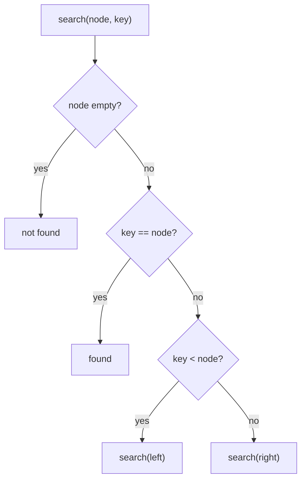
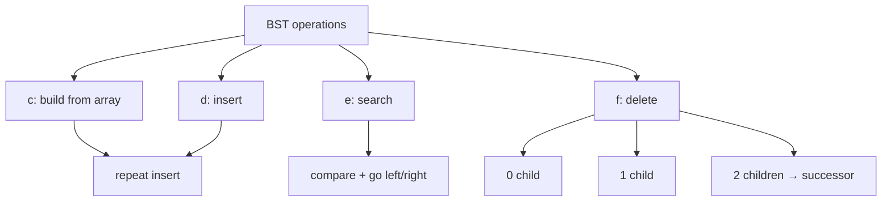

# MODULE 29 — Binary Search Trees (BST)

**Illustration code:** `a.cpp` (inorder) · `b.cpp` (search / balanced vs skewed) · `c.cpp` (build from array) · `d.cpp` (insert) · `e.cpp` (search) · `f.cpp` (delete) · `g.cpp`–`z.cpp` (more)

---

## From binary tree to BST

In **Module 28** you learned the **binary tree**: each node has at most **2 children** (left and right), but values could be placed **anywhere** — no ordering rule.

To **search** for a value in a general binary tree, you often must visit many nodes — worst case **all n nodes** → **O(n)** time.

A **Binary Search Tree (BST)** is a **special binary tree** with an **ordering rule** on values. That rule lets you **discard half** of the remaining tree at each step (like binary search on a sorted array).

> **BST idea:** At every node, everything on the **left** is **smaller**, everything on the **right** is **greater**.

---

## What is a BST?

A **binary search tree** is a binary tree that satisfies the **BST property**:

For **every** node `N`:

1. All values in the **left subtree** are **<** `N`'s value.
2. All values in the **right subtree** are **>** `N`'s value.
3. **No duplicate** keys (in the basic definition; some variants allow duplicates with a rule).

```text
Valid BST:                    NOT a BST:

        8                            8
       / \                          / \
      3   10                       3   10
     / \    \                      / \    \
    1   6    14                    1   9    14
       \    /                           \
        7  13                            7

left < 8 < right              9 is in left subtree of 8
at every node                 but 9 > 8  →  breaks rule
```

| Check | Valid BST (root 8) |
|-------|-------------------|
| Left of 8 | 3, 1, 6, 7 — all **< 8** |
| Right of 8 | 10, 14, 13 — all **> 8** |
| Left of 3 | 1 **< 3** |
| Right of 3 | 6, 7 **> 3** |

---

## BST property (detailed)

```text
              N
            /   \
    ALL values   ALL values
    < N.data     > N.data
    (left        (right
     subtree)     subtree)
```

This holds **recursively** — not only for direct children, but for **entire** left and right subtrees.

**Example walk — search for 7 in valid BST:**

```text
        8   →  7 < 8  go LEFT
       /
      3   →  7 > 3  go RIGHT
       \
        6  →  7 > 6  go RIGHT
         \
          7  →  FOUND

Only 4 nodes visited, not all 7 nodes in the tree
```

---

## Why BST improves search

| Structure | Search (worst case) | Why |
|-----------|---------------------|-----|
| **Unsorted array** | O(n) | Scan every element |
| **Sorted array** | O(log n) | Binary search on indices |
| **General binary tree** | O(n) | No order — may need full tree |
| **BST (balanced)** | **O(log n)** | Each step eliminates left **or** right subtree |
| **BST (skewed)** | **O(n)** | Becomes a linked list |

```text
Balanced BST (height ≈ log n):     Skewed BST (height = n):

        8                                1
       / \                                \
      3   10                                2
     / \    \                                \
    1   6    14                               3
                                               \
                                                4

search ~ log n steps                 search ~ n steps
```

**Key formula:**

```text
Time for search / insert / delete  =  O(height of tree)

Balanced BST:  height = O(log n)  →  O(log n)
Skewed BST:    height = O(n)      →  O(n)
```

---

## Inorder traversal of BST gives a sorted sequence

**Illustration code:** [`a.cpp`](a.cpp)

A very important fact: **inorder** traversal of a **BST** prints values in **ascending sorted order**.

**Inorder order:** **left** subtree → **root** → **right** subtree

```text
BST:                          Inorder output (sorted):

        8                     1  3  6  7  8  10  13  14
       / \
      3   10
     / \    \
    1   6    14
       \    /
        7  13
```

### Why it works (intuition)

At any node `N`:

1. **Inorder visits left subtree first** — all values there are **< N** (BST rule).
2. Then it prints **N**.
3. Then **right subtree** — all values there are **> N**.

So every value printed **before** `N` is smaller, and every value printed **after** is larger → entire sequence is **sorted**.

```text
When we visit node 8:

  already printed:  1, 3, 6, 7   (all from left, all < 8)
  print now:        8
  will print later: 10, 13, 14     (all from right, all > 8)
```

### Step-by-step inorder on sample BST

```text
        8
       / \
      3   10
     / \    \
    1   6    14
       \    /
        7  13

Visit order:
  go left of 8  →  inorder(3)
    go left of 3  →  print 1
    print 3
    go right of 3 →  inorder(6) → print 6, print 7
  print 8
  go right of 8 →  inorder(10) → print 10, print 13, print 14

Output: 1 3 6 7 8 10 13 14  ✓ sorted
```

### Compare with other traversals (same BST)

| Traversal | Order | Output on sample BST | Sorted? |
|-----------|-------|----------------------|---------|
| **Inorder** | left → root → right | `1 3 6 7 8 10 13 14` | **Yes** |
| **Preorder** | root → left → right | `8 3 1 6 7 10 14 13` | No |
| **Postorder** | left → right → root | `1 7 6 3 13 14 10 8` | No |

> **Only inorder** uses the BST property in the order **smaller → node → bigger** at every step.

### Code

```cpp
void inorder(Node* root) {
    if (!root) return;
    inorder(root->left);
    cout << root->data << " ";   // root in the middle
    inorder(root->right);
}
```

Store values in a `vector` and check: `isSorted(v)` should be **true** for a valid BST.

### Not true for a general binary tree

If the tree is **not** a BST, inorder does **not** sort values:

```text
NOT a BST (9 in left subtree of 8):

        8
       / \
      3   10
     / \    \
    1   9    14      ← 9 > 8 breaks BST

Inorder: 1 3 9 8 10 14   ← NOT sorted (9 before 8)
```

`a.cpp` builds a **valid BST**, runs inorder / preorder / postorder, and verifies the inorder list is sorted.

| | |
|--|--|
| **Time** | **O(n)** — visit every node once |
| **Space** | **O(h)** — recursion stack |

Run: `g++ -std=c++17 -o a a.cpp && ./a`

---

## Core operations

### 1. Search

```text
search(root, key):
  if root is null        → not found
  if key == root.data    → found
  if key < root.data     → search(root.left, key)
  if key > root.data     → search(root.right, key)
```

```cpp
Node* search(Node* root, int key) {
    if (!root || root->data == key) return root;
    if (key < root->data) return search(root->left, key);
    return search(root->right, key);
}
```

| | |
|--|--|
| **Time** | **O(h)** — height of tree |
| **Space** | **O(h)** — recursion stack |

---

### 2. Insert

Always insert as a **new leaf** in the position where search would end.

```text
Insert 5 into BST:

        8
       / \
      3   10
     / \    \
    1   6    14

5 < 8 → left
5 > 3 → right
5 < 6 → left of 6 → new node

        8
       / \
      3   10
     / \    \
    1   6    14
       /
      5
```

```cpp
Node* insert(Node* root, int key) {
    if (!root) return new Node(key);
    if (key < root->data) root->left = insert(root->left, key);
    else if (key > root->data) root->right = insert(root->right, key);
    return root;
}
```

| | |
|--|--|
| **Time** | **O(h)** |
| **Space** | **O(h)** |

---

### 3. Delete (overview)

Three cases when deleting node `key`:

| Case | Action |
|------|--------|
| **No children** (leaf) | Remove node |
| **One child** | Replace node with its child |
| **Two children** | Replace with **inorder successor** (smallest in right subtree) or **inorder predecessor** (largest in left subtree) |

```text
Delete 3 (two children) in:

        8
       / \
      3   10
     / \    \
    1   6    14

Inorder successor of 3 = smallest in right subtree = 6
Replace 3 with 6, delete old 6 from right subtree
```

Delete also runs in **O(h)** time.

---

## Node representation (C++)

Same as a binary tree — only the **rules** for placing values change.

```cpp
struct Node {
    int data;
    Node* left;
    Node* right;
    Node(int v) : data(v), left(nullptr), right(nullptr) {}
};
```

The **BST property** is maintained by **how** you insert/delete, not by a special field.

---

## BST vs other structures

| Structure | Ordered? | Search | Insert | Notes |
|-----------|----------|--------|--------|-------|
| **Array (unsorted)** | No | O(n) | O(1) end | Simple |
| **Array (sorted)** | Yes | O(log n) | O(n) shift | Binary search |
| **Linked list** | No | O(n) | O(1) | No random access |
| **BST** | Yes (inorder) | O(log n)* | O(log n)* | *if balanced |
| **`map` / `set` (C++)** | Yes | O(log n) | O(log n) | Usually red-black tree inside |

> **Lookup tables:** C++ `std::map` and `std::set` are often implemented as **balanced BSTs** (red-black trees). BST is the idea behind many real **dictionaries** and **databases indexes**.

---

## When is a tree a valid BST?

**Method 1 — range check (best for interviews):**

Pass a valid range `(min, max)` down the tree.

- At node `N`, require `min < N.data < max`.
- Left child: range becomes `(min, N.data)`.
- Right child: range becomes `(N.data, max)`.

```cpp
bool isBST(Node* root, long minV, long maxV) {
    if (!root) return true;
    if (root->data <= minV || root->data >= maxV) return false;
    return isBST(root->left, minV, root->data) &&
           isBST(root->right, root->data, maxV);
}
// call: isBST(root, LONG_MIN, LONG_MAX)
```

**Method 2 — inorder check:**

Do inorder traversal; values must be **strictly increasing**.

---

## Types of BST (preview)

| Type | Property |
|------|----------|
| **Standard BST** | Left < root < right |
| **Balanced BST (AVL, Red-Black)** | Height stays O(log n) after insert/delete |
| **BST (skewed)** | Degenerate — same as linked list |

```text
Same values, different shapes:

Balanced:          Skewed (bad):

    4                  1
   / \                   \
  2   6                   2
 / \ / \                   \
1 3 5 7                    3

both are BSTs if values follow rule
but skewed one has O(n) operations
```

---

## Summary

| Idea | Detail |
|------|--------|
| **What** | Binary tree + ordering: left smaller, right greater |
| **Search** | Compare at root; go left or right — **O(height)** |
| **Balanced** | Height **O(log n)** → fast lookup |
| **Skewed** | Height **O(n)** → same as linked list |
| **Inorder** | Prints values **sorted** |
| **Uses** | Lookup tables, `map`/`set`, symbol tables, indexes |



---

## Connection to Module 28

| Module 28 | Module 29 |
|-----------|-----------|
| Binary tree structure | Same structure |
| Any value placement | **Ordered** placement |
| Search O(n) general | Search **O(log n)** when balanced |
| Traversals | **Inorder** = sorted |

See `b.cpp` for search illustration; more operations in upcoming files.

---

## BST search

**Illustration code:** [`b.cpp`](b.cpp)

**Search** in a BST: start at the **root**, compare `key` with current node, go **left** if smaller, **right** if larger. Stop when found or `nullptr`.

### Algorithm

```text
search(root, key):
  if root is null           → not found
  if key == root.data       → found
  if key < root.data        → search(left)
  else                      → search(right)
```

```cpp
Node* search(Node* root, int key) {
    if (!root || root->data == key) return root;
    if (key < root->data) return search(root->left, key);
    return search(root->right, key);
}
```

### Example — search for 7 in balanced BST

```text
        8   key 7 < 8  → go left
       /
      3   7 > 3  → go right
       \
        6  7 > 6  → go right
         \
          7  found

3 comparisons, not 8 nodes
```

### Example — search for 7 (not in tree)

```text
Search 9 in same tree:
  8 → 10 → 14 → null   → not found
Still only follows ONE path down
```

### Mathematics — why time is O(height)

At each step you eliminate **either** the entire left **or** entire right subtree.

```text
Nodes visited on one search path ≤ height + 1

Balanced tree:  height = O(log n)  →  O(log n) steps
Skewed tree:    height = n - 1     →  O(n) steps
```

| | |
|--|--|
| **Time** | **O(h)** where `h` = height |
| **Space** | **O(h)** — recursion stack (or **O(1)** if iterative with a loop) |

Run: `g++ -std=c++17 -o b b.cpp && ./b`

---

## Balanced BST vs skewed BST

Shape of the tree controls **height** → controls **speed** of search, insert, and delete.

### Balanced BST

A **balanced** BST keeps height **roughly logarithmic** in the number of nodes `n`.

```text
Balanced BST (8 nodes):          height ≈ 3

            8
          /   \
         3     10
        / \      \
       1   6      14
          / \    /
         5   7  13

h ≈ log₂(8) = 3
Search visits at most ~4 nodes
```

| Property | Balanced BST |
|----------|----------------|
| **Height** | **O(log n)** |
| **Search / insert / delete** | **O(log n)** |
| **Shape** | Left and right subtrees have **similar** heights |
| **Examples** | AVL tree, Red-Black tree (`std::map`) |

```text
After each insert/delete, rotations may run to rebalance
( covered in advanced modules )
```

### Skewed BST

A **skewed** BST is a valid BST but looks like a **linked list** — every node has only **one** child.

Happens when you insert **sorted** values `1, 2, 3, 4, 5, ...` into a plain BST:

```text
Skewed BST (insert 1,2,3,4,5 in order):

    1
     \
      2
       \
        3
         \
          4
           \
            5

height = n - 1 = 4  for n = 5
Search for 5 visits ALL 5 nodes  →  O(n)
```

| Property | Skewed BST |
|----------|------------|
| **Height** | **O(n)** |
| **Search / insert / delete** | **O(n)** |
| **Shape** | Only left **or** only right chains |
| **Problem** | BST rules hold, but **no speed benefit** |

### Side-by-side comparison

```text
Same 5 keys {1,2,3,4,5} — two different BST shapes:

Balanced (if built well):     Skewed (sorted insert):

      3                            1
     / \                            \
    2   4                            2
   /     \                            \
  1       5                            3
                                        \
                                         4
                                          \
                                           5

height 2                      height 4
search 5: ~3 steps            search 5: 5 steps
```

### Time and space summary

| Operation | Balanced BST | Skewed BST | General binary tree |
|-----------|--------------|------------|---------------------|
| **Search** | **O(log n)** | **O(n)** | **O(n)** |
| **Insert** | **O(log n)** | **O(n)** | — |
| **Delete** | **O(log n)** | **O(n)** | — |
| **Space (search)** | **O(log n)** stack | **O(n)** stack | **O(n)** |

```text
n = 1000 nodes:

  Balanced:  ~10 comparisons
  Skewed:    ~1000 comparisons
```

### Iterative search (O(1) extra space)

Same logic, **no recursion**:

```cpp
Node* searchIter(Node* root, int key) {
    while (root) {
        if (key == root->data) return root;
        root = (key < root->data) ? root->left : root->right;
    }
    return nullptr;
}
```

| | |
|--|--|
| **Time** | **O(h)** |
| **Space** | **O(1)** — only pointer variables |

`b.cpp` searches the **same key** in a **balanced** BST and a **skewed** BST and prints how many steps each takes.

---

## Build a BST from an array

**Illustration code:** [`c.cpp`](c.cpp)

There is no special “array → BST” formula. You **insert each array element** into an **empty** BST, one by one, using the **BST insert** rule.

```text
Array:  8, 3, 10, 1, 6, 14, 7, 13

Start empty → insert 8 → insert 3 → insert 10 → ... → final BST
```

### Algorithm

```cpp
Node* root = nullptr;
for (int x : arr) {
    root = insert(root, x);
}
```

**Insert order matters** — same values in different order give **different shapes** (balanced vs skewed).

```text
Array {1,2,3,4,5} in order  →  skewed chain
Array {4,2,6,1,3,5,7}       →  more balanced
```

| | |
|--|--|
| **Time** | **O(n × h)** — `n` inserts, each **O(h)**; balanced **O(n log n)**, skewed **O(n²)** |
| **Space** | **O(h)** recursion per insert |

Run: `g++ -std=c++17 -o c c.cpp && ./c`

---

## Insert element in BST

**Illustration code:** [`d.cpp`](d.cpp)

**Insert** = walk like **search**; when you reach `nullptr`, attach a **new leaf** there.

### Steps

1. If `root == nullptr` → create new node with `key`.
2. If `key < root->data` → insert in **left** subtree.
3. If `key > root->data` → insert in **right** subtree.
4. If `key == root->data` → skip or handle duplicate (basic BST: no duplicate).

```text
Insert 5 into:

        8
       / \
      3   10
     / \    \
    1   6    14

8: 5<8 left → 3: 5>3 right → 6: 5<6 left → new node under 6
```

```cpp
Node* insert(Node* root, int key) {
    if (!root) return new Node(key);
    if (key < root->data) root->left = insert(root->left, key);
    else if (key > root->data) root->right = insert(root->right, key);
    return root;
}
```

| | |
|--|--|
| **Time** | **O(h)** |
| **Space** | **O(h)** |

Run: `g++ -std=c++17 -o d d.cpp && ./d`

---

## Search value in BST

**Illustration code:** [`e.cpp`](e.cpp)

Same logic as **BST search** in `b.cpp` — compare at root, go **left** or **right**.

### Recursive

```cpp
Node* search(Node* root, int key) {
    if (!root || root->data == key) return root;
    if (key < root->data) return search(root->left, key);
    return search(root->right, key);
}
```

### Iterative (O(1) extra space)

```cpp
while (root) {
    if (key == root->data) return root;
    root = (key < root->data) ? root->left : root->right;
}
return nullptr;
```

| Version | Time | Space |
|---------|------|-------|
| Recursive | **O(h)** | **O(h)** stack |
| Iterative | **O(h)** | **O(1)** |

Returns **pointer** to node if found, **`nullptr`** if not.

Run: `g++ -std=c++17 -o e e.cpp && ./e`

---

## Delete value in BST

**Illustration code:** [`f.cpp`](f.cpp)

**Delete** node with value `key` while keeping **BST property**.

Find the node using the same comparisons as search, then **3 cases**:

### Case 1 — Leaf (no children)

Simply remove the node.

```text
Delete 1 (leaf):

      3               3
     / \      →      / \
    1   6            6
```

### Case 2 — One child

Replace node with its **only child**.

```text
Delete 10 (only right child 14):

        8                   8
       / \                 / \
      3   10      →        3   14
     / \    \             / \
    1   6    14          1   6
```

### Case 3 — Two children

Replace node’s value with **inorder successor** = **smallest** node in **right** subtree (leftmost on the right). Then **delete** that successor from the right subtree.

```text
Delete 3 (two children):

        8                         8
       / \                       / \
      3   10          →          6   10
     / \    \                  / \    \
    1   6    14               1   7    14
         \
          7

Successor of 3 = 6 (smallest in right subtree)
Copy 6 into 3's position, delete old 6
```

### Algorithm (summary)

```text
delete(root, key):
  if root null → return null
  if key < root → root.left = delete(left)
  if key > root → root.right = delete(right)
  else (found):
    if no left child  → return right
    if no right child → return left
    successor = min in right subtree
    root.data = successor.data
    root.right = delete(right, successor.data)
  return root
```

| | |
|--|--|
| **Time** | **O(h)** |
| **Space** | **O(h)** |

Run: `g++ -std=c++17 -o f f.cpp && ./f`

---

### Build / insert / search / delete — summary

| Operation | File | Time | Space |
|-----------|------|------|-------|
| Build from array | `c.cpp` | O(n × h) | O(h) |
| Insert | `d.cpp` | O(h) | O(h) |
| Search | `e.cpp` | O(h) | O(h) or O(1) iterative |
| Delete | `f.cpp` | O(h) | O(h) |

