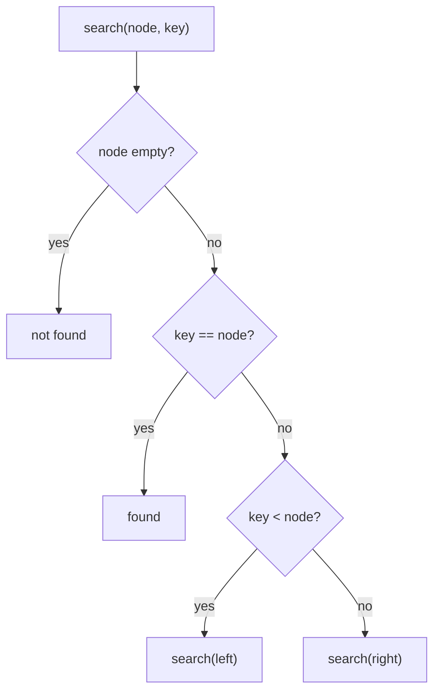
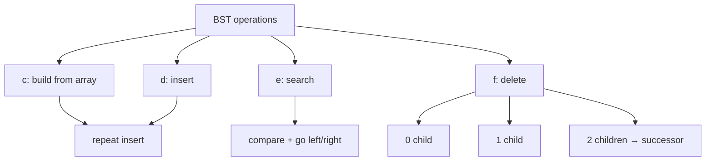
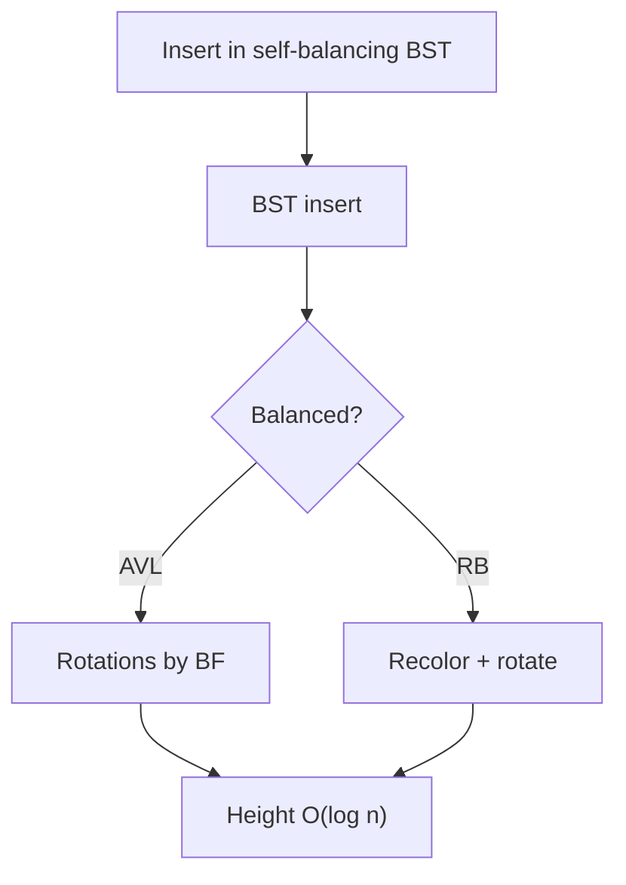

# MODULE 29 — Binary Search Trees (BST)

**Illustration code:** `a.cpp`–`q.cpp` · `r.cpp` (range sum) · `s.cpp` (closest to K) · `t.cpp` (Kth smallest) · `u.cpp` (two BST sum) · `v.cpp` (max sum BST) · `w.cpp`–`z.cpp` (more)

---

## From binary tree to BST

In **Module 28** you learned the **binary tree**: each node has at most **2 children** (left and right), but values could be placed **anywhere** — no ordering rule.

To **search** for a value in a general binary tree, you often must visit many nodes — worst case **all n nodes** → **O(n)** time.

A **Binary Search Tree (BST)** is a **special binary tree** with an **ordering rule** on values. That rule lets you **discard half** of the remaining tree at each step (like binary search on a sorted array).

> **BST idea:** At every node, everything on the **left** is **smaller**, everything on the **right** is **greater**.

---

## What is a BST?

A **binary search tree** is a binary tree that satisfies the **BST property**:

For **every** node `N`:

1. All values in the **left subtree** are **<** `N`'s value.
2. All values in the **right subtree** are **>** `N`'s value.
3. **No duplicate** keys (in the basic definition; some variants allow duplicates with a rule).

```text
Valid BST:                    NOT a BST:

        8                            8
       / \                          / \
      3   10                       3   10
     / \    \                      / \    \
    1   6    14                    1   9    14
       \    /                           \
        7  13                            7

left < 8 < right              9 is in left subtree of 8
at every node                 but 9 > 8  →  breaks rule
```

| Check | Valid BST (root 8) |
|-------|-------------------|
| Left of 8 | 3, 1, 6, 7 — all **< 8** |
| Right of 8 | 10, 14, 13 — all **> 8** |
| Left of 3 | 1 **< 3** |
| Right of 3 | 6, 7 **> 3** |

---

## BST property (detailed)

```text
              N
            /   \
    ALL values   ALL values
    < N.data     > N.data
    (left        (right
     subtree)     subtree)
```

This holds **recursively** — not only for direct children, but for **entire** left and right subtrees.

**Example walk — search for 7 in valid BST:**

```text
        8   →  7 < 8  go LEFT
       /
      3   →  7 > 3  go RIGHT
       \
        6  →  7 > 6  go RIGHT
         \
          7  →  FOUND

Only 4 nodes visited, not all 7 nodes in the tree
```

---

## Why BST improves search

| Structure | Search (worst case) | Why |
|-----------|---------------------|-----|
| **Unsorted array** | O(n) | Scan every element |
| **Sorted array** | O(log n) | Binary search on indices |
| **General binary tree** | O(n) | No order — may need full tree |
| **BST (balanced)** | **O(log n)** | Each step eliminates left **or** right subtree |
| **BST (skewed)** | **O(n)** | Becomes a linked list |

```text
Balanced BST (height ≈ log n):     Skewed BST (height = n):

        8                                1
       / \                                \
      3   10                                2
     / \    \                                \
    1   6    14                               3
                                               \
                                                4

search ~ log n steps                 search ~ n steps
```

**Key formula:**

```text
Time for search / insert / delete  =  O(height of tree)

Balanced BST:  height = O(log n)  →  O(log n)
Skewed BST:    height = O(n)      →  O(n)
```

---

## Inorder traversal of BST gives a sorted sequence

**Illustration code:** [`a.cpp`](a.cpp)

A very important fact: **inorder** traversal of a **BST** prints values in **ascending sorted order**.

**Inorder order:** **left** subtree → **root** → **right** subtree

```text
BST:                          Inorder output (sorted):

        8                     1  3  6  7  8  10  13  14
       / \
      3   10
     / \    \
    1   6    14
       \    /
        7  13
```

### Why it works (intuition)

At any node `N`:

1. **Inorder visits left subtree first** — all values there are **< N** (BST rule).
2. Then it prints **N**.
3. Then **right subtree** — all values there are **> N**.

So every value printed **before** `N` is smaller, and every value printed **after** is larger → entire sequence is **sorted**.

```text
When we visit node 8:

  already printed:  1, 3, 6, 7   (all from left, all < 8)
  print now:        8
  will print later: 10, 13, 14     (all from right, all > 8)
```

### Step-by-step inorder on sample BST

```text
        8
       / \
      3   10
     / \    \
    1   6    14
       \    /
        7  13

Visit order:
  go left of 8  →  inorder(3)
    go left of 3  →  print 1
    print 3
    go right of 3 →  inorder(6) → print 6, print 7
  print 8
  go right of 8 →  inorder(10) → print 10, print 13, print 14

Output: 1 3 6 7 8 10 13 14  ✓ sorted
```

### Compare with other traversals (same BST)

| Traversal | Order | Output on sample BST | Sorted? |
|-----------|-------|----------------------|---------|
| **Inorder** | left → root → right | `1 3 6 7 8 10 13 14` | **Yes** |
| **Preorder** | root → left → right | `8 3 1 6 7 10 14 13` | No |
| **Postorder** | left → right → root | `1 7 6 3 13 14 10 8` | No |

> **Only inorder** uses the BST property in the order **smaller → node → bigger** at every step.

### Code

```cpp
void inorder(Node* root) {
    if (!root) return;
    inorder(root->left);
    cout << root->data << " ";   // root in the middle
    inorder(root->right);
}
```

Store values in a `vector` and check: `isSorted(v)` should be **true** for a valid BST.

### Not true for a general binary tree

If the tree is **not** a BST, inorder does **not** sort values:

```text
NOT a BST (9 in left subtree of 8):

        8
       / \
      3   10
     / \    \
    1   9    14      ← 9 > 8 breaks BST

Inorder: 1 3 9 8 10 14   ← NOT sorted (9 before 8)
```

`a.cpp` builds a **valid BST**, runs inorder / preorder / postorder, and verifies the inorder list is sorted.

| | |
|--|--|
| **Time** | **O(n)** — visit every node once |
| **Space** | **O(h)** — recursion stack |

Run: `g++ -std=c++17 -o a a.cpp && ./a`

---

## Core operations

### 1. Search

```text
search(root, key):
  if root is null        → not found
  if key == root.data    → found
  if key < root.data     → search(root.left, key)
  if key > root.data     → search(root.right, key)
```

```cpp
Node* search(Node* root, int key) {
    if (!root || root->data == key) return root;
    if (key < root->data) return search(root->left, key);
    return search(root->right, key);
}
```

| | |
|--|--|
| **Time** | **O(h)** — height of tree |
| **Space** | **O(h)** — recursion stack |

---

### 2. Insert

Always insert as a **new leaf** in the position where search would end.

```text
Insert 5 into BST:

        8
       / \
      3   10
     / \    \
    1   6    14

5 < 8 → left
5 > 3 → right
5 < 6 → left of 6 → new node

        8
       / \
      3   10
     / \    \
    1   6    14
       /
      5
```

```cpp
Node* insert(Node* root, int key) {
    if (!root) return new Node(key);
    if (key < root->data) root->left = insert(root->left, key);
    else if (key > root->data) root->right = insert(root->right, key);
    return root;
}
```

| | |
|--|--|
| **Time** | **O(h)** |
| **Space** | **O(h)** |

---

### 3. Delete (overview)

Three cases when deleting node `key`:

| Case | Action |
|------|--------|
| **No children** (leaf) | Remove node |
| **One child** | Replace node with its child |
| **Two children** | Replace with **inorder successor** (smallest in right subtree) or **inorder predecessor** (largest in left subtree) |

```text
Delete 3 (two children) in:

        8
       / \
      3   10
     / \    \
    1   6    14

Inorder successor of 3 = smallest in right subtree = 6
Replace 3 with 6, delete old 6 from right subtree
```

Delete also runs in **O(h)** time.

---

## Node representation (C++)

Same as a binary tree — only the **rules** for placing values change.

```cpp
struct Node {
    int data;
    Node* left;
    Node* right;
    Node(int v) : data(v), left(nullptr), right(nullptr) {}
};
```

The **BST property** is maintained by **how** you insert/delete, not by a special field.

---

## BST vs other structures

| Structure | Ordered? | Search | Insert | Notes |
|-----------|----------|--------|--------|-------|
| **Array (unsorted)** | No | O(n) | O(1) end | Simple |
| **Array (sorted)** | Yes | O(log n) | O(n) shift | Binary search |
| **Linked list** | No | O(n) | O(1) | No random access |
| **BST** | Yes (inorder) | O(log n)* | O(log n)* | *if balanced |
| **`map` / `set` (C++)** | Yes | O(log n) | O(log n) | Usually red-black tree inside |

> **Lookup tables:** C++ `std::map` and `std::set` are often implemented as **balanced BSTs** (red-black trees). BST is the idea behind many real **dictionaries** and **databases indexes**.

---

## When is a tree a valid BST?

**Method 1 — range check (best for interviews):**

Pass a valid range `(min, max)` down the tree.

- At node `N`, require `min < N.data < max`.
- Left child: range becomes `(min, N.data)`.
- Right child: range becomes `(N.data, max)`.

```cpp
bool isBST(Node* root, long minV, long maxV) {
    if (!root) return true;
    if (root->data <= minV || root->data >= maxV) return false;
    return isBST(root->left, minV, root->data) &&
           isBST(root->right, root->data, maxV);
}
// call: isBST(root, LONG_MIN, LONG_MAX)
```

**Method 2 — inorder check:**

Do inorder traversal; values must be **strictly increasing**.

---

## Types of BST (preview)

| Type | Property |
|------|----------|
| **Standard BST** | Left < root < right |
| **Balanced BST (AVL, Red-Black)** | Height stays O(log n) after insert/delete |
| **BST (skewed)** | Degenerate — same as linked list |

```text
Same values, different shapes:

Balanced:          Skewed (bad):

    4                  1
   / \                   \
  2   6                   2
 / \ / \                   \
1 3 5 7                    3

both are BSTs if values follow rule
but skewed one has O(n) operations
```

---

## Summary

| Idea | Detail |
|------|--------|
| **What** | Binary tree + ordering: left smaller, right greater |
| **Search** | Compare at root; go left or right — **O(height)** |
| **Balanced** | Height **O(log n)** → fast lookup |
| **Skewed** | Height **O(n)** → same as linked list |
| **Inorder** | Prints values **sorted** |
| **Uses** | Lookup tables, `map`/`set`, symbol tables, indexes |



---

## Connection to Module 28

| Module 28 | Module 29 |
|-----------|-----------|
| Binary tree structure | Same structure |
| Any value placement | **Ordered** placement |
| Search O(n) general | Search **O(log n)** when balanced |
| Traversals | **Inorder** = sorted |

See `b.cpp` for search illustration; more operations in upcoming files.

---

## BST search

**Illustration code:** [`b.cpp`](b.cpp)

**Search** in a BST: start at the **root**, compare `key` with current node, go **left** if smaller, **right** if larger. Stop when found or `nullptr`.

### Algorithm

```text
search(root, key):
  if root is null           → not found
  if key == root.data       → found
  if key < root.data        → search(left)
  else                      → search(right)
```

```cpp
Node* search(Node* root, int key) {
    if (!root || root->data == key) return root;
    if (key < root->data) return search(root->left, key);
    return search(root->right, key);
}
```

### Example — search for 7 in balanced BST

```text
        8   key 7 < 8  → go left
       /
      3   7 > 3  → go right
       \
        6  7 > 6  → go right
         \
          7  found

3 comparisons, not 8 nodes
```

### Example — search for 7 (not in tree)

```text
Search 9 in same tree:
  8 → 10 → 14 → null   → not found
Still only follows ONE path down
```

### Mathematics — why time is O(height)

At each step you eliminate **either** the entire left **or** entire right subtree.

```text
Nodes visited on one search path ≤ height + 1

Balanced tree:  height = O(log n)  →  O(log n) steps
Skewed tree:    height = n - 1     →  O(n) steps
```

| | |
|--|--|
| **Time** | **O(h)** where `h` = height |
| **Space** | **O(h)** — recursion stack (or **O(1)** if iterative with a loop) |

Run: `g++ -std=c++17 -o b b.cpp && ./b`

---

## Balanced BST vs skewed BST

Shape of the tree controls **height** → controls **speed** of search, insert, and delete.

### Balanced BST

A **balanced** BST keeps height **roughly logarithmic** in the number of nodes `n`.

```text
Balanced BST (8 nodes):          height ≈ 3

            8
          /   \
         3     10
        / \      \
       1   6      14
          / \    /
         5   7  13

h ≈ log₂(8) = 3
Search visits at most ~4 nodes
```

| Property | Balanced BST |
|----------|----------------|
| **Height** | **O(log n)** |
| **Search / insert / delete** | **O(log n)** |
| **Shape** | Left and right subtrees have **similar** heights |
| **Examples** | AVL tree, Red-Black tree (`std::map`) |

```text
After each insert/delete, rotations may run to rebalance
( covered in advanced modules )
```

### Skewed BST

A **skewed** BST is a valid BST but looks like a **linked list** — every node has only **one** child.

Happens when you insert **sorted** values `1, 2, 3, 4, 5, ...` into a plain BST:

```text
Skewed BST (insert 1,2,3,4,5 in order):

    1
     \
      2
       \
        3
         \
          4
           \
            5

height = n - 1 = 4  for n = 5
Search for 5 visits ALL 5 nodes  →  O(n)
```

| Property | Skewed BST |
|----------|------------|
| **Height** | **O(n)** |
| **Search / insert / delete** | **O(n)** |
| **Shape** | Only left **or** only right chains |
| **Problem** | BST rules hold, but **no speed benefit** |

### Side-by-side comparison

```text
Same 5 keys {1,2,3,4,5} — two different BST shapes:

Balanced (if built well):     Skewed (sorted insert):

      3                            1
     / \                            \
    2   4                            2
   /     \                            \
  1       5                            3
                                        \
                                         4
                                          \
                                           5

height 2                      height 4
search 5: ~3 steps            search 5: 5 steps
```

### Time and space summary

| Operation | Balanced BST | Skewed BST | General binary tree |
|-----------|--------------|------------|---------------------|
| **Search** | **O(log n)** | **O(n)** | **O(n)** |
| **Insert** | **O(log n)** | **O(n)** | — |
| **Delete** | **O(log n)** | **O(n)** | — |
| **Space (search)** | **O(log n)** stack | **O(n)** stack | **O(n)** |

```text
n = 1000 nodes:

  Balanced:  ~10 comparisons
  Skewed:    ~1000 comparisons
```

### Iterative search (O(1) extra space)

Same logic, **no recursion**:

```cpp
Node* searchIter(Node* root, int key) {
    while (root) {
        if (key == root->data) return root;
        root = (key < root->data) ? root->left : root->right;
    }
    return nullptr;
}
```

| | |
|--|--|
| **Time** | **O(h)** |
| **Space** | **O(1)** — only pointer variables |

`b.cpp` searches the **same key** in a **balanced** BST and a **skewed** BST and prints how many steps each takes.

---

## Build a BST from an array

**Illustration code:** [`c.cpp`](c.cpp)

There is no special “array → BST” formula. You **insert each array element** into an **empty** BST, one by one, using the **BST insert** rule.

```text
Array:  8, 3, 10, 1, 6, 14, 7, 13

Start empty → insert 8 → insert 3 → insert 10 → ... → final BST
```

### Algorithm

```cpp
Node* root = nullptr;
for (int x : arr) {
    root = insert(root, x);
}
```

**Insert order matters** — same values in different order give **different shapes** (balanced vs skewed).

```text
Array {1,2,3,4,5} in order  →  skewed chain
Array {4,2,6,1,3,5,7}       →  more balanced
```

| | |
|--|--|
| **Time** | **O(n × h)** — `n` inserts, each **O(h)**; balanced **O(n log n)**, skewed **O(n²)** |
| **Space** | **O(h)** recursion per insert |

Run: `g++ -std=c++17 -o c c.cpp && ./c`

---

## Insert element in BST

**Illustration code:** [`d.cpp`](d.cpp)

**Insert** = walk like **search**; when you reach `nullptr`, attach a **new leaf** there.

### Steps

1. If `root == nullptr` → create new node with `key`.
2. If `key < root->data` → insert in **left** subtree.
3. If `key > root->data` → insert in **right** subtree.
4. If `key == root->data` → skip or handle duplicate (basic BST: no duplicate).

```text
Insert 5 into:

        8
       / \
      3   10
     / \    \
    1   6    14

8: 5<8 left → 3: 5>3 right → 6: 5<6 left → new node under 6
```

```cpp
Node* insert(Node* root, int key) {
    if (!root) return new Node(key);
    if (key < root->data) root->left = insert(root->left, key);
    else if (key > root->data) root->right = insert(root->right, key);
    return root;
}
```

| | |
|--|--|
| **Time** | **O(h)** |
| **Space** | **O(h)** |

Run: `g++ -std=c++17 -o d d.cpp && ./d`

---

## Search value in BST

**Illustration code:** [`e.cpp`](e.cpp)

Same logic as **BST search** in `b.cpp` — compare at root, go **left** or **right**.

### Recursive

```cpp
Node* search(Node* root, int key) {
    if (!root || root->data == key) return root;
    if (key < root->data) return search(root->left, key);
    return search(root->right, key);
}
```

### Iterative (O(1) extra space)

```cpp
while (root) {
    if (key == root->data) return root;
    root = (key < root->data) ? root->left : root->right;
}
return nullptr;
```

| Version | Time | Space |
|---------|------|-------|
| Recursive | **O(h)** | **O(h)** stack |
| Iterative | **O(h)** | **O(1)** |

Returns **pointer** to node if found, **`nullptr`** if not.

Run: `g++ -std=c++17 -o e e.cpp && ./e`

---

## Delete value in BST

**Illustration code:** [`f.cpp`](f.cpp)

**Delete** node with value `key` while keeping **BST property**.

Find the node using the same comparisons as search, then **3 cases**:

### Case 1 — Leaf (no children)

Simply remove the node.

```text
Delete 1 (leaf):

      3               3
     / \      →      / \
    1   6            6
```

### Case 2 — One child

Replace node with its **only child**.

```text
Delete 10 (only right child 14):

        8                   8
       / \                 / \
      3   10      →        3   14
     / \    \             / \
    1   6    14          1   6
```

### Case 3 — Two children

Replace node’s value with **inorder successor** = **smallest** node in **right** subtree (leftmost on the right). Then **delete** that successor from the right subtree.

```text
Delete 3 (two children):

        8                         8
       / \                       / \
      3   10          →          6   10
     / \    \                  / \    \
    1   6    14               1   7    14
         \
          7

Successor of 3 = 6 (smallest in right subtree)
Copy 6 into 3's position, delete old 6
```

### Algorithm (summary)

```text
delete(root, key):
  if root null → return null
  if key < root → root.left = delete(left)
  if key > root → root.right = delete(right)
  else (found):
    if no left child  → return right
    if no right child → return left
    successor = min in right subtree
    root.data = successor.data
    root.right = delete(right, successor.data)
  return root
```

| | |
|--|--|
| **Time** | **O(h)** |
| **Space** | **O(h)** |

Run: `g++ -std=c++17 -o f f.cpp && ./f`

---

### Build / insert / search / delete — summary

| Operation | File | Time | Space |
|-----------|------|------|-------|
| Build from array | `c.cpp` | O(n × h) | O(h) |
| Insert | `d.cpp` | O(h) | O(h) |
| Search | `e.cpp` | O(h) | O(h) or O(1) iterative |
| Delete | `f.cpp` | O(h) | O(h) |



---

## Inorder successor (BST)

**Illustration code:** [`g.cpp`](g.cpp)

Used mainly in **BST delete** when a node has **two children** — you copy the successor’s value into the node, then delete the old successor.

### What is it?

**Inorder successor** of a node `N` = the node that appears **immediately after** `N` in an **inorder** traversal (next larger value in a BST).

```text
Inorder:  1  3  6  7  8  10  13  14
              ^     ^
              N     successor of 3 is 6
```

### In a BST — how to find it

If `N` has a **right subtree**, the successor is the **leftmost (smallest) node** in that right subtree:

```text
        8
       / \
      3   10        Successor of 3:
     / \    \       1. go to right child → 6
    1   6    14     2. go left as far as possible → 6
         \
          7

Right subtree of 3: rooted at 6
Leftmost in that subtree: 6  ← inorder successor
```

**Steps:**

1. `succ = N->right`
2. While `succ->left != nullptr`, `succ = succ->left`
3. Done — `succ` is the inorder successor

```cpp
Node* inorderSuccessor(Node* node) {
    Node* succ = node->right;
    while (succ && succ->left) {
        succ = succ->left;
    }
    return succ;
}
```

### Why the successor has no left child

The successor is the **minimum** node in the **right subtree**, so there is **nothing smaller** below it on the left:

```text
        6          ← successor
       / \
      ?   ?        ← cannot have a left child
                   (would be smaller than 6)

Successor has NO left child (always).
It may have 0 or 1 right child.
```

| Property | Successor node |
|----------|----------------|
| **Left child** | **None** (it is the leftmost in its subtree) |
| **Right child** | Optional — **0 or 1** right child only |

That is why deleting the successor after copying is **easy** — it falls into delete **case 1 or 2** (leaf or one child), never two children.

### If there is no right subtree

If `N` has **no right child**, the successor is **not** below `N`. You must go **up** to an ancestor (first ancestor where `N` is in the left subtree). Used less often in basic delete code when you always pick successor from the right child.

```text
Successor of 7 (no right child in small tree):

        8
       /
      3
     / \
    1   6
         \
          7

Inorder: 1 3 6 7 8  →  successor of 7 is 8 (parent path upward)
```

For **delete with two children**, `N` always has a **right subtree** (because it also has a left child), so the **right-subtree minimum** method always works.

### Inorder predecessor (mirror)

**Inorder predecessor** = **rightmost** node in the **left** subtree (go left once, then right until null). Used as an alternative in delete case 3.

```text
Predecessor of 3 = largest in left subtree = 1? 
Left subtree of 3: 1 — predecessor is 1 (go left to 1, then right as far as possible)
```

### Use in delete (case 3)

```text
Delete node 3 with two children:

  1. Find successor = 6 (leftmost in right subtree)
  2. Copy 6 into node 3's position (value replace)
  3. Delete old node 6 from right subtree (easy — no left child)
```

| | |
|--|--|
| **Time to find successor** | **O(h)** — height of right subtree |
| **Space** | **O(1)** iterative loop |

Run: `g++ -std=c++17 -o g g.cpp && ./g`

---

## Print in range (BST)

**Illustration code:** [`h.cpp`](h.cpp)

Print all values in a BST that lie in **[low, high]** (inclusive).

Because the tree is **sorted** in inorder, answers appear in **sorted order**.

### Pruning idea (efficient)

```text
At node N:

  if N.data < low   →  only search RIGHT
  if N.data > high  →  only search LEFT
  else              →  print N, search BOTH sides
```

```text
Range [6, 10] on sample BST:

        8
       / \
      3   10
     / \    \
    1   6    14
       \    /
        7  13

Output: 6 7 8 10
```

### Algorithm

```cpp
void printInRange(Node* root, int low, int high) {
    if (!root) return;
    if (root->data >= low) printInRange(root->left, low, high);
    if (root->data >= low && root->data <= high)
        cout << root->data << " ";
    if (root->data <= high) printInRange(root->right, low, high);
}
```

| | |
|--|--|
| **Time** | **O(h + k)** — `k` = nodes in range; worst **O(n)** |
| **Space** | **O(h)** |

Run: `g++ -std=c++17 -o h h.cpp && ./h`

---

## Root to leaf paths

**Illustration code:** [`i.cpp`](i.cpp)

A **root-to-leaf path** starts at the **root** and ends at a **leaf**. Print **every** such path.

```text
        8
       / \
      3   10
     / \    \
    1   6    14

Paths:
  8 -> 3 -> 1
  8 -> 3 -> 6
  8 -> 10 -> 14
```

### Algorithm (DFS + backtrack)

1. Push node on `path`.
2. If **leaf** → print `path`.
3. Recurse left / right.
4. **Pop** before return.

```cpp
void paths(Node* root, vector<int>& path) {
    if (!root) return;
    path.push_back(root->data);
    if (!root->left && !root->right) print(path);
    else { paths(root->left, path); paths(root->right, path); }
    path.pop_back();
}
```

| | |
|--|--|
| **Time** | **O(n)** |
| **Space** | **O(h)** |

Run: `g++ -std=c++17 -o i i.cpp && ./i`

---

## Validate BST

**Illustration code:** [`j.cpp`](j.cpp)

Check if a binary tree satisfies the **BST property** everywhere.

### Valid vs invalid

```text
Valid:                      Invalid:

        8                           8
       / \                         / \
      3   10                       3   10
     / \    \                     / \    \
    1   6    14                  1   9    14
                                      ^
                               9 > 8 but in left subtree
```

### Method 1 — range (recommended)

```cpp
bool isBST(Node* root, long minV, long maxV) {
    if (!root) return true;
    if (root->data <= minV || root->data >= maxV) return false;
    return isBST(root->left, minV, root->data) &&
           isBST(root->right, root->data, maxV);
}
```

### Method 2 — inorder strictly increasing

Each inorder value must be **greater than** the previous.

| Method | Time | Space |
|--------|------|-------|
| Range | O(n) | O(h) |
| Inorder | O(n) | O(h) |

Run: `g++ -std=c++17 -o j j.cpp && ./j`

---

### h / i / j — summary

| Topic | File | Key idea |
|-------|------|----------|
| **Print in range** | `h.cpp` | Pruned inorder traversal |
| **Root to leaf** | `i.cpp` | DFS + backtrack path |
| **Validate BST** | `j.cpp` | Range or inorder check |

---

## Sorted array to balanced BST

**Illustration code:** [`k.cpp`](k.cpp)

Given a **sorted array**, build a **height-balanced BST** so search stays **O(log n)**.

### Key idea

Always pick the **middle** element as the root — then left and right halves have **equal size** (or differ by 1).

```text
Array:  1  2  3  4  5  6  7
              ^
            mid=4 → root

Left half [1,2,3] → left subtree
Right half [5,6,7] → right subtree
```

```text
        4
      /   \
     2     6
    / \   / \
   1  3  5   7
```

### Algorithm

```cpp
Node* build(vector<int>& a, int l, int r) {
    if (l > r) return nullptr;
    int mid = l + (r - l) / 2;
    Node* root = new Node(a[mid]);
    root->left  = build(a, l, mid - 1);
    root->right = build(a, mid + 1, r);
    return root;
}
```

| Step | Action |
|------|--------|
| 1 | `mid` = middle index |
| 2 | `a[mid]` becomes root |
| 3 | Recurse on `l .. mid-1` (left BST) |
| 4 | Recurse on `mid+1 .. r` (right BST) |

| | |
|--|--|
| **Time** | **O(n)** — each element becomes one node |
| **Space** | **O(log n)** — recursion depth ≈ tree height |

Run: `g++ -std=c++17 -o k k.cpp && ./k`

---

## Convert BST to balanced BST

**Illustration code:** [`l.cpp`](l.cpp)

A **valid BST** can be **skewed** (height **O(n)**) if values were inserted in sorted order. **Rebalance** it without changing the **inorder** sequence (same sorted order).

### Two-step recipe

```text
Step 1: Inorder traversal → sorted array (BST inorder is sorted)
Step 2: buildBalanced(array)  →  balanced BST (same values)
```

```text
Before (skewed):          After (balanced):

    1                          4
     \                        / \
      2                      2   6
       \                    / \ / \
        3                  1  3 5  7
         \
          ...

height O(n)                 height O(log n)
```

### Algorithm

1. `inorderCollect(root, vec)` — **O(n)**
2. `root = buildBalanced(vec, 0, n-1)` — **O(n)**
3. Free old skewed tree if replacing root

| | |
|--|--|
| **Time** | **O(n)** |
| **Space** | **O(n)** — array + **O(log n)** recursion on rebuild |

Run: `g++ -std=c++17 -o l l.cpp && ./l`

---

## Size of largest BST in a binary tree

**Illustration code:** [`m.cpp`](m.cpp)

Given a **general binary tree** (not necessarily a BST), find the **largest subtree** that **is** a valid BST. Return its **node count**.

```text
           10
          /  \
         5   15
        / \
       4   8        ← 8 breaks BST under 5
      / \
     2   5
    / \
   1   3

Largest BST subtree: rooted at 4 (nodes 4,2,5,1,3) → size 5
```

### Post-order idea

For each node, combine **left** and **right** subtree info:

| Field | Meaning |
|-------|---------|
| `isBST` | Is this subtree a valid BST? |
| `size` | If BST → node count; else → max BST size in children |
| `minVal`, `maxVal` | Range of values in subtree (if BST) |

```text
If left.isBST && right.isBST &&
   left.max < root.data < right.min:
     this subtree is BST
     size = left.size + right.size + 1
Else:
     size = max(left.size, right.size)   // best in children
     isBST = false
```

```cpp
struct Info { bool isBST; int size, minVal, maxVal; };
// empty child: isBST=true, size=0, min=INT_MAX, max=INT_MIN
```

| | |
|--|--|
| **Time** | **O(n)** — visit each node once |
| **Space** | **O(h)** — recursion |

Run: `g++ -std=c++17 -o m m.cpp && ./m`

---

## Merge two BSTs

**Illustration code:** [`n.cpp`](n.cpp)

Given two BSTs `t1` and `t2`, return one BST containing **all keys** in sorted order (merged result).

### Approach (3 steps)

```text
1. Inorder t1 → sorted array A
2. Inorder t2 → sorted array B
3. Merge A and B → sorted C
4. buildBalanced(C) → balanced merged BST
```

```text
BST1: 1 2 3        BST2: 5 7 9

Merged inorder: 1 2 3 5 7 9

        5
      /   \
     2     7
    / \     \
   1   3     9
```

### Merge two sorted arrays

```cpp
while (i < n && j < m) {
    if (A[i] <= B[j]) C.push_back(A[i++]);
    else C.push_back(B[j++]);
}
// append remaining
```

| | |
|--|--|
| **Time** | **O(m + n)** |
| **Space** | **O(m + n)** — merged array |

> **Note:** You can also merge using two pointers without full arrays (inorder iterators), but the **array + rebuild** method is the clearest to learn.

Run: `g++ -std=c++17 -o n n.cpp && ./n`

---

### k / l / m / n — summary

| Problem | File | Technique |
|---------|------|-----------|
| Sorted array → balanced BST | `k.cpp` | Middle element as root, recurse on halves |
| Balance a BST | `l.cpp` | Inorder → array → rebuild balanced |
| Largest BST subtree | `m.cpp` | Post-order `Info` (isBST, size, min, max) |
| Merge 2 BSTs | `n.cpp` | Two inorders + merge + balanced build |

---

## Self-balancing BSTs

A **self-balancing BST** automatically keeps tree **height small** (about **log n**) after **insert** and **delete**, so search / insert / delete stay **O(log n)**.

| Plain BST | Self-balancing BST |
|-----------|-------------------|
| Can become **skewed** | Stays **balanced** |
| Height **O(n)** worst | Height **O(log n)** |
| Insert sorted data → chain | Rotations / recoloring fix shape |

**Examples:** **AVL trees**, **Red-Black trees** (used in `std::map`, `std::set` in C++).

```text
Same 7 keys inserted in order:

Skewed BST:          AVL / Red-Black:

    1                    4
     \                  / \
      2                2   6
       \              / \ / \
        3            1  3 5  7
         \
          ...
height 6              height 2
```

---

## AVL trees

**Illustration code:** [`o.cpp`](o.cpp) (insert + rotations) · [`p.cpp`](p.cpp) (validate AVL)

### Definition

An **AVL tree** is a BST where **every node** is **height-balanced**:

```text
Balance Factor (BF) = height(left) - height(right)

|BF| <= 1  at EVERY node
```

| BF | Meaning |
|----|---------|
| **-1, 0, 1** | Balanced |
| **2 or -2** | Unbalanced → need **rotation** |

Each node stores its **height** (or compute on the fly).

### Why AVL is strict

AVL keeps heights **very close** — lookup is **faster** (fewer comparisons), but **more rotations** on insert/delete than Red-Black.

### Rotations (4 cases)

When `|BF| = 2` at node `N`, fix using **rotations**:

| Case | Shape | Fix |
|------|-------|-----|
| **LL** | Insert in **left** of **left** child | **Right** rotation at `N` |
| **RR** | Insert in **right** of **right** child | **Left** rotation at `N` |
| **LR** | Insert in **right** of **left** child | **Left** rotate child, then **right** rotate `N` |
| **RL** | Insert in **left** of **right** child | **Right** rotate child, then **left** rotate `N` |

```text
LL case (insert 30 into 10-20):     Right rotate at 10:

    10                                  20
      \                                /  \
       20                             10   30
        \
         30
```

```text
LR case:                Step 1 left rot      Step 2 right rot
    10                      10                  25
      \                       \                 /  \
       30        ->           25      ->      10   30
      /                         \
     25                          30
```

### AVL insert algorithm

1. Insert like normal **BST**.
2. Walk back up; **update heights**.
3. If `|BF| == 2` at any node → **rotate** (single or double).
4. Stop when balanced.

```cpp
Node* insertAVL(Node* root, int key) {
    if (!root) return new Node(key);
    if (key < root->data) root->left = insertAVL(root->left, key);
    else if (key > root->data) root->right = insertAVL(root->right, key);
    return balance(root);  // update height + rotate if needed
}
```

### AVL delete (overview)

1. Delete like BST (successor for two children).
2. Walk up; update heights and **rebalance** (rotations) same as insert.

### Important problem — check if tree is AVL

Post-order: subtree is AVL only if left & right are AVL **and** `|BF| <= 1`.

See **`p.cpp`**.

| Operation | Time | Space |
|-----------|------|-------|
| Search | **O(log n)** | O(1) iterative |
| Insert | **O(log n)** | **O(log n)** |
| Delete | **O(log n)** | **O(log n)** |
| Validate AVL | **O(n)** | **O(h)** |

Run: `g++ -std=c++17 -o o o.cpp && ./o` · `g++ -std=c++17 -o p p.cpp && ./p`

---

## Red-Black trees

**Illustration code:** [`q.cpp`](q.cpp)

### Definition

A **Red-Black tree** is a BST where each node has a **color**: **RED** or **BLACK**, following **5 rules**:

| # | Rule |
|---|------|
| 1 | Every node is **RED** or **BLACK** |
| 2 | **Root** is **BLACK** |
| 3 | Every **leaf** (null) is **BLACK** |
| 4 | **No two consecutive RED** nodes (RED parent → BLACK children) |
| 5 | Every path from node to descendant leaf has the **same black-height** |

```text
Black-height = number of BLACK nodes on any root-to-leaf path
(not counting the node itself, often counting null leaves as black)
```

Rules 4 and 5 guarantee height **<= 2 log(n+1)** → **O(log n)** operations.

### Why Red-Black is popular

- **Fewer rotations** than AVL on average (insert/delete faster to fix).
- Used in **C++ `std::map`**, **`std::set`**, **Java TreeMap**.
- Slightly **less strict** balance than AVL → faster updates, slightly taller trees.

### Red-Black vs AVL

| | **AVL** | **Red-Black** |
|--|---------|---------------|
| Balance | **Stricter** (`|BF| <= 1`) | **Relaxed** (color rules) |
| Lookup | **Faster** (shorter) | Slightly more comparisons |
| Insert/delete | More rotations | **Fewer** rotations |
| Use case | Databases (read-heavy) | **STL maps/sets** |

### Insert fix-up (idea)

1. Insert new node as **RED** (rule 5 preserved locally).
2. If parent is **BLACK** → done.
3. If parent is **RED** → **violation** → fix:

| Situation | Fix |
|-----------|-----|
| **Uncle is RED** | Recolor parent, uncle, grandparent; move problem up |
| **Uncle is BLACK** (triangle/zig-zag) | Rotate parent, then grandparent + recolor |
| **Uncle is BLACK** (line) | Rotate grandparent + recolor |

```text
Insert 25 (RED) under RED parent:

Recolor case: parent & uncle RED → flip to BLACK,
grandparent RED, continue fixing upward

Rotation case: rotate + recolor to remove consecutive REDs
```

4. Force **root BLACK** at end (rule 2).

See **`q.cpp`** for step-by-step insert output.

### Delete (overview)

Delete like BST, then **fix double-black** violations up the tree (more cases than insert — advanced topic).

| Operation | Time | Space |
|-----------|------|-------|
| Search | **O(log n)** | O(1) |
| Insert | **O(log n)** | **O(log n)** |
| Delete | **O(log n)** | **O(log n)** |

Run: `g++ -std=c++17 -o q q.cpp && ./q`

---

### Self-balancing BST — summary

| Topic | File | Key idea |
|-------|------|----------|
| **AVL insert** | `o.cpp` | BF + LL/RR/LR/RL rotations |
| **AVL validate** | `p.cpp` | Check `|BF| <= 1` everywhere |
| **Red-Black insert** | `q.cpp` | RED/BLACK rules + recolor + rotate |
| **STL** | — | `map` / `set` use Red-Black internally |




PROBLEM 1 -> r.cpp

 Given the root node of a binary search tree and two integers low and
high, return the sum of values of all nodes with a value in the inclusive range [low,
high].

PROBLEM 2 -> s.cpp

We have a binary search tree and a target node K. The task is to find the
node with minimum absolute difference with given target value K.

PROBLEM 3 -> t.cpp

Given the root of a binary search tree, and an integer k, return the kth
smallest value (1-indexed) of all the values of the nodes in the tree.


PROBLEM 4 -> u.cpp

Given two binary search trees, return True if and only if there is a node in
the first tree and a node in the second tree whose values sum up to a given integer
target.

PROBLEM 5 -> v.cpp

Given a binary tree root, return the maximum sum of all keys of any
sub-tree which is also a Binary Search Tree (BST).
Assume a BST is defined as follows:
● The left subtree of a node contains only nodes with keys less than the node's
key.
● The right subtree of a node contains only nodes with keys greater than the
node's key.
● Both the left and right subtrees must also be binary search trees.