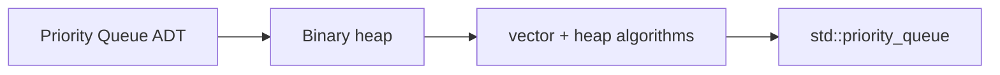
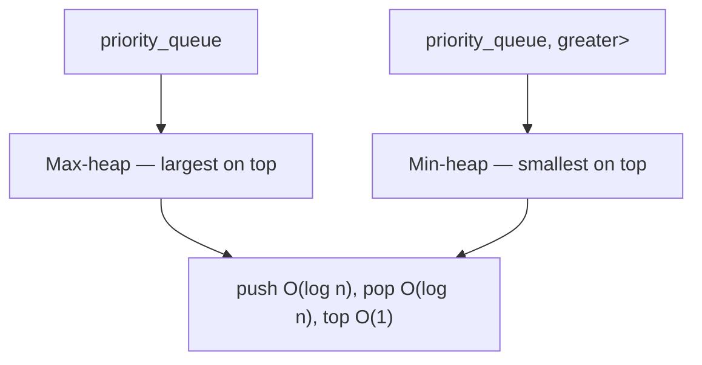

# MODULE 30 — Heaps & Priority Queue

**Illustration code:** `a.cpp` (PQ demo) · `b.cpp` (STL API: push / pop / top, max vs min heap) · `c.cpp`–`z.cpp` (more)

---

## What you already wrote (expanded)

Your draft captured four core ideas:

| Your note | Meaning |
|-----------|---------|
| **Heaps are implemented by PQ in C++** | `std::priority_queue` in `<queue>` is backed by a **binary heap** (by default `std::vector` + `heap` operations). |
| **Shortlist data by priority** | You only care about the **best** (or **worst**) element repeatedly — not full sorted order. |
| **Sort = O(n log n)** vs **PQ for top-k** | Full sort sorts **everything**; a heap often gives **O(n + k log n)** or **O(n log k)** when you only need the **top k**. |
| **Default = max at top** | `priority_queue<int>` is a **max-heap** — largest value has highest priority. |

---

## From queue to priority queue

In **Module 24** you saw a normal **queue (FIFO)**:

```text
enqueue →  [ 3 ] [ 7 ] [ 1 ]  → dequeue
           front          back

Order: first in, first out (by arrival time)
```

A **priority queue** does **not** follow arrival order. It always gives you the element with the **highest priority** first.

```text
insert: 5, 1, 9, 3

internal priority order (max-heap):  9 is "most important"

pop → 9
pop → 5
pop → 3
pop → 1
```

> **Priority queue idea:** Always access the **best** element (by a rule you define), not the oldest.

---

## What is a heap?

A **heap** is a **complete binary tree (CBT)** stored in an **array/vector**, with a **heap property** (max or min). In C++, the usual implementation is a **`priority_queue`**.

### Three layers (how to think about it)

| Layer | What you see | Role |
|-------|----------------|------|
| **1. Visual** | **Complete binary tree** | Draw the tree; check shape + parent/child rules |
| **2. In code** | **`vector` / array** (level-order) | How the tree is actually stored in memory |
| **3. ADT** | **`priority_queue`** | API: `push`, `top`, `pop` — heap logic hidden inside |

```text
  You picture:          Code stores:              You use:

       50                 [50,30,20,10,15,8]      priority_queue
      /  \                      ↑                 push / top / pop
    30    20               vector index 0 = root
```

> **Max-heap:** the **maximum** is always at the **root** of the tree (index `0` in the array).  
> **Min-heap:** the **minimum** is always at the **root**.

### Complete binary tree (CBT)

A **CBT** is a binary tree where:

- All levels are **fully filled**, **except** possibly the **last** level.
- The last level is filled **from left to right** (no “gap” on the left with a missing right sibling).

Every level is filled **left to right**, except possibly the last level (which is filled from the left).

```text
Complete:                    NOT complete:

        9                           9
       / \                         / \
      7   6                       7   6
     / \ /                       /     \
    3  5 4                     3       4
                               (missing left child on level 3)
```

### Max-heap property

For a **max-heap**: **parent ≥ both children** (at every node) → the **maximum** is always at the **root**.

```text
Max-heap (valid):

              50
            /    \
          30      20
         /  \    /
       10   15 8

50 ≥ 30, 20
30 ≥ 10, 15
20 ≥ 8
```

### Min-heap property

For a **min-heap**: **parent ≤ both children** (at every node) → the **minimum** is at the **root**.

```text
Min-heap (valid):

              3
            /   \
           5     8
          / \
         9   6
```

| Type | Root | Use when you need |
|------|------|-------------------|
| **Max-heap** | Largest | **K largest**, “best score”, Dijkstra with max? (usually min) |
| **Min-heap** | Smallest | **K smallest**, merge K sorted lists, shortest path |

---

## Heap as an array (important for interviews)

Store the tree **level-order** in an array `arr[]` (index 0 = root).

```text
Tree:          50
              /  \
            30    20
           / \   /
          10 15 8

Array:  [ 50 | 30 | 20 | 10 | 15 | 8 ]
Index:    0    1    2    3    4    5
```

For index `i`:

| Relation | Formula (0-based) |
|----------|-------------------|
| Parent | `(i - 1) / 2` |
| Left child | `2*i + 1` |
| Right child | `2*i + 2` |

**Example:** node `30` at index `1` → parent `(1-1)/2 = 0` → `50` ✓

---

## Core heap operations

| Operation | What it does | Time |
|-----------|--------------|------|
| **Peek** | See root (max or min) | **O(1)** |
| **Push** | Add element, **heapify up** (swap with parent until heap property holds) | **O(log n)** |
| **Pop** | Remove root, move last element to root, **heapify down** | **O(log n)** |
| **Build heap** (heapify all) | From unsorted array | **O(n)** |

### Push (heapify up) — max-heap

```text
Insert 45 into max-heap:

        50                         50
       /  \                       /  \
     30    20        →          45    20
    / \   /                     / \   /
   10 15 8                    10 15 8
                              /
                            30

45 > 30 → swap up
45 < 50 → stop
```

### Pop (heapify down) — max-heap

```text
Remove 50:

1. Replace root with last element (8)
2. Swap 8 down with larger child until heap property restored
```

---

## Priority queue (ADT) vs heap (implementation)

| Term | Meaning |
|------|---------|
| **Priority Queue (PQ)** | Abstract data type — API: `push`, `pop`, `top`, `empty` |
| **Heap** | Common **implementation** of a PQ with `O(log n)` push/pop |

Other implementations exist (e.g. balanced BST), but in contests and C++ STL you almost always use a **binary heap**.



---

## C++ `priority_queue`

**Illustration code:** [`a.cpp`](a.cpp)

```cpp
#include <queue>
#include <vector>
using namespace std;

// Max-heap by default (largest on top)
priority_queue<int> maxPQ;
maxPQ.push(5);
maxPQ.push(1);
maxPQ.push(9);
cout << maxPQ.top();  // 9
maxPQ.pop();

// Min-heap: greater<T> makes "largest" = smallest value
priority_queue<int, vector<int>, greater<int>> minPQ;
```

| Template parameter | Default | Role |
|--------------------|---------|------|
| `T` | — | Element type |
| `Container` | `vector<T>` | Underlying storage |
| `Compare` | `less<T>` | **Max-heap** (larger = higher priority) |
| `Compare` | `greater<T>` | **Min-heap** (smaller = higher priority) |

**Note:** `priority_queue` has **no iterators** — you cannot traverse it in sorted order; only `top`, `push`, `pop`.

Run: `g++ -std=c++17 -o a a.cpp && ./a`

---

## When to use a priority queue

Use a PQ when the problem needs **repeated access to the best element**, not the full sorted list.

| Situation | Why PQ? |
|-----------|---------|
| **Top K** largest / smallest | Keep only K elements in a heap while scanning |
| **K-way merge** (merge K sorted lists/arrays) | Always pick the smallest among K fronts — min-heap of size K |
| **Dijkstra’s shortest path** | Always expand the **closest** unvisited node — min-heap |
| **Huffman coding** | Repeatedly merge two **smallest** frequencies |
| **Running median** | Two heaps (max-heap for lower half, min-heap for upper half) |
| **Task scheduling** | Highest priority job runs first |
| **Connect ropes** (minimum cost) | Always merge two **smallest** ropes — min-heap |

**Do not use PQ when:** you need the **entire** array sorted once → `sort()` is simpler and `O(n log n)`.

---

## Full sort vs heap for “top K” — your O(n log n) vs O(n + k log n) note

### Sort everything

```text
Sort all n elements  →  O(n log n)
Take first k         →  O(k)

Total: O(n log n)
```

You pay to order **all** elements even if you only need **k**.

### Heap — find top K largest (max-heap of size K, or min-heap trick)

**Method A — min-heap of size K (scan once):**

```text
For each of n elements:
  push into min-heap of size K
  if size > K, pop smallest

Heap always holds the K largest seen so far.

Time: O(n log K)   Space: O(K)
```

**Method B — build heap on all n, extract k times:**

```text
Build max-heap from array     →  O(n)
Pop k times (each O(log n))   →  O(k log n)

Total: O(n + k log n)   Space: O(n)
```

| Approach | Time | When it wins |
|----------|------|--------------|
| **Full sort** | O(n log n) | Need **full** sorted output, or k ≈ n |
| **Min-heap size K** | **O(n log k)** | **k ≪ n** (top 10 from 1 million) |
| **Build heap + k pops** | **O(n + k log n)** | Good when k is moderate |

```text
Example: n = 1,000,000, k = 10

Sort:           ~ 1M × log(1M)  ≈ 20M operations
Heap size 10:   ~ 1M × log(10)  ≈ 3.3M operations  → much faster
```

> **Your note in one line:** Sorting is **O(n log n)** for the whole array; a heap lets you get the **top k** in **O(n log k)** or **O(n + k log n)** without sorting everything.

---

## PQ vs other structures (quick comparison)

| Structure | What comes out first | Typical top operation |
|-----------|----------------------|------------------------|
| **Stack** | Last pushed (LIFO) | `O(1)` |
| **Queue** | First pushed (FIFO) | `O(1)` |
| **Priority queue** | **Highest priority** | `O(1)` peek, `O(log n)` push/pop |
| **BST (`map` / `set`)** | Sorted order | `O(log n)` insert/search |
| **Sorted array** | Min/max at ends | `O(1)` peek if sorted, `O(n log n)` to build |

PQ is best when priorities **change** or you need **many** “give me the best” operations without maintaining a full sorted structure.

---

## Common patterns

### 1. Top K largest — min-heap of size K

```text
Rule: If you want the K LARGEST, use a MIN-heap of size K.
      The root is the weakest of your top K → easy to evict.
```

```cpp
priority_queue<int, vector<int>, greater<int>> pq; // min-heap
for (int x : nums) {
    pq.push(x);
    if (pq.size() > k) pq.pop();
}
// pq holds k largest; top() is the smallest among them
```

### 2. Top K smallest — max-heap of size K

```text
Rule: If you want the K SMALLEST, use a MAX-heap of size K.
```

### 3. Merge K sorted lists (from Module 24)

```text
Push head of each list into min-heap.
Pop smallest → attach to answer → push that node’s next.

Time: O(n log K)   n = total nodes, K = number of lists
```

### 4. Two heaps for median

```text
Lower half → max-heap (gives largest of lower half)
Upper half → min-heap (gives smallest of upper half)
Balance sizes → median from both tops
```

---

## Heap sort (connection to Module 13)

**Heap sort** uses a heap to sort in place:

1. Build max-heap → **O(n)**
2. Repeatedly swap root with end, shrink heap, heapify down → **n × O(log n)**

**Total: O(n log n)** time, **O(1)** extra space (if array is in-place).

C++ `std::sort` is usually faster in practice (IntroSort hybrid); heap sort is still important to understand **heap mechanics**.

---

## Complexity summary

| Operation | Binary heap |
|-----------|-------------|
| `top` / `peek` | O(1) |
| `push` | O(log n) |
| `pop` | O(log n) |
| Build heap from array | O(n) |
| Find top K (heap size K) | O(n log k) |
| Full sort via heap sort | O(n log n) |

---

## Mental checklist (interviews)

1. Do I need only the **extreme** value (min/max) or **top K**? → **PQ**
2. Do I need **fully sorted** output? → **`sort`**
3. Am I merging **K sorted** streams? → **min-heap of size K**
4. Max or min on top? → default PQ = **max**; use `greater<>` for **min**
5. Can I use a **fixed-size** heap of K? → often **O(n log k)** beats sort

---

## Module map (what comes next)

| Topic | Typical file | Idea |
|-------|--------------|------|
| PQ basics | `a.cpp` | `push`, `top`, `pop`, min vs max |
| STL API + max/min heap | `b.cpp` | `priority_queue` operations, `greater<>` |
| Custom comparator | `c.cpp` | Structs, pairs, `operator<` |
| Top K problems | `c.cpp`+ | Heap size K |
| Merge K sorted | | Min-heap |
| Heap implementation | | Array + heapify up/down |

---

## Key takeaways

1. A **heap** is a **complete binary tree** with the **heap property** (max or min at root).
2. A **priority queue** is the **interface**; in C++ it is implemented as a **heap** on a `vector`.
3. Use PQ when you **shortlist by priority** — top K, best-next, K-way merge — not when you need a full sort.
4. **Default `priority_queue<int>`** = **max-heap** (largest on top).
5. **Top K** is often **O(n log k)** with a size-K heap, better than **O(n log n)** full sort when **k ≪ n**.

---

## Priority queue in C++ STL

**Illustration code:** [`b.cpp`](b.cpp)

```cpp
#include <queue>
using namespace std;

priority_queue<int> pq;   // max-heap by default
```

`priority_queue` lives in **`<queue>`**. It is **not** a normal queue (FIFO) — it always exposes the **highest-priority** element at `top()`.

### Main operations

| Method | What it does | Time | Notes |
|--------|--------------|------|-------|
| **`push(x)`** | Insert `x`, restore heap property (heapify up) | **O(log n)** | `n` = current size |
| **`pop()`** | Remove the top (root) element, heapify down | **O(log n)** | Does **not** return the value — call `top()` first if you need it |
| **`top()`** | See the best element **without** removing | **O(1)** | Root of the heap |
| **`empty()`** | Is the PQ empty? | **O(1)** | |
| **`size()`** | Number of elements | **O(1)** | |

```text
pq.push(5);   // O(log n) — bubble up
pq.push(9);
pq.push(1);

pq.top();     // O(1)  → 9  (largest in max-heap)
pq.pop();     // O(log n) — remove 9, fix heap
pq.top();     // → 5
```

**Typical loop:**

```cpp
while (!pq.empty()) {
    int best = pq.top();  // O(1)
    pq.pop();             // O(log n)
    // use best...
}
```

Run: `g++ -std=c++17 -o b b.cpp && ./b`

---

## Max-heap vs min-heap (detailed)

Both are the **same data structure** (complete binary tree + heap property). Only the **comparison rule** changes.

### Max-heap

**Rule:** Every parent is **≥** its children → **largest** value sits at the **root**.

```text
              50
            /    \
          30      20
         /  \    /
       10   15  8

top() always returns 50
pop order: 50, 30, 20, 15, 10, 8  (not fully sorted, but max first each step)
```

**C++ — default `priority_queue`:**

```cpp
priority_queue<int> pq;          // max-heap
// same as:
priority_queue<int, vector<int>, less<int>> pq;
```

`less<int>` means: “higher priority = **larger** integer.”

| You need | Heap type | C++ |
|----------|-----------|-----|
| Largest first | **Max-heap** | `priority_queue<int>` |
| “Best” = highest score | **Max-heap** | default |
| Top K **largest** (size-K trick) | **Min-heap** of size K | `greater<int>` — see below |

---

### Min-heap

**Rule:** Every parent is **≤** its children → **smallest** value sits at the **root**.

```text
              3
            /   \
           5     8
          / \
         9   6

top() always returns 3
pop order: 3, 5, 6, 8, 9
```

**C++ — pass `greater<int>` as 3rd template argument:**

```cpp
priority_queue<int, vector<int>, greater<int>> pq;   // min-heap
```

`greater<int>` means: “higher priority = **smaller** integer.”

| You need | Heap type | C++ |
|----------|-----------|-----|
| Smallest first | **Min-heap** | `greater<int>` |
| Merge K sorted lists | **Min-heap** | pick smallest front |
| Dijkstra | **Min-heap** | smallest distance |
| Top K **largest** | **Min-heap** of size K | evict smallest of top-K |

---

### Side-by-side (same inserts: 5, 1, 9, 3, 7)

```text
MAX-HEAP (default)              MIN-HEAP (greater<int>)

        9                               1
       / \                             / \
      7   5                           3   5
     /                               /
    1                               7

top() → 9                         top() → 1
pop → 9,7,5,3,1                   pop → 1,3,5,7,9
```

---

### Why “top K largest” uses a **min**-heap (counter-intuitive but important)

Goal: keep only the **K largest** while scanning `n` numbers.

```text
Use min-heap of size K:
  - Root = smallest among your current top K
  - New number smaller than root? ignore (can't be in top K)
  - New number larger than root? pop root, push new number

Example K=3, stream: 4, 1, 7, 3, 9, 2, 8

After processing all, heap holds {7, 8, 9}  (top 3 largest)
```

If you used a **max-heap**, you would get the single largest easily, but not a controlled “top K” without extra logic.

---

### Template parameters (all three)

```cpp
priority_queue< T, Container, Compare >
```

| Parameter | Default | Role |
|-----------|---------|------|
| `T` | — | Element type (`int`, `pair<...>`, etc.) |
| `Container` | `vector<T>` | Where elements are stored |
| `Compare` | `less<T>` | **Max-heap** |
| `Compare` | `greater<T>` | **Min-heap** |



---

### Common mistakes

| Mistake | Fix |
|---------|-----|
| Expect FIFO order | PQ is **by priority**, not arrival order |
| `pop()` returns a value | It returns **void** — use `top()` then `pop()` |
| Want smallest but use default PQ | Add `greater<int>` |
| Iterate with `for (auto x : pq)` | **No iterators** on `priority_queue` — only `top` / `pop` |
| Confuse `top()` with sorted order | Repeated `pop` gives **priority order**, not full sort of all elements at once |

---

### STL summary (`b.cpp`)

```cpp
priority_queue<int> pq;   // max-heap

pq.push(10);    // O(log n)
pq.top();       // O(1)  — largest
pq.pop();       // O(log n)
priority_queue<int, vector<int>, greater<int>> minPq;  // min-heap
minPq.push(10);
minPq.top();    // smallest
```

HEAPS 

we visualise hte heap as COmplete Binary tree
inside the code we write this tree as a vector/array
the implementation is as Priority queue

in max heap int eh tree the max will be the root
in min heap in teh tree the min will be the root

Heap is a Complete BT (CBT)
• CBT is a BT where all levels are filled except maybe the last one, which is filled from left to right
• Parent >= Children
//Max Heap

Building the heap data structure -> c.cpp

Heaps
Building the Heap Data Structure
• push) //insert
• pop() //pop max or min
• top() //get max or