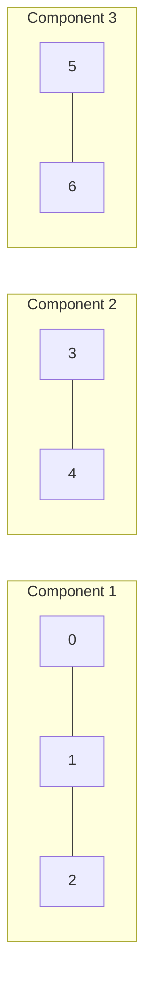
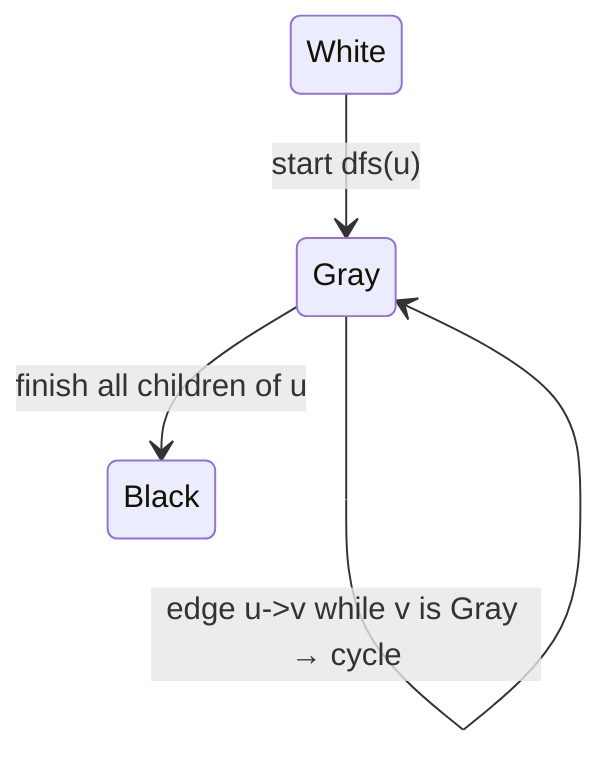
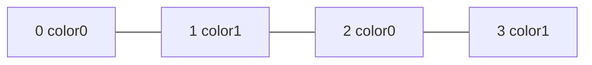

# MODULE 34 — Graph algorithms: components, cycles, bipartite graphs, coloring & path enumeration

**Illustration code:** [`a.cpp`](a.cpp) · [`b.cpp`](b.cpp) · [`c.cpp`](c.cpp) · [`d.cpp`](d.cpp) · [`e.cpp`](e.cpp) · [`f.cpp`](f.cpp) · [`g.cpp`](g.cpp) · [`h.cpp`](h.cpp) · [`i.cpp`](i.cpp) · [`j.cpp`](j.cpp) · [`k.cpp`](k.cpp)

This module assumes you already know what a **graph** is (vertices and edges). Here we use:

- **\(V\)** — number of vertices, usually labeled **`0, 1, \ldots, V-1`** in code.
- **\(E\)** — number of edges (undirected: each physical link counts once; directed: each arrow counts once).
- **`adj[u]`** — adjacency **list**: neighbors of vertex **`u`** (for directed graphs: only **out-neighbors**).

Unless stated otherwise, **traversal cost** is **\(O(V + E)\)** time and **\(O(V)\)** extra space for `visited` / queues, because every vertex is processed a constant number of times and every edge is examined when we scan one endpoint’s list.

---

## PART A — Disconnected components (undirected graphs)

### A.1 What is a connected component?

**Definition (intuitive):** Pick any vertex \(s\). The **component** containing \(s\) is the set of **all** vertices you can reach from \(s\) by walking along edges **in any direction** (undirected graph).

**Definition (formal):** Vertices \(u\) and \(v\) are in the same component if there exists a **path**  
\(u = x_0, x_1, \ldots, x_k = v\) such that every \(\{x_i, x_{i+1}\}\) is an edge.  
**Connected components** are the **equivalence classes** of this “mutually reachable” relation.

**Disconnected graph:** More than one component — some pair of vertices has **no** path between them.

### A.2 Example (three pieces)

Edges only **within** three groups; **no** edge between groups:

```text
  Component A          Component B       Component C

    0 — 1 — 2           3 — 4           5 — 6

```

- From vertex **`0`** you can reach **`1, 2`** but never **`3`**.
- Total **connected components** = **3**.



### A.3 Counting components — why “restart” DFS / BFS works

**Key idea:** If you start DFS (or BFS) from a vertex **inside** one component, you will mark **exactly** that whole component and **no** other vertices.

**Algorithm (high level):**

| Step | Action |
|------|--------|
| 1 | Create `visited[0..V-1]`, all `false`. Set `count = 0`. |
| 2 | For each `i` from `0` to `V-1`: if `visited[i]` is `false`, then **`count++`** and run **`explore(i)`** (DFS or BFS) marking every vertex reachable from `i`. |
| 3 | Return `count`. |

Each time you call `explore` on an unvisited vertex, you discover a **new** component.

**DFS — [`a.cpp`](a.cpp)**

- **Time:** **\(O(V + E)\)** — each vertex enters DFS once; each edge is examined at most twice in an undirected list representation (once from each endpoint).
- **Space:** **\(O(V)\)** for `visited` + **\(O(V)\)** recursion stack in the worst case (e.g. a long path).

**BFS — [`b.cpp`](b.cpp)**

- Same **\(O(V + E)\)** time.
- **Space:** **\(O(V)\)** for `visited` + **\(O(V)\)** for the queue at worst.

---

## PART B — Cycles in graphs (what “cycle” means here)

### B.1 Undirected graphs

**Simple cycle (informal):** A closed walk that repeats **no** vertex (except start/end) and uses **distinct edges**. In practice: “tree + one extra edge” creates **exactly one** simple cycle in a connected graph.

**Detection intuition:** While exploring a **tree** built by BFS/DFS, every edge connects a node to its **parent** or goes **down** the tree. If you see an edge to an already visited vertex that is **not** the parent, you found a **back edge** → **cycle**.

### B.2 Directed graphs

A **directed cycle** is a directed path that returns to its start following arc directions. A **DAG** (directed acyclic graph) has **no** directed cycles.

---

## PART C — Undirected cycle detection

### C.1 BFS with parent — [`c.cpp`](c.cpp)

**State:** queue stores pairs **`(vertex, parent)`** (`parent = -1` for the BFS root).

| Step | Action |
|------|--------|
| 1 | For each unvisited start `s` (handles disconnected graph), push `(s, -1)`, mark `s` visited. |
| 2 | Pop `(u, parent)`. For each neighbor `v`: if `v` unvisited, push `(v, u)` and mark visited. |
| 3 | If `v` **is** visited and **`v ≠ parent`**, report **cycle** (back edge). |

**Example — tree (no cycle):** path `0 — 1 — 2 — 3`. Every cross-link is only tree edge.

**Example — triangle:** vertices `0,1,2` all connected. When BFS expands from `0`, it reaches `1` and `2`. Edge `1–2` makes both visited with `parent` not equal → **cycle**.

```text
Triangle:

    0
   / \
  1---2

```

- **Time / space:** **\(O(V + E)\)**, **\(O(V)\)**.

### C.2 DFS with parent — [`d.cpp`](d.cpp)

Recursive version of the **same rule**: from `u`, neighbor `v` visited and `v ≠ parent` ⇒ cycle.

- **Time:** **\(O(V + E)\)**; **space:** **\(O(V)\)** stack + visited.

### C.3 DSU — [`e.cpp`](e.cpp)

Process edges **one by one**. Before `unite(u, v)`:

- If **`find(u) == find(v)`**, `u` and `v` are already connected — adding \((u,v)\) creates a **cycle**.
- Else merge.

**Math note:** In a forest with **\(c\)** connected components, **\(|E| = |V| - c\)**. Adding an edge that connects two different components **decreases** `c` by one. Adding an edge **inside** one component increases **\(|E| - (|V|-c)\)** and creates a cycle.

- **Time:** **\(O(E \cdot \alpha(V))\)** ≈ **\(O(E)\)** with union-by-rank and path compression, where \(\alpha\) is the inverse Ackermann function (tiny in practice).

---

## PART D — Directed cycle detection

### D.1 Kahn “peeling” (queue of indegree zero) — [`f.cpp`](f.cpp)

**Model:** Repeatedly remove vertices with **no incoming edges** from the **remaining** graph; update indegrees.

| Step | Action |
|------|--------|
| 1 | Compute `indegree[v]` for all `v`. |
| 2 | Push every vertex with `indegree[v] == 0` into a queue. |
| 3 | Pop `u`, increment `processed`, for each edge `u → w` do `indegree[w]--`; if zero, push `w`. |
| 4 | If **`processed < V`**, some vertices were never removed → each lies on a **directed cycle** (or depends on one). |

**Why it works:** In a DAG, there is always a **source** (indegree 0). Removing it preserves acyclicity. If no source exists, every vertex in the remaining subgraph has indegree ≥ 1 inside that subgraph → you can follow edges forever and must **cycle**.

- **Time / space:** **\(O(V + E)\)**, **\(O(V)\)**.

### D.2 DFS three colors — [`g.cpp`](g.cpp)

**Colors:** `0 = white` (unseen), `1 = gray` (on current recursion stack), `2 = black` (finished).

**Rule:** Edge **\(u \to v\)** with **`v` gray** means `v` is an **ancestor** in the DFS tree → **back edge** → **directed cycle**.



### D.3 Kahn + topological order — [`h.cpp`](h.cpp)

Same peeling as **`f.cpp`**, but **append** each removed vertex to an array **`topo`**.  
If **`topo.size() == V`**, graph is a **DAG** and `topo` is a **valid topological order** (for every edge `u→v`, `u` appears **before** `v` in `topo`).

If **`topo.size() < V`**, a directed **cycle** exists — **no** full topological ordering.

---

## PART E — Bipartite graphs & 2-coloring — [`i.cpp`](i.cpp)

### E.1 Definition

**Bipartite graph:** Vertices split into two **disjoint** sets \(L\) and \(R\) (**bipartition**) such that **every** edge connects one vertex in \(L\) to one in \(R\). **No** edge joins two vertices **within** the same set.

**Equivalent formulation — 2-coloring:** Assign each vertex color **`0` or `1`** (**proper** coloring) so that **no** edge has **both** ends the same color.

### E.2 Example — bipartite (path / even path)

```text
   Set L (color 0)     Set R (color 1)

        0 --- 1 --- 2 --- 3
       (0)   (1)   (0)   (1)

```

Edges only connect **different** colors.



### E.3 Example — NOT bipartite (triangle = odd cycle)

```text
        0
       / \
      1---2

```

Whatever color you put on `0`, vertices `1` and `2` must be **opposite** colors to match `0`, but then **`1` and `2` are adjacent with the same constraint** → impossible.

### E.4 Your reference table (what it means)

For **connected finite** undirected graphs:

| Graph contains… | Bipartite? | Reason (short) |
|-----------------|------------|----------------|
| **No cycles** (a **forest** / **tree**) | **TRUE** | Trees are bipartite: BFS layers alternate sets. |
| Only **even** length cycles | **TRUE** | Can alternate colors around the cycle consistently. |
| At least one **odd** cycle | **FALSE** | Alternating two colors around an odd cycle forces a contradiction at the start/end. |

**Theorem (standard):** An undirected graph is **bipartite** **if and only if** it has **no odd cycle** (equivalently: all cycles have **even** length).  

**Proof idea (only-if):** In a proper 2-coloring, walking one edge **flips** color. After **\(k\)** edges you return to start only if color flips an **even** number of times ⇒ **\(k\)** is **even** ⇒ every cycle is even length.  

**Proof idea (if):** In each connected component, pick any `s`, BFS/DFS assign color = parity of distance from `s`. An odd cycle would force conflicting parity — impossible — so if graph has no odd cycle, this always works.

### E.5 Algorithm — BFS 2-coloring — [`i.cpp`](i.cpp)

| Step | Action |
|------|--------|
| 1 | `color[v] = -1` for all `v` (uncolored). |
| 2 | For each uncolored start `s`, set `color[s]=0`, push `s` in queue. |
| 3 | Pop `u`. For each neighbor `v`: if `color[v]==-1`, set `color[v]=1-color[u]`, push `v`. If `color[v]==color[u]`, return **not bipartite**. |
| 4 | If all components finish without conflict, graph is **bipartite**. |

- **Time:** **\(O(V + E)\)**; **space:** **\(O(V)\)**.

---

## PART F — Graph coloring (general) — [`j.cpp`](j.cpp)

### F.1 Definitions

**Proper coloring:** Each vertex gets a color (integer label); **every** edge joins **different** colors.

**Chromatic number** \(\chi(G)\): **minimum** number of colors in any **proper** coloring of \(G\).

**Greedy coloring:** Fix an order of vertices \(v_1, v_2, \ldots, v_n\). Color \(v_i\) with the **smallest** color not already used on any **already colored** neighbor of \(v_i\).

**Bounds (facts, no full proofs here):**

- Always \(\chi(G) \le \Delta + 1\) where \(\Delta\) is **maximum degree** (greedy in any order achieves this).
- **Brooks’ theorem:** For a connected graph that is **not** a clique or an odd cycle, \(\chi(G) \le \Delta\).

**Bipartite \(\Leftrightarrow\) \(\chi(G) \le 2\)** (for graphs with at least one edge, \(\chi(G)=2\) if connected bipartite).

### F.2 Example — `C_5` (5-cycle)

Odd cycle ⇒ **not bipartite** ⇒ \(\chi(C_5) = 3\). Greedy in order `0,1,2,3,4` typically finds **3** colors (see [`j.cpp`](j.cpp)).

```text
C5:

      0
    /   \
   4     1
   |     |
   3 --- 2

```

### F.3 Example — complete bipartite \(K_{2,2}\)

Two vertices on left `{0,1}`, two on right `{2,3}`, **all** cross edges present. Here \(\chi(K_{2,2})=2\), and greedy often finds **2** colors.

- **Time (simple implementation):** **\(O(V^2 + E)\)** with a boolean “forbidden” array per vertex; can be improved with bitsets for small \(\Delta\).

---

## PART G — Enumerate all simple paths — [`k.cpp`](k.cpp)

### G.1 Problem

**Input:** Directed graph `adj`, **source** `src`, **destination** `dest`.  
**Output:** List **all simple paths** (no repeated vertex) from `src` to `dest`.

### G.2 Algorithm — DFS + “vertices on current path”

| Step | Action |
|------|--------|
| 1 | Maintain `onPath[u]` (bool) and vector `path`. |
| 2 | Enter `u`: `onPath[u]=true`, `path.push_back(u)`. |
| 3 | If `u==dest`, store `path` as one answer. Else for each `v` in `adj[u]` with `!onPath[v]`, recurse. |
| 4 | Leave `u`: `path.pop_back()`, `onPath[u]=false` (**backtrack**). |

### G.3 Example graph (directed)

```text
   0 ---> 1 ---> 3 ---> 4
   |              ^
   |/---> 2 ------+
   +-------------> 3

```

Paths **`0 → 4`** (simple):

- `0 → 1 → 3 → 4`
- `0 → 2 → 3 → 4`
- `0 → 3 → 4`

### G.4 Complexity warning (important)

Number of simple paths can grow **exponentially** in **\(V\)** (complete DAG–like constructions). This method is for **small** graphs or teaching — not for huge `V` unless the graph is very sparse/restricted.

- **Time:** **\(O(\text{#paths} \times \text{path length})\)** in output size; worst-case exponential in `V`.
- **Space:** **\(O(V)\)** for recursion + path + `onPath`.

---

## Quick reference — cycle detection summary

| Graph | Method | File |
|--------|--------|------|
| Undirected | BFS + parent | [`c.cpp`](c.cpp) |
| Undirected | DFS + parent | [`d.cpp`](d.cpp) |
| Undirected | DSU on edges | [`e.cpp`](e.cpp) |
| Directed | Kahn peel | [`f.cpp`](f.cpp) |
| Directed | DFS 3-color | [`g.cpp`](g.cpp) |
| Directed | Kahn + topo order | [`h.cpp`](h.cpp) |

---

## Compile all illustrations

```bash
cd Module-34
g++ -std=c++17 -o a a.cpp && ./a
g++ -std=c++17 -o b b.cpp && ./b
g++ -std=c++17 -o c c.cpp && ./c
g++ -std=c++17 -o d d.cpp && ./d
g++ -std=c++17 -o e e.cpp && ./e
g++ -std=c++17 -o f f.cpp && ./f
g++ -std=c++17 -o g g.cpp && ./g
g++ -std=c++17 -o h h.cpp && ./h
g++ -std=c++17 -o i i.cpp && ./i
g++ -std=c++17 -o j j.cpp && ./j
g++ -std=c++17 -o k k.cpp && ./k
```
