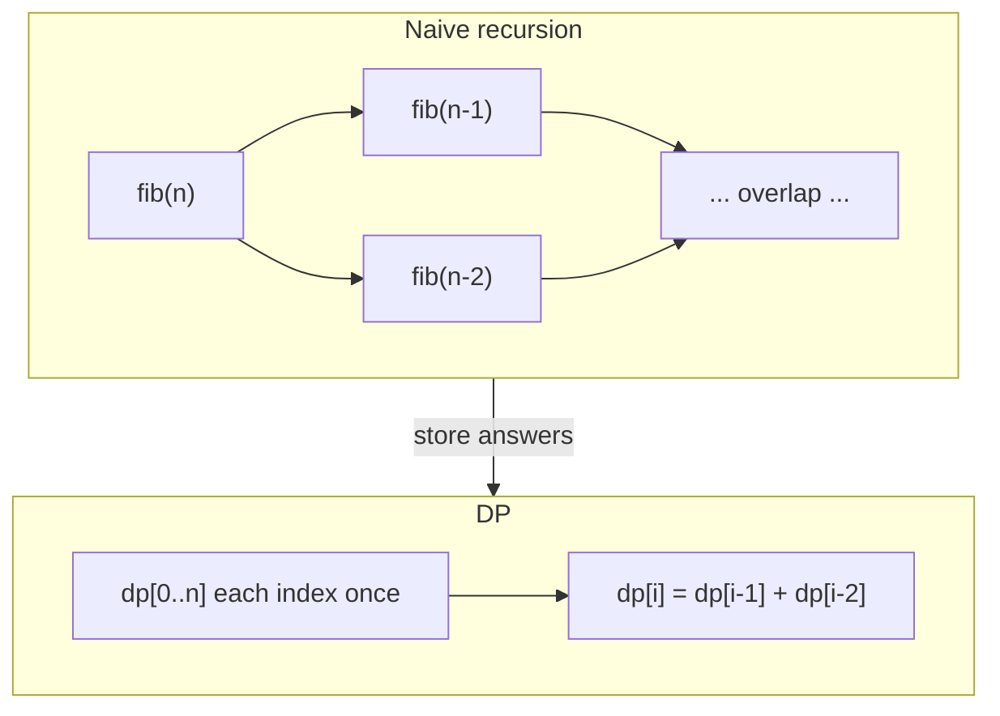
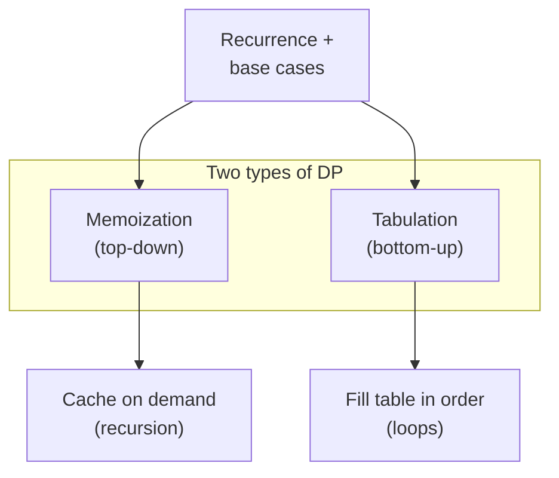
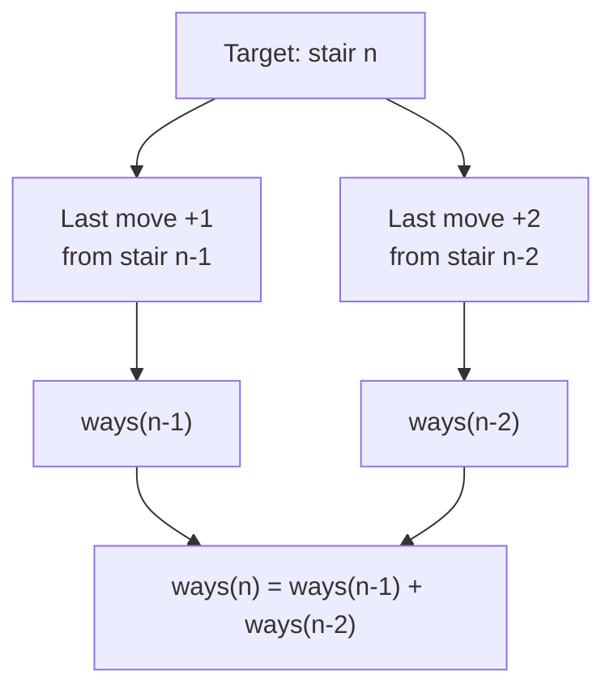
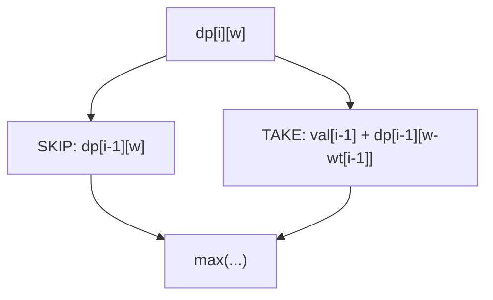
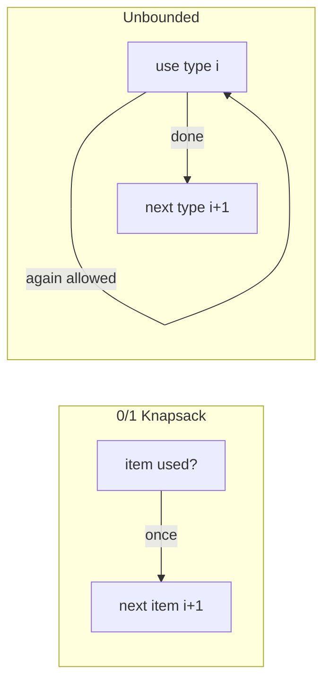

# MODULE 37 — Dynamic Programming (introduction)

**Illustration code:** [`a.cpp`](a.cpp)–[`c.cpp`](c.cpp) (Fibonacci / DP types) · [`d.cpp`](d.cpp)–[`g.cpp`](g.cpp) (Climbing Stairs) · [`e.cpp`](e.cpp)–[`f.cpp`](f.cpp) (stairs variants) · [`h.cpp`](h.cpp) (0/1 Knapsack) · [`i.cpp`](i.cpp) (Unbounded Knapsack)

---

## Notation (used in this module)

- **Subproblem** — A smaller instance of the same problem (e.g. “Fibonacci up to `n−1`” inside “Fibonacci up to `n`”).
- **State** — What you must remember to define a subproblem uniquely (e.g. index `i`, capacity `w`, position in a string).
- **Transition / recurrence** — Formula that builds a state’s answer from **already known** smaller states.
- **Base case** — Smallest states with **fixed** answers (e.g. `F(0)=0`, `F(1)=1`).
- **Overlapping subproblems** — The same subproblem is needed **more than once** on different branches of a naive recursive tree.
- **Optimal substructure** — An **optimal** solution to the whole problem uses **optimal** solutions to its subproblems (true for minimization/maximization when the recurrence is correct).

---

# Part I — What is dynamic programming?

## 1. What is DP? (core idea)

**Dynamic programming (DP)** is a way to solve problems that look like **recursion with choices** (many branches in the call tree) but where **the same smaller subproblem appears on different branches**.

In one line:

> **DP = optimized recursion** — keep the recursive **structure** and recurrence, but **never pay twice** for the same subproblem (memo table or bottom-up `dp` array).

| Phrase | Meaning |
|--------|--------|
| **What is DP?** | Break the problem into subproblems, write a recurrence + base cases, solve each distinct state **once** and reuse answers. |
| **Optimized recursion** | Start from a natural recursive solution; add **memoization** (cache) or rewrite as **tabulation** (loops) so repeated calls become **O(1) lookups**. |
| **Optimal substructure** | The best answer for the **whole** problem is built from **best** answers of subproblems (min/max/count recurrences). |
| **Overlapping subproblems** | Naive recursion **re-enters** the same state from **different branches** (multiple paths in the tree); DP stores that state’s result the first time. |

The word *dynamic* is historical (Richard Bellman, 1950s); it does **not** mean “changing at runtime” in the everyday sense. It means: build the solution from a **sequence of smaller decisions/states** stored in a table or memo array.

### 1.1 Optimal substructure

**Definition.** A problem has **optimal substructure** if an **optimal** solution to the full instance can be expressed using **optimal** solutions to its sub-instances.

**Examples.**

- **Shortest path:** shortest `s → t` path uses shortest `s → v` and `v → t` pieces (when weights are non-negative / no negative cycles in the model you use).
- **0/1 knapsack:** best value using items `1..i` with capacity `w` combines best choices on smaller `(i−1, w)` or `(i−1, w−weight_i)`.
- **Fibonacci (sum, not min/max):** `F(n)` is **defined** from `F(n−1)` and `F(n−2)` — structure is recursive; “optimal” here is just the **unique** value, not a competitive choice.

**Not every recursive problem has it for arbitrary objectives** — you must verify that combining sub-solutions does not require a **non-optimal** subpiece in the global optimum (greedy mistakes often fail here; DP recurrences encode the correct combine rule).

### 1.2 Overlapping subproblems (recursion with choices / multiple branches)

**Definition.** **Overlapping subproblems** means the recursion tree has **multiple branches** (from **choices**: take/skip item, move left/right, split interval, etc.), and **at least one subproblem state is reached along more than one branch**.

```text
                    solve(n)
                   /        \
            solve(n-1)    solve(n-2)     ← two branches (choices / decomposition)
               /    \
        solve(n-2) ...                    ← solve(n-2) appears again → OVERLAP
```

- **With overlap:** naive recursion **recomputes** `solve(k)` many times → exponential blow-up (Fibonacci).
- **Without overlap:** e.g. merge sort on **disjoint** halves — subarrays do not repeat → **divide and conquer**, not DP.

**DP fix:** first visit to state `k` **computes and stores**; every later visit **reads** the store → each state **once**.

### 1.3 Formal definition (same recurrence, two implementations)

**Dynamic programming** then means:

1. **Breaking** the problem into **overlapping subproblems** of the same type.
2. **Defining** a recurrence (transition) plus **base cases**.
3. **Computing** each subproblem’s answer **once** and **reusing** it (**memoization** or **tabulation**).

**When DP applies (checklist):**

| Requirement | Meaning |
|-------------|--------|
| **Overlapping subproblems** | Naive recursion would **re-solve** the same state many times (Fibonacci is the classic example). |
| **Optimal substructure** | If you want the best answer for the full problem, you can combine best answers of subproblems (knapsack, shortest paths on DAGs, LIS, etc.). |
| **Finite state space** | Usually a **bounded** number of distinct states so you can store them in an array, map, or bitset. |

If subproblems **do not overlap** (e.g. merge sort on halves), **divide and conquer** is enough—no DP table needed.

---

## 2. Applications (where you see DP)

DP is not one algorithm; it is a **design pattern** that appears across domains:

| Area | Typical problems |
|------|------------------|
| **Sequences** | Longest increasing subsequence (LIS), longest common subsequence (LCS), edit distance, palindrome DP |
| **Knapsack / subsets** | 0/1 knapsack, unbounded knapsack, subset sum, partition equal subset sum |
| **Intervals** | Matrix chain multiplication, burst balloons, optimal BST, palindrome partitioning |
| **Grids / paths** | Unique paths, min path sum, dungeon game, cherry pickup |
| **Trees** | Tree DP (rerooting, max independent set on tree), diameter with DP states |
| **Graphs (DAG)** | Shortest/longest path in a DAG, paths counting, DP on topological order |
| **Games** | Nim-style DP, win/lose states, minimax with memoization |
| **Digits / counting** | Digit DP (count numbers in `[L,R]` with digit constraints) |
| **Bitmask** | TSP on small `n`, assign workers to tasks (`n ≤ 20` often) |
| **Probability / expectation** | Sometimes DP on states for expected value |

In competitive programming and interviews, DP often shows up when the problem asks for **minimum / maximum / count / yes-no** over choices with **constraints**, and a **natural recurrence** on a small index or mask exists.

---

## 3. Important points (how to think and implement)

### 3.1 Two implementation styles

| Style | Also called | How it works |
|-------|-------------|--------------|
| **Top-down** | **Memoization** | Write recursive recurrence; before computing `solve(state)`, return cached value if present; else compute, store, return. |
| **Bottom-up** | **Tabulation** | Decide **order** of states (usually increasing size / index); fill `dp[...]` in a loop using already-filled smaller states. |

Both use the **same recurrence**; only **control flow** differs. Bottom-up often makes **space optimization** easier (keep only last row / last two values).

### 3.2 Steps to build a DP solution

| Step | Action |
|------|--------|
| 1 | **Define state** — What parameters uniquely identify a subproblem? (`i`, `j`, `mask`, `rem`, …) |
| 2 | **Write recurrence** — How does `dp[state]` depend on smaller states? |
| 3 | **List base cases** — Smallest states with known answers. |
| 4 | **Choose direction** — Top-down (memo) or bottom-up (tabulation); pick iteration order so dependencies are ready. |
| 5 | **Analyze** — Number of states × work per state → **time**; size of table → **space**; compress if possible. |
| 6 | **Reconstruct** (if needed) — Store parent pointers or re-walk transitions to print path / choices. |

### 3.3 Common pitfalls

- **Wrong state** — Missing a dimension (e.g. forgot “number of items used” or “tight” flag in digit DP).
- **Wrong order** — Updating a 1D knapsack **forward** on capacity when items are 0/1 (should go **backward** for 0/1 knapsack).
- **Confusing DP with greedy** — Greedy needs a proof that local choice is global optimum; DP only needs correct recurrence + optimal substructure.
- **Exponential state** — Bitmask DP with `n=25` is often too large; prune or change model.

### 3.4 Complexity mindset

If there are **`S`** distinct states and each transition does **`O(T)`** work,

\[
\textbf{Time} \approx O(S \cdot T), \qquad \textbf{Space} \approx O(S) \text{ (or less with rolling arrays).}
\]

Naive recursion without memo can be **exponential** even when **`S` is only polynomial** (again: Fibonacci).

---

# Part II — Introductory comparison: Fibonacci

Fibonacci is the standard **first example** because the recurrence is tiny but the **failure mode of naive recursion** is dramatic.

**Definition:**

\[
F(0) = 0,\quad F(1) = 1,\quad F(n) = F(n-1) + F(n-2) \quad \text{for } n \ge 2.
\]

**Goal:** compute **`F(n)`** for moderate **`n`** (e.g. `n = 50`).

See implementations in [`a.cpp`](a.cpp): `fibRecursive`, `fibMemo`, `fibTabulation`, `fibTabulationO1Space`.

---

## 4. Approach A — Naive recursion

```cpp
long long fib(int n) {
    if (n <= 1) return n;
    return fib(n - 1) + fib(n - 2);
}
```

### 4.1 What happens (call tree for `n = 5`)

```text
                         fib(5)
                        /      \
                   fib(4)        fib(3)
                  /    \        /    \
             fib(3) fib(2)  fib(2) fib(1)
            /   \   /   \   /   \
        fib(2) ...  (many repeated nodes)
```

**`fib(3)`** is computed **twice**, **`fib(2)`** **three times**, **`fib(1)`** **five times**. As **`n`** grows, the same **`fib(k)`** is recomputed **exponentially often**.

### 4.2 Why time explodes

Let **`T(n)`** be the number of recursive calls for `fib(n)` (ignoring constant work per call). Then

\[
T(n) = T(n-1) + T(n-2) + 1,\quad T(0)=T(1)=1.
\]

This grows like **`F(n)`** itself, i.e. **\(\Theta(\varphi^n)\)** where **\(\varphi = \frac{1+\sqrt{5}}{2} \approx 1.618\)** (golden ratio). So **time is exponential in `n`**.

**Space:** **`O(n)`** call stack depth (not counting the huge number of frames alive across branches).

| `n` | Rough growth | Practical note |
|-----|----------------|----------------|
| 10 | fine | instant |
| 30 | ~1e6 calls | slow |
| 45+ | huge | often **timeout** in contests |

**Conclusion:** Correct answer, but **repeated work** on overlapping subproblems **`F(k)`** for the same **`k`**.

---

## 5. Approach B — Top-down DP (memoization)

**Idea:** First time you need **`F(k)`**, compute it and **store** in `memo[k]`. Next time, **return** `memo[k]` in **O(1)**.

```cpp
// See fibMemo in a.cpp
if (memo[n] != -1) return memo[n];
return memo[n] = fibMemo(n-1, memo) + fibMemo(n-2, memo);
```

### 5.1 What changes

- Each **`k` from 0..n`** is evaluated **at most once** → **\(n+1\)** subproblems.
- Each subproblem does **O(1)** arithmetic → **time \(O(n)\)**.
- **Space \(O(n)\)** for `memo` + **\(O(n)\)** recursion stack (can be rewritten iteratively to drop stack).

### 5.2 Comparison to naive recursion

| Aspect | Naive recursion | Memoization |
|--------|-----------------|-------------|
| Subproblems solved | Same `F(k)` many times | Each `F(k)` **once** |
| Time | **\(O(\varphi^n)\)** | **\(O(n)\)** |
| Space | **\(O(n)\)** stack, no table | **\(O(n)\)** memo + stack |
| Code shape | Pure recurrence | Recurrence + cache lookup |

**Same mathematical recurrence**; **different execution plan**.

---

## 6. Approach C — Bottom-up DP (tabulation)

**Idea:** Fill an array in **increasing** `i`:

\[
dp[0]=0,\quad dp[1]=1,\quad dp[i]=dp[i-1]+dp[i-2].
\]

```cpp
for (int i = 2; i <= n; i++)
    dp[i] = dp[i-1] + dp[i-2];
```

### 6.1 Space optimization

Only **`dp[i-1]`** and **`dp[i-2]`** are needed → **\(O(1)\)** extra space (`fibTabulationO1Space` in [`a.cpp`](a.cpp)).

### 6.2 Memoization vs tabulation (Fibonacci)

| | Memoization (top-down) | Tabulation (bottom-up) |
|--|------------------------|-------------------------|
| Order | Natural recursion order | You choose loop order (`i = 2..n`) |
| Stack | Uses call stack | No recursion (usually) |
| Unused states | May skip some states if graph sparse | Often fills all `0..n` |
| Space | `memo` + stack | Array or rolling **2** variables |

For Fibonacci, **both are \(O(n)\)** time; tabulation with rolling variables is **\(O(1)\)** space.

---

## 7. Side-by-side summary (the “intro to DP” lesson)



| Criterion | Naive recursion | DP (memo or tab) |
|-----------|-----------------|------------------|
| **Overlapping subproblems** | Present, **ignored** | Present, **exploited** |
| **Time** | Exponential **\(O(\varphi^n)\)** | Linear **\(O(n)\)** |
| **Space** | **\(O(n)\)** stack | **\(O(n)\)** table or **\(O(1)\)** rolling |
| **Idea** | “Compute when needed” | “Compute each state **once**, reuse” |

**One-sentence takeaway:** Dynamic programming is **recursion + remembering** (or an equivalent loop filling a table) so you never pay twice for the same subproblem.

---

## 8. Run the demos

```bash
cd Module-37
g++ -std=c++17 -o a a.cpp && ./a   # naive vs memo vs tab (all in one)
g++ -std=c++17 -o b b.cpp && ./b   # memoization + cache hits/misses
g++ -std=c++17 -o c c.cpp && ./c   # tabulation step-by-step table fill
```

For experimentation, try increasing **`n`** in `a.cpp`’s `main`: memoization and tabulation stay fast; naive recursion becomes impractical around **`n ≈ 40–45`** on typical hardware.

---

# Part III — Types of dynamic programming

Every DP solution uses the **same recurrence**; what differs is **how you store and visit** subproblem answers. There are **two main types** (plus variants like rolling arrays and bitmask tables).



| Type | Direction | Control | Storage | Typical code shape |
|------|-----------|---------|---------|-------------------|
| **Memoization** | **Top-down** | Recursion calls `solve(state)` | `memo[state]` or `unordered_map` | `if (known) return; else compute & save` |
| **Tabulation** | **Bottom-up** | `for` loops over states | `dp[...]` array | `dp[i] = f(dp[smaller states])` |

Both guarantee: **each distinct state computed at most once** → polynomial time when the number of states is polynomial.

---

## 9. Memoization (top-down DP) — [`b.cpp`](b.cpp)

**Definition.** **Memoization** means: keep the **recursive** formulation of the problem, but before doing real work for state **`s`**, check a **cache** (`memo`). If **`memo[s]`** is already filled, **return it immediately**; otherwise compute recursively, **write** into **`memo[s]`**, then return.

**When to prefer memoization**

- The recurrence is **natural to write recursively** (trees, intervals, divide on index).
- Some states may be **unreachable** from the start state — memo only visits **needed** states.
- You want a **quick prototype** from a recursive brute-force sketch.

**Template (Fibonacci)**

```cpp
long long solve(int n, vector<long long>& memo) {
    if (n <= 1) return n;
    if (memo[n] != -1) return memo[n];           // cache hit
    return memo[n] = solve(n-1, memo) + solve(n-2, memo);  // miss → store
}
```

**What [`b.cpp`](b.cpp) demonstrates**

| Output | Meaning |
|--------|--------|
| Final **`memo[i]`** | Only indices **0..n** that were ever needed get values |
| **`misses`** | Number of **first-time** computations (= **distinct subproblems** for Fibonacci) |
| **`hits`** | How often recursion **avoided** recomputation |

For **`n = 8`**, misses = **9** (indices 0–8 each computed once); hits > 0 because later calls reuse earlier entries.

**Time / space (Fibonacci)** — **\(O(n)\)** time, **\(O(n)\)** for `memo` + **\(O(n)\)** recursion stack.

**Pitfalls**

- Forgetting to **initialize** memo sentinel (`-1`, `INT_MIN`, or `optional`).
- Using **global** memo without clearing between test cases in judges.
- **Stack overflow** on deep recursion (`n` very large) — switch to tabulation or increase stack / use iterative DFS with explicit stack.

---

## 10. Tabulation (bottom-up DP) — [`c.cpp`](c.cpp)

**Definition.** **Tabulation** means: **do not** rely on recursion to discover order. You **decide** an order over states (usually **smallest → largest**), allocate **`dp`**, set **base cases**, then loop:

\[
\text{for each state } s \text{ in order: } \quad dp[s] \leftarrow \text{combine } dp[\text{dependencies of } s].
\]

**When to prefer tabulation**

- You need **space optimization** (rolling row, only last two Fibonacci values).
- You want **no recursion** (deep states, stack limits).
- You must fill **all** states for a later pass (e.g. reconstruct path from `dp` table).

**Template (Fibonacci)**

```cpp
dp[0] = 0; dp[1] = 1;
for (int i = 2; i <= n; i++)
    dp[i] = dp[i-1] + dp[i-2];
return dp[n];
```

**What [`c.cpp`](c.cpp) demonstrates**

- Prints each step **`dp[i] = dp[i-1] + dp[i-2]`** so you see **dependencies already available** when `i` is processed.
- Shows **rolling O(1) space** variant: only **`(prev2, prev1)`** needed because recurrence uses **fixed window** of prior states.

**Time / space (Fibonacci)**

| Variant | Time | Extra space |
|---------|------|-------------|
| Full table | **\(O(n)\)** | **\(O(n)\)** array |
| Rolling | **\(O(n)\)** | **\(O(1)\)** two variables |

**Pitfalls**

- **Wrong loop direction** — e.g. 0/1 knapsack must iterate capacity **backward** when reusing one row.
- Filling **`dp`** before base cases are set.
- Off-by-one on state indices (0-based vs 1-based problem statement).

---

## 11. Memoization vs tabulation — full comparison

| Criterion | Memoization | Tabulation |
|-----------|-------------|------------|
| **Direction** | Top-down (goal → bases) | Bottom-up (bases → goal) |
| **Discovery order** | Implicit via recursion | Explicit `for` loops |
| **Unreachable states** | Often skipped | Often all states in range filled |
| **Stack** | Yes (unless converted) | No |
| **Space tricks** | Harder (still need cache) | Rolling arrays, 1–2 rows common |
| **Debugging** | Trace recursion + memo | Print table row by row ([`c.cpp`](c.cpp)) |
| **Same answer?** | Yes, if recurrence identical | Yes |

**Choosing one:** Start from the **recurrence**. If recursive code is clear → add memo ([`b.cpp`](b.cpp)). If you need tight space or iterative judges → tabulate ([`c.cpp`](c.cpp)). [`a.cpp`](a.cpp) runs **naive**, **memo**, and **tab** side by side on the same **`n`**.

---

## 12. Fibonacci using DP — file map

| File | Role |
|------|------|
| [`a.cpp`](a.cpp) | **All approaches**: naive recursion, memoization, full tabulation, **O(1)** rolling tabulation |
| [`b.cpp`](b.cpp) | **Memoization only** + cache hit/miss statistics and final memo table |
| [`c.cpp`](c.cpp) | **Tabulation only** + step-by-step table construction + rolling space demo |

**Same problem, three files:** `a` = overview; `b` / `c` = deep dive into each **type** of DP.

---

## Quick reference (Module 37)

| Topic | File | Time (Fibonacci) | Notes |
|-------|------|------------------|--------|
| Naive recursion | `a.cpp` | **\(O(\varphi^n)\)** | Overlapping calls |
| **Memoization (type 1)** | `a.cpp`, `b.cpp` | **\(O(n)\)** | Top-down cache |
| **Tabulation (type 2)** | `a.cpp`, `c.cpp` | **\(O(n)\)** | Bottom-up table |
| Tabulation (rolling) | `a.cpp`, `c.cpp` | **\(O(n)\)** time, **\(O(1)\)** space | Only last two values |
| Types of DP (theory) | §9–§11 | — | Memo vs tab comparison |
| **Climbing Stairs** | `d.cpp` | **\(O(n)\)** | Same as Fibonacci |
| Min cost stairs | `e.cpp` | **\(O(n)\)** | Rolling min |
| Stairs **1/2/3** | `g.cpp` | **\(O(n)\)** | Tribonacci ways |
| Stairs variations | `f.cpp` | **\(O(nk)\)** | k-step sum |
| **0/1 Knapsack** | `h.cpp` | **\(O(nW)\)** | Loop **W down** |
| **Unbounded Knapsack** | `i.cpp` | **\(O(nW)\)** | Loop **W up** |

**Next in the course (typical):** LIS/LCS, grid DP, interval DP — same **state → recurrence → fill once** workflow.

---

## 13. Fibonacci using tabulation (summary)

**Tabulation** for Fibonacci: fill `dp[0..n]` bottom-up — no recursion needed for the final loop.

| Step | Action |
|------|--------|
| 1 | `dp[0]=0`, `dp[1]=1` (base cases) |
| 2 | For `i = 2 .. n`: `dp[i] = dp[i-1] + dp[i-2]` |
| 3 | Answer = `dp[n]`; optional **O(1)** space with two variables ([`c.cpp`](c.cpp)) |

**Code:** [`c.cpp`](c.cpp) prints each row of the table; [`a.cpp`](a.cpp) also includes `fibTabulation` and `fibTabulationO1Space` next to naive and memo versions.

```bash
g++ -std=c++17 -o c c.cpp && ./c
```

---

# Part IV — Climbing Stairs (counting DP)

**Problem (LeetCode 70).** You are climbing a staircase with **`n`** steps to reach the **top** (stair **`n`**). Each move you may climb **1** or **2** stairs. Return the **number of distinct ways** to reach the top.

**Code:** [`d.cpp`](d.cpp) (count ways) · [`e.cpp`](e.cpp) (min cost) · [`f.cpp`](f.cpp) (k steps, 1/2/3, forbidden stairs)

```bash
g++ -std=c++17 -o d d.cpp && ./d
g++ -std=c++17 -o e e.cpp && ./e
g++ -std=c++17 -o f f.cpp && ./f
g++ -std=c++17 -o g g.cpp && ./g
```

---

## 14. Climbing Stairs — full walkthrough

### 14.1 What we are counting

Think of each **way** as a **sequence of moves**, each move either **`+1`** or **`+2`**:

\[
1+1+1+\cdots,\quad 1+2+1,\quad 2+1+1,\quad 2+2+1,\ \ldots
\]

The **sum of moves** must equal **`n`**. Order matters: **`1+2`** and **`2+1`** are **different** ways.

| `n` | All sequences (examples) | Count |
|-----|--------------------------|-------|
| 1 | `(1)` | **1** |
| 2 | `(1,1)`, `(2)` | **2** |
| 3 | `(1,1,1)`, `(1,2)`, `(2,1)` | **3** |
| 4 | `(1,1,1,1)`, `(1,1,2)`, `(1,2,1)`, `(2,1,1)`, `(2,2)` | **5** |
| 5 | … | **8** |

So **`ways(5) = 8`** (verified in [`d.cpp`](d.cpp)).

---

### 14.2 State, choices, and recurrence

**State:** **`ways(i)`** = number of distinct move sequences that **exactly** reach stair **`i`**.

**Last move** when standing on stair **`i`** (`i ≥ 2`):

| Last move | Came from | Contribution |
|-----------|-----------|--------------|
| **+1** | stair **`i−1`** | all ways that ended at **`i−1`** |
| **+2** | stair **`i−2`** | all ways that ended at **`i−2`** |

No other last move is allowed → **two branches** (recursion with **choices**).

**Recurrence:**

\[
\text{ways}(i) = \text{ways}(i-1) + \text{ways}(i-2), \quad i \ge 3
\]

**Base cases:**

\[
\text{ways}(1) = 1,\qquad \text{ways}(2) = 2
\]

**Answer:** **`ways(n)`**.



This is the same **overlap pattern** as Fibonacci: two branches, shared subproblems.

---

### 14.3 Recursion tree (why naive recursion is slow)

Define **`ways(k)`** recursively. For **`n = 5`**, the **call tree** (not the move tree) looks like [`d.cpp`](d.cpp) output:

```text
ways(5)
|-- ways(4)
|     |-- ways(3)
|     |     |-- ways(2)
|     |     \-- ways(1)
|     \-- ways(2)
\-- ways(3)
      |-- ways(2)
      \-- ways(1)
```

**`ways(3)`** appears **twice**, **`ways(2)`** **three times** — **overlapping subproblems**. Without a cache, work grows like **\(O(\varphi^n)\)** (same as naive Fibonacci).

**Decision tree of moves** (all paths for **`n=3`**) is different but related — 3 leaves:

```text
                    start
                   /     \
                 +1       +2
                /           \
              +1             (done at 3)
             / \
           +1   +2
          /       \
        (done)    (done)
```

Three leaves ⇒ **`ways(3)=3`**.

---

### 14.4 DP approaches (step by step)

#### Step 1 — Write naive recursion

```cpp
long long ways(int n) {
    if (n <= 2) return n;
    return ways(n - 1) + ways(n - 2);
}
```

#### Step 2 — Memoization (top-down)

Cache **`memo[i]`** after first compute → each **`i`** once → **\(O(n)\)** time.

#### Step 3 — Tabulation (bottom-up)

| `i` | `ways(i)` | How |
|-----|-----------|-----|
| 1 | 1 | base |
| 2 | 2 | base |
| 3 | 1+2 = **3** | `ways(2)+ways(1)` |
| 4 | 2+3 = **5** | |
| 5 | 3+5 = **8** | answer |

```cpp
long long w1 = 1, w2 = 2;
for (int i = 3; i <= n; i++) {
    long long w3 = w1 + w2;
    w1 = w2; w2 = w3;
}
return w2;
```

Only **`w1, w2`** needed → **\(O(1)\)** extra space.

---

### 14.5 Time and space

| Method | Time | Extra space | Notes |
|--------|------|-------------|--------|
| Naive recursion | **\(O(\varphi^n)\)** | **\(O(n)\)** stack | Recomputes states |
| Memoization | **\(O(n)\)** | **\(O(n)\)** memo + stack | **\(n+1\)** distinct states |
| Tabulation (full array) | **\(O(n)\)** | **\(O(n)\)** | Easy to print table |
| Tabulation (rolling) | **\(O(n)\)** | **\(O(1)\)** | [`d.cpp`](d.cpp) `climbTab` |

**Number of states:** **`i = 1..n`** → **\(S = n\)**, **\(O(1)\)** work per state → **\(O(n)\)** total.

---

### 14.6 Link to Fibonacci

With **`ways(1)=1`**, **`ways(2)=2`**:

\[
\text{ways}(n) = F_{n+1}
\]

where **`F_k`** is Fibonacci with **`F_1=1, F_2=1`** (or your module’s **`F(1)=1, F(2)=2`** shift). Example: **`ways(5)=8 = F_6`**.

So **Climbing Stairs** is **Fibonacci counting** with a different story (paths vs rabbit pairs). Same DP skills: **overlap + linear recurrence**.

---

### 14.7 Checklist: does DP apply?

| Property | Climbing Stairs |
|----------|-----------------|
| **Overlapping subproblems** | Yes — `ways(k)` reused on multiple branches |
| **Optimal substructure** | For **counting**, full count = sum of counts from last-step choices (no “wrong” subpath) |
| **Choices / branches** | Last step 1 or 2 |

---

## 15. Variations of Climbing Stairs

| Variation | Goal | Recurrence idea | File |
|-----------|------|-----------------|------|
| **Original** | Count ways, steps 1 or 2 | `dp[i]=dp[i-1]+dp[i-2]` | [`d.cpp`](d.cpp) |
| **Min cost** | Minimum cost to top | `dp[i]=cost[i]+min(dp[i-1],dp[i-2])` | [`e.cpp`](e.cpp) |
| **1..k steps** | Count ways with step sizes 1…k | `dp[i]=Σ_{s=1..k} dp[i-s]` | [`f.cpp`](f.cpp) |
| **Steps 1, 2, or 3** | Tribonacci-style counting | `ways(i)=ways(i-1)+ways(i-2)+ways(i-3)` | [`g.cpp`](g.cpp), [`f.cpp`](f.cpp) |
| **Forbidden stairs** | Count ways avoiding indices | Same 1/2 but `dp[bad]=0` | [`f.cpp`](f.cpp) |
| **Huge n + modulo** | `ways(n) mod M` | Matrix exponentiation on 2×2 Fibonacci matrix | (theory) |
| **Exact k moves** | Ways using exactly k moves | Different state: `(stair, moves_used)` | (not in code) |

### 15.1 Min cost climbing stairs — [`e.cpp`](e.cpp)

**Problem.** Array **`cost[i]`** = cost paid when you **step on** stair **`i`**. You may start at index **0** or **1**. Reach **top** (past index **`n-1`**). **Minimize** total cost.

**State:** **`dp[i]`** = minimum cost to **reach** stair **`i`**.

\[
dp[i] = cost[i] + \min(dp[i-1], dp[i-2])
\]

**Answer:** **`min(dp[n-1], dp[n-2])`** — last jump can be 1 or 2 from the last stair.

**Example** `cost = [10, 15, 20]`: DP gives minimum **15** — e.g. start at index **1** (no prior cost), then pay **`cost[1]=15`** and jump **2** steps to the top ([`e.cpp`](e.cpp)). Rolling DP: **\(O(n)\)** time, **\(O(1)\)** space.

### 15.2 Climbing Stairs variation — steps **1, 2, or 3** — [`g.cpp`](g.cpp)

**Problem.** Same as Climbing Stairs, but each move may climb **1**, **2**, or **3** stairs. Count **distinct** ways to reach stair **`n`**.

**Three branches (choices) at each step** — last move is **+1**, **+2**, or **+3**:

\[
\text{ways}(n) = \text{ways}(n-1) + \text{ways}(n-2) + \text{ways}(n-3), \quad n \ge 4
\]

**Base cases** (count move sequences summing to **`n`**):

| `n` | Example sequences | `ways(n)` |
|-----|-------------------|-----------|
| 1 | `(1)` | **1** |
| 2 | `(1,1)`, `(2)` | **2** |
| 3 | `(1,1,1)`, `(1,2)`, `(2,1)`, `(3)` | **4** |
| 4 | … | **7** |
| 5 | … | **13** |

**Recursion tree** for `ways(5)` has **three** children at each internal node → even more **overlap** than the 1/2 version; DP still stores each **`ways(k)`** once.

```text
ways(5)
|-- ways(4)
|     |-- ways(3)  ...
|     |-- ways(2)
|     \-- ways(1)
|-- ways(3)   ← repeated subtrees
\-- ways(2)
```

**Tabulation trace** (`n=5`) — from [`g.cpp`](g.cpp):

| `i` | `ways(i)` |
|-----|-----------|
| 1 | 1 |
| 2 | 2 |
| 3 | 4 |
| 4 | 2+4+1 = **7** |
| 5 | 7+4+2 = **13** |

**Rolling variables** `(a,b,c)` = `(ways(i-3), ways(i-2), ways(i-1))` → **\(O(1)\)** space, **\(O(n)\)** time.

**vs original (1 or 2 only):** `n=5` → **8** ways; with **1/2/3** → **13** ways.

```bash
g++ -std=c++17 -o g g.cpp && ./g
```

### 15.3 General step sizes 1..k — [`f.cpp`](f.cpp)

\[
dp[0]=1,\qquad dp[i]=\sum_{s=1}^{k} dp[i-s]\ \text{for } i\ge 1
\]

(`dp[i-s]=0` if **`i-s<0`**.) For **`k=2`** this is original Climbing Stairs; **`k=3`** is §15.2; **`n=5`, `k=3`** → **13** ways.

### 15.4 Forbidden stairs — [`f.cpp`](f.cpp)

If stair **`i`** is broken, set **`dp[i]=0`** (no path may **land** on **`i`**). Still add from **`i-1`** and **`i-2`** if those states are valid. Example: **`n=5`**, bad **`{3}`** → **2** ways.

### 15.5 Other variations (conceptual)

- **Matrix exponentiation:** For very large **`n`**, compute **`ways(n)`** in **\(O(\log n)\)** using
  \[
  \begin{bmatrix} ways(n) \\ ways(n-1) \end{bmatrix}
  =
  \begin{bmatrix} 1 & 1 \\ 1 & 0 \end{bmatrix}^{n-1}
  \begin{bmatrix} ways(2) \\ ways(1) \end{bmatrix}
  \]
  (adjust bases to match your indexing).

- **Modulo:** Take all **`dp`** values **`mod 10^9+7`** in contests.

- **Exactly k moves:** State **`(position, moves_left)`** — different problem; not Fibonacci.

---

## Quick reference (Climbing Stairs)

| Topic | File | Time | Space |
|-------|------|------|-------|
| Count ways (1 or 2) | `d.cpp` | **\(O(n)\)** DP | **\(O(1)\)** rolling |
| Min cost | `e.cpp` | **\(O(n)\)** | **\(O(1)\)** |
| Count ways (1, 2, or 3) | `g.cpp` | **\(O(n)\)** | **\(O(1)\)** rolling (3 vars) |
| k steps / forbidden | `f.cpp` | **\(O(n·k)\)** | **\(O(n)\)** |

---

# Part V — Knapsack problems

**Knapsack** = fill a bag of capacity **`W`** with items to **maximize total value** (or reach a target weight). Each variant differs in **how many times** each item may be used.

| Problem | Per-item limit | Typical loop on capacity |
|---------|----------------|---------------------------|
| **0/1 Knapsack** | At most **once** | **`W` down to `wt[i]`** (1D) |
| **Unbounded Knapsack** | **Unlimited** copies | **`wt[i]` up to `W`** (forward) |

```bash
g++ -std=c++17 -o h h.cpp && ./h
g++ -std=c++17 -o i i.cpp && ./i
```

---

## 16. 0/1 Knapsack — [`h.cpp`](h.cpp)

### 16.1 Problem statement

- **`n`** items; item **`i`** has weight **`wt[i]`** and value **`val[i]`**.
- Knapsack capacity **`W`**.
- Each item may be taken **at most once** (0 or 1).
- **Maximize** total value without exceeding **`W`**.

**Demo in [`h.cpp`](h.cpp):** `wt = {1,3,4,5}`, `val = {1,4,5,7}`, **`W = 7`** → answer **9** (take items with weights **3+4**, values **4+5**).

---

### 16.2 State, choices, recurrence

**State:** **`dp[i][w]`** = maximum value using only the **first `i` items** (indices `0..i-1`) with capacity at most **`w`**.

**At item `i` (0-indexed item `i-1` in code)** — two **choices**:

| Choice | Meaning | Value |
|--------|---------|-------|
| **SKIP** | Do not take item `i-1` | `dp[i-1][w]` |
| **TAKE** | Take item `i-1` (if `wt[i-1] ≤ w`) | `val[i-1] + dp[i-1][w - wt[i-1]]` |

\[
dp[i][w] = \max\bigl(dp[i-1][w],\; val[i-1] + dp[i-1][w - wt[i-1]]\bigr)
\]

**Base:** **`dp[0][w] = 0`** for all **`w`** (no items → zero value).

**Answer:** **`dp[n][W]`**.



---

### 16.3 Recursion tree (take / skip)

Naive recursion **`solve(i, w)`** tries **both** branches when item fits:

```text
solve(4, 7)                    ← all 4 items, capacity 7
├── SKIP → solve(3, 7)
│   ├── SKIP → solve(2, 7)
│   │   ├── TAKE item3 (w=4) → solve(1, 3)  ...
│   │   └── SKIP → ...
│   └── TAKE item2 (w=3) → solve(2, 4)  ...
└── TAKE item4 (w=5) → solve(3, 2)  ...
```

**Overlapping subproblems:** many pairs **`(i, w)`** repeat (e.g. **`solve(2, 4)`** on multiple paths). Memo on **`(i, w)`** → **\(O(n \cdot W)\)** states.

**Without memo:** up to **\(2^n\)** leaf paths (every subset of items).

---

### 16.4 Tabulation steps (example table)

Fill **`i = 1..n`**, **`w = 0..W`** ([`h.cpp`](h.cpp) prints table):

| | w=0 | w=1 | w=2 | w=3 | w=4 | w=5 | w=6 | w=7 |
|---|-----|-----|-----|-----|-----|-----|-----|-----|
| i=0 | 0 | 0 | 0 | 0 | 0 | 0 | 0 | 0 |
| i=1 | 0 | 1 | 1 | 1 | 1 | 1 | 1 | 1 |
| i=2 | 0 | 1 | 1 | 4 | 5 | 5 | 5 | 5 |
| i=3 | 0 | 1 | 1 | 4 | 5 | 6 | 6 | **9** |
| i=4 | 0 | 1 | 1 | 4 | 5 | 7 | 8 | **9** |

**Answer `dp[4][7] = 9`.**

---

### 16.5 Space-optimized 1D DP (critical detail)

Use one array **`dp[w]`** = best value for capacity **`w`** using items processed so far.

When processing **item `i`**, update:

```cpp
for (int w = W; w >= wt[i]; w--)
    dp[w] = max(dp[w], val[i] + dp[w - wt[i]]);
```

**Why `w` goes DOWN:** **`dp[w - wt[i]]`** must still mean “best **without** using current item `i` again.” If you loop **`w` upward**, the same item can be packed **multiple times** → becomes **unbounded** knapsack by mistake.

| | 0/1 Knapsack | Unbounded Knapsack |
|---|--------------|-------------------|
| 1D loop direction | **`W` → `wt[i]`** (decreasing) | **`wt[i]` → `W`** (increasing) |

---

### 16.6 Time and space

| Method | Time | Space |
|--------|------|-------|
| Naive subset / recursion | **\(O(2^n)\)** | **\(O(n)\)** stack |
| Memo / 2D table | **\(O(n \cdot W)\)** | **\(O(n \cdot W)\)** |
| 1D tabulation | **\(O(n \cdot W)\)** | **\(O(W)\)** |

**Pseudo-polynomial:** polynomial in **`n`** and **`W`**, but exponential in **bit length of `W`** if `W` is huge.

**Optimal substructure:** optimal knapsack for **`(i, w)`** uses optimal **`(i-1, ·)`** substates — the **`max(skip, take)`** recurrence is correct.

---

### 16.7 Variations (0/1 family)

| Variation | Idea |
|-----------|------|
| **Subset sum** | `val[i]=wt[i]`, check if `dp[n][W]` hits target |
| **Partition equal subset** | `dp` to see if half-sum achievable |
| **Count ways** | `dp[i][w] += ...` instead of `max` |
| **Bounded knapsack** | Item `i` at most `cnt[i]` times → binary split or monotone queue |
| **Fractional knapsack** | Greedy by value/weight — **not** DP (different problem) |

---

## 17. Unbounded Knapsack — [`i.cpp`](i.cpp)

### 17.1 Problem statement

- **`n`** item **types**; type **`i`** has **`wt[i]`**, **`val[i]`**.
- **Unlimited** copies of each type.
- Capacity **`W`**. **Maximize** total value.

**Demo in [`i.cpp`](i.cpp):** `wt = {1,3,4}`, `val = {15,20,30}`, **`W = 7`** → answer **105** = **7 ×** item of weight **1** (value **15** each).

**Same weights as §16 but unbounded:** you can repeat light items; **0/1** on the same data would give **75** (`4+3` once: **30+20+15** style paths) — showing **limit matters**.

---

### 17.2 State and recurrence

**State (1D):** **`dp[w]`** = max value with capacity exactly up to **`w`** using unlimited items.

After considering types **`1..i`**:

\[
dp[w] = \max\bigl(dp[w],\; val[i-1] + dp[w - wt[i-1]]\bigr)
\quad\text{for } w \ge wt[i-1]
\]

**Recursive form (memo):** at type **`i`**, either **skip type** (`i-1`) or **take one more** of type **`i`** and stay at same **`i`** (allows unlimited):

```text
solve(i, w) = max( solve(i-1, w),  val[i-1] + solve(i, w-wt[i-1]) )
```

Note **`solve(i, w-wt)`** not **`solve(i-1, ...)`** on the TAKE branch — that is what allows **reusing** the same item.

---

### 17.3 Tabulation (forward loop)

```cpp
for (int i = 0; i < n; i++)
    for (int w = wt[i]; w <= W; w++)
        dp[w] = max(dp[w], val[i] + dp[w - wt[i]]);
```

**Why `w` goes UP:** when updating **`dp[w]`**, **`dp[w - wt[i]]`** may **already include** one copy of item **`i`** — adding another is allowed.

**Trace for [`i.cpp`](i.cpp) demo** — final row: `w7=105`, built from repeated weight-1 items.

---

### 17.4 Time and space

| | Bound |
|---|--------|
| **Time** | **\(O(n \cdot W)\)** |
| **Space** | **\(O(W)\)** with 1D array |

Same state count as 0/1, different **transition** (reuse vs single use).

---

### 17.5 0/1 vs Unbounded (side-by-side)

| | **0/1** [`h.cpp`](h.cpp) | **Unbounded** [`i.cpp`](i.cpp) |
|---|--------------------------|--------------------------------|
| Copies per item | **≤ 1** | **∞** |
| Typical 1D loop | `w` from **`W` down** | `w` from **`wt[i]` up** |
| TAKE moves to | `i-1` (item consumed) | `i` (same type again) |
| Example `W=7`, light item v=15 | bounded by count | **7×15 = 105** |



---

### 17.6 Variations (unbounded family)

| Variation | Notes |
|-----------|--------|
| **Coin change (min coins)** | `dp[w] = min`, same forward loop |
| **Coin change (count ways)** | `dp[w] += dp[w-coin]` |
| **Complete knapsack** | Another name for unbounded |
| **Bounded knapsack** | Cap `cnt[i]` per item — binary decomposition to 0/1 |

---

## Quick reference (Knapsack)

| Topic | File | Time | Space |
|-------|------|------|-------|
| **0/1 Knapsack** | `h.cpp` | **\(O(nW)\)** | **\(O(W)\)** 1D |
| **Unbounded Knapsack** | `i.cpp` | **\(O(nW)\)** | **\(O(W)\)** 1D |
| Loop direction | §16.5 vs §17.3 | — | **down** vs **up** |

Target Sum Subset -> j.cpp
Find if there is a subset of numbers which give sum equal to target
nums[] = {4, 2, 7, 1, 3}
target sum = 7