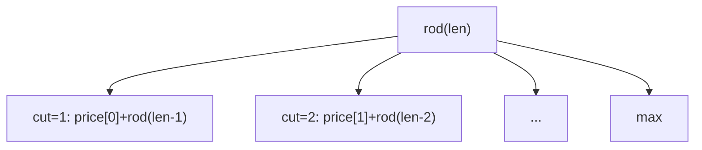
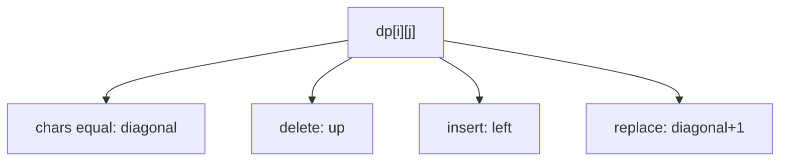

# MODULE 38 — Coin change, rod cutting, longest common subsequence

**Illustration code:** [`a.cpp`](a.cpp) (coin combinations) · [`b.cpp`](b.cpp) (rod cutting) · [`c.cpp`](c.cpp)–[`e.cpp`](e.cpp) (LCS) · [`f.cpp`](f.cpp) (common substring) · [`g.cpp`](g.cpp) (LIS) · [`h.cpp`](h.cpp) (edit distance)

---

## Notation

- **\(n, m\)** — string lengths for LCS.
- **State \((i,j)\)** — LCS on suffixes **`s1[i..]`** and **`s2[j..]`** (top-down) or prefixes **`s1[0..i-1]`**, **`s2[0..j-1]`** (bottom-up table).
- **Subsequence** — characters keep **relative order**, gaps allowed (not necessarily contiguous).

---

# Part I — Coin change (number of combinations)

## 1. Problem — [`a.cpp`](a.cpp)

**Given** coin denominations **`coins[]`** and **`amount`**, count how many **combinations** of coins sum to **`amount`**.

- **Unlimited** supply of each coin type.
- **Combinations** (not permutations): `{1,2,2}` and `{2,1,2}` are the **same** if we only care about counts per denomination.

**Demo:** `coins = {1, 2, 5}`, **`amount = 5`** → **4** ways:

| Combination | Breakdown |
|-------------|-----------|
| 1 | `5×1` |
| 2 | `3×1 + 1×2` |
| 3 | `1×1 + 2×2` |
| 4 | `1×5` |

---

### 1.1 Recurrence (process coin types in order)

**State (top-down):** **`ways(coinIndex, amount)`** = combinations using coin types **`coins[coinIndex..]`**.

| Branch | Meaning |
|--------|---------|
| Skip type | `ways(ci+1, amount)` |
| Use one coin of this type | `ways(ci, amount - coins[ci])` (can repeat same `ci`) |

\[
\text{ways}(ci, a) = \text{ways}(ci+1, a) + \text{ways}(ci, a - coins[ci])
\]

**Base:** **`a == 0` → 1** (one empty combination); **`a < 0` or `ci == n` → 0**.

```text
ways(0, 5)   coin types {1,2,5}
├── skip 1 → ways(1, 5)
│   ├── skip 2 → ways(2, 5)
│   │   └── use 5 → ways(2, 0) → 1
│   └── use 2 → ways(1, 3) → ...
└── use 1 → ways(0, 4) → ...
```

**Overlapping** pairs **`(ci, a)`** → memo or 1D tabulation.

---

### 1.2 Tabulation (bottom-up)

```cpp
dp[0] = 1;
for (int c : coins)           // outer: coin TYPES (combinations)
    for (int a = c; a <= amount; a++)
        dp[a] += dp[a - c];    // inner: forward (unbounded)
```

**Why coin loop is outer:** each combination is counted once with a fixed order of processing types (1s, then 2s, then 5s).

**Time / space:** **\(O(n \cdot amount)\)** time, **\(O(amount)\)** space.

| Method | In `a.cpp` |
|--------|------------|
| Naive recursion | `coinCombNaive` |
| Memoization | `coinCombMemo` |
| Tabulation | `coinCombTab` |

```bash
g++ -std=c++17 -o a a.cpp && ./a
```

**Link to Module 37:** same as **unbounded knapsack — count ways** ([`i.cpp`](../Module-37/i.cpp)), with **coins outer** to avoid permutation double-counting.

---

# Part II — Rod cutting

## 2. Problem — [`b.cpp`](b.cpp)

**Given** a rod of length **`n`** and array **`price[i]`** = revenue for a piece of length **`i+1`** (lengths **1 … n**), cut the rod into pieces (total length **`n`**) to **maximize** total price. Pieces can be reused in count (cutting **8** as **2+6** uses two pieces).

**Demo:**

- `price = {1, 5, 8, 9, 10, 17, 17, 20}` for lengths **1..8**
- **`rodLength = 8`** → max profit **22** (e.g. pieces of length **2** and **6**: **5 + 17**)

---

### 2.1 Recurrence

**State:** **`rod(len)`** = max revenue for a rod of length **`len`**.

Try every **first cut** of size **`cut`** (1..len):

\[
rod(len) = \max_{1 \le cut \le len} \bigl( price[cut-1] + rod(len - cut) \bigr)
\]

**Base:** **`rod(0) = 0`**.



This is **unbounded knapsack** where “weight” = piece length and “value” = **`price[cut-1]`**, capacity = **`rodLen`**.

---

### 2.2 Tabulation

```cpp
dp[0] = 0;
for (int len = 1; len <= rodLen; len++)
    for (int cut = 1; cut <= len; cut++)
        dp[len] = max(dp[len], price[cut-1] + dp[len - cut]);
```

| Method | In `b.cpp` |
|--------|------------|
| Naive | `rodCutNaive` |
| Memoization | `rodCutMemo` |
| Tabulation | `rodCutTab` |

**Time / space:** **\(O(n^2)\)** for **`n = rodLen`**, **\(O(n)\)** space with 1D **`dp`**.

```bash
g++ -std=c++17 -o b b.cpp && ./b
```

**Note:** `length[] = {1,2,...,8}` in the problem statement is implicit — index **`i`** maps to piece length **`i+1`**.

---

# Part III — Longest common subsequence (LCS)

## 3. Problem

**Subsequence:** delete zero or more characters without reordering.

**Given** `str1`, `str2`, find the **longest** sequence that is a subsequence of **both**.

**Demo:**

- `str1 = "abcdge"`
- `str2 = "abedg"`
- **LCS length = 4**, one LCS = **`"abdg"`**

| File | Role |
|------|------|
| [`c.cpp`](c.cpp) | **Naive recursion** |
| [`d.cpp`](d.cpp) | **Memoization** |
| [`e.cpp`](e.cpp) | **Tabulation** + reconstruct string |

```bash
g++ -std=c++17 -o c c.cpp && ./c
g++ -std=c++17 -o d d.cpp && ./d
g++ -std=c++17 -o e e.cpp && ./e
```

---

### 3.1 Recurrence (two pointers)

At indices **`i`** in **`s1`**, **`j`** in **`s2`**:

| Case | Action |
|------|--------|
| **`s1[i] == s2[j]`** | `1 + LCS(i+1, j+1)` — take both |
| Else | `max(LCS(i+1, j), LCS(i, j+1))` — skip one char |

**Base:** if **`i == n`** or **`j == m`** → **0**.

```text
                    LCS(0,0)  "abcdge" vs "abedg"
                   /        \
           match 'a'          skip
           /                      \
    LCS(1,1)                    LCS(1,0) vs LCS(0,1)
    ...                         (many shared sub-states)
```

**Overlapping:** **`LCS(i,j)`** recomputed on many paths → **\(O(nm)\)** states.

---

### 3.2 Memoization — [`d.cpp`](d.cpp)

**`memo[i][j]`** stores answer for suffixes starting at **`(i,j)`**.

- **Time:** **\(O(n \cdot m)\)**
- **Space:** **\(O(n \cdot m)\)** + recursion stack

---

### 3.3 Tabulation — [`e.cpp`](e.cpp)

**`dp[i][j]`** = LCS length of prefixes **`s1[0..i-1]`**, **`s2[0..j-1]`**.

\[
dp[i][j] = \begin{cases}
1 + dp[i-1][j-1] & s1[i-1] = s2[j-1] \\
\max(dp[i-1][j], dp[i][j-1]) & \text{otherwise}
\end{cases}
\]

**Fill order:** **`i = 1..n`**, **`j = 1..m`** (dependencies up/left/diagonal already done).

**Example table (corner):**

| i \\ j | 0 | … | 5 |
|--------|---|---|---|
| 0 | 0 | | 0 |
| 5 | 0 | | 3 |
| 6 | 0 | | **4** |

**Reconstruction:** from **`(n,m)`**, if characters match go **diagonal**; else move to side with larger **`dp`**.

**Time / space:** **\(O(nm)\)** time, **\(O(nm)\)** space (or one row for space **\(O(m)\)**).

---

### 3.4 Comparison: c → d → e

| | `c.cpp` recursion | `d.cpp` memo | `e.cpp` tabulation |
|---|-------------------|--------------|-------------------|
| Time | exponential | **\(O(nm)\)** | **\(O(nm)\)** |
| Space | **\(O(n+m)\)** stack | **\(O(nm)\)** | **\(O(nm)\)** |
| Reconstruct LCS | yes (slow) | can add parent | **`reconstructLCS`** |

**One-sentence takeaway:** same recurrence; DP stores each **`(i,j)`** once.

---

### 3.5 Related problems (full sections below)

| Topic | Section | File |
|-------|---------|------|
| Longest common **substring** | §5 | [`f.cpp`](f.cpp) |
| Longest increasing subsequence | §6 | [`g.cpp`](g.cpp) |
| Edit distance | §7 | [`h.cpp`](h.cpp) |

---

# Part IV — Longest common substring

## 5. Problem — [`f.cpp`](f.cpp)

**Substring** = **contiguous** block of characters inside a string (no gaps).

**Given** `str1`, `str2`, find the **longest** string that is a **contiguous** substring of **both**.

**Demo:** `str1 = "abcde"`, `str2 = "abgce"` → length **2**, one answer **`"ab"`** (at the start; `'c'` vs `'g'` breaks further match).

**Not the same as LCS:** LCS `"abdg"` allows skipping `'c'` / `'g'`; substring **cannot** skip.

---

### 5.1 Recurrence (difference from LCS)

**`dp[i][j]`** = length of longest common substring **ending at** `s1[i-1]` and `s2[j-1]`.

\[
dp[i][j] = \begin{cases}
1 + dp[i-1][j-1] & s1[i-1]=s2[j-1] \\
0 & \text{otherwise}
\end{cases}
\]

On **mismatch**, streak **resets to 0** (contiguity). Answer = **\(\max_{i,j} dp[i][j]\)** over the whole table.

| LCS ([`e.cpp`](e.cpp)) | Common substring ([`f.cpp`](f.cpp)) |
|------------------------|-------------------------------------|
| `max(up, left, diag+1)` | **0** on mismatch |
| Gaps allowed | **Contiguous only** |

---

### 5.2 Methods in code

| Method | Idea |
|--------|------|
| Memo on each `(i,j)` | scan all endings, take max |
| Tabulation | fill table, track best `(endI, endJ)` |

**Time / space:** **\(O(nm)\)** time, **\(O(nm)\)** space (or one row).

```bash
g++ -std=c++17 -o f f.cpp && ./f
```

---

# Part V — Longest increasing subsequence (LIS)

## 6. Problem — [`g.cpp`](g.cpp)

**Given** array **`arr`**, find the **longest strictly increasing** subsequence (pick indices in order, values must **increase**).

**Demo:** `arr = {50, 3, 10, 7, 40, 80}` → **LIS length = 4**, e.g. **`{3, 7, 40, 80}`** (not required to include `50`).

---

### 6.1 Recurrence (O(n²) DP)

**`dp[i]`** = length of LIS **ending at index `i`**.

\[
dp[i] = 1 + \max_{\substack{j < i \\ arr[j] < arr[i]}} dp[j]
\]

**Answer:** **`max_i dp[i]`**.

```text
arr:  50  3  10  7  40  80
dp:    1  1   2  2   3   4   → best = 4 at i=5
```

**Top-down:** state **`(index, prevIndex)`** — take `arr[idx]` if `arr[idx] > arr[prev]` ([`g.cpp`](g.cpp) `lisMemo`).

---

### 6.2 O(n log n) alternative

**Patience sorting / tails array:** maintain smallest tail of an increasing subsequence for each length; binary search each `arr[i]` ([`g.cpp`](g.cpp) `lisNLogN`).

| Approach | Time |
|----------|------|
| Tabulation `dp[i]` | **\(O(n^2)\)** |
| Tails + `lower_bound` | **\(O(n \log n)\)** |

```bash
g++ -std=c++17 -o g g.cpp && ./g
```

---

# Part VI — Edit distance (Levenshtein)

## 7. Problem — [`h.cpp`](h.cpp)

**Given** `str1`, `str2`, minimum number of **insert**, **delete**, or **replace** (each cost **1**) to transform **`str1`** into **`str2`**.

---

### 7.1 Recurrence

**`dp[i][j]`** = min edits to convert `s1[0..i-1]` → `s2[0..j-1]`.

**Base:** `dp[i][0]=i` (delete all), `dp[0][j]=j` (insert all).

If **`s1[i-1]==s2[j-1]`:** `dp[i][j]=dp[i-1][j-1]`.

Else:

\[
dp[i][j] = 1 + \min\bigl(
\underbrace{dp[i-1][j]}_{\text{delete}},\;
\underbrace{dp[i][j-1]}_{\text{insert}},\;
\underbrace{dp[i-1][j-1]}_{\text{replace}}
\bigr)
\]



---

### 7.2 Examples ([`h.cpp`](h.cpp))

| str1 | str2 | Distance | One optimal sequence |
|------|------|----------|----------------------|
| `"abc"` | `"ac"` | **1** | delete **`b`** |
| `"horse"` | `"ros"` | **3** | replace **`h→r`**, delete **`r`**, delete **`e`** |

**Table corner for `horse` → `ros`:** answer **`dp[5][3]=3`**.

---

### 7.3 Methods and complexity

| Method | In `h.cpp` |
|--------|------------|
| Naive recursion | `editDistRecursive` |
| Memoization | `editDistMemo` |
| Tabulation | `editDistTab` |

**Time / space:** **\(O(nm)\)** time, **\(O(nm)\)** space (or **\(O(m)\)** rolling row).

```bash
g++ -std=c++17 -o h h.cpp && ./h
```

**Relation to LCS:** edit distance ≈ **`n+m-2·LCS`** when only insert/delete allowed (no replace); with replace, use full **`dp`** above.

---

## 8. Compile all

```bash
cd Module-38
g++ -std=c++17 -o a a.cpp && ./a
g++ -std=c++17 -o b b.cpp && ./b
g++ -std=c++17 -o c c.cpp && ./c
g++ -std=c++17 -o d d.cpp && ./d
g++ -std=c++17 -o e e.cpp && ./e
g++ -std=c++17 -o f f.cpp && ./f
g++ -std=c++17 -o g g.cpp && ./g
g++ -std=c++17 -o h h.cpp && ./h
```

---

## Quick reference

| Topic | File | Time | Space |
|-------|------|------|-------|
| Coin combinations | `a.cpp` | **\(O(n \cdot amount)\)** | **\(O(amount)\)** |
| Rod cutting | `b.cpp` | **\(O(n^2)\)** | **\(O(n)\)** |
| LCS naive | `c.cpp` | exponential | stack |
| LCS memo | `d.cpp` | **\(O(nm)\)** | **\(O(nm)\)** |
| LCS tabulation | `e.cpp` | **\(O(nm)\)** | **\(O(nm)\)** |
| **Common substring** | `f.cpp` | **\(O(nm)\)** | **\(O(nm)\)** |
| **LIS** | `g.cpp` | **\(O(n^2)\)** / **\(O(n\log n)\)** | **\(O(n)\)** |
| **Edit distance** | `h.cpp` | **\(O(nm)\)** | **\(O(nm)\)** |