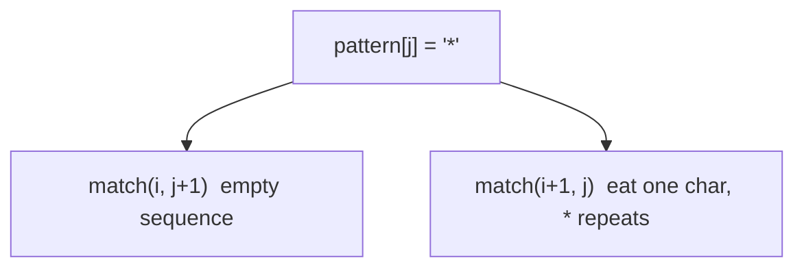

# MODULE 39 — Wildcard matching & Catalan numbers

**Illustration code:** [`a.cpp`](a.cpp) (wildcard) · [`b.cpp`](b.cpp)–[`d.cpp`](d.cpp) (Catalan) · [`e.cpp`](e.cpp) (count BSTs) · [`f.cpp`](f.cpp) (mountain ranges)

See also: [`09. Catalan Variations & Applications.pdf`](09.%20Catalan%20Variations%20%26%20Applications.pdf)

---

## Notation

- **`text` / `pattern`** — strings; pattern may contain literals, **`?`**, **`*`**.
- **`C_n`** — **n-th Catalan number** (OEIS A000108), **`C_0 = 1`**.

---

# Part I — Wildcard pattern matching

## 1. Problem — [`a.cpp`](a.cpp)

**Given** a text string and a pattern, decide if the pattern **matches** the full text.

| Symbol | Meaning |
|--------|---------|
| **`?`** | Matches **exactly one** arbitrary character in the text |
| **`*`** | Matches **any sequence** of characters (length **0** or more) |

**Examples:**

| Text | Pattern | Match? |
|------|---------|--------|
| `"baaabab"` | `"**ba****ab*"` | **true** |
| `"baaabab"` | `"a*ab"` | **false** |

```bash
g++ -std=c++17 -o a a.cpp && ./a
```

---

### 1.1 State and recurrence (2D DP on indices)

**State:** **`match(i, j)`** = can **`text[i..]`** be matched by **`pattern[j..]`**?

**Base cases:**

- **`j == pattern.length`** → match iff **`i == text.length`** (both consumed).
- If **`text` exhausted** but pattern remains → only possible if remaining pattern is all **`*`** (handled in loop / recursion).

**Transitions** at **`pattern[j]`**:

| `pattern[j]` | Recurrence |
|--------------|------------|
| **`*`** | `match(i, j+1)` **OR** `match(i+1, j)` if `i < n` — star matches **empty**, or eats one text char and stays |
| **`?`** | `i < n` and `match(i+1, j+1)` |
| **letter** | `i < n` and `text[i]==pattern[j]` and `match(i+1, j+1)` |



**Overlapping:** many pairs **`(i,j)`** revisited → **memoization** or **bottom-up** table **`dp[i][j]`** filled from the end.

---

### 1.2 Implementation in [`a.cpp`](a.cpp)

| Method | Function |
|--------|----------|
| Naive recursion | `matchNaive` |
| Memoization | `wildcardMatch` / `matchMemo` |
| Tabulation | `matchTab` (fill from `i,j` at end) |

**Time / space:** **\(O(n \cdot m)\)** where **`n = |text|`**, **`m = |pattern|`**; space **\(O(nm)\)** or **\(O(m)\)** with rolling (not shown).

**Why not greedy?** Patterns like **`*a`** and text **`ba`** need exploring both “how much” **`*`** consumes — DP (or careful recursion) is the standard approach.

---

# Part II — Catalan numbers

## 2. What is \(C_n\)?

The **Catalan numbers** count many “balanced” combinatorial structures:

- **Valid parentheses** strings of **`n`** pairs: **`()`**, **`(())`**, **`()()`**, …
- **BSTs** with **`n`** distinct keys (structure count)
- **Triangulations** of a convex **`(n+2)`**-gon
- **Paths** that stay below a diagonal in a grid (Dyck paths)

**Sequence:** **`1, 1, 2, 5, 14, 42, 132, 429, …`**

---

### 2.1 Recursive definition (from your notes)

\[
C_0 = 1,\quad C_1 = 1
\]

For **`n ≥ 2`**:

\[
C_n = \sum_{k=0}^{n-1} C_k \cdot C_{n-1-k}
\]

**Idea:** Split a structure of “size **`n`**” into a **left** piece of size **`k`** and a **right** piece of size **`n-1-k`**, then multiply counts (convolution of Catalan sequence with itself).

**Worked values:**

| \(n\) | Expansion | Value |
|-------|-----------|-------|
| **0** | — | **1** |
| **1** | — | **1** |
| **2** | \(C_0 C_1 + C_1 C_0 = 1\cdot1 + 1\cdot1\) | **2** |
| **3** | \(C_0 C_2 + C_1 C_1 + C_2 C_0 = 1\cdot2 + 1\cdot1 + 2\cdot1\) | **5** |
| **4** | \(C_0 C_3 + C_1 C_2 + C_2 C_1 + C_3 C_0 = 1\cdot5 + 1\cdot2 + 2\cdot1 + 5\cdot1\) | **14** |

This matches [`b.cpp`](b.cpp) / [`c.cpp`](c.cpp) / [`d.cpp`](d.cpp) output.

---

### 2.2 Closed form (reference)

\[
C_n = \frac{1}{n+1}\binom{2n}{n}
\]

[`d.cpp`](d.cpp) checks tabulation against this formula for **`n ≤ 10`**.

---

### 2.3 Recursion tree / overlap

Computing **`C_4`** calls **`C_3`**, **`C_2`**, **`C_1`**, **`C_0`** many times across different **`k`** splits → **massive overlap**. Naive recursion in [`b.cpp`](b.cpp) is **exponential** in **`n`** without cache.

```text
C_4
├── k=0: C_0 * C_3  →  C_3 recomputed again for k=2, etc.
├── k=1: C_1 * C_2
├── k=2: C_2 * C_3
└── k=3: C_3 * C_0
```

---

## 3. Catalan — recursion — [`b.cpp`](b.cpp)

Direct translation of:

```cpp
long long catalan(int n) {
    if (n <= 1) return 1;
    long long sum = 0;
    for (int k = 0; k < n; k++)
        sum += catalan(k) * catalan(n - 1 - k);
    return sum;
}
```

Prints **`C_0 … C_6`** and explains **`C_2`**, **`C_3`**, **`C_4`** by hand.

```bash
g++ -std=c++17 -o b b.cpp && ./b
```

**Time (naive):** exponential · **Space:** **\(O(n)\)** stack depth.

---

## 4. Catalan — memoization — [`c.cpp`](c.cpp)

**`memo[n]`** stores **`C_n`** after first compute; inner loop still sums **`k`** but each **`C_k`** is **O(1)** lookup.

```bash
g++ -std=c++17 -o c c.cpp && ./c
```

Fills **`C_0 … C_20`** quickly.

**Time:** **\(O(n^2)\)** if each **`C_i`** summed once with **`i`** terms (standard Catalan DP). **Space:** **\(O(n)\)**.

---

## 5. Catalan — tabulation — [`d.cpp`](d.cpp)

**Bottom-up:** build **`dp[0..n]`** in increasing order so **`dp[k]`** and **`dp[i-1-k]`** are ready.

```cpp
dp[0] = 1;
dp[1] = 1;
for (int i = 2; i <= n; i++)
    for (int k = 0; k < i; k++)
        dp[i] += dp[k] * dp[i - 1 - k];
```

| `i` | `dp[i]` |
|-----|---------|
| 0 | 1 |
| 1 | 1 |
| 2 | 2 |
| 3 | 5 |
| 4 | 14 |
| 5 | 42 |

```bash
g++ -std=c++17 -o d d.cpp && ./d
```

**Time:** **\(O(n^2)\)** · **Space:** **\(O(n)\)**.

---

### 5.1 Comparison: b → c → d

| | `b.cpp` | `c.cpp` | `d.cpp` |
|---|---------|---------|---------|
| Style | Top-down, recompute | Top-down + cache | Bottom-up table |
| Time | exponential | **\(O(n^2)\)** | **\(O(n^2)\)** |
| Best for | tiny `n`, teaching | medium `n` | medium `n`, no stack |

Same recurrence; **DP stores each `C_k` once**.

---

### 5.2 Applications (conceptual)

| Application | Why \(C_n\) |
|-------------|-------------|
| **Balanced parentheses** | `n` pairs → **`C_n`** valid strings |
| **Binary search trees** | `n` nodes → **`C_n`** structurally distinct BSTs |
| **Mountain ranges** | up/down steps staying above ground |
| **Polygon triangulation** | **`(n+2)`**-gon → **`C_n`** triangulations |

Details and variants: see the course PDF in this folder.

---

# Part III — Catalan applications

Both problems below count the **same** sequence **`C_n`** from Part II; the code shows **why** the BST split and the mountain prefix rule both reduce to **`dp[i] += dp[k] * dp[i-1-k]`**.

---

## 6. Count structurally unique BSTs — [`e.cpp`](e.cpp)

**Problem:** Given **`n`** nodes (say keys **`1 .. n`**), how many **structurally different** binary search trees exist? (Shape only — not permutations of values.)

| `n` | Answer |
|-----|--------|
| 2 | **2** |
| 3 | **5** |

### 6.1 Why it is Catalan

Choose **root** at key **`k`** (**`1 ≤ k ≤ n`**):

- **Left subtree:** **`k - 1`** nodes → **`C_{k-1}`** shapes.
- **Right subtree:** **`n - k`** nodes → **`C_{n-k}`** shapes.

Total:

\[
\text{BST}(n) = \sum_{k=1}^{n} C_{k-1}\, C_{n-k}
\]

Re-index **`k' = k-1`** → same as **`C_n = \sum_{k=0}^{n-1} C_k C_{n-1-k}`** (§3).

**`n = 2`:** root at 1 → left empty (**`C_0=1`**) + right one node (**`C_1=1`**); root at 2 → left one + right empty → **2** trees.

**`n = 3`:** sum **`C_0 C_2 + C_1 C_1 + C_2 C_0 = 1·2 + 1·1 + 2·1 = 5`**.

[`e.cpp`](e.cpp) tabulates **`C_n`** and prints checks for **`n = 2, 3`**.

```bash
g++ -std=c++17 -o e e.cpp && ./e
```

**Time / space:** **\(O(n^2)\)** / **\(O(n)\)** (same table as [`d.cpp`](d.cpp)).

---

## 7. Mountain ranges (Dyck paths) — [`f.cpp`](f.cpp)

**Problem:** Draw a mountain with **`n`** **up** strokes (**`U`**) and **`n`** **down** strokes (**`D`**). At **every prefix**, the number of **`U`** must be **≥** the number of **`D`** (you never go below “ground”).

| `pairs` | Mountains |
|---------|-----------|
| 3 | **5** |

### 7.1 State and recurrence

**State:** **`ways(u, d)`** = valid partial paths using **`u`** ups and **`d`** downs so far, with **`u ≥ d`** always.

**Transitions** from **`(u, d)`** toward **`(n, n)`**:

- Add **`U`** if **`u < n`**
- Add **`D`** only if **`d < u`** (so after adding, still **`u ≥ d`**)

**Base:** **`u == d == n`** → **1** way.

This 2D DP on a triangular grid also equals **`C_n`**; [`f.cpp`](f.cpp) implements **DFS**, **memo**, and **Catalan tab** for **`pairs = 3`**, then **lists all 5** paths.

Example paths for **`pairs = 3`** (same as 3-pair balanced parentheses):

```
UUUDDD   UUDUDD   UUDDUD   UDUUDD   UDUDUD
```

```bash
g++ -std=c++17 -o f f.cpp && ./f
```

**Time:** **\(O(n^2)\)** memo / Catalan · **Space:** **\(O(n^2)\)** memo or **\(O(n)\)** tab.

---

## 8. Compile all

```bash
cd Module-39
g++ -std=c++17 -o a a.cpp && ./a
g++ -std=c++17 -o b b.cpp && ./b
g++ -std=c++17 -o c c.cpp && ./c
g++ -std=c++17 -o d d.cpp && ./d
g++ -std=c++17 -o e e.cpp && ./e
g++ -std=c++17 -o f f.cpp && ./f
```

---

## Quick reference

| Topic | File | Time | Space |
|-------|------|------|-------|
| Wildcard match | `a.cpp` | **\(O(nm)\)** | **\(O(nm)\)** |
| Catalan naive | `b.cpp` | exponential | **\(O(n)\)** stack |
| Catalan memo | `c.cpp` | **\(O(n^2)\)** | **\(O(n)\)** |
| Catalan tab | `d.cpp` | **\(O(n^2)\)** | **\(O(n)\)** |
| Count BSTs | `e.cpp` | **\(O(n^2)\)** | **\(O(n)\)** |
| Mountain ranges | `f.cpp` | **\(O(n^2)\)** | **\(O(n^2)\)** memo |

explain matrices multiplication. programming and mathematics part

Matrix Chain Multiplication
Find min cost to multiply all matrices. Cost is no. of ops for multiplication.
arrin] = { 1, 2, 3, 4, 3}

MCM with recursion -> g.cpp
MCM with memoisation -> h.cpp
MCM with tabulation -> i.cpp

Minimum Partitioning -> j.cpp
numst 1 = 1 1, 6, 11, 5}
ans = min Diff = 1