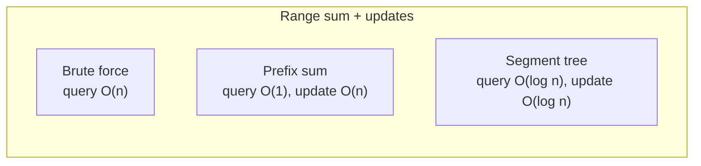
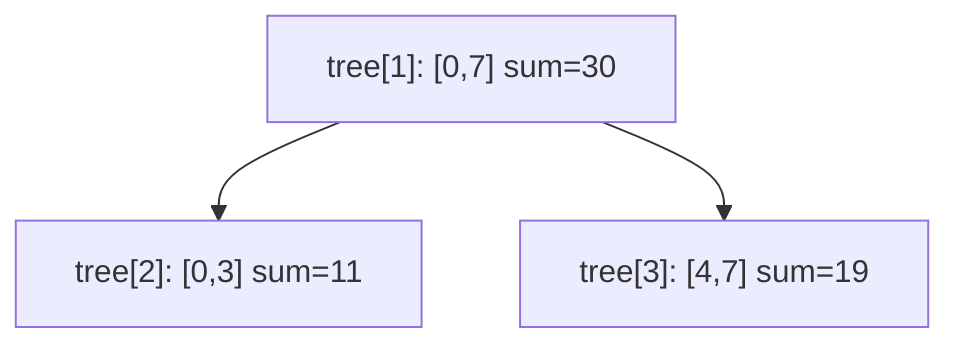

# MODULE 40 — Segment trees

**Illustration code:** [`a.cpp`](a.cpp) (range sum + point update) · [`b.cpp`](b.cpp) (node count, levels, structure)

---

## Notation

- **`n`** — length of the input array **`arr[0..n-1]`**.
- **`[l, r]`** — **closed** index range (both ends inclusive), **`0 ≤ l ≤ r < n`**.
- **`tree[]`** — segment-tree storage (usually **1-indexed** heap layout: root at **`tree[1]`**).
- **`node`** — index in **`tree`**; also means “the tree vertex that stores an aggregate for some interval”.

---

# Part I — Why segment trees?

## 1. The problem: range queries + updates

You have a **static or changing** array and need to support:

| Operation | Meaning |
|-----------|---------|
| **Range query** | Combine values on **`arr[l..r]`** (sum, min, max, gcd, …) |
| **Point update** | Set **`arr[i] = x`** (or add to **`arr[i]`**) |

**Brute force**

- Query **`[l,r]`**: loop **`i = l..r`** → **\(O(n)\)** per query.
- Update one index: **\(O(1)\)**.

**Prefix sum** (only if there are **no** updates, or very few)

- Build **`prefix[i] = arr[0]+…+arr[i]`** → **\(O(n)\)**.
- Range sum **`[l,r]`** = **`prefix[r] - prefix[l-1]`** → **\(O(1)\)**.
- **Point update** at **`i`**: rebuild or shift prefix from **`i`** → **\(O(n)\)**.

**Segment tree**

- Build once → **\(O(n)\)**.
- Range query → **\(O(\log n)\)**.
- Point update → **\(O(\log n)\)**.



**When to use a segment tree:** many **interleaved** range queries and updates on an array; the combine operation is **associative** (sum, min, max, gcd, xor, …).

---

# Part II — Structure of a segment tree

## 2. Binary tree on intervals

A segment tree is a **full binary tree** where each node represents a **contiguous subarray**:

| Node | Interval (example `n = 8`) |
|------|-----------------------------|
| Root **`1`** | **`[0, 7]`** — whole array |
| Left child **`2`** | **`[0, 3]`** — left half |
| Right child **`3`** | **`[4, 7]`** — right half |
| … | … until **leaves** **`[i, i]`** — single element |

**Invariant:** value at a node = **aggregate** of all **`arr[i]`** in that node’s interval (for sum tree: **sum**; for min tree: **minimum**).

**Children split at `mid = (start + end) / 2`:**

- Left covers **`[start, mid]`**
- Right covers **`[mid+1, end]`**

---

## 3. Count and meaning of nodes

### 3.1 How many nodes?

For **`n`** array elements:

- Tree height ≈ **`⌈log₂ n⌉ + 1`** (root to leaf).
- **At most `2n - 1`** nodes in a perfect tree on **`n`** leaves.
- In code we store **`tree`** as a **heap** (array simulation of a binary tree):
  - **Root** at index **`1`**
  - **Left child** of **`v`** → **`2*v`**
  - **Right child** of **`v`** → **`2*v + 1`**

**Safe size:** **`4 * n`** (standard competitive-programming bound — enough even when **`n`** is not a power of two).

| Quantity | Typical value |
|----------|----------------|
| Logical nodes used | **≤ 2n** |
| **`tree.size()`** in code | **`4n`** (safe padding) |
| Root index | **`1`** (1-indexed) |

See counts and levels printed in [`b.cpp`](b.cpp).

### 3.2 What data lives in each node?

| Node type | Interval | Stored value |
|-----------|----------|----------------|
| **Leaf** | **`[i, i]`** | **`arr[i]`** (current array value) |
| **Internal** | **`[l, r]`, `l < r`** | Combine of children (e.g. **sum**, **min**) |

**Meaning:** **`tree[v]`** answers the query on that node’s interval **without** scanning the whole array.

**Example (`arr = {2,1,5,3,4,6,2,7}`):**

- Leaf for index **3** stores **3**.
- Node for **`[0,3]`** stores **2+1+5+3 = 11**.
- Root **`[0,7]`** stores **30**.

---

## 4. Levels in a segment tree

Think of **level 0** = root, **level increases** toward leaves.

| Level | Role | # nodes (max, perfect tree) |
|-------|------|-----------------------------|
| **0** | Full range **`[0, n-1]`** | **1** |
| **1** | Two halves | **2** |
| **2** | Quarters | **4** |
| … | … | … |
| **~log n** | Leaves **`[i,i]`** | **`n`** (padded to next power of 2 in some drawings) |

**Width of intervals** halves each level: root width **`n`**, then **`n/2`**, **`n/4`**, …, **`1`**.

[`a.cpp`](a.cpp) and [`b.cpp`](b.cpp) print **level-by-level** values of **`tree[]`** for **`n = 8`**.



---

# Part III — Operations

## 5. Build — [`a.cpp`](a.cpp)

**Idea:** post-order DFS on index ranges.

1. If **`start == end`**: **`tree[node] = arr[start]`** (leaf).
2. Else: **`mid = (start+end)/2`**, build left **`2*node`**, right **`2*node+1`**, then  
   **`tree[node] = combine(tree[left], tree[right])`**.

**Time:** **\(O(n)\)** — each array index becomes one leaf; total nodes **\(O(n)\)**.

---

## 6. Range query (sum)

**Goal:** sum on **`arr[l..r]`**.

**Function:** **`query(node, start, end, l, r)`**

| Case | Action |
|------|--------|
| **No overlap** (`r < start` or `end < l`) | return **neutral** (0 for sum) |
| **Full cover** (`l ≤ start` and `end ≤ r`) | return **`tree[node]`** |
| **Partial overlap** | split at **`mid`**, return **query(left) + query(right)** |

**Steps:**

1. Start at root (**`node = 1`**, range **`[0, n-1]`**).
2. If current interval is inside **`[l,r]`**, return stored aggregate.
3. Otherwise recurse into children that intersect **`[l,r]`**.
4. At most **two** children per level → **\(O(\log n)\)** nodes visited.

**Example:** **`rangeSum(2, 5)`** on **`{2,1,5,3,4,6,2,7}`** → **5+3+4+6 = 18**.

---

## 7. Point update

**Goal:** set **`arr[idx] = val`**.

**Steps:**

1. Walk from root to leaf for **`[idx, idx]`** (compare **`idx`** with **`mid`** each step).
2. Set **`tree[node] = val`** at leaf.
3. **Backtrack:** recompute every ancestor as **combine(left child, right child)**.

**Time:** **\(O(\log n)\)** — one root-to-leaf path.

**Example:** **`pointUpdate(3, 10)`** changes **`arr[3]`** from **3** to **10**; **`rangeSum(2,5)`** becomes **25**, total sum **37**.

---

## 8. Complexity summary

| Operation | Time | Extra space |
|-----------|------|-------------|
| **Build** | **\(O(n)\)** | **`tree` size \(O(n)\)** (array **`4n`**) |
| **Range query** | **\(O(\log n)\)** | — |
| **Point update** | **\(O(\log n)\)** | — |

**Space:** **\(O(n)\)** for the tree array (constant **`4`** × **`n`** in implementation).

---

# Part IV — Code walkthrough

## 9. Sum segment tree — [`a.cpp`](a.cpp)

**API:**

- **`SumSegTree(arr)`** — build.
- **`rangeSum(l, r)`** — query sum on **`[l,r]`**.
- **`pointUpdate(idx, val)`** — set **`arr[idx]`**.

```bash
g++ -std=c++17 -o a a.cpp && ./a
```

---

## 10. Structure demo — [`b.cpp`](b.cpp)

Explains:

- Why **`4*n`** slots.
- Height / levels.
- What internal vs leaf nodes store.
- Comparison with **prefix sum**.

```bash
g++ -std=c++17 -o b b.cpp && ./b
```

---

## 11. Compile all

```bash
cd Module-40
g++ -std=c++17 -o a a.cpp && ./a
g++ -std=c++17 -o b b.cpp && ./b
```

---

## Quick reference

| Topic | File | Build | Query | Update | Space |
|-------|------|-------|-------|--------|-------|
| Range sum + point set | `a.cpp` | **\(O(n)\)** | **\(O(\log n)\)** | **\(O(\log n)\)** | **\(O(n)\)** |
| Node count & levels | `b.cpp` | — | — | — | — |

**Generalization (later modules):** lazy propagation (range update), min/max trees, coordinate compression, persistent / 2D segment trees.

**Combine must be associative** for the standard segment tree; with a custom “segment beats” or monoid, variants extend to harder range updates.


creating a segment tree using vecotr -> c.cpp

resize 4n and then building

Queries on Segment Tree -> d.cpp
Qi = 2, Qj = 5

no overlap

complete overlap

partial overlap


updates on the segment tree -> e.cpp

update at any idx

max segment tree

cration -> g.cpp 
 , range max queries -> h.cpp
 update in max segment tree -> i.cpp

